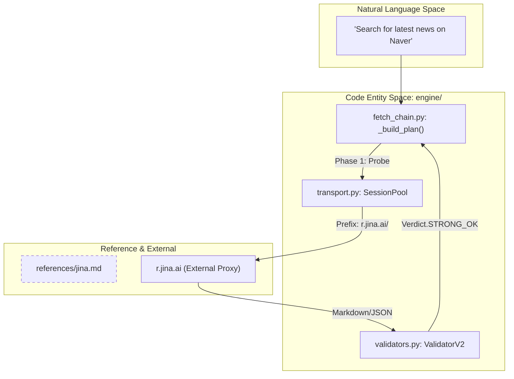
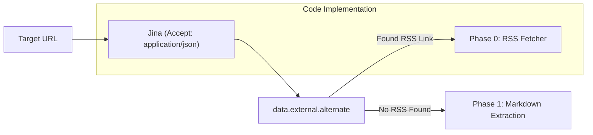

# Jina Reader Integration

관련 소스 파일

다음 파일들은 이 위키 페이지를 생성하기 위한 컨텍스트로 사용되었습니다.

- [skills/insane-search/references/jina.md](skills/insane-search/references/jina.md)

Jina Reader 통합은 `insane-search` Phase 1 단계 상승 전략에서 주요 경량 probe 메커니즘 역할을 합니다. `r.jina.ai` 프록시를 활용함으로써, 시스템은 복잡한 HTML-to-markdown 변환, JavaScript 실행(SPA 렌더링), RSS 자동 발견을 처리량이 높고 키가 필요 없는 서비스로 위임합니다.

## 개요 및 목적

Jina Reader는 복잡한 웹 페이지에서 깨끗한 콘텐츠를 쉽게 가져오기 위한 "no-key" 유틸리티로 통합되어 있습니다. JavaScript 실행이 필요하지만 공격적인 anti-proxy WAF를 구현하지 않은 사이트에 특히 효과적입니다.

### insane-search에서의 주요 역할
1.  **Phase 1 Lightweight Probe**: 무거운 헤드리스 브라우저(Phase 3)로 단계 상승하기 전에 콘텐츠를 가져오기 위한 초기 단계 시도로 사용됩니다 [skills/insane-search/references/jina.md:1-5]().
2.  **Markdown Normalization**: 원시 HTML을 LLM 친화적인 markdown으로 자동 변환하여 token 오버헤드를 줄입니다 [skills/insane-search/references/jina.md:3]().
3.  **RSS Auto-Discovery**: Jina의 메타데이터 추출을 활용하여 지정된 도메인의 숨겨진 RSS/Atom 피드를 찾습니다 [skills/insane-search/references/jina.md:23]().
4.  **SPA Handling**: Jina 인프라의 Puppeteer 기반 렌더링을 통해 Single Page Applications(SPAs)를 처리합니다 [skills/insane-search/references/jina.md:4]().

## 구현 로직

시스템은 주로 `https://r.jina.ai/` 접두사에 대한 HTTP 요청을 통해 Jina와 상호작용합니다.

### 데이터 흐름: 콘텐츠 검색
URL이 Jina 통합을 통해 라우팅되면, 시스템은 출력 형식과 동작을 제어하기 위한 다양한 헤더를 포함할 수 있는 요청을 구성합니다.

| 기능 | 헤더 / 방식 | 목적 |
| :--- | :--- | :--- |
| **JSON Output** | `Accept: application/json` | 제목과 콘텐츠를 포함한 구조화 메타데이터를 반환합니다 [skills/insane-search/references/jina.md:18-21](). |
| **RSS Discovery** | `Accept: application/json` | 피드 링크를 위해 `data.external.alternate`에 접근합니다 [skills/insane-search/references/jina.md:123-130](). |
| **CSS Targeting** | `X-Target-Selector` | 특정 article body를 분리하고 nav/footer를 제거합니다 [skills/insane-search/references/jina.md:28-31](). |
| **SPA Waiting** | `Accept: text/event-stream` | JS 실행 이후 최종 렌더링 상태를 스트리밍합니다 [skills/insane-search/references/jina.md:36-39](). |
| **Cache Control** | `X-No-Cache: true` | origin 사이트에서 fresh fetch를 강제합니다 [skills/insane-search/references/jina.md:73](). |

### 시스템 엔터티 매핑: Jina 통합
다음 다이어그램은 fetch 생명주기 중 Jina 참조가 더 넓은 `engine` 로직과 어떻게 관련되는지 보여줍니다.

**제목: Jina 통합 로직 흐름**

출처: [skills/insane-search/references/jina.md:1-5](), [skills/insane-search/references/jina.md:18-21]()

## RSS 자동 발견 패턴

Jina 통합의 가장 강력한 기능 중 하나는 Phase 0(Official Public Endpoints)으로 가는 브리지 역할입니다. JSON 형식을 요청함으로써 `insane-search`는 URL 구조에서 즉시 드러나지 않는 RSS 피드를 발견할 수 있습니다.

**제목: RSS 발견에서 Phase 0 단계 상승까지**

출처: [skills/insane-search/references/jina.md:23](), [skills/insane-search/references/jina.md:125-130]()

## 성능 및 제한

이 통합은 개별 API 키 없이도 대량 probe에 최적화되어 있습니다.

*   **Rate Limits**: 분당 최대 500 Requests Per Minute(RPM)을 지원합니다 [skills/insane-search/references/jina.md:5]().
*   **Success Profile**: 뉴스 사이트(Naver News, Daum), 기술 블로그(Medium, Dev.to), 커뮤니티 게시판(Clien, Ruliyweb)에 매우 효과적입니다 [skills/insane-search/references/jina.md:89-108]().
*   **Failure Profile**: 엄격한 anti-bot WAF가 있는 사이트(Coupang, Naver Shopping) 또는 특정 API 전용 요구사항이 있는 사이트(X/Twitter, Reddit)에서는 일반적으로 실패합니다 [skills/insane-search/references/jina.md:110-121]().

## Probe에서의 고급 사용

이 통합은 쿠키 전달과 특정 DOM 요소 타게팅을 지원하므로, 엔진이 단순한 콘텐츠 게이트를 우회하거나 노이즈가 많은 레이아웃을 정리할 수 있습니다.

| 기법 | 구현 | 출처 |
| :--- | :--- | :--- |
| **Cookie Bridging** | `X-Set-Cookie: session=...` | [skills/insane-search/references/jina.md:60]() |
| **Screenshotting** | `X-Respond-With: screenshot` | [skills/insane-search/references/jina.md:44]() |
| **PDF Conversion** | `.pdf`로 직접 연결되는 URL | [skills/insane-search/references/jina.md:52-55]() |

출처: [skills/insane-search/references/jina.md:1-130]()
