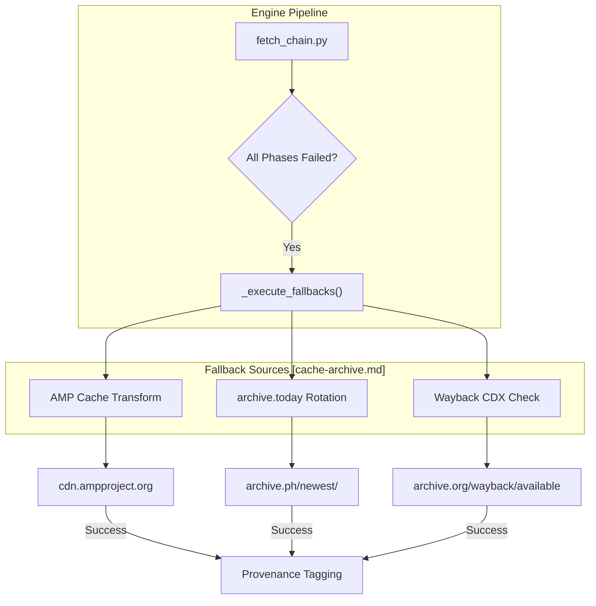
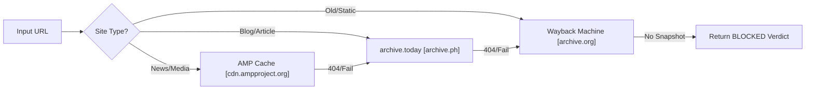

# Cache 및 Archive Fallbacks

관련 소스 파일

다음 파일들은 이 위키 페이지를 생성하기 위한 컨텍스트로 사용되었습니다.

- [skills/insane-search/references/cache-archive.md](skills/insane-search/references/cache-archive.md)

`insane-search` 엔진은 origin 서버에 접근할 수 없거나, 공격적인 WAF로 보호되어 있거나, 콘텐츠가 삭제된 경우 서드파티 캐시와 웹 아카이브를 sidecar 소스로 활용합니다. 이러한 폴백은 fetch 파이프라인에서 지연 시간은 높지만 신뢰도도 높은 대안으로 취급됩니다.

## 폴백 소스 개요

직접 fetch가 모든 Phase(0부터 3까지)에서 실패하거나, 사이트에 crawler가 우회할 수 있는 paywall이 있는 것으로 알려진 경우, 시스템은 세 가지 주요 sidecar 소스를 평가합니다.

| 소스 | 주요 사용 사례 | 메커니즘 |
| :--- | :--- | :--- |
| **Google AMP Cache** | AMP를 지원하는 뉴스 및 미디어 사이트. | `cdn.ampproject.org`로 URL 변환. |
| **archive.today** | Paywall이 있는 기사 또는 최근 삭제된 콘텐츠. | 다중 도메인 순환(예: `.ph`, `.is`). |
| **Wayback Machine** | 과거 데이터 또는 IP로 차단된 사이트. | 가용성 확인에는 CDX API, 검색에는 `web.archive.org` 사용. |

> **참고:** 전통적인 Google Search Cache(`webcache.googleusercontent.com`)는 2024년 7월 공식적으로 지원 중단되었으며 더 이상 엔진에서 사용하지 않습니다 [skills/insane-search/references/cache-archive.md:72-74]().

## Google AMP Cache

Google AMP Cache는 뉴스 및 미디어 플랫폼에 대한 첫 번째 폴백으로 선호됩니다. 메인 사이트에 soft paywall이나 무거운 JavaScript 봇 감지가 있더라도 기사 전체 콘텐츠를 제공하는 경우가 많기 때문입니다 [skills/insane-search/references/cache-archive.md:10-12]().

### 구현 로직
엔진은 hostname을 수정하고 AMP CDN 접두사를 앞에 붙여 origin URL을 AMP Cache URL로 변환합니다.

1.  **도메인 변환:** hostname의 모든 점(`.`)을 대시(`-`)로 바꿉니다.
2.  **경로 구성:** 원래 hostname과 path를 `/c/s/` 엔드포인트에 추가합니다.

**변환 예시:**
*   **Origin:** `https://www.bbc.com/news/articles/123`
*   **AMP Cache:** `https://www-bbc-com.cdn.ampproject.org/c/s/www.bbc.com/news/articles/123`

출처: [skills/insane-search/references/cache-archive.md:18-28]()

## archive.today(Archive.is)

`archive.today`는 paywall을 우회하기 위해 사용자가 수동으로 아카이브한 콘텐츠에 매우 효과적입니다. 이 서비스는 검열이나 기술적 차단을 피하기 위해 기본 TLD를 자주 변경하므로, 시스템은 순환 전략을 통해 이 소스를 처리합니다 [skills/insane-search/references/cache-archive.md:33-36]().

### 도메인 순환 전략
엔진은 `200 OK` 또는 `302 Found` 응답을 받을 때까지 알려진 mirror 목록을 반복합니다.

| 도메인 | 목적 |
| :--- | :--- |
| `archive.ph` | 현재 기본 엔드포인트. |
| `archive.is` | 과거 기본 엔드포인트. |
| `archive.md` | Mirror. |
| `archive.vn` | Mirror. |
| `archive.li` | Mirror. |

출처: [skills/insane-search/references/cache-archive.md:42-50]()

## Wayback Machine(Internet Archive)

Wayback Machine은 오래된 콘텐츠에 대한 최후의 수단으로 사용됩니다. 전체 페이지 로드를 시도하기 전에 snapshot 존재 여부를 확인할 수 있는 구조화 API(CDX)를 제공합니다 [skills/insane-search/references/cache-archive.md:56-60]().

### 데이터 흐름: CDX API에서 검색까지
시스템은 불필요한 bandwidth 사용을 최소화하기 위해 먼저 availability API를 조회합니다. snapshot이 존재하면 `web.archive.org/web/{URL}` 형식을 사용해 콘텐츠를 가져옵니다 [skills/insane-search/references/cache-archive.md:60-66]().

## 코드 엔터티 맵: 폴백 실행

다음 다이어그램은 폴백 로직이 fetch 실행 흐름과 어떻게 통합되는지 보여줍니다.

**폴백 의사결정 흐름**

출처: [skills/insane-search/references/cache-archive.md:77-83]()

## 실행 순서 및 성공 조건

엔진은 콘텐츠 최신성과 레이아웃 품질을 최적화하기 위해 이러한 폴백을 시도할 때 엄격한 우선순위 목록을 따릅니다.

| 우선순위 | 소스 | 성공 조건 | 실패 조건 |
| :--- | :--- | :--- | :--- |
| 1 | **AMP Cache** | 사이트가 유효한 AMP 메타데이터를 제공합니다. | 비-AMP 사이트; 생성된 지 15초 미만인 콘텐츠. |
| 2 | **archive.today** | URL이 이전에 사용자에 의해 아카이브되었습니다. | 한 번도 아카이브되지 않은 URL. |
| 3 | **Wayback Machine** | 공개 URL이 IA bot에 의해 crawled되었습니다. | `robots.txt` 차단; SPA/JS-heavy 앱. |

**시스템 로직 다이어그램: 소스 선택**

출처: [skills/insane-search/references/cache-archive.md:79-83]()
