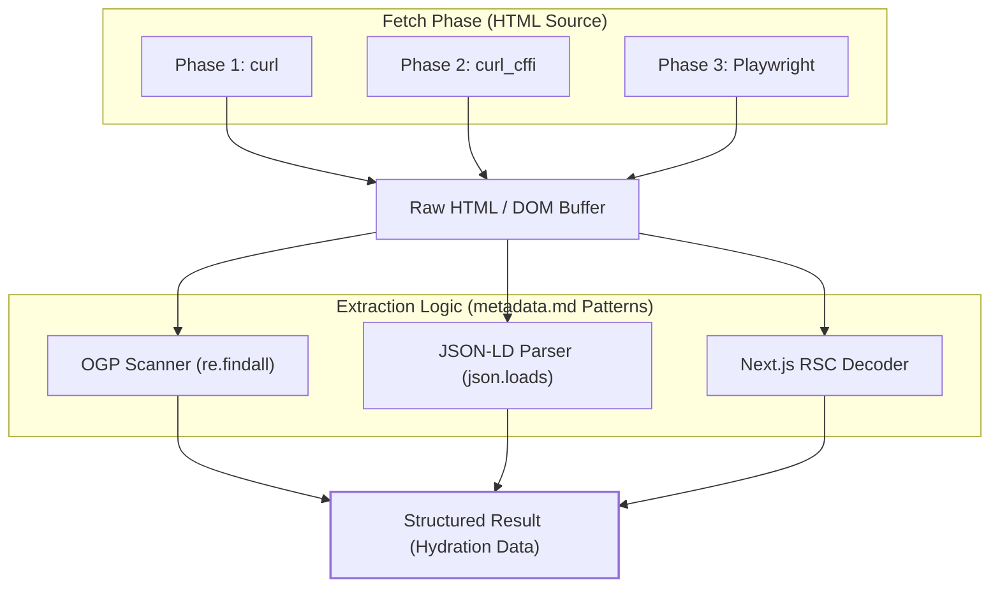
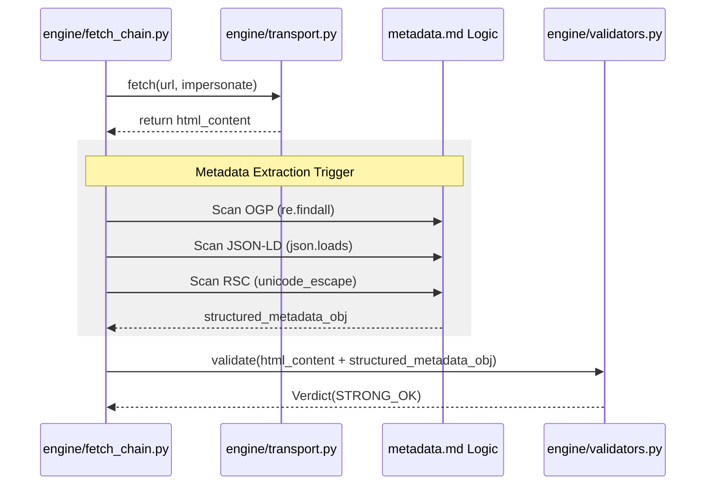

# Metadata Extraction(OGP 및 JSON-LD)

관련 소스 파일

다음 파일들은 이 위키 페이지를 생성하기 위한 컨텍스트로 사용되었습니다.

- [skills/insane-search/references/metadata.md](skills/insane-search/references/metadata.md)

Metadata extraction은 `insane-search` 엔진 안에서 중요한 복구 계층 역할을 합니다. fetch 작업이 HTML을 성공적으로 가져왔지만 깨끗한 본문 콘텐츠를 얻지 못하는 경우(예: 복잡한 DOM 구조 또는 부분 차단으로 인해), 시스템은 구조화된 메타데이터로 전환합니다. 이를 통해 전체 페이지 텍스트가 가려져 있더라도 엔진은 제품 가격, 기사 요약, 프로필 세부정보 같은 고충실도 정보를 반환할 수 있습니다.

## 목적 및 범위

metadata extraction 로직의 주요 목표는 원시 HTML 응답을 구조화된 데이터 객체로 변환하는 것입니다. 이는 Phase 1, 2, 3 전반에서 성공한 모든 HTML 검색에 동반되는 보조 처리 단계로 처리됩니다. **Open Graph Protocol(OGP)**, **JSON-LD(Schema.org)**, **Next.js RSC payloads** 같은 표준화된 형식을 대상으로 하여, 페이지의 시각적 레이아웃을 파싱할 수 없는 경우에도 데이터 가용성을 보장합니다 [skills/insane-search/references/metadata.md:107-117]().

## 추출 로직 흐름

Metadata extraction은 기회주의적 프로세스입니다. 추가 네트워크 요청을 필요로 하지 않고, 이미 가져온 buffer에 대해 regex 기반 또는 DOM 기반 scanner를 실행합니다.

### 시스템-코드 매핑: Metadata 파이프라인

다음 다이어그램은 원시 HTML이 추출 로직을 거쳐 구조화된 출력을 생성하는 방식을 보여줍니다.

**다이어그램: Metadata Extraction 데이터 흐름**

**출처:** [skills/insane-search/references/metadata.md:10-24](), [skills/insane-search/references/metadata.md:26-43](), [skills/insane-search/references/metadata.md:109-115]()

---

## 핵심 추출 기법

### 1. Open Graph Protocol(OGP)
대부분의 최신 웹사이트는 소셜 미디어 호환성을 위해 OGP 태그를 포함합니다. 이러한 태그는 기본 페이지 정체성에 대한 신뢰할 수 있는 폴백을 제공합니다.

*   **주요 필드:** `og:title`, `og:description`, `og:image`, `og:url`.
*   **구현:** `property="og:..."`가 있는 `<meta>` 태그를 스캔하기 위해 `re.findall`을 사용합니다 [skills/insane-search/references/metadata.md:14-24]().

### 2. JSON-LD(Schema.org)
JSON-LD는 "가장 가치가 높은" 추출 대상으로 간주됩니다. DOM traversal 없이도 사이트의 내부 데이터 모델에 프로그래밍 방식으로 접근할 수 있게 해줍니다.

| 엔터티 유형 | 복구되는 데이터 | 소스 예시 |
| :--- | :--- | :--- |
| `Product` | 이름, 가격, 통화, 재고 여부 | Coupang, E-commerce [skills/insane-search/references/metadata.md:47-65]() |
| `NewsArticle` | 헤드라인, 날짜, 작성자, ArticleBody | 뉴스 매체 [skills/insane-search/references/metadata.md:79-88]() |
| `Person` | 직책, 동문, 조직 | LinkedIn, Social [skills/insane-search/references/metadata.md:67-77]() |

**구현 패턴:**
scanner는 `<script type="application/ld+json">` 블록을 찾고 내부 텍스트에 대해 `json.loads()`를 시도합니다 [skills/insane-search/references/metadata.md:30-43]().

### 3. Next.js RSC(React Server Components)
Next.js App Router를 사용하는 최신 웹 애플리케이션은 표준 HTML 태그가 아니라 hydration script 안에 콘텐츠를 숨기는 경우가 많습니다.

*   **패턴:** 콘텐츠는 `self.__next_f.push()` 호출에 저장됩니다 [skills/insane-search/references/metadata.md:92-94]().
*   **디코딩:** 엔진은 이러한 chunk를 추출하고 `unicode_escape` 디코딩을 적용하여 비 ASCII 문자(예: 한국어 또는 일본어 텍스트)를 복구합니다 [skills/insane-search/references/metadata.md:95-105]().

---

## Phase 전반의 통합

Metadata extraction은 Phase에 구애받지 않으며 기본 fetch 작업의 sidecar로 동작합니다.

**다이어그램: 코드 엔터티 상호작용**

**출처:** [skills/insane-search/references/metadata.md:109-115](), [engine/fetch_chain.py:1-50] (아키텍처 개요에서 암시된 흐름)

## 사용 시나리오

| 시나리오 | Metadata의 역할 |
| :--- | :--- |
| **Paywalled News** | `articleBody`가 잘려 있더라도 `NewsArticle` description 또는 headline을 복구합니다 [skills/insane-search/references/metadata.md:79-88](). |
| **Dynamic E-commerce** | 복잡한 JS로 가격이 렌더링될 때 JSON-LD에서 `Product` price와 currency를 추출합니다 [skills/insane-search/references/metadata.md:47-65](). |
| **WAF Partial Block** | WAF가 부분 페이지를 제공하는 경우에도 `<head>`의 OGP 태그는 여전히 사용 가능할 수 있습니다 [skills/insane-search/references/metadata.md:10-12](). |

**출처:** [skills/insane-search/references/metadata.md:1-117]()
