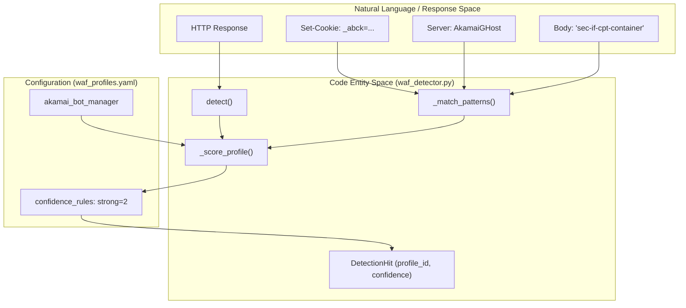
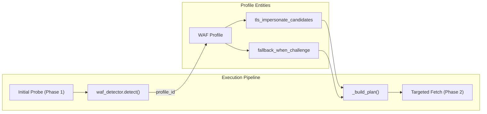

# WAF Profiles 및 Detection

관련 소스 파일

다음 파일들은 이 위키 페이지를 생성하기 위한 컨텍스트로 사용되었습니다.

- [skills/insane-search/engine/waf_detector.py](skills/insane-search/engine/waf_detector.py)
- [skills/insane-search/engine/waf_profiles.yaml](skills/insane-search/engine/waf_profiles.yaml)

WAF Profiles 및 Detection 하위 시스템은 공급업체별 산출물을 사용해 Web Application Firewalls(WAF)와 안티봇 솔루션을 식별하는 역할을 합니다. 사이트별 로직에 의존하는 전통적인 scraper와 달리, `insane-search`는 **No-Site-Name Rule**을 준수하며, 도메인명이 아니라 헤더, 쿠키, 본문 패턴을 기반으로 Akamai, Cloudflare, DataDome 같은 보호 계층을 식별합니다 [[skills/insane-search/engine/waf_profiles.yaml:1-9]()] [[skills/insane-search/engine/waf_detector.py:7-10]()] .

이러한 감지는 **Diversity Grid**를 구동하여, 엔진이 감지된 공급업체의 특정 요구사항에 따라 TLS 지문, URL 변환, 브라우저 폴백을 전환할 수 있게 합니다.

## WAF Detection 로직(`waf_detector.py`)

`waf_detector.py`의 `detect` 함수는 실제 응답에 대해 다중 신호 분석을 수행합니다 [[skills/insane-search/engine/waf_detector.py:182-187]()]. 이 함수는 이진적인 "blocked" 판정 대신, profile ID와 confidence score를 포함하는 `DetectionHit` 객체의 순위 목록을 반환합니다 [[skills/insane-search/engine/waf_detector.py:3-5]()] .

### 감지 프로세스
1.  **Artifact Extraction**: detector는 `curl_cffi` 또는 `playwright` 응답에서 쿠키, 헤더, 응답 본문을 추출합니다 [[skills/insane-search/engine/waf_detector.py:140-143]()] .
2.  **Pattern Matching**: 헤더와 쿠키 전반에서 wildcard(예: `X-Akamai-*`)를 지원하기 위해 `fnmatch`를 사용합니다 [[skills/insane-search/engine/waf_detector.py:115-129]()] .
3.  **Scoring**: confidence는 profile에 정의된 `confidence_rules`를 기반으로 계산됩니다. 일반적으로 여러 신호(예: 특정 쿠키와 특정 헤더가 모두 존재)가 있으면 "strong"(0.9) confidence rating이 됩니다 [[skills/insane-search/engine/waf_detector.py:170-179]()] .
4.  **Fallback**: 어떤 vendor profile도 일치하지 않으면, 시스템은 낮은 confidence(0.1)의 `unknown_challenge` profile을 반환하여 보수적이고 광범위한 우회 시도를 트리거합니다 [[skills/insane-search/engine/waf_detector.py:201-207]()] .

### 데이터 흐름: 응답에서 Profile 순위까지
다음 다이어그램은 `detect()` 함수가 원시 HTTP artifact를 구조화된 WAF profile로 연결하는 방식을 보여줍니다.

**WAF Detection 흐름**

출처: [skills/insane-search/engine/waf_detector.py:132-180](), [skills/insane-search/engine/waf_profiles.yaml:19-28]()

## WAF Profiles(`waf_profiles.yaml`)

profile은 엔진의 "knowledge base"입니다. WAF를 감지하는 방법뿐 아니라 이를 우회하는 방법까지 정의합니다. 각 profile은 다음을 지정합니다.
*   **Capabilities Needed**: `needs_real_tls_stack`(`curl_cffi` 또는 실제 Chrome 필요) 또는 `needs_js_exec`(Playwright 필요) 같은 태그입니다 [[skills/insane-search/engine/waf_profiles.yaml:29-31]()] .
*   **TLS Candidates**: 해당 공급업체에서 작동하는 것으로 알려진 JA3 지문(Safari, Chrome 등)의 우선순위 목록입니다 [[skills/insane-search/engine/waf_profiles.yaml:32-41]()] .
*   **Avoid List**: 즉시 403을 유발하는 것으로 경험적으로 관찰된 지문입니다 [[skills/insane-search/engine/waf_profiles.yaml:42-53]()] .
*   **URL 및 Referer Strategies**: Cloudflare에 대해 `google_search`를 referer로 사용하는 것 같은 공급업체별 선호사항입니다 [[skills/insane-search/engine/waf_profiles.yaml:76-78]()] .

### Fetch Grid와의 통합
다음 다이어그램은 `fetch_chain.py`가 `waf_detector.py` 출력을 사용해 검색 전략을 다시 계획하는 방식을 보여줍니다.

**전략 재계획 Grid**

출처: [skills/insane-search/engine/waf_detector.py:182-207](), [skills/insane-search/engine/waf_profiles.yaml:10-13]()

## 상세 구성 및 Vendor 가이드

schema와 특정 vendor 구현에 대한 더 깊은 기술 세부사항은 다음 하위 페이지를 참조하세요.

### [WAF Profile Schema 및 Configuration](#5.1)
`confidence_rules`, `capabilities_needed` 태그, `url_transform_order`가 diversity grid에 영향을 주는 방식 등 YAML 구조를 자세히 설명합니다.
*   참조: [WAF Profile Schema 및 Configuration](#5.1)

### [WAF Vendor Profiles: Akamai, Cloudflare, DataDome, PerimeterX](#5.2)
Akamai의 `_abck` 쿠키 생명주기와 Cloudflare의 `cf_clearance` bridging을 포함하여 주요 vendor의 특정 artifact와 우회 전략을 깊이 있게 다룹니다.
*   참조: [WAF Vendor Profiles: Akamai, Cloudflare, DataDome, PerimeterX](#5.2)

---
**출처:**
*   [skills/insane-search/engine/waf_detector.py:1-215]()
*   [skills/insane-search/engine/waf_profiles.yaml:1-163]()
