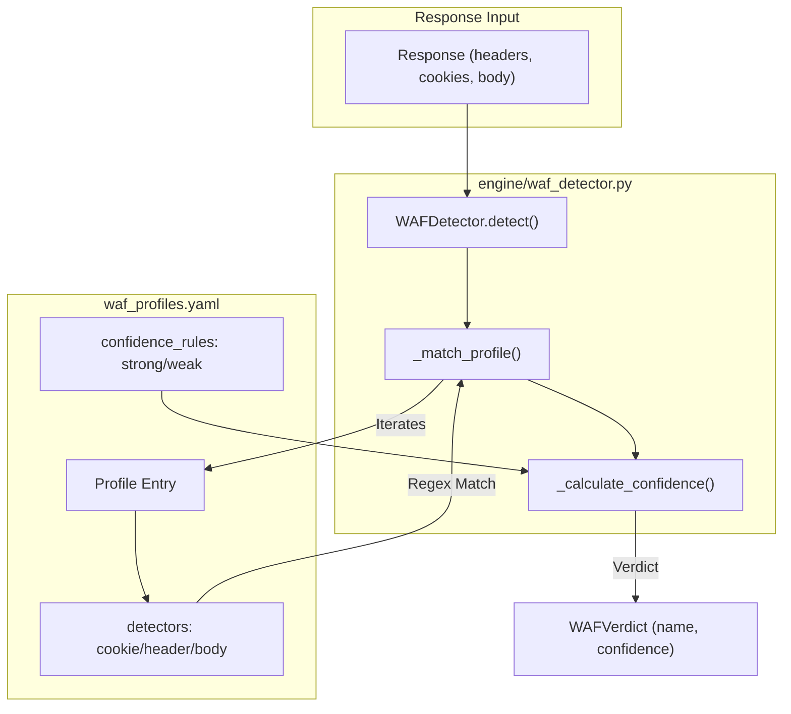
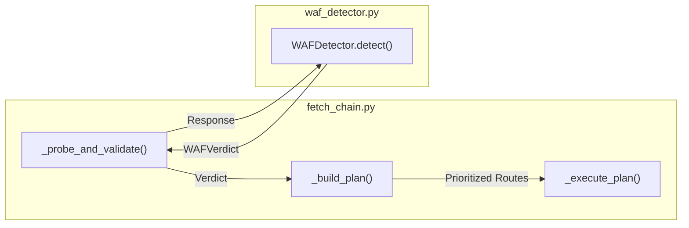

# WAF Profile Schema 및 Configuration

관련 소스 파일

다음 파일들은 이 위키 페이지를 생성하기 위한 컨텍스트로 사용되었습니다.

- [CHANGELOG.md](CHANGELOG.md)
- [skills/insane-search/engine/waf_profiles.yaml](skills/insane-search/engine/waf_profiles.yaml)

`insane-search` 엔진은 Web Application Firewalls(WAF)를 식별하고 우회하기 위해 구조화된 profile 시스템을 활용합니다. `waf_profiles.yaml`에 정의된 이러한 profile은 사이트별 로직을 vendor별 감지 패턴에서 분리합니다. 이 시스템을 통해 엔진은 probe 중 식별된 특정 WAF 제품에 따라 TLS 지문, URL 변환, referer 헤더를 포함한 fetch 전략을 조정할 수 있습니다.

## 목적 및 범위

WAF profiling 시스템은 세 가지 주요 기능을 수행합니다.
1.  **식별**: 쿠키, 헤더, 본문 마커를 통해 특정 WAF vendor(예: Akamai, Cloudflare)의 존재를 감지합니다.
2.  **전략 최적화**: 특정 vendor에 대해 잘 작동하는 것으로 알려진 TLS impersonation 대상과 referer 전략을 추천합니다.
3.  **단계 상승 계획**: vendor의 알려진 기능을 기반으로 챌린지가 경량 JS 실행(Playwright MCP)을 필요로 하는지, 전체 브라우저 스택(Playwright Real Chrome)을 필요로 하는지 정의합니다.

모든 profile은 **No-Site-Name Rule**을 준수해야 합니다. 즉, 특정 사이트 selector가 아니라 해당 제품을 실행하는 모든 사이트에 나타나는 WAF 제품 artifact를 설명해야 합니다 [skills/insane-search/engine/waf_profiles.yaml:3-8]().

## WAF Profile Schema

schema는 `skills/insane-search/engine/waf_profiles.yaml`에 정의되어 있으며 `engine/waf_detector.py`의 `WAFDetector` 클래스가 사용합니다.

### Detector 정의
detector는 vendor 식별을 위한 주요 메커니즘입니다. 네 가지 유형으로 분류됩니다.
*   `cookie`: 쿠키 이름 또는 패턴 목록입니다(예: `_abck`, `cf_clearance`).
*   `header`: HTTP 응답 헤더 키 또는 패턴입니다(예: `X-Akamai-*`, `cf-ray`).
*   `server_contains`: `Server` 응답 헤더에 있을 것으로 예상되는 문자열입니다.
*   `body`: 챌린지 페이지의 HTML 본문에서 발견되는 고유 문자열입니다(예: "Just a moment...", "sec-if-cpt-container").

### Confidence Rules
`confidence_rules` 블록은 일치의 확실성을 결정합니다 [skills/insane-search/engine/waf_profiles.yaml:25-28]().
*   **Strong**: 높은 confidence(일반적으로 0.9)를 부여하는 데 필요한 신호 수입니다.
*   **Weak**: 낮은 confidence 일치(일반적으로 0.6)에 필요한 신호 수입니다.

### Capability Tags
`capabilities_needed` 목록은 성공적인 우회에 필요한 기술 요구사항을 `FetchChain`에 알려줍니다.
*   `needs_real_tls_stack`: WAF가 비브라우저 TLS 스택(표준 Playwright/Chromium의 BoringSSL 등)을 감지하며 `curl_cffi` 또는 특수 브라우저가 필요함을 나타냅니다 [skills/insane-search/engine/waf_profiles.yaml:30-31]().
*   `needs_js_exec`: 정적 fetching으로 해결할 수 없는 챌린지이며 JavaScript runtime이 필요함을 나타냅니다 [skills/insane-search/engine/waf_profiles.yaml:72-73]().

### Strategy Lists
profile은 `DiversityGrid` 스케줄러를 위한 우선순위 목록을 제공합니다.
*   **`tls_impersonate_candidates`**: 계열별로 그룹화된 브라우저 지문(예: `safari17_2_ios`, `chrome131`)의 중첩 목록입니다 [skills/insane-search/engine/waf_profiles.yaml:32-41]().
*   **`tls_impersonate_avoid`**: 해당 vendor에 의해 blacklist된 것으로 경험적으로 알려진 지문입니다 [skills/insane-search/engine/waf_profiles.yaml:42-53]().
*   **`referer_strategies`**: `self_root` 또는 `google_search` 같은 전략입니다 [skills/insane-search/engine/waf_profiles.yaml:54-55]().
*   **`url_transform_order`**: `mobile_subdomain`(`www` -> `m`) 같은 선호 URL 변형입니다 [skills/insane-search/engine/waf_profiles.yaml:56-58]().

### Fallback Logic
`fallback_when_challenge` 필드는 초기 `curl_cffi` grid가 실패할 경우의 단계 상승 경로를 정의합니다.
*   `curl_grid_exhaust`: grid의 가능한 모든 조합을 계속 시도합니다.
*   `playwright_mcp`: 경량 MCP 브라우저를 사용합니다.
*   `playwright_real_chrome`: 전체 스택 브라우저 템플릿을 사용합니다.

**출처:** [skills/insane-search/engine/waf_profiles.yaml:19-163](), [skills/insane-search/engine/waf_detector.py:1-50]()

---

## 데이터 흐름: Probe에서 Profile까지

다음 다이어그램은 원시 응답이 코드 안에서 WAF Profile 일치로 변환되는 방식을 보여줍니다.

### 감지 로직 흐름
"이 다이어그램은 `WAFDetector.detect` 로직을 YAML schema에 매핑합니다."

**출처:** [skills/insane-search/engine/waf_detector.py:23-74](), [skills/insane-search/engine/waf_profiles.yaml:20-28]()

---

## 구현 세부사항

### WAFDetector 클래스
`engine/waf_detector.py`의 `WAFDetector` 클래스는 YAML 구성을 로드하고 응답을 평가하는 역할을 담당합니다.

| 메서드 | 역할 |
| :--- | :--- |
| `__init__` | `waf_profiles.yaml`을 로드하고 `unknown_challenge` fallback을 초기화합니다 [skills/insane-search/engine/waf_detector.py:12-21](). |
| `detect` | 모든 profile에 대해 쿠키, 헤더, 본문 콘텐츠를 확인하여 감지를 오케스트레이션합니다 [skills/insane-search/engine/waf_detector.py:23-52](). |
| `_match_profile` | 단일 profile에 대한 저수준 문자열 및 regex matching을 수행합니다 [skills/insane-search/engine/waf_detector.py:54-74](). |
| `get_profile` | 감지된 vendor 이름에 대한 전체 구성을 가져옵니다 [skills/insane-search/engine/waf_detector.py:85-87](). |

### FetchChain과의 통합
`FetchChain`(`fetch_chain.py`)은 `WAFDetector`를 사용해 진행 중 전략을 전환합니다.

1.  **Probe**: 대상에 대해 가벼운 요청을 수행합니다.
2.  **Detect**: 응답이 `OK`가 아니면 `WAFDetector.detect()`가 호출됩니다 [skills/insane-search/engine/fetch_chain.py:134-135]().
3.  **Plan**: `_build_plan`이 WAF profile을 사용합니다. `needs_real_tls_stack`이 있으면 grid는 `tls_impersonate_avoid` 대상을 우선순위 하향하고 `tls_impersonate_candidates`를 우선합니다 [skills/insane-search/engine/fetch_chain.py:180-210]().
4.  **Execute**: 엔진은 최적화된 매개변수를 사용해 diversity grid를 반복합니다.

**출처:** [skills/insane-search/engine/fetch_chain.py:115-145](), [skills/insane-search/engine/fetch_chain.py:175-220](), [skills/insane-search/engine/waf_detector.py:23-52]()

---

## Fallback Strategies

WAF 챌린지가 감지되면 profile의 `fallback_when_challenge` 목록이 단계 상승을 지시합니다.

| 전략 | 구현 | 사용 사례 |
| :--- | :--- | :--- |
| `curl_grid_exhaust` | `DiversityGrid` 반복 | 특정 TLS/Header 조합이 일반적으로 작동하는 표준 WAF(예: Akamai). |
| `playwright_mcp` | `executor.py` -> MCP | 깊은 TLS fingerprinting을 수행하지 않는 JS-heavy 챌린지(예: Cloudflare Turnstile) [skills/insane-search/engine/waf_profiles.yaml:80](). |
| `playwright_real_chrome` | `executor.py` -> `playwright_real_chrome.js` | 실제 브라우저 프로세스와 특정 TLS 동작이 필요한 고급 WAF(예: DataDome, PerimeterX) [skills/insane-search/engine/waf_profiles.yaml:115, 130](). |

**출처:** [skills/insane-search/engine/waf_profiles.yaml:59-61](), [skills/insane-search/engine/executor.py:45-65]()

## Unknown Challenges
높은 confidence로 일치하는 profile이 없으면 엔진은 `unknown_challenge` profile로 폴백합니다 [skills/insane-search/engine/waf_profiles.yaml:139-163](). 이 profile은 식별되지 않은 보안 계층에 대해서도 최대 도달 범위를 보장하기 위해 광범위하고 보수적인 grid를 사용하고 `playwright_mcp`, 이어서 `playwright_real_chrome`으로 단계 상승합니다.

**출처:** [skills/insane-search/engine/waf_detector.py:18-21](), [skills/insane-search/engine/waf_profiles.yaml:139-158]()
