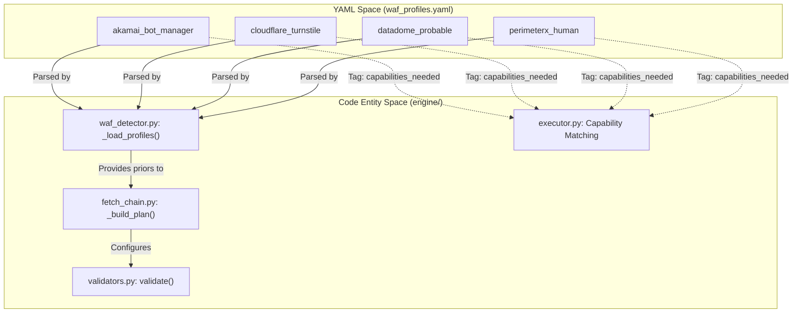
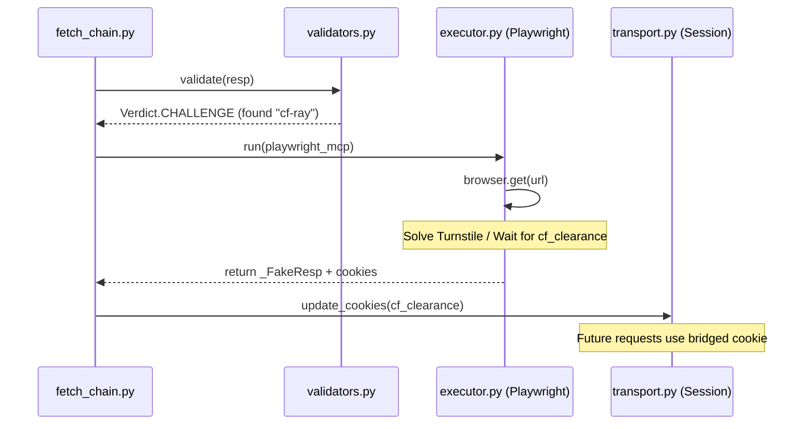

# WAF Vendor Profiles: Akamai, Cloudflare, DataDome, PerimeterX

관련 소스 파일

다음 파일들은 이 위키 페이지를 생성하기 위한 컨텍스트로 사용되었습니다.

- [skills/insane-search/engine/tests/test_u1.py](skills/insane-search/engine/tests/test_u1.py)
- [skills/insane-search/engine/validators.py](skills/insane-search/engine/validators.py)
- [skills/insane-search/engine/waf_profiles.yaml](skills/insane-search/engine/waf_profiles.yaml)
- [skills/insane-search/references/fallback.md](skills/insane-search/references/fallback.md)
- [skills/insane-search/references/tls-impersonate.md](skills/insane-search/references/tls-impersonate.md)

이 페이지는 `insane-search`가 지원하는 주요 Web Application Firewall(WAF) vendor에 대한 상세 기술 profile을 제공합니다. `waf_profiles.yaml`에 정의된 이러한 profile은 감지 마커, 필요한 브라우저 기능, TLS impersonation 전략을 지정하여 적응형 fetch grid를 구동합니다.

## WAF Profiles 개요

시스템은 WAF 처리에 사이트 비특화 접근 방식을 사용합니다. profile은 대상 도메인이 아니라 WAF 제품 이름(예: `akamai_bot_manager`)을 키로 하며, **No-Site-Name Rule**을 준수합니다 [engine/waf_profiles.yaml:3-8]().

### Profile-to-Code 매핑
다음 다이어그램은 `waf_profiles.yaml`의 YAML 정의가 Python 엔진의 실행 로직에 어떻게 매핑되는지 보여줍니다.

**WAF Profile 엔터티 매핑**

출처: [engine/waf_profiles.yaml:19-135](), [engine/fetch_chain.py:52-88](), [engine/validators.py:38-60]()

---

## Akamai Bot Manager

Akamai는 높은 민감도의 TLS fingerprinting과, 전체 JavaScript 환경이 필요한 경우가 많은 행동 기반 챌린지가 특징입니다.

### 감지 마커
*   **Cookies:** `_abck`, `bm_sz`, `ak_bmsc`, `bm_sv`, `bm_so` [engine/waf_profiles.yaml:21]().
*   **Headers:** `X-Akamai-*` [engine/waf_profiles.yaml:22]().
*   **Body:** `sec-if-cpt-container`, `Powered and protected by Akamai` [engine/waf_profiles.yaml:24]().

### 기술 구현 및 검증
`_abck` 쿠키는 주요 신호입니다. 값에 `~-1~`이 포함되어 있으면 센서 데이터가 Akamai edge에서 성공적으로 검증되지 않았음을 나타냅니다 [engine/validators.py:120-122]().
*   **Verdict:** 미해결 `_abck` 쿠키가 있는 응답은 `Verdict.SUSPECT_OK`를 반환합니다 [engine/validators.py:101]().
*   **비최종:** `STRONG_OK`와 달리 `SUSPECT_OK`는 비최종이므로, fetch chain은 다른 TLS/URL 조합을 계속 시도합니다 [engine/validators.py:98-100]().

### 전략
*   **Capabilities:** `needs_real_tls_stack`과 `needs_js_exec`가 필요합니다 [engine/waf_profiles.yaml:29-31]().
*   **TLS Candidates:** `safari`(특히 `safari260`)와 `chrome` [engine/waf_profiles.yaml:37-39]().
*   **Avoid List:** `safari18_0`, `chrome107`, `chrome120`, `firefox` [engine/waf_profiles.yaml:45-53]().
*   **Fallback:** `playwright_real_chrome` [engine/waf_profiles.yaml:61]().

출처: [engine/waf_profiles.yaml:19-65](), [engine/validators.py:120-122](), [engine/tests/test_u1.py:98-103]()

---

## Cloudflare Turnstile

Cloudflare는 가장 흔히 마주치는 WAF입니다. `cf_clearance` 쿠키 브리지에 크게 의존합니다.

### 감지 마커
*   **Cookies:** `cf_clearance`, `__cf_bm` [engine/waf_profiles.yaml:68]().
*   **Headers:** `cf-ray`, `cf-cache-status` [engine/waf_profiles.yaml:69]().
*   **Body:** `Just a moment...`, `Checking your browser`, `cf-chl-bypass` [engine/waf_profiles.yaml:71]().

### 전략
*   **Capabilities:** `needs_js_exec`가 필요합니다. 특히 Cloudflare의 baseline은 표준 Chromium TLS(BoringSSL)를 받아들이는 경우가 많으므로 `playwright_mcp`만으로도 충분한 경우가 자주 있습니다 [engine/waf_profiles.yaml:73-80]().
*   **TLS Candidates:** `chrome`, `chrome_android` [engine/waf_profiles.yaml:75]().
*   **Referer:** `google_search` 또는 `self_root` 전략을 선호합니다 [engine/waf_profiles.yaml:77-78]().

### 데이터 흐름: Cookie Bridge
JS 챌린지를 만나면 시스템은 브라우저로 단계 상승하여 챌린지를 해결하고 쿠키를 `curl_cffi` 세션으로 다시 브리지합니다.

**Cloudflare 챌린지 데이터 흐름**

출처: [engine/waf_profiles.yaml:66-82](), [references/tls-impersonate.md:110-128](), [engine/validators.py:43-45]()

---

## DataDome

DataDome은 행동 분석에 초점을 맞추며, 엔진에서는 변화하는 감지 표면을 반영하기 위해 `datadome_probable`로 표시됩니다 [engine/waf_profiles.yaml:105-118]().

### 감지 마커
*   **Cookies:** `datadome` [engine/waf_profiles.yaml:107]().
*   **Body:** `DataDome`(`validators.py`의 Soft marker) [engine/waf_profiles.yaml:108](), [engine/validators.py:58]().

### 전략
*   **Capabilities:** `needs_real_tls_stack`과 `needs_js_exec`가 모두 필요합니다 [engine/waf_profiles.yaml:110-111]().
*   **TLS Candidates:** `safari` 및 `chrome` [engine/waf_profiles.yaml:113]().
*   **Fallback:** 챌린지 해결에는 `playwright_real_chrome`이 권장 경로입니다 [engine/waf_profiles.yaml:115]().

출처: [engine/waf_profiles.yaml:105-119](), [engine/validators.py:55-60]()

---

## PerimeterX(HUMAN)

현재 HUMAN Bot Defender로 알려진 이 vendor는 DataDome과 다른 고유한 쿠키 계열을 사용하며, planner가 올바른 fallback을 선택하도록 별도 처리가 필요합니다 [engine/waf_profiles.yaml:120-134]().

### 감지 마커
*   **Cookies:** `_px3`, `_pxhd`, `_px2`, `pxcts` [engine/waf_profiles.yaml:122]().
*   **Body:** `px-captcha`, `Press & Hold to confirm you are a human` [engine/waf_profiles.yaml:123]().

### 전략
*   **Capabilities:** `needs_real_tls_stack`과 `needs_js_exec`가 필요합니다 [engine/waf_profiles.yaml:125-126]().
*   **TLS Candidates:** `safari` 및 `chrome` [engine/waf_profiles.yaml:128]().
*   **Fallback:** `playwright_real_chrome`으로 단계 상승합니다 [engine/waf_profiles.yaml:130]().

출처: [engine/waf_profiles.yaml:120-135]()

---

## TLS Impersonation 대상 요약

다음 표는 2026년 4월 기준 profile 전반에서 사용되는 권장 `curl_cffi` impersonation 대상을 요약합니다 [references/tls-impersonate.md:58-69]().

| 별칭 | 대상 버전 | 주요 사용 사례 |
| :--- | :--- | :--- |
| `safari` | `safari260` | 한국 사이트(Coupang, FMKorea)에 가장 적합 |
| `chrome` | `chrome146` | 범용 목적(Cloudflare, Akamai) |
| `firefox` | `firefox135` | Chrome/Safari가 실패할 때의 대안 |
| `chrome_android` | `chrome131_android` | 모바일 API 엔드포인트 |
| `safari_ios` | `safari260_ios` | iOS Mobile emulation |

출처: [references/tls-impersonate.md:62-69](), [engine/waf_profiles.yaml:37-41]()
