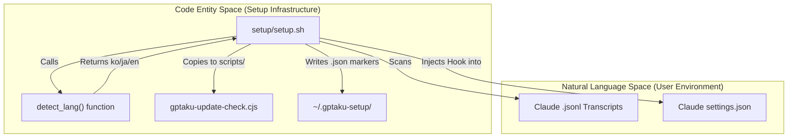
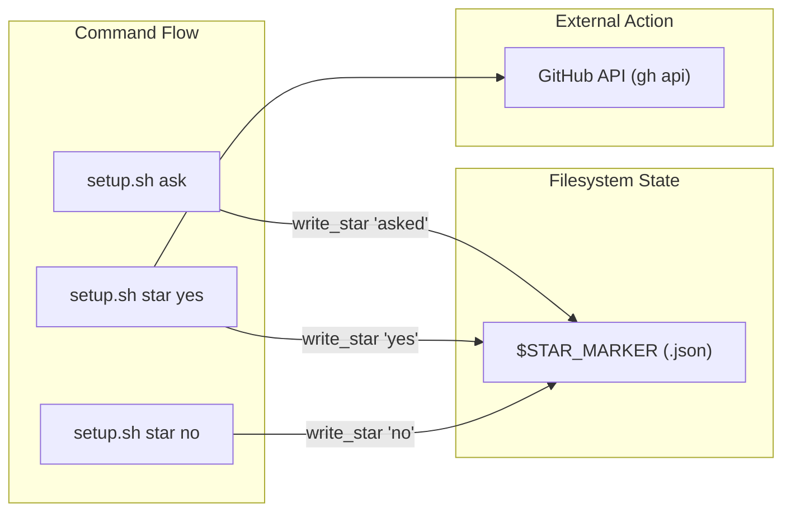

# Setup 및 Plugin Infrastructure

관련 소스 파일

다음 파일들은 이 위키 페이지를 생성하기 위한 컨텍스트로 사용되었습니다.

- [.claude-plugin/plugin.json](.claude-plugin/plugin.json)
- [setup/setup.sh](setup/setup.sh)

`insane-search` 플러그인은 높은 가용성, 자동 업데이트, 매끄러운 사용자 경험을 보장하기 위해 견고한 초기화 및 유지관리 인프라를 활용합니다. 이 시스템은 `setup/` 디렉터리와 `.claude-plugin/` 매니페스트를 중심으로 구성되며, 두 요소가 함께 환경 검증, 의존성 관리, 방해가 적은 업데이트 알림 시스템을 처리합니다.

## Plugin Manifest

플러그인의 핵심 정체성은 `.claude-plugin/plugin.json`에 정의되어 있습니다. 이 파일은 API 키 없이도 플러그인의 기능, 버전 관리, 지원하는 광범위한 플랫폼을 선언합니다.

| 필드 | 값 / 목적 |
| :--- | :--- |
| **Name** | `insane-search` [ .claude-plugin/plugin.json:2 ]() |
| **Version** | `0.8.2` [ .claude-plugin/plugin.json:3 ]() |
| **Engine** | Phase 0→3 적응형 스케줄러 [ .claude-plugin/plugin.json:4 ]() |
| **Keywords** | `web-access`, `tls-impersonation`, `playwright`, `yt-dlp` [ .claude-plugin/plugin.json:12-41 ]() |

출처: [ .claude-plugin/plugin.json:1-42 ]()

## 초기화 및 생명주기

setup 인프라는 멱등적이고 non-blocking으로 설계되어, 플러그인을 즉시 사용할 수 있게 하면서 백그라운드 작업이 환경 준비를 처리하도록 보장합니다.

### 최초 실행 초기화
`setup/setup.sh` 스크립트는 환경 구성을 위한 주요 진입점입니다. 이 스크립트는 몇 가지 중요한 작업을 수행합니다.
1.  **환경 검증**: `node`와 `python3`의 존재 여부를 확인합니다 [ setup/setup.sh:105-110 ]().
2.  **Hook Injection**: `gptaku-update-check.cjs` 스크립트를 Claude `settings.json`에 `SessionStart` hook으로 삽입합니다 [ setup/setup.sh:110-123 ]().
3.  **언어 감지**: 휴리스틱 투표 시스템을 사용해 로컬 Claude 세션 transcript(`.jsonl` 파일)를 스캔하여 UI prompt에 사용할 사용자의 선호 언어(한국어, 일본어 또는 영어)를 판단합니다 [ setup/setup.sh:32-83 ]().
4.  **상태 관리**: `~/.gptaku-setup/`의 marker 파일을 사용해 setup 상태와 사용자 상호작용(예: repository starring)을 추적하여 prompt가 한 번만 표시되도록 보장합니다 [ setup/setup.sh:24-27 ]().

자세한 내용은 [First-Run Setup Script](#6.1)를 참조하세요.

### 업데이트 알림 시스템
플러그인에는 모든 Claude 세션 시작 시 실행되는 전용 업데이트 알림기 `gptaku-update-check.cjs`가 포함되어 있습니다.
*   **Git Integration**: `git ls-remote`를 사용해 로컬 버전을 marketplace HEAD와 비교합니다.
*   **Caching**: 네트워크 오버헤드를 최소화하기 위해 24시간 캐시를 구현합니다.
*   **Concurrency**: 중복 확인을 방지하기 위해 세션별 독점 lock을 사용합니다.

자세한 내용은 [Update Notifier Hook](#6.2)을 참조하세요.

## 시스템 통합 다이어그램

다음 다이어그램은 setup script가 사용자 환경(Natural Language Space)을 동작 중인 플러그인(Code Entity Space)과 어떻게 연결하는지 보여줍니다.

**Setup 및 Hook Injection 흐름**

출처: [ setup/setup.sh:22-27 ](), [ setup/setup.sh:32-34 ](), [ setup/setup.sh:109-123 ]()

## STAR_ASK 상태 머신

플러그인은 repository starring 요청을 관리하기 위해 "STAR_ASK" 프로토콜을 구현합니다. 이는 모델이 적절한 경우에만 사용자에게 prompt를 표시하도록 `setup/setup.sh` 내부의 멱등 상태 머신을 통해 처리됩니다.

| 상태 | 트리거 | 동작 |
| :--- | :--- | :--- |
| **Initial** | 최초 실행 | 스크립트가 `$SETUP_MARKER`를 생성합니다 [ setup/setup.sh:126 ](). |
| **Asked** | `setup.sh ask` | `$STAR_MARKER`에 `asked`를 기록하고 `STAR_ASK <lang>`을 출력합니다 [ setup/setup.sh:133-136 ](). |
| **Yes** | `setup.sh star yes` | `gh api`를 통해 `fivetaku/insane-search`와 `fivetaku/gptaku_plugins`에 star를 남깁니다 [ setup/setup.sh:95-99 ](). |
| **No** | `setup.sh star no` | `$STAR_MARKER`에 `no`를 기록하고 아무 star도 남기지 않습니다 [ setup/setup.sh:93-94 ](). |

**Star 의사결정 로직**

출처: [ setup/setup.sh:87-101 ](), [ setup/setup.sh:133-136 ]()

## 하위 페이지

*   **[First-Run Setup Script](#6.1)**: 환경 검증, 언어 휴리스틱, STAR_ASK 메커니즘을 자세히 다룹니다.
*   **[Update Notifier Hook](#6.2)**: lock 프로토콜과 marketplace 동기화를 포함한 `gptaku-update-check.cjs` hook의 기술 세부사항.
