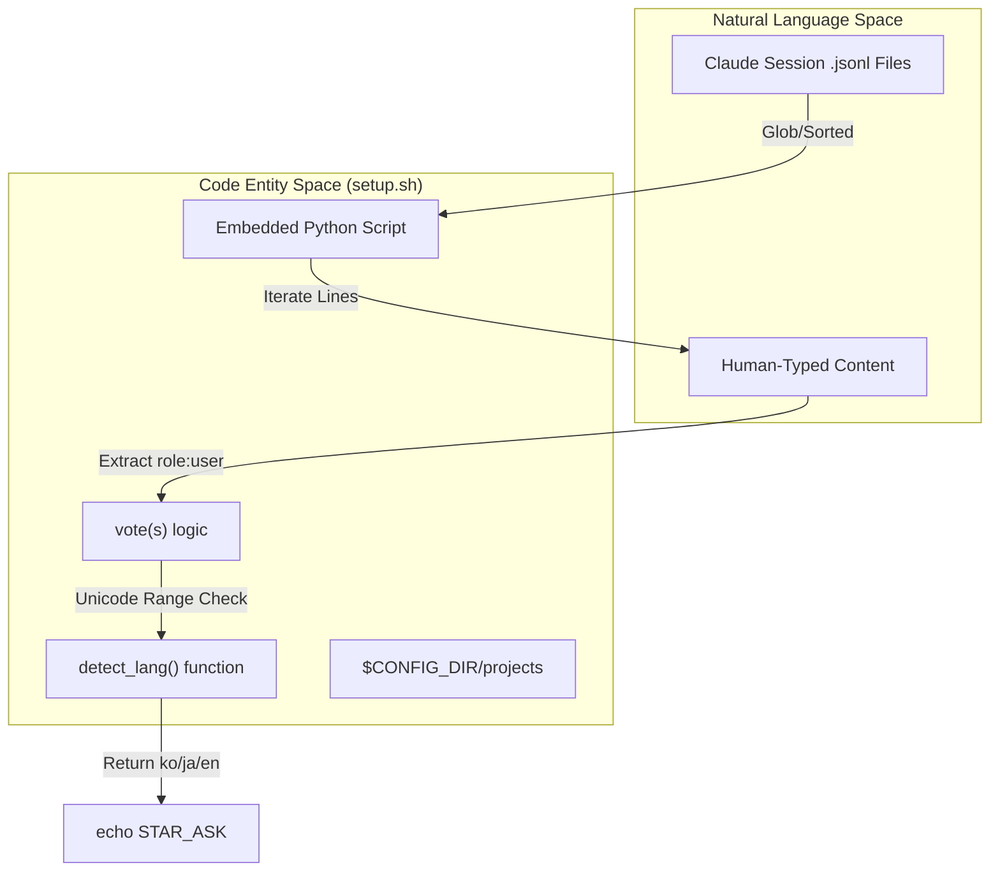
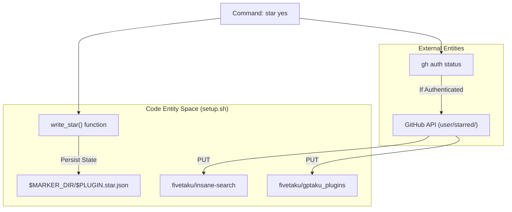

# First-Run Setup Script

관련 소스 파일

다음 파일들은 이 위키 페이지를 생성하기 위한 컨텍스트로 사용되었습니다.

- [setup/setup.sh](setup/setup.sh)

`setup/setup.sh` 스크립트는 `insane-search` 환경을 초기화하는 경량 멱등 유틸리티입니다. 의존성 검증을 처리하고, update-notifier hook을 Claude settings에 삽입하며, 휴리스틱 언어 감지를 사용해 일회성 "star" 요청 상태 머신을 관리합니다.

## 목적 및 범위

스크립트는 두 가지 모드로 실행되도록 설계되었습니다.
1.  **Silent Mode**: 첫 tool 실행 중 자동으로 트리거되어 환경이 준비되었고 update-notifier가 설치되었는지 보장합니다 [setup/setup.sh:3-4]().
2.  **Ask Mode**: 특정 명령줄 흐름에 의해 트리거되어, 로컬 기록을 사용해 사용자의 선호 언어를 감지한 뒤 repository star를 요청합니다 [setup/setup.sh:5-11]().

### 핵심 구현 로직

| 기능 | 메커니즘 | 구현 |
| :--- | :--- | :--- |
| **멱등성** | Marker Files | 이후 실행에서 setup을 건너뛰기 위해 `~/.gptaku-setup/insane-search.json`을 사용합니다 [setup/setup.sh:24-27, 104](). |
| **Hook Injection** | `settings.json` | `gptaku-update-check.cjs`를 Claude의 `SessionStart` hook에 삽입합니다 [setup/setup.sh:110-123](). |
| **언어 감지** | JSONL Scanning | Claude 세션 transcript를 휴리스틱으로 스캔하여 `ko`, `ja`, `en`을 식별합니다 [setup/setup.sh:32-84](). |
| **상태 머신** | STAR_ASK | 사용자에게 한 번만 prompt가 표시되도록 `asked`, `yes`, `no` 상태를 추적합니다 [setup/setup.sh:87-90, 133-136](). |

출처: [setup/setup.sh:1-15](), [setup/setup.sh:24-27](), [setup/setup.sh:104-127]()

---

## 언어 감지 휴리스틱

스크립트는 최근 20개의 Claude 세션 transcript를 분석하여 사용자의 언어를 best-effort로 감지하는 Python 기반 `detect_lang` 함수를 구현합니다 [setup/setup.sh:32-39]().

### 감지 전략
-   **대상**: tool output이나 system prompt로 인한 왜곡을 피하기 위해 `user` role 메시지만 스캔합니다 [setup/setup.sh:70-71]().
-   **투표**: 문자 단위가 아니라 메시지 단위 투표 시스템을 사용합니다. 이를 통해 큰 ASCII 코드 블록이나 로그가 짧게 입력된 자연어 turn을 압도하지 않도록 합니다 [setup/setup.sh:42-45]().
-   **Unicode 범위**:
    -   **Korean (ko)**: `0xAC00` to `0xD7A3` (Hangul Syllables) [setup/setup.sh:51]().
    -   **Japanese (ja)**: `0x3040` to `0x30FF` (Hiragana/Katakana) [setup/setup.sh:52]().
    -   **English (en)**: Standard Latin alphabet [setup/setup.sh:53]().

### 데이터 흐름: 언어 감지
"이 다이어그램은 자연어 감지 로직을 스크립트의 Python 엔터티에 매핑합니다."

출처: [setup/setup.sh:32-84](), [setup/setup.sh:135-136]()

---

## Update Notifier Hook Injection

스크립트는 `gptaku-update-check.cjs` 유틸리티가 Claude desktop/CLI 환경에 등록되도록 보장합니다.

1.  **File Placement**: notifier script를 `$HOME/.claude/scripts/`에 복사합니다 [setup/setup.sh:107-109]().
2.  **Settings Mutation**: `~/.claude/settings.json`을 읽고 파싱합니다.
3.  **Hook Registration**:
    -   `hooks.SessionStart`에 접근합니다 [setup/setup.sh:115-116]().
    -   `gptaku-update-check`를 포함하는 command가 이미 존재하는지 확인합니다 [setup/setup.sh:117]().
    -   없으면 5초 timeout이 있는 새 hook object를 추가합니다 [setup/setup.sh:118-121]().

출처: [setup/setup.sh:104-124]()

---

## STAR_ASK 상태 머신

스크립트는 사용자 privacy를 존중하고 성가심을 방지하기 위해 결정적 상태 머신을 통해 "Star on GitHub" 상호작용을 관리합니다.

### 상태 전이
| 입력 명령 | 현재 Marker | 동작 | 새 상태 |
| :--- | :--- | :--- | :--- |
| `setup.sh ask` | None | marker를 쓰고 `STAR_ASK <lang>` 출력 | `asked` |
| `setup.sh ask` | `asked` | No-op(Silent exit) | `asked` |
| `setup.sh star yes` | Any | `gh` CLI를 통해 `OWN_REPO` 및 `HUB_REPO`에 star | `yes` |
| `setup.sh star no` | Any | marker 기록 | `no` |

### 시스템 통합: Star 흐름
"이 다이어그램은 bash script가 GitHub CLI 및 로컬 파일시스템과 상호작용하는 방식을 보여줍니다."

출처: [setup/setup.sh:18-20](), [setup/setup.sh:87-101](), [setup/setup.sh:133-136]()

---

## 멱등성 및 Marker

"non-blocking" 최초 실행 경험을 유지하기 위해, 스크립트는 `$HOME/.gptaku-setup/`에 위치한 두 가지 주요 marker 파일에 의존합니다.

1.  **`insane-search.json`**: 환경 확인과 hook injection이 성공한 뒤 생성됩니다 [setup/setup.sh:125-126](). 이 파일이 존재하면 main setup block을 건너뜁니다 [setup/setup.sh:104]().
2.  **`insane-search.star.json`**: 현재 star 결정(`asked`, `yes`, `no`)과 timestamp를 저장합니다 [setup/setup.sh:88-89](). 이를 통해 사용자가 초기 prompt에 응답하지 않더라도 `STAR_ASK` signal이 한 번만 출력되도록 보장합니다 [setup/setup.sh:133-134]().

출처: [setup/setup.sh:24-26](), [setup/setup.sh:104-105](), [setup/setup.sh:125-127](), [setup/setup.sh:133-136]()
