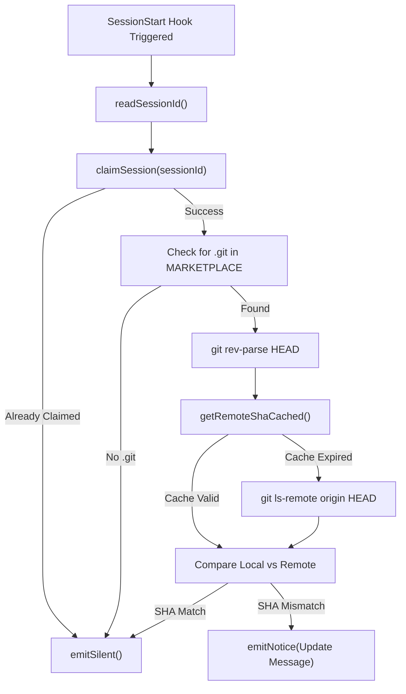
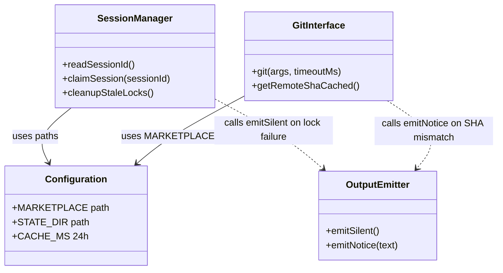

# Update Notifier Hook

관련 소스 파일

다음 파일들은 이 위키 페이지를 생성하기 위한 컨텍스트로 사용되었습니다.

- [setup/gptaku-update-check.cjs](setup/gptaku-update-check.cjs)

Update Notifier Hook은 `gptaku-update-check.cjs`에 구현된 특수 `SessionStart` 생명주기 hook입니다. `insane-search`를 포함하는 `gptaku-plugins` marketplace의 원격 repository에 업데이트가 있을 때 사용자에게 알리도록 보장합니다. 여러 플러그인에 걸친 성능 저하와 중복 알림을 방지하기 위해, 24시간 네트워크 캐시와 세션별 독점 locking 메커니즘을 사용합니다.

## 개요 및 목적

Claude Code가 새 세션을 시작하면 구성된 hook을 실행합니다. `gptaku-update-check.cjs`는 모든 세션 시작 시 실행되어 로컬 marketplace 설치가 upstream repository와 동기화되지 않았는지 확인하도록 설계되었습니다 [setup/gptaku-update-check.cjs:3-12]().

주요 설계 제약은 다음과 같습니다.
- **Non-blocking Execution**: hook은 세션을 절대 깨뜨려서는 안 되며, 항상 코드 `0`과 유효한 JSON으로 종료됩니다 [setup/gptaku-update-check.cjs:14-14]().
- **Deduplication**: 여러 gptaku 플러그인이 설치되어 있으면, 가장 먼저 실행된 하나만 확인을 수행합니다 [setup/gptaku-update-check.cjs:11-12]().
- **Efficiency**: 비용이 큰 네트워크 작업(`git ls-remote`)은 24시간 캐시를 통해 제한됩니다 [setup/gptaku-update-check.cjs:29-30]().

### 데이터 흐름: 업데이트 감지 로직

다음 다이어그램은 세션 시작부터 최종 출력까지의 논리 흐름을 보여줍니다.

**업데이트 확인 의사결정 흐름**

출처: [setup/gptaku-update-check.cjs:113-142]()

## 주요 구현 세부사항

### 세션 Locking 및 Deduplication
`gptaku-update-check.cjs`는 `gptaku-plugins` 생태계의 모든 플러그인에서 공유되므로, 여러 플러그인이 세션 시작 시 동시에 확인을 실행하려고 할 수 있습니다. `claimSession` 함수는 원자적 파일 생성을 사용해 독점성을 보장합니다.

- **메커니즘**: `wx` 플래그(원자적 독점 생성)를 사용해 `~/.claude/.gptaku-update/session-[ID].lock`에 lock 파일 쓰기를 시도합니다 [setup/gptaku-update-check.cjs:69-71]().
- **정리**: 성공적으로 claim하는 동안 hook은 `cleanupStaleLocks()`도 트리거하며, 이 함수는 24시간보다 오래된 lock 파일을 제거합니다 [setup/gptaku-update-check.cjs:80-89]().

### 캐싱 전략
모든 세션 시작 시 GitHub/GitLab에 접근하는 것을 피하기 위해 원격 SHA를 캐시합니다.

- **캐시 위치**: `~/.claude/.gptaku-update/check-cache.json` [setup/gptaku-update-check.cjs:29-29]().
- **TTL**: 24시간(`24 * 60 * 60 * 1000` ms) [setup/gptaku-update-check.cjs:30-30]().
- **네트워크 작업**: 캐시가 없거나 만료되면 2.5초 timeout으로 `git ls-remote origin HEAD`를 실행합니다 [setup/gptaku-update-check.cjs:101-104]().

### 출력 프로토콜
hook은 특정 JSON 프로토콜을 사용해 표준 출력으로 Claude Code와 통신합니다.

| 함수 | 출력 JSON | 목적 |
| :--- | :--- | :--- |
| `emitSilent()` | `{"continue": true, "suppressOutput": true}` | hook 출력을 표시하지 않고 조용히 세션을 계속합니다 [setup/gptaku-update-check.cjs:32-35](). |
| `emitNotice(text)` | `{"continue": true, "hookSpecificOutput": {...}}` | Claude 인터페이스 안에 형식화된 알림을 사용자에게 표시합니다 [setup/gptaku-update-check.cjs:37-43](). |

출처: [setup/gptaku-update-check.cjs:32-43]()

## 코드 엔터티 맵

다음 다이어그램은 업데이트 프로세스의 논리 컴포넌트를 스크립트에 정의된 특정 함수와 상수에 매핑합니다.

**코드 엔터티 관계 맵**

출처: [setup/gptaku-update-check.cjs:20-111]()

## 시스템 경로 및 환경

hook은 상태를 영속화하고 플러그인 marketplace를 찾기 위해 사용자 home directory 안의 특정 디렉터리 구조에 의존합니다.

| 변수/경로 | 값 / 해석 | 설명 |
| :--- | :--- | :--- |
| `CONFIG_DIR` | `process.env.CLAUDE_CONFIG_DIR` 또는 `~/.claude` | Claude Code 구성을 위한 base directory [setup/gptaku-update-check.cjs:26-26](). |
| `MARKETPLACE` | `CONFIG_DIR/plugins/marketplaces/gptaku-plugins` | git 기반 marketplace가 clone되는 위치 [setup/gptaku-update-check.cjs:27-27](). |
| `STATE_DIR` | `CONFIG_DIR/.gptaku-update` | lock 파일과 원격 SHA 캐시를 위한 directory [setup/gptaku-update-check.cjs:28-28](). |

출처: [setup/gptaku-update-check.cjs:25-30]()
