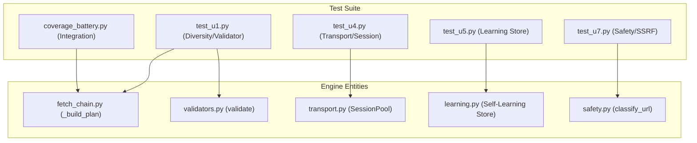

# Testing

<details>
<summary>관련 소스 파일</summary>

다음 파일들은 이 위키 페이지를 생성하기 위한 컨텍스트로 사용되었습니다.

- [skills/insane-search/engine/__init__.py](skills/insane-search/engine/__init__.py)
- [skills/insane-search/engine/learning.py](skills/insane-search/engine/learning.py)
- [skills/insane-search/engine/templates/.gitignore](skills/insane-search/engine/templates/.gitignore)
- [skills/insane-search/engine/templates/package.json](skills/insane-search/engine/templates/package.json)
- [skills/insane-search/engine/tests/test_smoke.py](skills/insane-search/engine/tests/test_smoke.py)
- [skills/insane-search/engine/tests/test_u1.py](skills/insane-search/engine/tests/test_u1.py)
- [skills/insane-search/engine/tests/test_u4.py](skills/insane-search/engine/tests/test_u4.py)
- [skills/insane-search/engine/tests/test_u5.py](skills/insane-search/engine/tests/test_u5.py)
- [skills/insane-search/engine/tests/test_u7.py](skills/insane-search/engine/tests/test_u7.py)
- [skills/insane-search/engine/url_transforms.py](skills/insane-search/engine/url_transforms.py)
- [skills/insane-search/engine/validators.py](skills/insane-search/engine/validators.py)
- [skills/insane-search/tests/coverage_battery.py](skills/insane-search/tests/coverage_battery.py)

</details>


`insane-search` 테스트 스위트는 fetch 엔진의 적응형 단계 상승 로직의 신뢰성과 플랫폼별 검색 기법의 지속적인 유효성을 보장하도록 설계되었습니다. 이 스위트는 `engine/tests/`의 결정적 unit tests와 `tests/`의 live integration "coverage battery"로 나뉩니다.

테스트 철학은 다음을 강조합니다.
1.  **결정적 엔진 로직**: 네트워크 없이도 grid scheduler와 response validator가 올바르게 동작하는지 검증합니다.
2.  **Live Platform Verification**: Reddit, X, YouTube 같은 사이트의 공개 접근 경로가 플랫폼 변경에도 계속 동작함을 입증합니다.
3.  **Safety 및 Bias Compliance**: "No-Site-Name Rule"과 SSRF 보호를 강제하기 위한 자동 linting입니다.

### 테스트 스위트 아키텍처

다음 다이어그램은 테스트 컴포넌트와 이들이 실행하는 핵심 엔진 엔터티 간의 관계를 보여줍니다.

**Test-to-Engine 매핑**

출처: [skills/insane-search/engine/tests/test_u1.py:1-10](), [skills/insane-search/engine/tests/test_u5.py:1-6](), [skills/insane-search/tests/coverage_battery.py:1-22]()

---

## Unit Tests

Unit tests(U1부터 U7까지)는 엔진 내부 상태 머신에 대해 빠르고 대부분 네트워크가 필요 없는 검증을 제공합니다. 이러한 테스트는 grid diversity와 WAF detection 정확도 같은 중요한 동작에 대한 수정 사항을 고정합니다.

*   **Grid 및 Validator(U1)**: `_build_plan`이 예산 내에서 TLS 계열과 URL 변환을 올바르게 순환하는지 검증합니다 [skills/insane-search/engine/tests/test_u1.py:52-62](). 또한 `validate` 함수가 미해결 Akamai `_abck` 쿠키 같은 모호한 상태를 올바르게 처리하는지 보장합니다 [skills/insane-search/engine/tests/test_u1.py:98-103]().
*   **Transport 및 Sessions(U4)**: host 기반 session 재사용과 browser-to-curl cookie bridge를 위해 `SessionPool`을 실행합니다 [skills/insane-search/engine/tests/test_u4.py:26-37]().
*   **Self-Learning(U5)**: `learning.py` store의 영속성, TTL pruning, strike 기반 퇴출을 테스트합니다 [skills/insane-search/engine/tests/test_u5.py:66-74]().
*   **Safety 및 SSRF(U7)**: `classify_url`이 loopback, private IP, 악의적 리다이렉트를 차단하는지 확인합니다 [skills/insane-search/engine/tests/test_u7.py:18-34]().

자세한 내용은 [Unit Tests](#7.1)를 참조하세요.

**출처:** [skills/insane-search/engine/tests/test_u1.py:1-10](), [skills/insane-search/engine/tests/test_u4.py:1-6](), [skills/insane-search/engine/tests/test_u5.py:1-6](), [skills/insane-search/engine/tests/test_u7.py:1-5]()

---

## Coverage Battery 및 Integration Tests

Coverage Battery(`coverage_battery.py`)는 도구의 검색 기능에 대한 "evidence artifact" 역할을 하는 live integration suite입니다. 엔진 unit tests와 달리, 이 battery는 `SKILL.md`에 문서화된 검색 패턴이 부패하지 않았는지 검증하기 위해 사이트별 이름을 사용할 수 있습니다.

| 플랫폼 | 테스트되는 방식 | 소스 엔터티 |
| :--- | :--- | :--- |
| **Reddit** | RSS, JSON(iPhone UA), JSON(curl_cffi) | `reddit_routes` |
| **X (Twitter)** | Syndication, Tweet-Result, oEmbed | `x_routes` |
| **YouTube** | yt-dlp 메타데이터 추출 | `youtube_routes` |
| **Hacker News** | Firebase API, Algolia API | `hn_routes` |

battery는 모든 경로에 대해 status code, byte size, content sample을 캡처하여 전체 플랫폼 매트릭스에 대한 명확한 PASS/FAIL 보고서를 제공합니다 [skills/insane-search/tests/coverage_battery.py:35-44]().

자세한 내용은 [Coverage Battery 및 Integration Tests](#7.2)를 참조하세요.

**출처:** [skills/insane-search/tests/coverage_battery.py:67-142](), [skills/insane-search/engine/tests/test_smoke.py:96-110]()

---

## Smoke Tests 및 Linting

unit 및 integration tests 외에도, 코드베이스는 아키텍처 무결성을 유지하기 위해 smoke tests와 특수 linter를 활용합니다.

### Smoke Tests
`test_smoke.py` 파일은 `example.com`과 `httpbin.org`에 대해 무해한 온라인 검사를 수행하여 fetch trace의 end-to-end "shape"를 검증하고, 실패한 시도에서도 metadata가 올바르게 채워지는지 보장합니다 [skills/insane-search/engine/tests/test_smoke.py:112-119]().

### Bias Check(Linter)
`bias_check.py` 스크립트(CI에서 실행됨)는 **No-Site-Name Rule**을 강제합니다. `engine/` 디렉터리에서 하드코딩된 브랜드 부분 문자열이나 사이트별 URL 패턴을 스캔하여, 엔진이 범용 WAF 우회 grid로 유지되고 사이트별 지식은 `references/` 또는 Phase 0으로 분리되도록 보장합니다 [skills/insane-search/engine/tests/test_u1.py:7-8]().

**Validator 로직 흐름(Unit Tested)**
```mermaid
graph TD
    "Response" --> H["HARD Markers?"]
    H -- "Yes" --> "Verdict.CHALLENGE"
    H -- "No" --> S["Status Code?"]
    S -- "429" --> "Verdict.RATE_LIMITED"
    S -- "401/404" --> "Verdict.AUTH/NOT_FOUND"
    S -- "200" --> JSON["Is JSON?"]
    JSON -- "Yes" --> "Verdict.WEAK_OK"
    JSON -- "No" --> SEL["Selector Match?"]
    SEL -- "Yes" --> "Verdict.STRONG_OK"
    SEL -- "No" --> SIZE["Small Body?"]
    SIZE -- "Yes" --> "Verdict.CHALLENGE"
    SIZE -- "No" --> "Verdict.WEAK_OK"
```
출처: [skills/insane-search/engine/validators.py:69-81](), [skills/insane-search/engine/tests/test_u1.py:89-165]()
