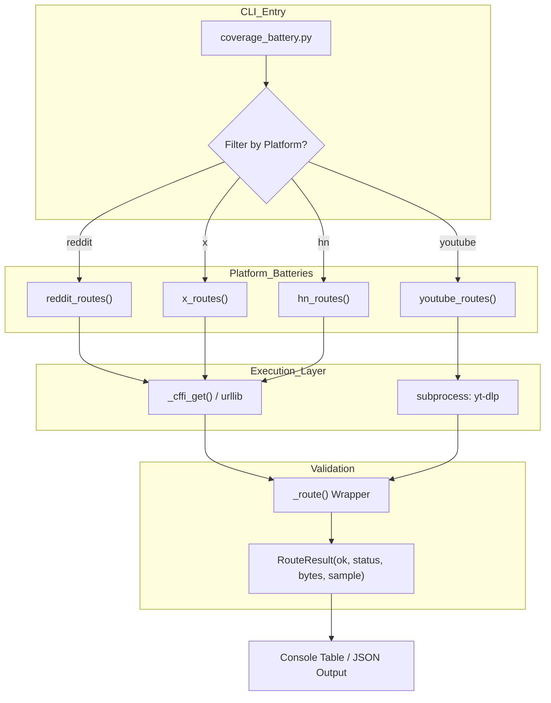

# 커버리지 배터리 및 통합 테스트

관련 소스 파일

다음 파일들은 이 위키 페이지를 생성하기 위한 컨텍스트로 사용되었습니다:

- [skills/insane-search/tests/coverage_battery.py](skills/insane-search/tests/coverage_battery.py)

**Coverage Battery**는 트래픽이 많은 플랫폼을 대상으로 특정 검색 경로의 실효성을 검증하도록 설계된 네트워크 라이브 테스트 스위트입니다. 코어 엔진은 범용 WAF 회피 그리드를 제공하지만, 많은 플랫폼(예: X/Twitter, Reddit, YouTube)은 스크래핑보다 안정적인 공식 또는 준공식 공개 엔드포인트를 제공하는 동시에 조용히 "부패"하기 쉽습니다(API 변경 또는 새로운 차단).

이 스위트는 시스템에 문서화된 Phase 0 플랫폼별 로직이 계속 작동하며 시간이 지나도 어떤 경로도 저하되지 않았음을 보장하기 위한 증거 산출물 역할을 합니다 [skills/insane-search/tests/coverage_battery.py:6-13]().

## 목적과 범위

`coverage_battery.py` 스크립트는 엔드투엔드 fetch 시나리오를 실행합니다. 단위 테스트와 달리, 이것들은 활성 인터넷 연결과 `curl_cffi`, `yt-dlp` 같은 유효한 외부 의존성이 필요한 **통합 테스트**입니다 [skills/insane-search/tests/coverage_battery.py:15-17]().

### 핵심 목표
1.  **경로 부패 감지:** 이전에 작동하던 엔드포인트(예: Reddit의 `.json` 피드)가 403 또는 429 오류를 반환하기 시작하는 시점을 포착합니다 [skills/insane-search/tests/coverage_battery.py:8-13]().
2.  **다중 단계 커버리지 검증:** 단일 플랫폼(예: X/Twitter)에 대해 syndication, oEmbed, CDN 기반 JSON 등 사용 가능한 모든 메서드가 테스트되는지 보장합니다 [skills/insane-search/tests/coverage_battery.py:101-129]().
3.  **스킬 예제 검증:** 에이전트가 작동하는 코드를 받고 있는지 보장하기 위해, 스크립트는 `SKILL.md`에서 LLM에 제공되는 정확한 `urllib` 또는 `curl_cffi` 스니펫을 테스트합니다 [skills/insane-search/tests/coverage_battery.py:76-87]().

## 시스템 아키텍처: 테스트 흐름

배터리는 표준 `fetch_chain.py` 로직을 우회하여 원시 기반 엔드포인트를 직접 테스트합니다. 이를 통해 개발자는 실패 원인이 플랫폼 API 변경인지 엔진의 스케줄링 로직인지 격리할 수 있습니다.

### 자연어와 코드 엔티티 매핑

| 시스템 개념 | 코드 엔티티 | 파일 경로 |
| :--- | :--- | :--- |
| **결과 스키마** | `RouteResult` (dataclass) | [skills/insane-search/tests/coverage_battery.py:35-44]() |
| **미디어 추출** | `youtube_routes` / `yt-dlp` | [skills/insane-search/tests/coverage_battery.py:132-142]() |
| **RSS/JSON 프로브** | `reddit_routes` | [skills/insane-search/tests/coverage_battery.py:67-98]() |
| **Syndication/oEmbed** | `x_routes` | [skills/insane-search/tests/coverage_battery.py:101-129]() |
| **검색/API 프로브** | `hn_routes` (Algolia/Firebase) | [skills/insane-search/tests/coverage_battery.py:145-155]() |

### 커버리지 실행 흐름

다음 다이어그램은 `coverage_battery.py`가 서로 다른 네트워크 프로토콜과 플랫폼 핸들러 전반에서 테스트를 어떻게 오케스트레이션하는지 보여줍니다.

"Coverage Battery Execution Logic"

**출처:** [skills/insane-search/tests/coverage_battery.py:19-31](), [skills/insane-search/tests/coverage_battery.py:56-63]().

## 핵심 함수와 구현

### 결과 추적: `RouteResult`
모든 테스트 시도는 `RouteResult` 객체를 반환하며, 이 객체는 다음을 캡처합니다:
*   `ok`: 데이터가 성공적으로 검색되고 검증되었는지를 나타내는 Boolean입니다(예: 예상 JSON 키 또는 HTML 태그 포함) [skills/insane-search/tests/coverage_battery.py:39]().
*   `status`: 반환된 HTTP 상태 코드입니다 [skills/insane-search/tests/coverage_battery.py:40]().
*   `sample`: 시각적 확인을 위한 검색된 콘텐츠의 작은 스니펫입니다 [skills/insane-search/tests/coverage_battery.py:42]().
*   `elapsed_s`: 요청 지연 시간입니다 [skills/insane-search/tests/coverage_battery.py:44]().

### 전송: `_cffi_get`
배터리는 주로 브라우저 TLS 지문을 모방하기 위해 `curl_cffi`를 사용하며, 이는 메인 엔진의 Phase 2에서 사용하는 것과 동일한 전송 방식입니다 [skills/insane-search/tests/coverage_battery.py:50-53](). 또한 "경량" Phase 1 시나리오를 검증하기 위해 표준 `urllib`를 사용하는 테스트도 포함합니다 [skills/insane-search/tests/coverage_battery.py:77-81]().

### 플랫폼 구현 세부 사항

| 플랫폼 | 테스트되는 메서드 | 검증 로직 |
| :--- | :--- | :--- |
| **Reddit** | RSS, JSON (iPhone UA), JSON (CFFI) | RSS의 `<title>` 태그 또는 JSON의 `{` 시작 여부를 확인합니다 [skills/insane-search/tests/coverage_battery.py:70-93](). |
| **X (Twitter)** | Syndication, Tweet-Result, oEmbed | `__NEXT_DATA__` 또는 `text` 같은 특정 JSON 키를 검색합니다 [skills/insane-search/tests/coverage_battery.py:104-124](). |
| **YouTube** | `yt-dlp --dump-json` | JSON 파싱 가능성과 `subtitles` 존재를 검증합니다 [skills/insane-search/tests/coverage_battery.py:133-141](). |
| **Hacker News** | Firebase, Algolia | Checks for array starts `[` and hit counts [skills/insane-search/tests/coverage_battery.py:146-155](). |

**출처:** [skills/insane-search/tests/coverage_battery.py:67-155]().

## 배터리 실행

배터리는 세 가지 작동 모드를 지원합니다:
1.  **전체 스위트:** 스크립트에 정의된 모든 플랫폼을 실행합니다.
    `python3 tests/coverage_battery.py` [skills/insane-search/tests/coverage_battery.py:19]().
2.  **대상 지정 테스트:** 지정된 플랫폼만 실행합니다.
    `python3 tests/coverage_battery.py reddit x` [skills/insane-search/tests/coverage_battery.py:20]().
3.  **기계 판독 가능:** CI/CD 통합을 위해 결과를 JSON 형식으로 출력합니다.
    `python3 tests/coverage_battery.py --json` [skills/insane-search/tests/coverage_battery.py:21]().

## 새 플랫폼 커버리지 추가

coverage battery에 새 플랫폼을 추가하려면 다음 패턴을 따르세요:

1.  **경로 함수 정의:** `list[RouteResult]`를 반환하는 함수(예: `github_routes()`)를 만듭니다 [skills/insane-search/tests/coverage_battery.py:67]().
2.  **하위 경로 구현:** `_route` wrapper를 사용해 서로 다른 검색 전략(예: API vs. Web Scrape)을 실행합니다 [skills/insane-search/tests/coverage_battery.py:56-63]().
3.  **검증 추가:** 콘텐츠가 실제로 유용한 경우에만 `ok` 플래그가 설정되도록 보장합니다(예: 특정 JSON 필드 또는 비어 있지 않은 HTML 본문 확인) [skills/insane-search/tests/coverage_battery.py:113-114]().
4.  **Main에 등록:** 스크립트의 `main()` 블록에 있는 실행 목록에 새 함수를 추가합니다.

**출처:** [skills/insane-search/tests/coverage_battery.py:56-155]().
