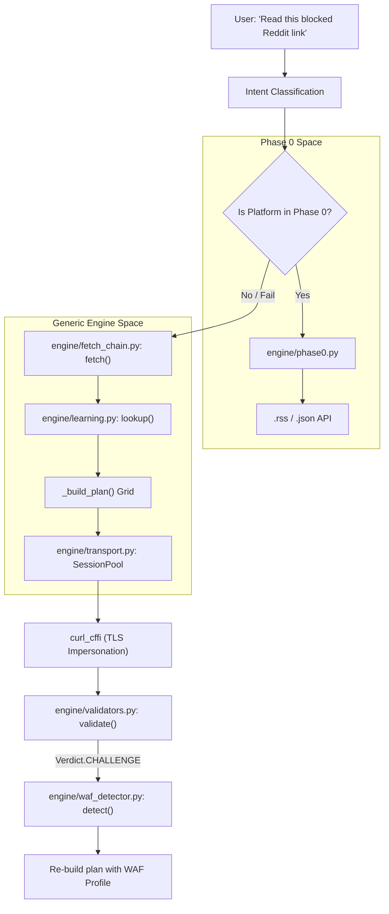
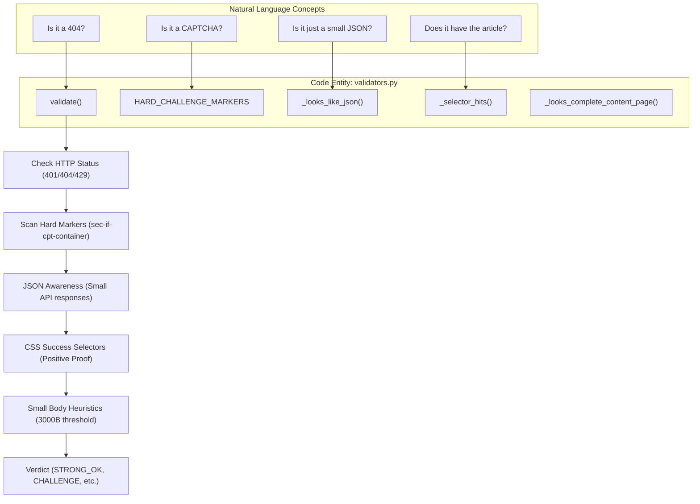

# 용어집

관련 소스 파일

다음 파일들은 이 위키 페이지를 생성하기 위한 컨텍스트로 사용되었습니다.

- [CHANGELOG.md](CHANGELOG.md)
- [skills/insane-search/SKILL.md](skills/insane-search/SKILL.md)
- [skills/insane-search/engine/bias_check.py](skills/insane-search/engine/bias_check.py)
- [skills/insane-search/engine/fetch_chain.py](skills/insane-search/engine/fetch_chain.py)
- [skills/insane-search/engine/learning.py](skills/insane-search/engine/learning.py)
- [skills/insane-search/engine/safety.py](skills/insane-search/engine/safety.py)
- [skills/insane-search/engine/tests/test_u1.py](skills/insane-search/engine/tests/test_u1.py)
- [skills/insane-search/engine/tests/test_u5.py](skills/insane-search/engine/tests/test_u5.py)
- [skills/insane-search/engine/transport.py](skills/insane-search/engine/transport.py)
- [skills/insane-search/engine/validators.py](skills/insane-search/engine/validators.py)
- [skills/insane-search/engine/waf_profiles.yaml](skills/insane-search/engine/waf_profiles.yaml)
- [skills/insane-search/references/fallback.md](skills/insane-search/references/fallback.md)
- [skills/insane-search/references/tls-impersonate.md](skills/insane-search/references/tls-impersonate.md)

이 페이지는 `insane-search` 코드베이스 전반에서 사용되는 기술 용어, 약어, 도메인별 개념을 정의합니다. 우회 엔진의 내부 언어와 구현 메커니즘을 이해하려는 신규 엔지니어를 위한 참조 문서 역할을 합니다.

## 핵심 개념 및 용어

### No-Site-Name Rule(R3)
`bias_check.py`가 강제하는 엄격한 아키텍처 제약입니다 [skills/insane-search/engine/bias_check.py:1-11](). 이 규칙은 범용 fetch 엔진이 도메인 비의존적으로 유지되어야 한다고 요구합니다. 핵심 엔진 파일에는 사이트별 로직, CSS selector, 브랜드명을 허용하지 않습니다(`phase0.py` 제외). 이를 통해 사이트 구조가 변경될 때 엔진이 부패하는 것을 방지하고, 우회 로직이 범용 목적을 유지하도록 보장합니다.

### Phase 0→3 단계 상승
점점 더 무거운 방식으로 단계 상승하며 콘텐츠를 검색하는 데 사용되는 적응형 파이프라인입니다.
*   **Phase 0**: 공식 공개 엔드포인트(RSS, JSON, oEmbed) [skills/insane-search/engine/phase0.py:42-45]().
*   **Phase 1**: 표준 `curl_cffi` 또는 Jina Reader를 사용하는 경량 probe.
*   **Phase 2**: `curl_cffi` 계열을 사용하는 TLS Impersonation grid [skills/insane-search/engine/fetch_chain.py:185-192]().
*   **Phase 3**: 헤드리스 브라우저 실행(Playwright) [skills/insane-search/references/fallback.md:106-115]().

### Diversity Grid
`(TLS Family × URL Transform × Referer Strategy)`의 행렬을 구체화하는 `_build_plan`의 핵심 스케줄링 로직입니다 [skills/insane-search/engine/fetch_chain.py:174-181](). 이는 작은 시도 예산에서도 엔진이 단일 실패 전략에 모든 시도를 소진하지 않고 다양한 우회 범주를 건드리도록 보장합니다 [skills/insane-search/engine/fetch_chain.py:13-17]().

### TLS Impersonation(JA3/JA4)
`curl_cffi`가 실제 브라우저의 TLS handshake signature(fingerprint)를 모방하여 비브라우저 client를 차단하는 WAF를 우회하는 기법입니다 [skills/insane-search/references/tls-impersonate.md:3-5]().

---

## 기술 정의 표

| 용어 | 정의 | 코드 포인터 |
|:---|:---|:---|
| **`_abck`** | 중요한 Akamai Bot Manager 쿠키입니다. `~-1~`을 포함하면 "unresolved"(봇으로 표시됨) 상태입니다 [skills/insane-search/engine/validators.py:120-122](). | `validators.py` |
| **`cf_clearance`** | 사용자가 JS 챌린지를 통과한 뒤 발급되는 Cloudflare 쿠키입니다. Playwright에서 Session Pool로 다시 브리지됩니다 [skills/insane-search/engine/transport.py:9-12](). | `transport.py` |
| **`Verdict`** | fetch 결과를 분류하는 Enum입니다(예: `STRONG_OK`, `CHALLENGE`, `SUSPECT_OK`) [skills/insane-search/engine/validators.py:69-80](). | `validators.py` |
| **`Transform`** | `mobile_subdomain`(`m.` 추가) 또는 `am_prefix` 같은 도메인 비의존적 URL 변형입니다 [skills/insane-search/engine/url_transforms.py:42-43](). | `url_transforms.py` |
| **`SessionPool`** | 쿠키와 warm connection을 유지하기 위해 `(host, impersonate)`를 키로 하는 `curl_cffi` 세션의 스레드 안전 캐시입니다 [skills/insane-search/engine/transport.py:43-46](). | `transport.py` |
| **`SSRF Guard`** | DNS-rebinding 방어를 포함하여 private/internal IP fetching을 방지하는 `classify_url`의 safety 로직입니다 [skills/insane-search/engine/safety.py:37-39](). | `safety.py` |
| **`Self-Learning`** | 동일 호스트에 대한 이후 방문에서 우선순위를 높이기 위해 성공한 route를 `learned.json`에 영속화하는 것입니다 [skills/insane-search/engine/learning.py:1-6](). | `learning.py` |

---

## 데이터 흐름 및 시스템 상호작용

다음 다이어그램은 요청이 자연어 의도에서 fetch를 실행하는 코드 엔터티로 이동하는 방식을 보여줍니다.

### 의도에서 실행까지
제목: 의도에서 코드 엔터티로의 매핑

출처: [skills/insane-search/SKILL.md:95-101](), [skills/insane-search/engine/fetch_chain.py:3-9](), [skills/insane-search/engine/phase0.py:42-45](), [skills/insane-search/engine/learning.py:122-125]()

---

## 검증 및 감지 로직

엔진은 응답이 "실제" 콘텐츠인지 WAF 차단 페이지인지 판단하기 위해 다계층 검증 시스템을 사용합니다.

### 응답 검증 파이프라인
제목: 검증 흐름(자연어에서 Validator v2까지)

출처: [skills/insane-search/engine/validators.py:1-23](), [skills/insane-search/engine/validators.py:40-50](), [skills/insane-search/engine/validators.py:159-171](), [skills/insane-search/engine/validators.py:192-198]()

---

## 주요 코드 심볼 용어집

### `FetchResult`
엔진의 통합 반환 객체입니다.
*   `ok`: 최종 성공(`STRONG_OK` 또는 `WEAK_OK`)을 나타내는 Boolean입니다 [skills/insane-search/engine/fetch_chain.py:85-86]().
*   `trace`: 시도된 모든 TLS/URL 조합을 문서화하는 `Attempt` 객체 목록입니다 [skills/insane-search/engine/fetch_chain.py:90]().
*   `untried_routes`: `ok=False`이면 엔진이 도달하지 못한 전략을 나열하여 에이전트에게 계속 진행해야 함을 알립니다(R6) [skills/insane-search/engine/fetch_chain.py:99]().

### `WAF Profile`
`waf_profiles.yaml`에 정의됩니다. vendor별 지침을 포함합니다.
*   `capabilities_needed`: `needs_real_tls_stack` 같은 태그입니다(Playwright 트리거) [skills/insane-search/engine/fetch_chain.py:227-230]().
*   `tls_impersonate_avoid`: 해당 특정 WAF에 의해 차단되는 것으로 알려진 fingerprint입니다 [skills/insane-search/engine/fetch_chain.py:18-19]().

### Strike-based Eviction
`learning.py`의 정책으로, 학습된 route는 연속적인 실제 차단(`CHALLENGE`, `BLOCKED`)이 `EVICT_AFTER_FAILS`(기본값: 2)에 도달한 뒤에만 `learned.json`에서 삭제됩니다. `429` 같은 일시적 오류는 strike로 계산되지 않습니다 [skills/insane-search/engine/learning.py:32-37]().

출처: [skills/insane-search/engine/fetch_chain.py:83-117](), [skills/insane-search/engine/learning.py:32-37](), [skills/insane-search/engine/validators.py:69-80]()
