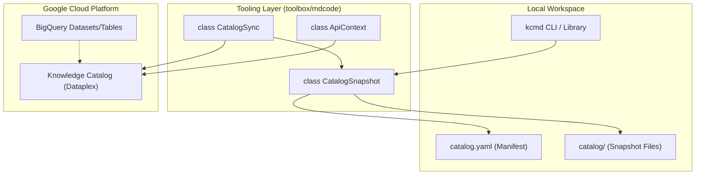
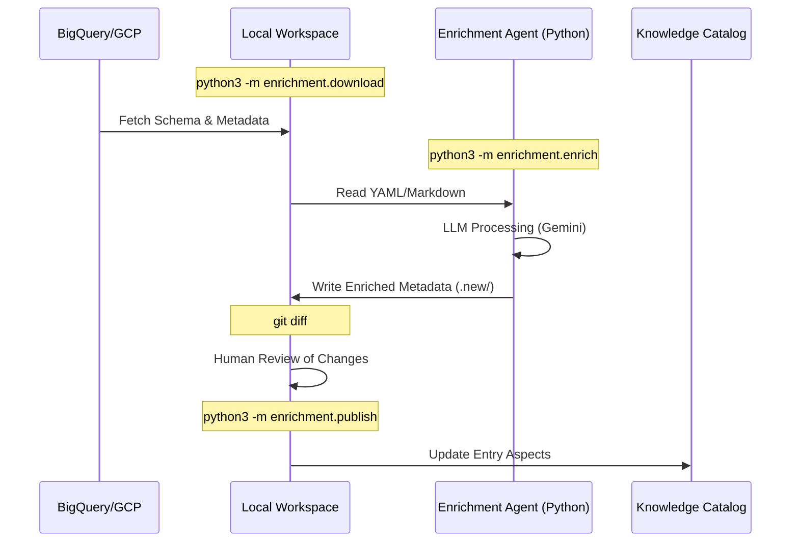

# 저장소 구조 및 시작하기

<details>
<summary>관련 소스 파일</summary>

다음 파일들은 이 위키 페이지를 생성하기 위한 컨텍스트로 사용되었습니다.

- [CODE_OF_CONDUCT.md](CODE_OF_CONDUCT.md)
- [CONTRIBUTING.md](CONTRIBUTING.md)
- [LICENSE.md](LICENSE.md)
- [README.md](README.md)
- [samples/README.md](samples/README.md)
- [samples/enrichment/README.md](samples/enrichment/README.md)
- [toolbox/README.md](toolbox/README.md)
- [toolbox/mdcode/src/libts/gcp/context.ts](toolbox/mdcode/src/libts/gcp/context.ts)
- [toolbox/mdcode/src/libts/tsconfig.json](toolbox/mdcode/src/libts/tsconfig.json)

</details>


Knowledge Catalog 저장소는 AI 기반 메타데이터 관리와 컨텍스트 엔지니어링을 위해 설계된 포괄적인 도구, 에이전트, 샘플 모음을 제공합니다. 핵심적으로 **Metadata as Code (MaC)** 워크플로를 지원하여, 데이터 관리자와 AI 에이전트가 YAML 및 Markdown 같은 소스 관리 아티팩트를 사용해 Google Cloud Dataplex(Knowledge Catalog) 리소스를 관리할 수 있게 합니다 [README.md:1-5]().

## 저장소 레이아웃

저장소는 네 가지 주요 기능 영역으로 구성되어 있습니다.

| Directory | Component | Description |
| :--- | :--- | :--- |
| `toolbox/` | **핵심 도구** | 양방향 메타데이터 동기화를 위한 TypeScript 기반 `kcmd` CLI와 라이브러리를 포함합니다 [toolbox/README.md:5-8](). |
| `agents/` | **보강 에이전트** | LLM을 사용해 메타데이터를 자동으로 생성하고 개선하는 Python 및 TypeScript 에이전트를 포함합니다 [toolbox/README.md:9-12](). |
| `okf/` | **Open Knowledge Format** | 벤더 중립 메타데이터 교환 형식을 위한 참조 구현과 사양입니다. |
| `samples/` | **데모 및 예제** | 탐색 및 보강 시나리오를 보여주는 엔드투엔드 워크플로입니다 [samples/README.md:1-15](). |

### 논리적 구성 요소 관계

다음 다이어그램은 핵심 구성 요소가 로컬 환경과 Google Cloud 사이에서 메타데이터를 관리하기 위해 어떻게 상호작용하는지 보여줍니다.

**시스템 아키텍처 및 코드 엔티티 매핑**

**출처:** [toolbox/README.md:5-8](), [toolbox/mdcode/src/libts/gcp/context.ts:10-42]()

---

## 사전 요구 사항 및 인증

### 소프트웨어 요구 사항
* **Node.js**: `toolbox/` 구성 요소에 필요합니다. TypeScript 라이브러리는 `nodenext` 모듈 해석과 함께 `es2022`용으로 구성되어 있습니다 [toolbox/mdcode/src/libts/tsconfig.json:1-15]().
* **Python 3.x**: `agents/enrichment`, `okf/`, Python 샘플에 필요합니다 [samples/enrichment/README.md:41-45]().
* **Google Cloud SDK (gcloud)**: 인증 및 프로젝트 구성에 필수입니다.

### 인증 설정
도구는 GCP API와 상호작용하기 위해 Application Default Credentials (ADC)와 `gcloud` 구성을 사용합니다. TypeScript 라이브러리의 `ApiContext` 클래스는 토큰과 프로젝트 ID를 가져오기 위해 프로그래밍 방식으로 `gcloud` 명령을 호출합니다 [toolbox/mdcode/src/libts/gcp/context.ts:6-10]().

구체적으로 `ApiContext.default()`는 환경을 초기화하기 위해 다음 명령을 실행합니다.
* `gcloud -q config get-value project` [toolbox/mdcode/src/libts/gcp/context.ts:6-34]()
* `gcloud -q config get-value compute/region` [toolbox/mdcode/src/libts/gcp/context.ts:7-35]()
* `gcloud -q auth application-default print-access-token` [toolbox/mdcode/src/libts/gcp/context.ts:8-36]()

환경을 준비하려면 다음 명령을 실행하세요.
```bash
# Set your active project
export CLOUD_PROJECT=<your-project-id>
gcloud config set core/project $CLOUD_PROJECT

# Authenticate for API access
gcloud auth application-default login
gcloud auth application-default set-quota-project $CLOUD_PROJECT
```
**출처:** [samples/enrichment/README.md:33-39](), [toolbox/mdcode/src/libts/gcp/context.ts:31-42]()

---

## kcmd(Toolbox) 시작하기

`kcmd` 도구는 메타데이터 스냅샷을 코드로 관리하기 위한 기본 인터페이스입니다 [toolbox/README.md:5-7]().

### 1. 설치 및 빌드
의존성을 설치하고 도구를 컴파일하려면 `toolbox/mdcode` 디렉터리로 이동합니다. TypeScript 구성은 컴파일된 코드를 `toolbox/build/ts/kcmd`로 출력합니다 [toolbox/mdcode/src/libts/tsconfig.json:3-3]().

### 2. 동기화 워크플로
`kcmd` 도구는 양방향 동기화 워크플로를 제공합니다.
* **Pull**: Dataplex에서 최신 메타데이터를 로컬 YAML/Markdown 파일로 다운로드합니다.
* **Push**: 로컬 변경 사항을 Knowledge Catalog 서비스로 다시 업로드합니다.

---

## 보강 에이전트 시작하기

보강 에이전트는 `kcmd`가 관리하는 메타데이터를 자동으로 채우는 방법을 제공합니다 [toolbox/README.md:9-12]().

### 보강 워크플로
일반적인 수명 주기는 상태를 다운로드하고, 에이전트를 실행해 문서를 생성한 다음, 결과를 게시하는 과정으로 이루어집니다 [samples/enrichment/README.md:56-89]().

**보강 데이터 흐름**

**출처:** [samples/enrichment/README.md:60-89](), [toolbox/README.md:9-13]()

### Python 샘플 실행
샘플에는 보강 흐름을 테스트하기 위한 더미 데이터를 생성하는 유틸리티가 포함되어 있습니다 [samples/enrichment/README.md:47-54]().

```bash
cd samples/enrichment/src
source env.sh --install

# 1. Setup sample data
python3 ../sample/data/create_data.py

# 2. Download current state
python3 -m enrichment.download \
  --dir ../sample/metadata.initial \
  --dataset ${KC_ENRICH_SAMPLE_PROJECT}.kc_enrich_sample_data

# 3. Generate enrichment
python3 -m enrichment.enrich \
  --dir ../sample/metadata.initial \
  --output-dir ../sample/metadata.new \
  --config-dir ../sample/config

# 4. Review and Publish
git diff --no-index ../sample/metadata.initial ../sample/metadata.new
python3 -m enrichment.publish --dir ../sample/metadata.new
```
**출처:** [samples/enrichment/README.md:41-89]()

## 기여
기여에는 Contributor License Agreement (CLA)가 함께 필요합니다 [CONTRIBUTING.md:15-21](). 모든 제출물은 GitHub pull request를 통한 코드 리뷰가 필요합니다 [CONTRIBUTING.md:27-32](). 개발자는 코드가 기존 스타일을 따르고 단위 테스트(예: TypeScript 디렉터리의 `npm run test`)를 통과하는지 확인해야 합니다 [CONTRIBUTING.md:10-12]().

**출처:** [CONTRIBUTING.md:1-32]()
