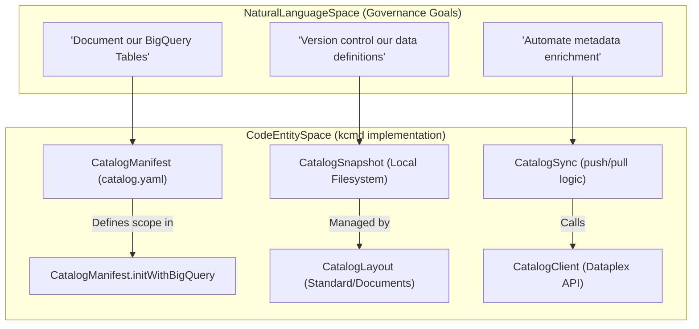
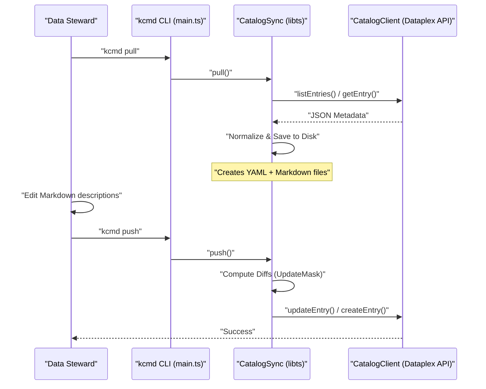

# 핵심 개념: Metadata as Code 및 Knowledge Catalog

관련 소스 파일

다음 파일들은 이 위키 페이지를 생성하기 위한 컨텍스트로 사용되었습니다.

- [toolbox/mdcode/README.md](toolbox/mdcode/README.md)
- [toolbox/mdcode/docs/concept.md](toolbox/mdcode/docs/concept.md)
- [toolbox/mdcode/docs/design.md](toolbox/mdcode/docs/design.md)
- [toolbox/mdcode/docs/plan.md](toolbox/mdcode/docs/plan.md)
- [toolbox/mdcode/docs/spec.md](toolbox/mdcode/docs/spec.md)
- [toolbox/mdcode/package-lock.json](toolbox/mdcode/package-lock.json)
- [toolbox/mdcode/package.json](toolbox/mdcode/package.json)
- [toolbox/mdcode/src/tool/commands.ts](toolbox/mdcode/src/tool/commands.ts)
- [toolbox/mdcode/src/tool/main.ts](toolbox/mdcode/src/tool/main.ts)

이 페이지는 Knowledge Catalog 저장소의 기반 개념을 설명하며, "Metadata as Code"(MaC) 철학, 그 바탕이 되는 Dataplex 데이터 모델, 그리고 `kcmd` 도구가 현대적인 데이터 거버넌스 수명 주기를 어떻게 지원하는지에 초점을 맞춥니다.

## Knowledge Catalog란?

**Knowledge Catalog**(이전 명칭 Dataplex)는 AI 기반 데이터 카탈로그화 및 메타데이터 관리를 위해 설계된 Google Cloud 플랫폼입니다 [toolbox/mdcode/README.md:1-3](). 구조화 데이터(예: BigQuery 테이블)와 비구조화 데이터 모두에 대한 동적 지식 그래프를 생성하여 AI 에이전트에 의미론적 컨텍스트를 제공합니다 [toolbox/mdcode/README.md:3-5]().

### 데이터 모델: Entries, Aspects, Types

Knowledge Catalog는 계층적이고 확장 가능한 모델을 사용해 메타데이터를 구성합니다.

| Component | Description |
| :--- | :--- |
| **Entry** | 데이터 자산(예: 테이블, 데이터셋, entry group)을 나타내는 기본 단위입니다 [toolbox/mdcode/docs/spec.md:21-21](). |
| **Aspect** | Entry에 연결되는 관련 메타데이터 속성 그룹입니다. Aspect는 확장성을 제공하여 시스템 정의 메타데이터와 사용자 정의 메타데이터를 모두 가능하게 합니다 [toolbox/mdcode/docs/spec.md:22-22](). |
| **EntryType / AspectType** | 각각 Entry와 Aspect의 스키마 및 요구 사항을 정의하는 템플릿입니다. |
| **EntryLink** | 서로 다른 Entry 간의 관계를 정의하여 지식 그래프의 간선을 형성합니다 [toolbox/mdcode/docs/concept.md:20-21](). |
| **EntryGroup** | Entry를 담는 논리적 컨테이너로, 특정 프로젝트나 비즈니스 도메인에 맞춰지는 경우가 많습니다 [toolbox/mdcode/docs/spec.md:24-24](). |

**출처:** [toolbox/mdcode/README.md:1-5](), [toolbox/mdcode/docs/concept.md:20-21](), [toolbox/mdcode/docs/spec.md:21-24]()

## Metadata as Code (MaC)

Metadata as Code는 데이터 관리자와 엔지니어에게 메타데이터 관리를 위한 소스 코드 기반 경험을 제공하도록 설계된 핵심 기능입니다 [toolbox/mdcode/docs/concept.md:5-8](). UI만으로 메타데이터를 관리하는 대신, MaC는 개발자 저장소 안에서 메타데이터를 버전 관리되는 아티팩트(YAML 및 Markdown)로 취급합니다 [toolbox/mdcode/docs/concept.md:8-11]().

### MaC의 핵심 원칙
*   **사람과 에이전트가 읽을 수 있음:** 수동 리뷰와 AI 에이전트에 의한 자동 처리 모두에 최적화되어 있습니다 [toolbox/mdcode/docs/concept.md:30-33]().
*   **양방향 동기화:** 클라우드에서 로컬 파일로 상태를 다운로드(`pull`)하고 로컬 변경 사항을 다시 서비스에 게시(`push`)하는 기능을 지원합니다 [toolbox/mdcode/docs/concept.md:41-44]().
*   **버전 관리 통합:** 메타데이터의 diff 확인, 브랜칭, CI/CD 기반 배포에 표준 Git 워크플로를 사용할 수 있게 합니다 [toolbox/mdcode/docs/concept.md:76-85]().
*   **비정형 콘텐츠 지원:** Aspect의 큰 텍스트 필드는 미리보기 같은 IDE 기능을 활용할 수 있도록 "sidecar" Markdown 파일로 표현됩니다 [toolbox/mdcode/docs/concept.md:22-24]().

**출처:** [toolbox/mdcode/docs/concept.md:5-85]()

## kcmd 워크플로

`kcmd` CLI 도구는 MaC 수명 주기를 구현합니다. 클라우드의 "Knowledge Catalog"와 로컬 "Code Entity Space" 사이의 간극을 연결합니다.

### 자연어에서 코드 엔티티로
다음 다이어그램은 상위 수준의 거버넌스 목표가 `kcmd` 생태계 내의 구체적인 코드 구조로 어떻게 변환되는지 보여줍니다.

**거버넌스와 코드 매핑**

**출처:** [toolbox/mdcode/src/tool/commands.ts:25-48](), [toolbox/mdcode/src/tool/commands.ts:61-67](), [toolbox/mdcode/docs/concept.md:19-27](), [toolbox/mdcode/docs/design.md:18-25]()

### 데이터 거버넌스 수명 주기
`kcmd`를 사용해 메타데이터를 관리하는 표준 워크플로는 다음 단계를 따릅니다.

1.  **초기화(`init`):** `catalog.yaml` 매니페스트에 메타데이터의 범위(예: BigQuery 데이터셋)를 정의합니다 [toolbox/mdcode/src/tool/main.ts:10-13]().
2.  **다운로드(`pull`):** Dataplex에서 현재 상태를 가져와 로컬 YAML/Markdown 파일로 저장합니다 [toolbox/mdcode/src/tool/commands.ts:61-70]().
3.  **보강:** AI 에이전트나 수동 편집을 사용해 로컬 파일을 업데이트합니다(예: 설명 또는 태그 추가) [toolbox/mdcode/docs/concept.md:58-62]().
4.  **검토(`status`):** 변경 사항이 실제로 반영되기 전에 `kcmd status` 또는 `git diff` 같은 표준 도구를 사용해 검사합니다 [toolbox/mdcode/docs/design.md:90-91]().
5.  **게시(`push`):** 검증된 로컬 변경 사항을 Knowledge Catalog 서비스로 다시 동기화합니다 [toolbox/mdcode/src/tool/commands.ts:82-90]().

**시스템 상호작용 다이어그램**

**출처:** [toolbox/mdcode/src/tool/main.ts:26-54](), [toolbox/mdcode/src/tool/commands.ts:61-100](), [toolbox/mdcode/docs/design.md:86-91]()

## 주요 구현 클래스

| Class | File Path | Role |
| :--- | :--- | :--- |
| `CatalogManifest` | [toolbox/mdcode/src/libts/manifest.ts]() | `catalog.yaml` 파싱과 초기화를 처리합니다 [toolbox/mdcode/src/tool/commands.ts:28-30](). |
| `CatalogSnapshot` | [toolbox/mdcode/src/libts/snapshot.ts]() | 로컬 디렉터리 구조와 파일 I/O를 관리합니다 [toolbox/mdcode/src/tool/commands.ts:63-63](). |
| `CatalogSync` | [toolbox/mdcode/src/libts/sync.ts]() | 충돌 해결을 포함해 `pull` 및 `push` 로직을 조율합니다 [toolbox/mdcode/src/tool/commands.ts:66-69](). |
| `CatalogClient` | [toolbox/mdcode/src/libts/gcp/dataplex.ts]() | Google Cloud Dataplex API 래퍼입니다 [toolbox/mdcode/src/tool/commands.ts:65-65](). |
| `ApiContext` | [toolbox/mdcode/src/libts/gcp/context.ts]() | 인증 및 프로젝트 구성을 관리합니다 [toolbox/mdcode/src/tool/commands.ts:26-26](). |
| `CatalogLayout` | [toolbox/mdcode/src/libts/layout.ts]() | 물리적 파일 표현(Standard vs Documents)을 위한 추상 클래스입니다 [toolbox/mdcode/docs/design.md:65-70](). |

**출처:** [toolbox/mdcode/src/tool/commands.ts:6-9](), [toolbox/mdcode/src/tool/commands.ts:25-100](), [toolbox/mdcode/docs/design.md:18-25]()
