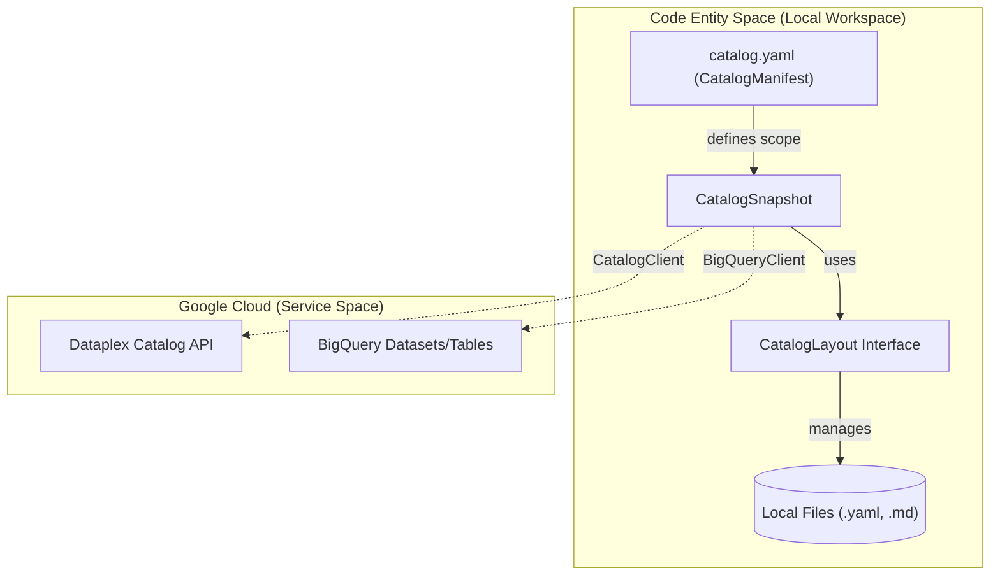
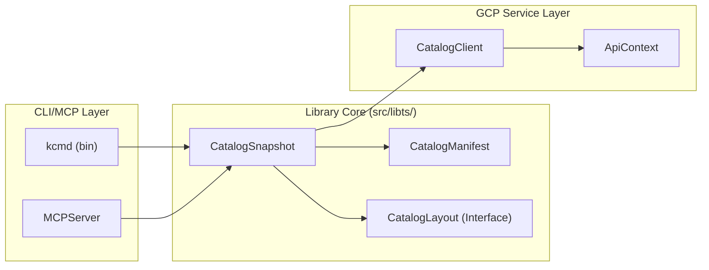

# kcmd: Metadata as Code CLI 및 라이브러리

관련 소스 파일

다음 파일들은 이 위키 페이지를 생성하기 위한 컨텍스트로 사용되었습니다.

- [toolbox/mdcode/README.md](toolbox/mdcode/README.md)
- [toolbox/mdcode/package-lock.json](toolbox/mdcode/package-lock.json)
- [toolbox/mdcode/package.json](toolbox/mdcode/package.json)
- [toolbox/mdcode/src/libts/snapshot.ts](toolbox/mdcode/src/libts/snapshot.ts)

**Metadata as Code**는 데이터 관리자, 생산자, AI 에이전트에게 메타데이터 관리와 컨텍스트 엔지니어링을 위한 소스 코드 아티팩트 기반 워크플로를 제공하는 Knowledge Catalog(Dataplex)의 핵심 기능입니다 [toolbox/mdcode/README.md:3-5](). `kcmd` 도구를 사용하면 사용자는 버전 관리와 CI/CD 같은 개발자 친화적 방식으로 메타데이터 아티팩트를 작성, 관리, 보강할 수 있습니다 [toolbox/mdcode/README.md:1-5]().

이 도구는 TypeScript 라이브러리, Command Line Interface (CLI), Model Context Protocol (MCP) 서버로 배포됩니다 [toolbox/mdcode/README.md:13-14]().

### 핵심 워크플로와 아키텍처

시스템은 `catalog.yaml` 매니페스트와 메타데이터 스냅샷을 포함하는 `catalog/` 디렉터리가 있는 로컬 작업 공간에서 동작합니다 [toolbox/mdcode/README.md:22-30]().

아래 다이어그램은 `kcmd`가 로컬 개발자 환경(Code Entity Space)과 Google Cloud Dataplex 서비스(Natural Language/Service Space) 사이의 간극을 어떻게 연결하는지 보여줍니다.

**시스템 아키텍처: 로컬 작업 공간에서 Dataplex 서비스까지**

출처: [toolbox/mdcode/src/libts/snapshot.ts:14-30](), [toolbox/mdcode/src/libts/snapshot.ts:138-142](), [toolbox/mdcode/README.md:18-30]()

---

### 구성 요소 개요

#### CLI 및 MCP Server
`kcmd` CLI는 작업 공간을 초기화(`init`)하고, 클라우드에서 메타데이터를 가져오며(`pull`), 로컬 변경 사항을 서비스로 다시 푸시하는(`push`) 명령을 제공합니다 [toolbox/mdcode/README.md:138-166](). 또한 MCP 서버 구현도 포함하여, AI 에이전트가 `modify-entry` 또는 `list-entries` 같은 표준화된 도구를 통해 카탈로그와 상호작용할 수 있게 합니다 [toolbox/mdcode/README.md:170-194]().
*   자세한 내용은 [CLI Commands and MCP Server](#2.1)를 참조하세요.

#### Catalog Manifest (`catalog.yaml`)
`CatalogManifest` 클래스가 관리하는 매니페스트 파일은 구성 허브 역할을 합니다. 이 파일은 `scope`(예: BigQuery 데이터셋), Aspect type에 대한 `aliases`, 그리고 Entry 및 Aspect type에 대한 `snapshot`/`publishing` 규칙을 정의합니다 [toolbox/mdcode/src/libts/snapshot.ts:32-44](), [toolbox/mdcode/README.md:34-58]().
*   자세한 내용은 [Catalog Manifest (catalog.yaml)](#2.2)를 참조하세요.

#### 동기화 엔진(`CatalogSync`)
동기화 로직은 메타데이터의 양방향 흐름을 처리합니다. `pull` 작업 중에는 시스템이 Dataplex Entry를 로컬 스냅샷에 저장합니다 [toolbox/mdcode/src/libts/snapshot.ts:181-184](). `push` 중에는 로컬 표현을 가져와 Dataplex API에 맞게 준비합니다 [toolbox/mdcode/src/libts/snapshot.ts:186-188]().
*   자세한 내용은 [Synchronization Engine (CatalogSync)](#2.3)를 참조하세요.

#### 스냅샷 및 소스 추상화
`CatalogSnapshot` 클래스는 로컬 메타데이터 상태를 조율하는 중심 클래스입니다 [toolbox/mdcode/src/libts/snapshot.ts:14-22](). 이 클래스는 `CatalogManifest`와 기반 `CatalogLayout` 사이의 관계를 관리합니다 [toolbox/mdcode/src/libts/snapshot.ts:24-30](). 또한 Dataplex 서비스에서 `entryTypes` 및 `aspectTypes`의 로컬 맵을 구성하여 로컬 변경 사항을 검증합니다 [toolbox/mdcode/src/libts/snapshot.ts:137-176]().
*   자세한 내용은 [CatalogSnapshot and Source Abstractions](#2.4)를 참조하세요.

#### 스토리지 레이아웃
메타데이터 스토리지는 `CatalogLayout` 인터페이스를 통해 추상화됩니다 [toolbox/mdcode/src/libts/snapshot.ts:22](). 시스템은 리소스 계층 구조를 반영하는 계층적 구성을 지원합니다 [toolbox/mdcode/README.md:11-12](). Sidecar 파일(예: `.overview.md`)을 사용하면 구조화된 YAML 메타데이터와 함께 긴 형식의 콘텐츠를 Markdown으로 관리할 수 있습니다 [toolbox/mdcode/README.md:82-92]().
*   자세한 내용은 [Storage Layouts: Standard and Documents](#2.5)를 참조하세요.

#### GCP API 클라이언트 계층
라이브러리에는 Dataplex와 상호작용하기 위한 `CatalogClient`가 포함되어 있습니다 [toolbox/mdcode/src/libts/snapshot.ts:138](). 이 클라이언트는 인증을 관리하기 위해 `ApiContext`를 사용하며, 일반적으로 로컬 환경에서는 `gcloud` 자격 증명에 의존합니다 [toolbox/mdcode/README.md:168]().
*   자세한 내용은 [GCP API Client Layer](#2.6)를 참조하세요.

#### 테스트 인프라
프로젝트는 테스트에 `bun`을 사용합니다 [toolbox/mdcode/package.json:18-19](). 테스트 스위트에는 시나리오 기반 테스트가 포함되어 있으며, 디스크 I/O 없이 스냅샷 및 레이아웃 작업을 검증하기 위해 인메모리 가상 파일 시스템인 `memfs`를 활용합니다 [toolbox/mdcode/package-lock.json:27]().
*   자세한 내용은 [Testing Infrastructure and Scenario Framework](#2.7)를 참조하세요.

---

### 주요 클래스와 관계

다음 다이어그램은 `kcmd` 라이브러리의 주요 클래스를 Metadata as Code 수명 주기에서의 역할에 매핑합니다.

**클래스 맵: 라이브러리 코어에서 CLI 인터페이스까지**

출처: [toolbox/mdcode/src/libts/snapshot.ts:14-30](), [toolbox/mdcode/src/libts/snapshot.ts:138](), [toolbox/mdcode/package.json:6-8]()
