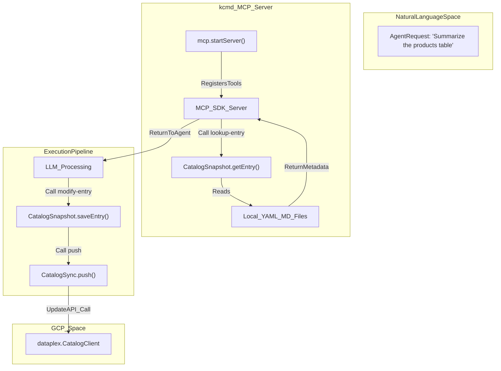
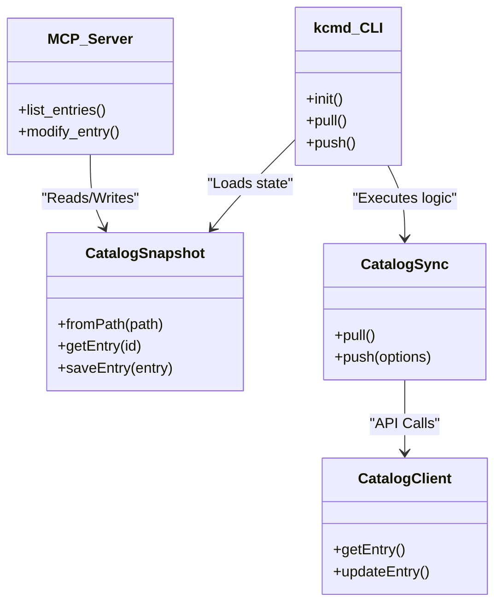

# CLI 명령 및 MCP 서버

관련 소스 파일

다음 파일들은 이 위키 페이지를 생성하기 위한 컨텍스트로 사용되었습니다.

- [toolbox/mdcode/README.md](toolbox/mdcode/README.md)
- [toolbox/mdcode/docs/concept.md](toolbox/mdcode/docs/concept.md)
- [toolbox/mdcode/package-lock.json](toolbox/mdcode/package-lock.json)
- [toolbox/mdcode/package.json](toolbox/mdcode/package.json)
- [toolbox/mdcode/src/tool/commands.ts](toolbox/mdcode/src/tool/commands.ts)
- [toolbox/mdcode/src/tool/main.ts](toolbox/mdcode/src/tool/main.ts)

`kcmd` 도구는 Metadata as Code (MaC) 워크플로를 위한 기본 인터페이스입니다. 이 도구는 독립 실행형 바이너리로 배포되며 두 가지 주요 동작 모드를 제공합니다. 사람 사용자와 자동화 파이프라인을 위한 표준 Command Line Interface (CLI), 그리고 카탈로그 작업을 AI 에이전트용 도구로 노출하는 Model Context Protocol (MCP) 서버입니다.

## CLI 명령

CLI는 `cac` 라이브러리를 사용해 빌드되며 [toolbox/mdcode/src/tool/main.ts:4-9](), `CatalogSync` 및 `CatalogSnapshot` 클래스의 래퍼 역할을 합니다. 로컬 작업 공간 초기화와 Google Cloud Dataplex Knowledge Catalog와의 양방향 메타데이터 동기화를 지원합니다.

### 명령 참조

| Command | Description | Key Options |
| :--- | :--- | :--- |
| `init` | 새 `catalog.yaml` 매니페스트와 작업 공간을 초기화합니다. | `--entry-group`, `--bigquery-dataset`, `--kb`, `--pull` |
| `pull` | Catalog 서비스에서 로컬 `catalog/` 디렉터리로 메타데이터를 다운로드합니다. | N/A |
| `push` | 로컬 수정 사항을 Catalog 서비스로 업로드합니다. | `--force`, `--validate-only` |
| `mcp` | 에이전트 도구 사용을 위한 MCP 서버를 시작합니다. | `--path` |

#### `init`
로컬 메타데이터 저장소를 초기화합니다. 세 가지 주요 소스 유형을 지원합니다.
*   **BigQuery Datasets**: `--bigquery-dataset <project>.<dataset>`을 사용해 대상으로 지정합니다 [toolbox/mdcode/src/tool/main.ts:12-12]().
*   **Entry Groups**: `--entry-group <project>.<location>.<id>`를 사용해 대상으로 지정합니다 [toolbox/mdcode/src/tool/main.ts:11-11]().
*   **Knowledge Bases**: `--kb <project>.<location>.<id>`를 사용해 대상으로 지정합니다 [toolbox/mdcode/src/tool/main.ts:13-13]().

이 명령은 현재 디렉터리에 `catalog.yaml` 매니페스트를 생성합니다 [toolbox/mdcode/src/tool/commands.ts:50-51](). `--pull` 플래그가 제공되면 초기화 직후 동기화를 실행합니다 [toolbox/mdcode/src/tool/commands.ts:53-55]().

#### `pull`
`pull` 명령은 `CatalogSync` 객체를 인스턴스화하고 해당 `pull()` 메서드를 호출합니다 [toolbox/mdcode/src/tool/commands.ts:61-79](). 매니페스트에 정의된 원격 소스에서 Entry와 Aspect를 가져와 로컬 파일 시스템 스냅샷을 업데이트합니다.

#### `push`
`push` 명령은 로컬 변경 사항을 GCP로 다시 동기화합니다 [toolbox/mdcode/src/tool/commands.ts:82-100]().
*   `--validate-only`: 변경 사항을 커밋하지 않고 오류를 확인하기 위해 Dataplex API의 검증 모드를 사용합니다 [toolbox/mdcode/src/tool/commands.ts:21-21]().
*   `--force`: 충돌이 감지되더라도(ETag 불일치를 통해) 원격 변경 사항을 덮어씁니다 [toolbox/mdcode/src/tool/commands.ts:20-20]().

**출처:** [toolbox/mdcode/src/tool/main.ts:1-80](), [toolbox/mdcode/src/tool/commands.ts:1-101](), [toolbox/mdcode/README.md:135-166]()

---

## MCP 서버 인터페이스

`kcmd mcp` 명령은 Model Context Protocol을 구현하는 서버를 시작합니다 [toolbox/mdcode/src/tool/main.ts:57-67](). 이를 통해 AI 에이전트(Gemini CLI 또는 Claude Desktop의 에이전트 등)는 표준화된 도구 모음을 사용해 메타데이터 카탈로그와 상호작용할 수 있습니다.

### 도구 정의

MCP 서버는 에이전트의 컨텍스트에 다음 도구를 노출합니다.

| Tool Name | Implementation | Purpose |
| :--- | :--- | :--- |
| `pull` | `sync.pull()` | 클라우드 서비스에서 로컬 스냅샷을 새로 고칩니다. |
| `push` | `sync.push()` | 에이전트가 만든 로컬 편집 내용을 클라우드에 게시합니다. |
| `list-entries` | `snapshot.entries()` | 사용 가능한 메타데이터 자산 목록을 에이전트에 제공합니다. |
| `lookup-entry` | `snapshot.getEntry()` | 특정 Entry의 전체 YAML/Markdown 콘텐츠를 가져옵니다. |
| `modify-entry` | `snapshot.saveEntry()` | 에이전트가 로컬 스냅샷에 업데이트를 쓸 수 있게 합니다. |

### 데이터 흐름: 에이전트에서 카탈로그까지

다음 다이어그램은 AI 에이전트의 자연어 요청이 `kcmd` 아키텍처 내 코드 수준 작업으로 어떻게 변환되는지 보여줍니다.

**에이전트 상호작용 데이터 흐름**

**출처:** [toolbox/mdcode/src/tool/main.ts:57-67](), [toolbox/mdcode/README.md:170-195](), [toolbox/mdcode/package.json:20-20]()

---

## 구현 세부 사항

### CLI 오케스트레이션
CLI 로직은 명령 정의 파일(`main.ts`)과 핸들러 파일(`commands.ts`)로 분리되어 있습니다.
1.  **컨텍스트 초기화**: 모든 명령은 `gcloud` 인증을 처리하는 `context.ApiContext.default()`를 사용해 `ApiContext`를 생성하는 것으로 시작합니다 [toolbox/mdcode/src/tool/commands.ts:26-26]().
2.  **스냅샷 로드**: `pull` 및 `push` 같은 명령은 `CatalogSnapshot.fromPath('.')`를 사용해 로컬 상태를 `CatalogSnapshot` 객체로 로드합니다 [toolbox/mdcode/src/tool/commands.ts:63-63]().
3.  **동기화 실행**: `CatalogSync` 클래스는 diff 계산과 API 오케스트레이션을 관리하는 엔진입니다 [toolbox/mdcode/src/tool/commands.ts:66-69]().

### MCP 서버 수명 주기
MCP 서버는 `mcp.startServer(path)`를 통해 초기화됩니다 [toolbox/mdcode/src/tool/main.ts:61-61](). `@modelcontextprotocol/sdk`를 사용해 표준 I/O 위에서 JSON-RPC 연결을 설정합니다 [toolbox/mdcode/package.json:27-27]().

**CLI에서 라이브러리로의 매핑**

**출처:** [toolbox/mdcode/src/tool/commands.ts:61-101](), [toolbox/mdcode/src/tool/main.ts:1-80](), [toolbox/mdcode/README.md:104-131]()
