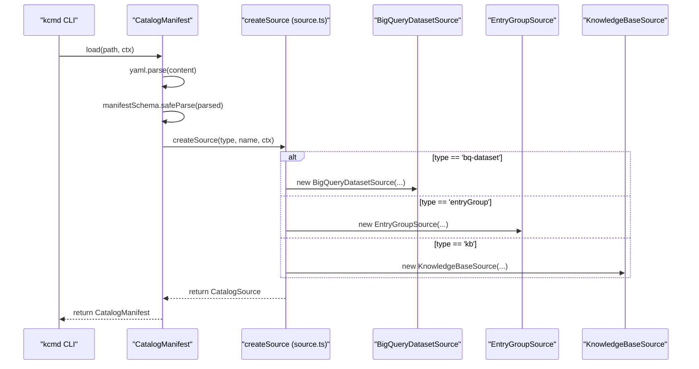
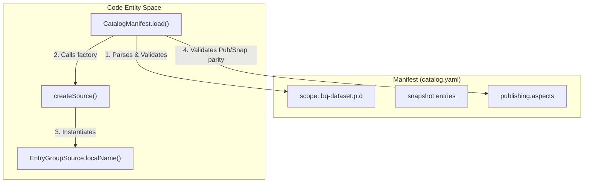

# Catalog Manifest (catalog.yaml)

관련 소스 파일

다음 파일들은 이 위키 페이지를 생성하기 위한 컨텍스트로 사용되었습니다.

- [toolbox/mdcode/demo/README.md](toolbox/mdcode/demo/README.md)
- [toolbox/mdcode/src/libts/manifest.ts](toolbox/mdcode/src/libts/manifest.ts)
- [toolbox/mdcode/src/libts/source.ts](toolbox/mdcode/src/libts/source.ts)
- [toolbox/mdcode/src/libts/sources/entrygroup.ts](toolbox/mdcode/src/libts/sources/entrygroup.ts)
- [toolbox/mdcode/tests/scenarios/pull_bq.yaml](toolbox/mdcode/tests/scenarios/pull_bq.yaml)
- [toolbox/mdcode/tests/scenarios/pull_bq_filtered.yaml](toolbox/mdcode/tests/scenarios/pull_bq_filtered.yaml)
- [toolbox/mdcode/tests/scenarios/push_custom.yaml](toolbox/mdcode/tests/scenarios/push_custom.yaml)

`catalog.yaml` 파일은 `kcmd` 작업 공간의 중앙 구성 매니페스트입니다. 이 파일은 메타데이터 관리의 **scope**(추적 중인 GCP 리소스), **snapshot** 구성(클라우드에서 가져올 메타데이터 유형), **publishing** 규칙(Knowledge Catalog로 다시 푸시할 수 있는 필드)을 정의합니다.

## 매니페스트 구조

매니페스트는 YAML로 작성되며 `kcmd` 라이브러리에 정의된 Zod 스키마를 사용해 검증됩니다 [toolbox/mdcode/src/libts/manifest.ts:11-21]().

### Scope 형식

`scope` 필드는 작업 공간에 사용되는 `CatalogSource` 구현을 결정합니다 [toolbox/mdcode/src/libts/manifest.ts:78-111](). 단일 문자열이거나 문자열 배열일 수 있습니다(특히 다중 데이터셋 BigQuery 지원을 위해) [toolbox/mdcode/src/libts/manifest.ts:80-100]().

| Source Type | Scope Format | Description |
| :--- | :--- | :--- |
| **BigQuery** | `bq-dataset.<project>.<dataset>` | BigQuery 데이터셋과 그 테이블 및 뷰를 추적합니다 [toolbox/mdcode/src/libts/source.ts:14](). |
| **Entry Group** | `entryGroup.<project>.<location>.<id>` | 특정 Dataplex Entry Group을 추적합니다 [toolbox/mdcode/src/libts/source.ts:13](). |
| **Knowledge Base** | `kb.<project>.<location>.<id>` | Knowledge Base(문서용 특수 Entry Group)를 추적합니다 [toolbox/mdcode/src/libts/source.ts:15](). |

### 구성 블록

매니페스트에는 로컬 파일 시스템과 GCP API 사이의 데이터 흐름을 제어하는 두 가지 기본 구성 블록이 포함됩니다.

1.  **`snapshot`**: "읽기" 범위를 정의합니다. `kcmd pull`이 가져와 로컬에 저장해야 하는 Entry Type과 Aspect Type을 나열합니다 [toolbox/mdcode/src/libts/manifest.ts:13-16]().
2.  **`publishing`**: "쓰기" 범위를 정의합니다. `kcmd push`가 특정 Entry Type 또는 Aspect Type만 수정하도록 제한하여, 시스템 관리 메타데이터를 실수로 덮어쓰는 일을 방지합니다 [toolbox/mdcode/src/libts/manifest.ts:17-20]().

**검증 규칙**: `publishing`에 나열된 모든 type은 업데이트를 시도하기 전에 도구가 로컬 기준선을 갖도록 보장하기 위해 `snapshot` 섹션에도 반드시 존재해야 합니다 [toolbox/mdcode/src/libts/manifest.ts:142-162]().

출처: [toolbox/mdcode/src/libts/manifest.ts:11-31](), [toolbox/mdcode/src/libts/manifest.ts:78-111](), [toolbox/mdcode/src/libts/source.ts:12-16]()

---

## 데이터 흐름: 매니페스트에서 소스까지

`CatalogManifest` 클래스는 `scope` 문자열을 사용해 구체적인 `CatalogSource`를 인스턴스화합니다. 이 매핑은 `createSource` 팩터리 함수가 처리합니다 [toolbox/mdcode/src/libts/source.ts:70-85]().

### 매니페스트 초기화 다이어그램
이 다이어그램은 `CatalogSnapshot.load` 또는 `CatalogManifest.load` 호출 중에 `catalog.yaml` 파일로부터 `CatalogManifest` 및 `CatalogSource` 엔티티가 어떻게 구성되는지 보여줍니다.

출처: [toolbox/mdcode/src/libts/manifest.ts:69-111](), [toolbox/mdcode/src/libts/source.ts:70-85](), [toolbox/mdcode/src/libts/source.ts:12-16]()

---

## Snapshot 구성 및 Type 해석

매니페스트가 로드되면 구성은 로컬 작업 공간에 포함될 메타데이터 Entry를 정의합니다.

### 필터링 로직
`snapshot` 블록을 사용하면 사용자가 `entryType`을 기준으로 소스에서 가져올 Entry를 필터링할 수 있습니다. 예를 들어 매니페스트를 구성하여 상위 `bigquery-dataset` Entry는 무시하고 `bigquery-table` Entry만 가져오도록 할 수 있습니다 [toolbox/mdcode/tests/scenarios/pull_bq_filtered.yaml:37-39]().

### Type 검증
매니페스트 로더는 모든 Entry 및 Aspect type이 3부분 명명 규칙(예: `project.location.type`)을 따르는지 검증합니다 [toolbox/mdcode/src/libts/manifest.ts:116-131]().

출처: [toolbox/mdcode/src/libts/manifest.ts:113-132](), [toolbox/mdcode/tests/scenarios/pull_bq_filtered.yaml:35-50]()

---

## Publishing 및 검증 규칙

매니페스트는 로컬에서 수정하고 클라우드로 푸시할 수 있는 대상을 엄격하게 제한합니다.

### 수집된 Entry와 사용자 관리 Entry
`CatalogSource` 인터페이스에는 `ingestedEntries` boolean이 포함됩니다 [toolbox/mdcode/src/libts/source.ts:22]().
*   **수집됨(예: BigQuery)**: Entry는 시스템 크롤러가 관리합니다. `ingestedEntries`는 `true`로 설정됩니다 [toolbox/mdcode/src/libts/sources/entrygroup.ts:26]().
*   **사용자 관리(예: Custom Entry Groups)**: 사용자가 Entry를 직접 관리할 수 있습니다. `EntryGroupSource`는 Entry Group ID가 `@`로 시작하는지 확인하여 이를 결정합니다(`@`는 시스템 그룹용으로 예약됨) [toolbox/mdcode/src/libts/sources/entrygroup.ts:26]().

### 로컬 이름 매핑
매니페스트는 복잡한 Dataplex 리소스 이름과 사람이 읽기 쉬운 로컬 파일 이름 사이를 변환하기 위해 `CatalogSource`에 의존합니다.

| Source | Local Name Logic | Example |
| :--- | :--- | :--- |
| **BigQuery** | `<project>.<dataset>.<tableId>` | `p.d.t1` [toolbox/mdcode/tests/scenarios/pull_bq.yaml:36-41]() |
| **Entry Group** | `<entryId>` | `custom-entry` [toolbox/mdcode/src/libts/sources/entrygroup.ts:38-46]() |

### 코드-엔티티 매핑: 매니페스트 강제 적용
이 다이어그램은 매니페스트에 정의된 제약 조건을 이를 강제하는 코드 엔티티와 연결합니다.

출처: [toolbox/mdcode/src/libts/manifest.ts:69-166](), [toolbox/mdcode/src/libts/source.ts:70-85](), [toolbox/mdcode/src/libts/sources/entrygroup.ts:38-46]()

---

## Open Knowledge Format (OKF) 통합

`catalog.yaml` 매니페스트는 OKF 위키 번들을 게시하는 데에도 사용됩니다. 이 모드에서 매니페스트는 일반적으로 `entryGroup` 또는 `kb` scope를 가리킵니다 [toolbox/mdcode/demo/README.md:133-134]().

*   **Documents Layout**: `kb` 소스를 사용할 때 `kcmd`는 `DocumentsLayout`을 사용하여 `catalog/` 디렉터리의 각 `.md` 파일을 Dataplex Entry에 매핑합니다 [toolbox/mdcode/demo/README.md:127-129]().
*   **Frontmatter Mapping**: Markdown frontmatter에 정의된 `title`, `description`, `tags` 같은 메타데이터는 Markdown 본문과 함께 Dataplex로 푸시되며, 본문은 `dataplex-types.global.overview` Aspect에 저장됩니다 [toolbox/mdcode/demo/README.md:129-130]().

출처: [toolbox/mdcode/demo/README.md:121-153]()
