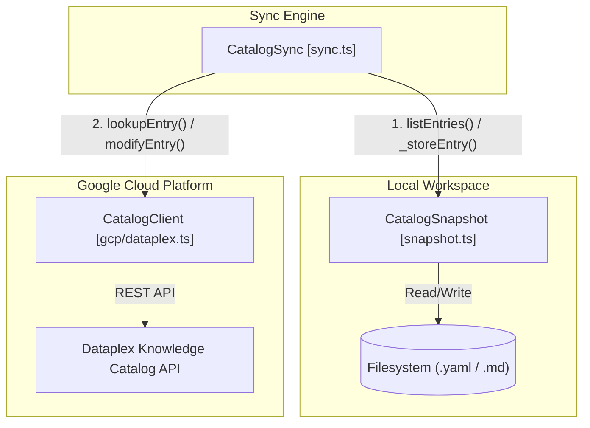
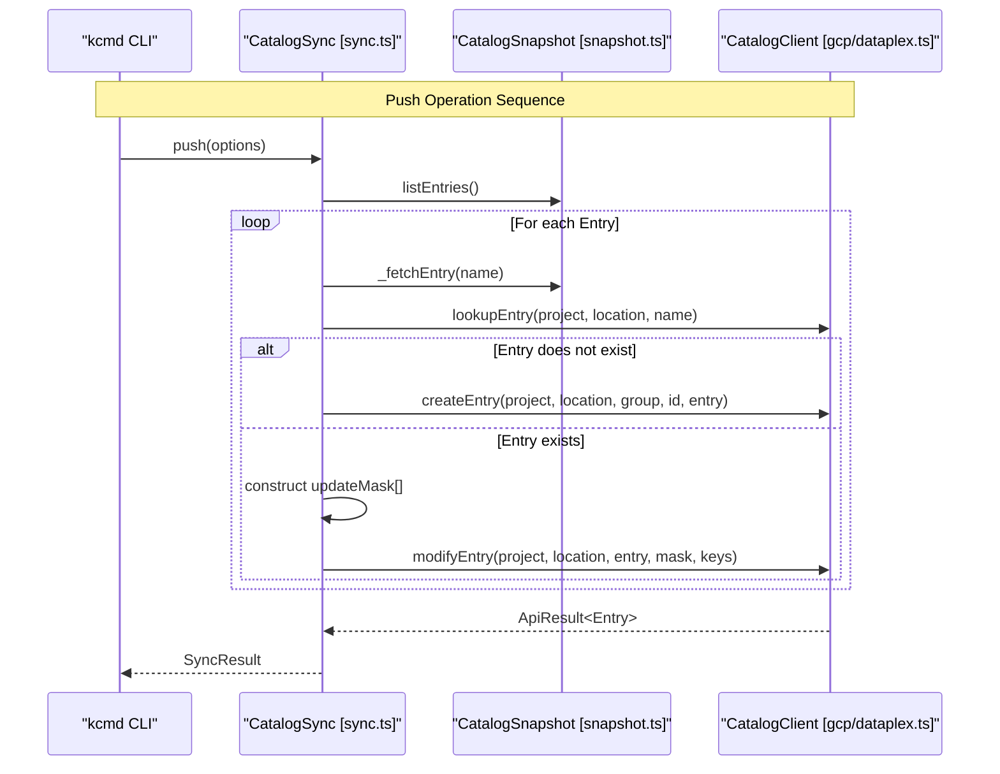

# 동기화 엔진(CatalogSync)

관련 소스 파일

다음 파일들은 이 위키 페이지를 생성하기 위한 컨텍스트로 사용되었습니다.

- [toolbox/mdcode/src/libts/sync.ts](toolbox/mdcode/src/libts/sync.ts)
- [toolbox/mdcode/tests/scenarios/pull_bq.yaml](toolbox/mdcode/tests/scenarios/pull_bq.yaml)
- [toolbox/mdcode/tests/scenarios/pull_bq_filtered.yaml](toolbox/mdcode/tests/scenarios/pull_bq_filtered.yaml)
- [toolbox/mdcode/tests/scenarios/push_bq.yaml](toolbox/mdcode/tests/scenarios/push_bq.yaml)

`CatalogSync` 클래스는 로컬 Metadata as Code (MaC) 작업 공간과 Google Cloud Dataplex Knowledge Catalog 서비스 사이의 양방향 동기화를 담당하는 핵심 오케스트레이션 엔진입니다. 원격 상태를 로컬 파일로 가져오는(`pull`) 수명 주기와 로컬 수정 사항을 클라우드로 다시 게시하는(`push`) 수명 주기를 관리합니다.

## CatalogSync 개요

엔진은 `CatalogClient`(API 계층)와 `CatalogSnapshot`(로컬 상태 관리자)을 연결하여 동작합니다. `catalog.yaml` 매니페스트에 정의된 구성을 준수하면서 메타데이터가 두 환경 사이에서 전환되도록 보장합니다.

### 핵심 데이터 흐름
다음 다이어그램은 `CatalogSync`가 `CatalogSnapshot`을 통해 Dataplex API와 로컬 파일 시스템 사이의 데이터를 어떻게 조율하는지 보여줍니다.

**다이어그램: CatalogSync 오케스트레이션 흐름**

**출처:** [toolbox/mdcode/src/libts/sync.ts:21-28](), [toolbox/mdcode/src/libts/gcp/dataplex.ts:58-62]()

---

## Pull 수명 주기

`pull` 작업은 로컬 스냅샷을 원격 Catalog 서비스와 동기화합니다. 매니페스트의 소스가 정의한 Entry를 순회하고 이를 로컬에 영속화합니다.

### 구현 세부 사항
1.  **Entry 발견**: 매니페스트의 소스(예: BigQuery 데이터셋 또는 Entry Group)에서 Entry iterator를 가져옵니다 [toolbox/mdcode/src/libts/sync.ts:33]().
2.  **필터링**: Entry의 type이 snapshot 구성에 정의된 허용 type과 일치하는지 확인합니다 [toolbox/mdcode/src/libts/sync.ts:36-38]().
3.  **상세 조회**: 각 Entry에 대해 `CatalogClient`를 통해 `lookupEntry` 호출을 수행하여 snapshot에 정의된 특정 Aspect를 포함한 전체 메타데이터를 가져옵니다 [toolbox/mdcode/src/libts/sync.ts:45-46]().
4.  **영속화**: 가져온 Entry는 `CatalogSnapshot._storeEntry()`로 전달되며, 이 메서드는 구성된 `CatalogLayout`에 따라 디스크에 물리적으로 쓰는 작업을 처리합니다 [toolbox/mdcode/src/libts/sync.ts:54]().

**출처:** [toolbox/mdcode/src/libts/sync.ts:31-61](), [toolbox/mdcode/tests/scenarios/pull_bq.yaml:32-42](), [toolbox/mdcode/tests/scenarios/pull_bq_filtered.yaml:37-42]()

---

## Push 수명 주기

`push` 작업은 로컬 변경 사항을 Dataplex 서비스에 게시합니다. 생성이 필요한 새 Entry와 수정이 필요한 기존 Entry를 구분합니다.

### Entry 생성과 수정
로컬 스냅샷에서 발견된 모든 Entry에 대해 엔진은 클라우드에 존재하는지 확인하기 위해 조회를 수행합니다 [toolbox/mdcode/src/libts/sync.ts:82]().

| Scenario | Logic | API Method |
| :--- | :--- | :--- |
| **Entry Missing** | 리소스 이름을 파싱하여 `entryGroup`과 `entryId`를 추출한 다음 리소스를 생성합니다 [toolbox/mdcode/src/libts/sync.ts:84-86](). | `createEntry` |
| **Entry Exists** | 부분 업데이트를 수행하기 위해 `updateMask`와 `aspectKeys`를 구성합니다 [toolbox/mdcode/src/libts/sync.ts:93-112](). | `modifyEntry` |

### Update Mask 구성
서비스가 관리하는 메타데이터를 덮어쓰지 않도록 `CatalogSync`는 명시적인 `updateMask`를 구성합니다.
*   **Aspects**: 로컬 Entry에 Aspect가 있으면 `aspects` 필드가 mask에 추가됩니다 [toolbox/mdcode/src/libts/sync.ts:94-97]().
*   **Source Metadata**: 매니페스트 소스가 "ingested"가 아닌 경우(즉, 사용자 관리 대상인 경우) `entry_source`와 `parent_entry` 같은 필드가 mask에 추가됩니다 [toolbox/mdcode/src/libts/sync.ts:99-106]().

**출처:** [toolbox/mdcode/src/libts/sync.ts:64-119](), [toolbox/mdcode/tests/scenarios/push_bq.yaml:37-47]()

---

## 기술 매핑: 로직에서 코드 엔티티로

다음 다이어그램은 논리적 동기화 단계를 TypeScript 라이브러리에 구현된 구체적인 클래스 메서드와 API 호출에 매핑합니다.

**다이어그램: 논리에서 코드 엔티티로의 매핑**

**출처:** [toolbox/mdcode/src/libts/sync.ts:64-119](), [toolbox/mdcode/src/libts/gcp/dataplex.ts:99-132]()

---

## 오류 처리 및 동시성

### 낙관적 동시성
현재 구현은 `modifyEntry`에 초점을 맞추고 있지만 [toolbox/mdcode/src/libts/sync.ts:112](), 기반 Dataplex API는 낙관적 동시성을 위한 ETag를 지원합니다. `CatalogSync` 클래스는 HTTP 상태 코드와 오류 메시지를 캡처하는 `ApiResult` 인터페이스를 통해 이러한 호출의 결과를 처리하도록 설계되어 있습니다 [toolbox/mdcode/src/libts/sync.ts:113-115]().

### 오류 보고
동기화 작업은 `SyncResult` 객체를 반환합니다.
*   **성공**: `{ success: true }` [toolbox/mdcode/src/libts/sync.ts:56, 118]()
*   **실패**: GCP API 또는 로컬 파일 시스템 오류의 오류 메시지를 포함하는 `{ success: false, details: string }` [toolbox/mdcode/src/libts/sync.ts:7-10, 59, 88, 114]()

### 알려진 제한 사항(TODO)
*   **충돌 해결**: 현재 엔진은 로컬 버전과 원격 버전이 모두 변경된 경우의 충돌을 자동으로 해결하지 않습니다 [toolbox/mdcode/src/libts/sync.ts:41]().
*   **삭제**: 로컬 삭제는 아직 서버에 전파되지 않습니다(서비스 측 삭제의 반대 방향 전파도 마찬가지입니다) [toolbox/mdcode/src/libts/sync.ts:42, 75]().
*   **Type 발견**: 엔진은 pull 중에 이전에 보지 못한 type을 만나면 type 정보를 채워야 합니다 [toolbox/mdcode/src/libts/sync.ts:40]().

**출처:** [toolbox/mdcode/src/libts/sync.ts:7-10, 40-42, 74-77, 113-115]()
