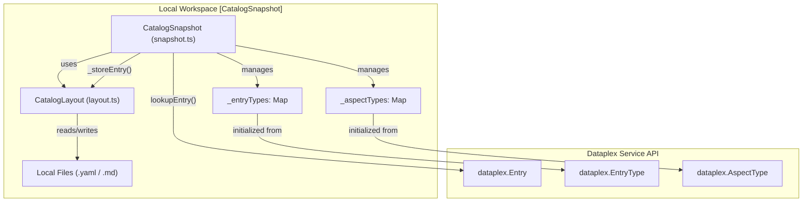
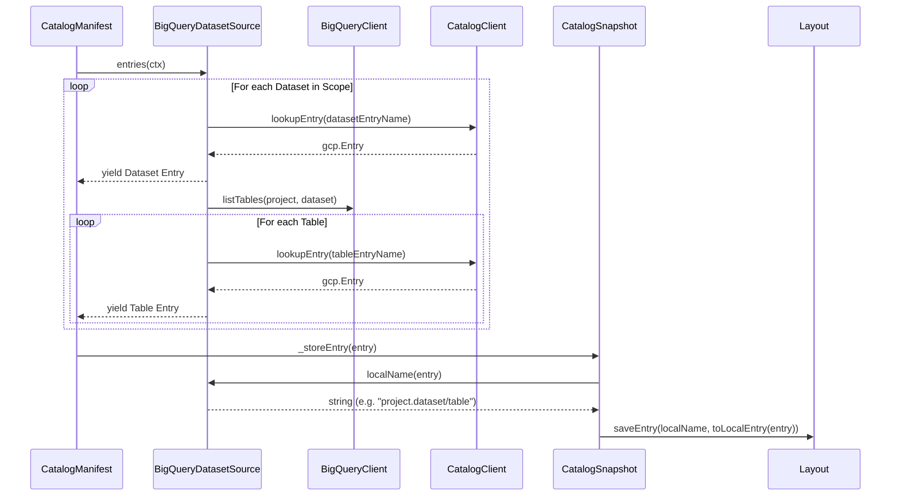

# CatalogSnapshot 및 Source 추상화

관련 소스 파일

다음 파일들은 이 위키 페이지를 생성하기 위한 컨텍스트로 사용되었습니다.

- [toolbox/mdcode/src/libts/manifest.ts](toolbox/mdcode/src/libts/manifest.ts)
- [toolbox/mdcode/src/libts/snapshot.ts](toolbox/mdcode/src/libts/snapshot.ts)
- [toolbox/mdcode/src/libts/source.ts](toolbox/mdcode/src/libts/source.ts)
- [toolbox/mdcode/src/libts/sources/bq-dataset.ts](toolbox/mdcode/src/libts/sources/bq-dataset.ts)
- [toolbox/mdcode/src/libts/sources/entrygroup.ts](toolbox/mdcode/src/libts/sources/entrygroup.ts)
- [toolbox/mdcode/tests/scenarios/push_custom.yaml](toolbox/mdcode/tests/scenarios/push_custom.yaml)

Knowledge Catalog 시스템은 서로 다른 메타데이터 원본과 연동하기 위해 provider 기반 아키텍처를 사용합니다. `CatalogSnapshot` 클래스는 로컬 상태의 중앙 관리자 역할을 하며, `CatalogSource` 인터페이스는 서로 다른 GCP 리소스 계층 구조(BigQuery, Dataplex Entry Groups, Knowledge Bases)의 복잡성을 통합된 Entry 스트림으로 추상화합니다.

## CatalogSnapshot

`CatalogSnapshot` 클래스는 로컬 카탈로그 인터페이스의 기본 구현입니다. 디스크에 저장된 메타데이터의 수명 주기를 관리하며, 여기에는 type 해석, Entry 조회, 클라우드로 다시 동기화되기 전의 로컬 수정이 포함됩니다.

### 주요 책임
*   **Type 관리**: 로컬 메타데이터가 클라우드 스키마를 준수하도록 Dataplex에서 `EntryType` 및 `AspectType` 정의를 해석하고 캐시합니다. 초기화 중 `_entryTypes` 및 `_aspectTypes` 맵을 채웁니다 [toolbox/mdcode/src/libts/snapshot.ts:19-20](), [toolbox/mdcode/src/libts/snapshot.ts:137-176]().
*   **로컬 상태 영속화**: 파일 시스템에서 Entry를 저장하고 로드하기 위해 `CatalogLayout`(`createLayout`을 통해 생성됨)과 연동합니다 [toolbox/mdcode/src/libts/snapshot.ts:28-29]().
*   **CRUD 작업**: 로컬 작업 공간 안에서 `listEntries`, `lookupEntry`, `updateEntry`, `createEntry`, `deleteEntry` 메서드를 제공합니다 [toolbox/mdcode/src/libts/snapshot.ts:55-133]().
*   **수집 가드레일**: 기반 소스의 `ingestedEntries`가 true로 설정된 경우(예: BigQuery), Entry 생성 또는 삭제를 방지합니다. 이런 경우 Dataplex가 Entry 수명 주기를 자동으로 관리합니다 [toolbox/mdcode/src/libts/snapshot.ts:112-114](), [toolbox/mdcode/src/libts/snapshot.ts:128-130]().

### 메타데이터 매핑: 코드에서 서비스로
다음 다이어그램은 `CatalogSnapshot`이 로컬 YAML 파일과 Dataplex Service API 사이의 간극을 어떻게 연결하는지 보여줍니다.

**엔티티 매핑: 로컬 작업 공간에서 Dataplex 서비스까지**

출처: [toolbox/mdcode/src/libts/snapshot.ts:14-22](), [toolbox/mdcode/src/libts/snapshot.ts:181-184](), [toolbox/mdcode/src/libts/snapshot.ts:137-176]()

## CatalogSource 인터페이스

`CatalogSource` 인터페이스는 모든 메타데이터 provider를 위한 계약을 정의합니다. Entry를 열거하고 로컬의 "친숙한" 이름과 완전한 GCP 리소스 이름 사이를 변환하는 역할을 담당합니다.

### 인터페이스 정의
이 인터페이스에는 다음 속성과 메서드가 필요합니다.
*   `type`: 소스 type 문자열(예: `bq-dataset`, `entryGroup`, `kb`) [toolbox/mdcode/src/libts/source.ts:20]().
*   `name`: 소스의 리소스 식별자 [toolbox/mdcode/src/libts/source.ts:21]().
*   `ingestedEntries`: Entry가 자동화된 크롤러(예: BigQuery)에 의해 관리되는지를 나타내는 boolean [toolbox/mdcode/src/libts/source.ts:22]().
*   `layout`: `Layouts` enum 값(STANDARD 또는 DOCUMENTS) [toolbox/mdcode/src/libts/source.ts:23]().
*   `entries(ctx)`: 클라우드에서 `gcp.Entry` 객체를 yield하는 async generator [toolbox/mdcode/src/libts/source.ts:25]().
*   `localName(entry)`: 서비스 측 Entry 이름을 로컬 파일 경로 식별자로 변환합니다 [toolbox/mdcode/src/libts/source.ts:26]().
*   `serviceName(localName)`: 로컬 식별자를 완전한 서비스 이름으로 다시 변환합니다 [toolbox/mdcode/src/libts/source.ts:27]().

출처: [toolbox/mdcode/src/libts/source.ts:19-28]()

## 구체적인 Source 구현

### BigQueryDatasetSource
이 소스는 BigQuery 데이터셋과 테이블을 Dataplex Entry로 취급합니다. BigQuery 계층 구조를 탐색하고 이를 Dataplex `@bigquery` 시스템 Entry Group에 매핑합니다.

*   **로직**: 먼저 데이터셋 Entry를 yield한 다음, `BigQueryClient.listTables`를 사용해 해당 데이터셋 내의 모든 테이블을 순회합니다 [toolbox/mdcode/src/libts/sources/bq-dataset.ts:29-54]().
*   **명명 규칙**: 
    *   Dataset: `<project>.<dataset>` [toolbox/mdcode/src/libts/sources/bq-dataset.ts:78]().
    *   Table: `<project>.<dataset>/<tableId>` [toolbox/mdcode/src/libts/sources/bq-dataset.ts:70]().
*   **서비스 이름 구성**: 로컬 이름을 `bigquery.googleapis.com` 리소스 네임스페이스 내의 Dataplex Entry로 다시 매핑합니다 [toolbox/mdcode/src/libts/sources/bq-dataset.ts:95-103]().

### EntryGroupSource
모든 Dataplex Entry Group을 위한 일반 소스입니다.
*   **수집 감지**: Entry Group ID가 `@`로 시작하는지 확인하여 Entry가 수집된 것인지 판단합니다 [toolbox/mdcode/src/libts/sources/entrygroup.ts:26]().
*   **순회**: `CatalogClient.listEntries`를 사용해 그룹의 모든 Entry를 가져옵니다 [toolbox/mdcode/src/libts/sources/entrygroup.ts:33]().

### KnowledgeBaseSource
Knowledge Bases를 위한 특수 구현입니다. `EntryGroupSource`와 동일한 로직을 확장하지만, Markdown 기반 메타데이터를 지원하기 위해 `Layouts.DOCUMENTS`로 초기화됩니다 [toolbox/mdcode/src/libts/source.ts:80-81]().

**데이터 흐름: Source 열거에서 Snapshot까지**

출처: [toolbox/mdcode/src/libts/sources/bq-dataset.ts:25-57](), [toolbox/mdcode/src/libts/snapshot.ts:181-184](), [toolbox/mdcode/src/libts/manifest.ts:79-111]()

## Source Type 요약

| Source Type | Implementation Class | Layout | Ingested | Scope Format |
| :--- | :--- | :--- | :--- | :--- |
| `bq-dataset` | `BigQueryDatasetSource` | `STANDARD` | `true` | `bq-dataset.<project>.<dataset>` |
| `entryGroup` | `EntryGroupSource` | `STANDARD` | 다양함(`@`로 시작) | `entryGroup.<project>.<loc>.<group>` |
| `kb` | `KnowledgeBaseSource` | `DOCUMENTS` | `false` | `kb.<project>.<loc>.<group>` |

출처: [toolbox/mdcode/src/libts/source.ts:12-16](), [toolbox/mdcode/src/libts/sources/bq-dataset.ts:10-15](), [toolbox/mdcode/src/libts/sources/entrygroup.ts:10-27](), [toolbox/mdcode/src/libts/manifest.ts:106-111]()
