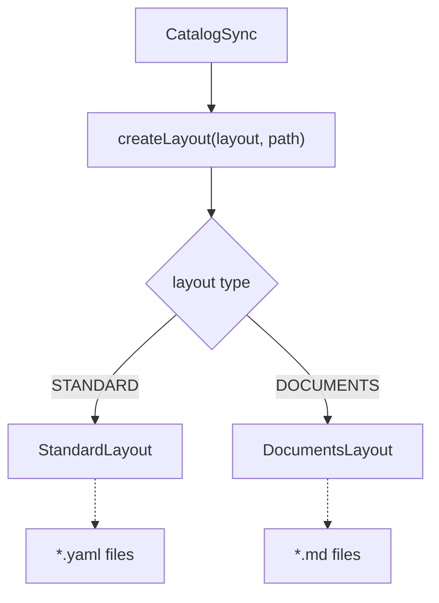
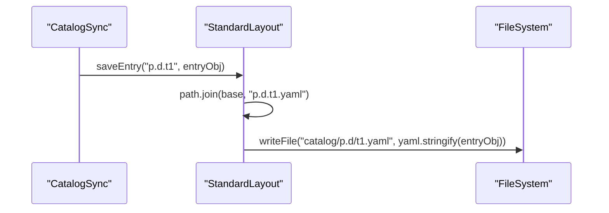
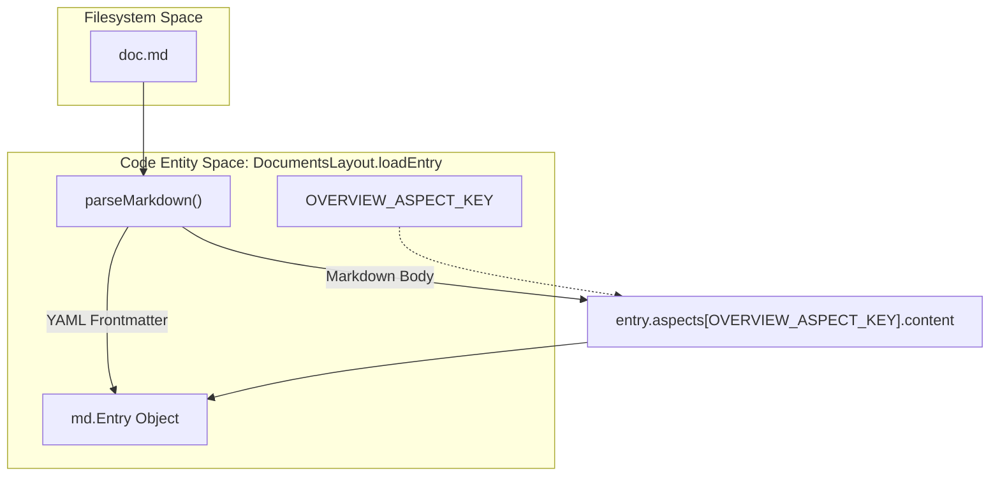

# 스토리지 레이아웃: Standard 및 Documents

관련 소스 파일

다음 파일들은 이 위키 페이지를 생성하기 위한 컨텍스트로 사용되었습니다.

- [toolbox/mdcode/src/libts/layout.ts](toolbox/mdcode/src/libts/layout.ts)
- [toolbox/mdcode/src/libts/layouts/documents.ts](toolbox/mdcode/src/libts/layouts/documents.ts)
- [toolbox/mdcode/src/libts/layouts/standard.ts](toolbox/mdcode/src/libts/layouts/standard.ts)
- [toolbox/mdcode/tests/scenarios/pull_kb.yaml](toolbox/mdcode/tests/scenarios/pull_kb.yaml)
- [toolbox/mdcode/tests/scenarios/push_kb.yaml](toolbox/mdcode/tests/scenarios/push_kb.yaml)

Knowledge Catalog CLI(`kcmd`)는 메타데이터 Entry가 로컬 파일 시스템에 영속화되는 방식을 관리하기 위해 플러그형 레이아웃 시스템을 사용합니다. 이 추상화를 통해 동일한 동기화 로직이 구조화된 데이터 자산(예: BigQuery 테이블)과 비구조화 지식 베이스(예: Markdown 문서)를 모두 지원할 수 있습니다.

## CatalogLayout 인터페이스

`CatalogLayout` 인터페이스는 Dataplex Entry를 로컬 파일에 매핑하기 위한 계약을 정의합니다. 파일 형식, 디렉터리 구조, 명명 규칙을 추상화합니다.

| Method | Description |
| :--- | :--- |
| `init()` | 로컬 디렉터리를 스캔하여 Entry의 내부 인덱스를 구축합니다. |
| `entryExists(name)` | 특정 Entry가 로컬 인덱스에 존재하는지 확인합니다. |
| `listEntries()` | 현재 레이아웃이 관리하는 모든 Entry 이름 목록을 반환합니다. |
| `loadEntry(name)` | 로컬 파일을 읽고 `md.Entry` 객체로 파싱합니다. |
| `saveEntry(name, entry)` | `md.Entry`를 직렬화하고 적절한 로컬 경로에 씁니다. |
| `deleteEntry(name)` | Entry와 연결된 로컬 파일을 제거합니다. |

**출처:** [toolbox/mdcode/src/libts/layout.ts:14-22]()

### 레이아웃 선택 로직
`createLayout` 팩터리 함수는 `catalog.yaml`의 `layout` 속성을 기준으로 올바른 구현을 인스턴스화합니다.

Title: Layout Factory Flow

**출처:** [toolbox/mdcode/src/libts/layout.ts:25-35]()

---

## StandardLayout (YAML)

`StandardLayout`은 구조화된 데이터 자산을 위해 설계되었습니다. 각 Dataplex Entry를 독립적인 YAML 파일로 영속화합니다.

### 구현 세부 사항
- **파일 발견**: `init()` 중에 `**/*.yaml`에 대한 재귀 glob 검색을 수행합니다 [toolbox/mdcode/src/libts/layouts/standard.ts:29-33]().
- **인덱싱**: 각 YAML 파일을 파싱하고 메타데이터 안의 `name` 필드를 내부 맵 `_index`의 기본 키로 사용합니다 [toolbox/mdcode/src/libts/layouts/standard.ts:16-16](), [toolbox/mdcode/src/libts/layouts/standard.ts:35-46]().
- **영속화**: Entry 이름을 파일 이름으로 사용해 Entry를 저장합니다(예: `p.d.t1.yaml`) [toolbox/mdcode/src/libts/layouts/standard.ts:68-74]().

### 데이터 흐름: Standard Pull
BigQuery 메타데이터를 pull할 때 시스템은 데이터셋/테이블 계층 구조를 반영하는 중첩 파일 경로를 생성합니다.

Title: StandardLayout Serialization

**출처:** [toolbox/mdcode/src/libts/layouts/standard.ts:68-74](), [toolbox/mdcode/tests/scenarios/push_kb.yaml:52-57]()

---

## DocumentsLayout (Markdown)

`DocumentsLayout`은 Knowledge Bases에 최적화되어 있습니다. Markdown 파일을 주요 진실 공급원으로 취급하며, 메타데이터에는 YAML frontmatter를 사용하고 "Overview" Aspect에는 Markdown 본문을 사용합니다.

### 파일 구조 및 Frontmatter
문서 파일은 `---`로 구분된 YAML 블록과 그 뒤의 Markdown 콘텐츠로 구성됩니다. `parseMarkdown` 함수가 이 분리를 처리합니다 [toolbox/mdcode/src/libts/layouts/documents.ts:185-220]().

| Component | Source in `md.Entry` |
| :--- | :--- |
| **Frontmatter** | 리소스 필드(title, description, labels)와 Type [toolbox/mdcode/src/libts/layouts/documents.ts:199-217](). |
| **Markdown Body** | `dataplex-types.global.overview` Aspect 콘텐츠 [toolbox/mdcode/src/libts/layouts/documents.ts:88-94](). |

**출처:** [toolbox/mdcode/src/libts/layouts/documents.ts:185-220]()

### 합성 Index Entry
Dataplex에서 탐색 가능한 계층 구조를 유지하기 위해 `DocumentsLayout`은 파일은 포함하지만 `index.md`가 없는 디렉터리에 대해 "index" Entry를 자동으로 합성합니다.

- **`_synthesizeIndexEntries()`**: 발견된 모든 `.md` 파일을 순회하고 모든 부모 디렉터리에 `index`라는 이름의 Entry가 있는지 보장합니다 [toolbox/mdcode/src/libts/layouts/documents.ts:140-161]().
- **부모-자식 연결**: 레이아웃은 `loadEntry` 중에 `deriveParentLocalName`을 통해 디렉터리 구조를 기준으로 `resource.parent` 필드를 자동으로 도출합니다 [toolbox/mdcode/src/libts/layouts/documents.ts:76-81](), [toolbox/mdcode/src/libts/layouts/documents.ts:169-183]().

### 데이터 흐름: 문서 파싱
Title: DocumentsLayout Parsing (loadEntry)

**출처:** [toolbox/mdcode/src/libts/layouts/documents.ts:57-96](), [toolbox/mdcode/src/libts/layouts/documents.ts:185-220](), [toolbox/mdcode/src/libts/layouts/documents.ts:11-11]()

---

## 레이아웃 동작 비교

| Feature | StandardLayout | DocumentsLayout |
| :--- | :--- | :--- |
| **File Extension** | `.yaml` [toolbox/mdcode/src/libts/layouts/standard.ts:29]() | `.md` [toolbox/mdcode/src/libts/layouts/documents.ts:35]() |
| **Primary Identifier** | YAML 내부의 `name` 필드 [toolbox/mdcode/src/libts/layouts/standard.ts:39]() | 루트 기준 상대 파일 경로 [toolbox/mdcode/src/libts/layouts/documents.ts:164-167]() |
| **Overview Aspect** | 구조화된 YAML로 저장됨 | Markdown 본문으로 추출됨 [toolbox/mdcode/src/libts/layouts/documents.ts:92]() |
| **Directory Handling** | 이름에 따라 평면 또는 중첩 구조 | 폴더 구조를 반영함 [toolbox/mdcode/src/libts/layouts/documents.ts:99-100]() |
| **Sidecar Support** | N/A | Frontmatter가 sidecar 역할을 함 |

### 명명 규칙
- **Standard**: Entry 이름이 `p.d.t1`이면 `p.d.t1.yaml`로 저장됩니다 [toolbox/mdcode/src/libts/layouts/standard.ts:69]().
- **Documents**: 파일이 `dir/sub.md`에 있으면 Entry 이름은 `dir/sub`로 도출됩니다 [toolbox/mdcode/src/libts/layouts/documents.ts:164-167](). 합성 index 파일은 `index` 또는 `dir/index`로 명명됩니다 [toolbox/mdcode/src/libts/layouts/documents.ts:156]().

**출처:** [toolbox/mdcode/src/libts/layouts/standard.ts:12-85](), [toolbox/mdcode/src/libts/layouts/documents.ts:16-162](), [toolbox/mdcode/tests/scenarios/pull_kb.yaml:37-47]()
