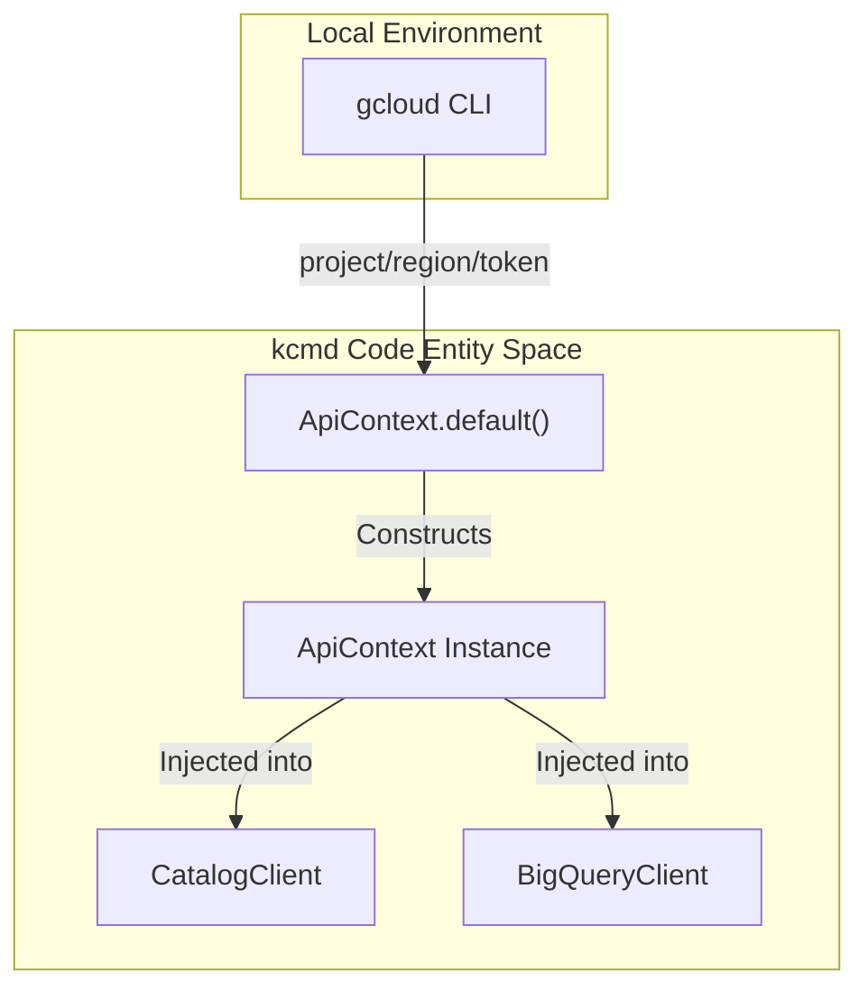
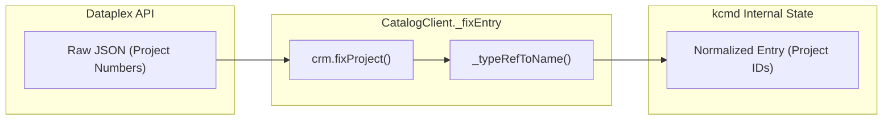
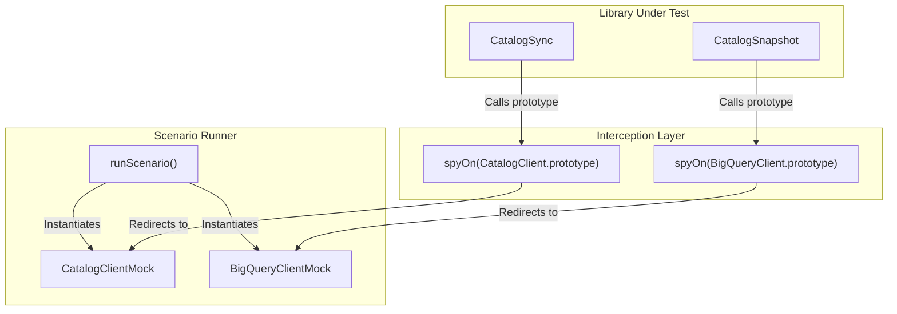

# GCP API 클라이언트 계층

관련 소스 파일

다음 파일들은 이 위키 페이지를 생성하기 위한 컨텍스트로 사용되었습니다.

- [samples/README.md](samples/README.md)
- [toolbox/README.md](toolbox/README.md)
- [toolbox/mdcode/src/libts/gcp/context.ts](toolbox/mdcode/src/libts/gcp/context.ts)
- [toolbox/mdcode/src/libts/gcp/dataplex.ts](toolbox/mdcode/src/libts/gcp/dataplex.ts)
- [toolbox/mdcode/src/libts/tsconfig.json](toolbox/mdcode/src/libts/tsconfig.json)
- [toolbox/mdcode/tests/libts/mocks.ts](toolbox/mdcode/tests/libts/mocks.ts)
- [toolbox/mdcode/tests/libts/scenarios.ts](toolbox/mdcode/tests/libts/scenarios.ts)
- [toolbox/mdcode/tests/scenarios/push_new_entry.yaml](toolbox/mdcode/tests/scenarios/push_new_entry.yaml)

GCP API 클라이언트 계층은 Knowledge Catalog 툴킷(`kcmd`)과 Google Cloud Platform 서비스 사이의 기반 통신 인터페이스를 제공합니다. 원시 REST 호출을 typed TypeScript 클래스로 추상화하고, `gcloud` CLI를 통해 인증을 관리하며, 메타데이터 리소스 전반의 일관성을 보장하기 위한 정규화 파이프라인을 구현합니다.

## ApiContext: 인증 및 구성

`ApiContext` 클래스는 GCP 자격 증명과 구성을 제공하는 중앙 provider 역할을 합니다. `gcloud` CLI 명령을 실행하여 활성 프로젝트 ID, compute region, OAuth2 access token을 가져옵니다.

*   **초기화**: `ApiContext.default()` 메서드는 `gcloud config get-value project`, `gcloud config get-value compute/region`, `gcloud auth application-default print-access-token`을 호출하여 컨텍스트를 초기화합니다 [toolbox/mdcode/src/libts/gcp/context.ts:31-41]().
*   **토큰 관리**: 토큰이 만료되면 `gcloud auth` 명령을 다시 호출하여 토큰을 교체하는 `refresh()` 메서드를 제공합니다 [toolbox/mdcode/src/libts/gcp/context.ts:44-46]().
*   **로깅**: `GCP_LOG` 환경 변수가 설정되어 있으면 컨텍스트는 디버깅을 위해 모든 API 상호작용을 기록합니다 [toolbox/mdcode/src/libts/gcp/context.ts:25-29]().

### 데이터 흐름: 인증 컨텍스트
Title: ApiContext Authentication Flow

출처: [toolbox/mdcode/src/libts/gcp/context.ts:4-47]()

## CatalogClient (Dataplex API 래퍼)

`CatalogClient` 클래스는 Google Cloud Dataplex(Knowledge Catalog) v1 API를 둘러싼 상위 수준 래퍼를 제공합니다. `Entry`, `EntryGroup`, `EntryType`, `AspectType` 리소스의 수명 주기를 처리합니다.

### 주요 메서드
| Method | Purpose | API Endpoint |
| :--- | :--- | :--- |
| `getEntry` | basic 또는 custom aspect view로 특정 Entry를 가져옵니다 [toolbox/mdcode/src/libts/gcp/dataplex.ts:82-97](). | `GET /v1/{name}` |
| `lookupEntry` | 리소스 이름(예: BQ 테이블 경로)을 사용해 Entry를 찾습니다 [toolbox/mdcode/src/libts/gcp/dataplex.ts:99-114](). | `GET /v1/{container}:lookupEntry` |
| `modifyEntry` | `updateMask`를 사용해 Entry와 해당 Aspect를 원자적으로 업데이트합니다 [toolbox/mdcode/src/libts/gcp/dataplex.ts:116-132](). | `POST /v1/{container}:modifyEntry` |
| `listEntries` | Entry Group 내 모든 Entry에 대한 페이지네이션 generator입니다 [toolbox/mdcode/src/libts/gcp/dataplex.ts:153-178](). | `GET /v1/{parent}/entries` |
| `createEntry` | 특정 Entry Group에 새 Entry를 생성합니다 [toolbox/mdcode/src/libts/gcp/dataplex.ts:180-194](). | `POST /v1/{parent}/entries` |

출처: [toolbox/mdcode/src/libts/gcp/dataplex.ts:58-208]()

## 데이터 정규화 파이프라인(`_fixEntry`)

클라이언트 계층의 중요한 구성 요소는 `_fixEntry` 함수입니다. Dataplex API는 종종 project ID 대신 project number를 사용해 리소스 이름을 반환하며, 이는 로컬 YAML 파일의 불일치를 만듭니다.

`_fixEntry` 파이프라인은 다음을 수행합니다.
1.  **Project ID 해석**: Cloud Resource Manager (CRM) 클라이언트를 사용해 `entry.name`, `entry.entryType`, `entry.entrySource.resource`의 project number를 project ID로 변환합니다 [toolbox/mdcode/src/libts/gcp/dataplex.ts:214-218]().
2.  **Type 참조 변환**: Aspect key를 정규화합니다. Aspect key가 짧은 이름으로 제공된 경우 `_typeRefToName`을 사용해 전체 리소스 경로로 변환합니다 [toolbox/mdcode/src/libts/gcp/dataplex.ts:222-226]().
3.  **일관성**: 이 함수는 데이터가 `CatalogSync` 엔진에 도달하기 전에 모든 조회 메서드(`getEntry`, `lookupEntry`, `listEntries`, `updateEntry`, `modifyEntry`, `createEntry`) 내부에서 자동으로 호출됩니다 [toolbox/mdcode/src/libts/gcp/dataplex.ts:93,110,128,147,172,190]().

### 데이터 흐름: Entry 정규화
Title: Entry Normalization Pipeline

출처: [toolbox/mdcode/src/libts/gcp/dataplex.ts:213-230]()

## BigQueryClient

`BigQueryClient`는 BigQuery 메타데이터에 대한 특수 접근을 제공하며, 주로 `BigQueryDatasetSource`가 카탈로그화를 위해 테이블과 데이터셋을 발견하는 데 사용합니다.

*   **`getDataset`**: location과 description을 포함한 데이터셋 메타데이터를 가져옵니다 [toolbox/mdcode/tests/libts/mocks.ts:163-171]().
*   **`listTables`**: 특정 프로젝트와 데이터셋 내의 모든 테이블을 순회하는 `AsyncGenerator`입니다 [toolbox/mdcode/tests/libts/mocks.ts:172-178]().

출처: [toolbox/mdcode/tests/libts/mocks.ts:145-179]()

## 테스트 및 Mocking 계층

단위 테스트와 시나리오 실행을 위해 이 계층은 네트워크 호출을 우회하는 mock 구현을 제공합니다.

*   **`CatalogClientMock`**: Entry, Entry Group, Type의 인메모리 registry를 구현합니다. `entrySource`와 `aspects`에 대한 `updateMask` 로직 같은 API 동작을 시뮬레이션하고, 리소스가 없으면 `404 Not Found` 오류를 반환합니다 [toolbox/mdcode/tests/libts/mocks.ts:8-142]().
*   **`BigQueryClientMock`**: 내부 `mockDatasets` 및 `mockTables` 맵을 사용해 BigQuery 데이터셋 및 테이블 목록을 시뮬레이션합니다 [toolbox/mdcode/tests/libts/mocks.ts:145-179]().
*   **시나리오 통합**: 테스트 중에는 `spyOn`을 사용해 실제 `CatalogClient.prototype` 및 `BigQueryClient.prototype` 메서드 호출을 가로채고, 테스트 시나리오에 정의된 `currentCatalogMock` 또는 `currentBigQueryMock`으로 리다이렉션합니다 [toolbox/mdcode/tests/libts/scenarios.ts:16-197]().

### 코드 엔티티 연결: Mocks 및 Scenarios
Title: Test Mock Injection

출처: [toolbox/mdcode/tests/libts/mocks.ts:8-179](), [toolbox/mdcode/tests/libts/scenarios.ts:20-197]()
