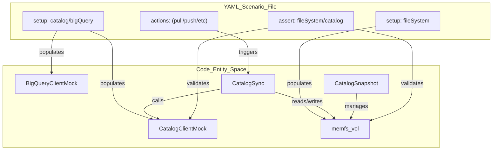
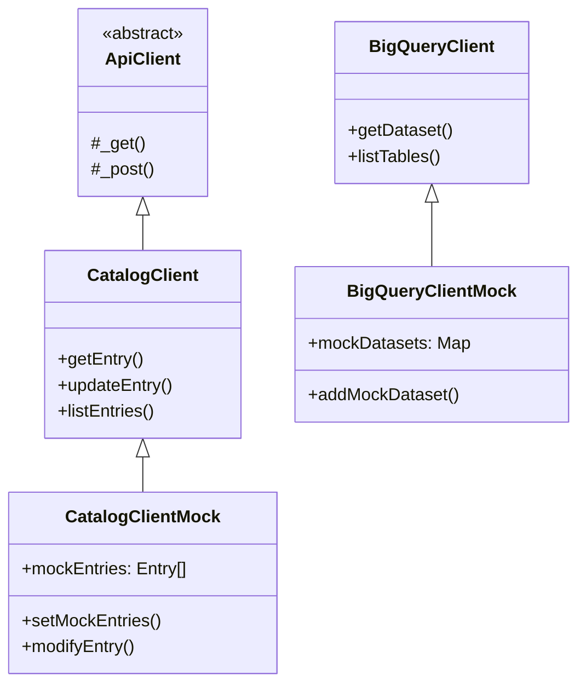

# 테스트 인프라 및 시나리오 프레임워크

<details>
<summary>관련 소스 파일</summary>

다음 파일들은 이 위키 페이지를 생성하기 위한 컨텍스트로 사용되었습니다.

- [toolbox/mdcode/src/libts/gcp/dataplex.ts](toolbox/mdcode/src/libts/gcp/dataplex.ts)
- [toolbox/mdcode/tests/libts/mocks.ts](toolbox/mdcode/tests/libts/mocks.ts)
- [toolbox/mdcode/tests/libts/scenarios.ts](toolbox/mdcode/tests/libts/scenarios.ts)
- [toolbox/mdcode/tests/scenarios/create_entry_hierarchy.yaml](toolbox/mdcode/tests/scenarios/create_entry_hierarchy.yaml)
- [toolbox/mdcode/tests/scenarios/pull_basic.yaml](toolbox/mdcode/tests/scenarios/pull_basic.yaml)
- [toolbox/mdcode/tests/scenarios/pull_bq.yaml](toolbox/mdcode/tests/scenarios/pull_bq.yaml)
- [toolbox/mdcode/tests/scenarios/pull_bq_filtered.yaml](toolbox/mdcode/tests/scenarios/pull_bq_filtered.yaml)
- [toolbox/mdcode/tests/scenarios/pull_multi.yaml](toolbox/mdcode/tests/scenarios/pull_multi.yaml)
- [toolbox/mdcode/tests/scenarios/push_filtered.yaml](toolbox/mdcode/tests/scenarios/push_filtered.yaml)
- [toolbox/mdcode/tests/scenarios/push_new_entry.yaml](toolbox/mdcode/tests/scenarios/push_new_entry.yaml)

</details>


Knowledge Catalog 저장소는 실제 Google Cloud Platform (GCP) 리소스에 접근하지 않고도 메타데이터 동기화(pull 및 push)의 엔드투엔드 수명 주기를 검증하도록 설계된 특수한 시나리오 기반 테스트 프레임워크를 사용합니다. 이는 YAML로 정의된 테스트 케이스, Dataplex와 BigQuery를 위한 인메모리 mock 클라이언트, 가상화된 파일 시스템의 조합을 통해 이루어집니다.

## 시나리오 기반 테스트 아키텍처

프레임워크는 YAML 파일에서 시나리오 정의를 로드하고, 그 정의를 기반으로 mock 환경을 초기화하며, `kcmd` 작업 시퀀스를 실행하고, 로컬 파일 시스템과 원격 mock catalog의 최종 상태를 검증하는 방식으로 동작합니다.

### 데이터 흐름 및 실행 로직

`toolbox/mdcode/tests/libts/scenarios.ts`에 구현된 테스트 runner는 다음 흐름을 조율합니다.

1.  **환경 초기화**: `memfs` volume을 재설정하고 `CatalogClientMock` 및 `BigQueryClientMock`을 초기화합니다 [toolbox/mdcode/tests/libts/scenarios.ts:21-29]().
2.  **상태 설정**: 시나리오의 `setup` 블록에 정의된 Entry, Entry type, Aspect type으로 mock 클라이언트를 채웁니다 [toolbox/mdcode/tests/libts/scenarios.ts:32-61](). 또한 `catalog.yaml`과 기존 메타데이터 파일을 가상 파일 시스템에 채웁니다 [toolbox/mdcode/tests/libts/scenarios.ts:64-69]().
3.  **작업 실행**: `pull`, `push`, `createEntry`, `updateEntry` 같은 작업을 `CatalogSync` 엔진 또는 `CatalogSnapshot`에 대해 순차적으로 실행합니다 [toolbox/mdcode/tests/libts/scenarios.ts:97-121]().
4.  **검증**: 가상 파일 시스템과 mock Dataplex registry의 결과 상태를 `assert` 블록에 정의된 기대값과 비교합니다 [toolbox/mdcode/tests/libts/scenarios.ts:124-149]().

### 코드 엔티티 연결: Scenario Runner

다음 다이어그램은 YAML 시나리오 구성 요소가 내부 TypeScript 클래스 및 `memfs` 가상 환경에 어떻게 매핑되는지 보여줍니다.

**시나리오 구성 요소 매핑**

출처: [toolbox/mdcode/tests/libts/scenarios.ts:20-152](), [toolbox/mdcode/tests/libts/mocks.ts:8-180]()

## Mock 인프라

프레임워크는 네트워크 호출을 가로채기 위해 프로덕션 API 클라이언트를 확장하는 두 가지 주요 mock 클래스에 의존합니다.

### CatalogClientMock
`toolbox/mdcode/tests/libts/mocks.ts`에 위치한 이 클래스는 `toolbox/mdcode/src/libts/gcp/dataplex.ts`에 정의된 `CatalogClient`를 override합니다. 내부적으로 다음 registry를 유지합니다.
*   `mockEntries`: `gcp.Entry` 객체 배열 [toolbox/mdcode/tests/libts/mocks.ts:9]().
*   `mockEntryGroups`, `mockEntryTypes`, `mockAspectTypes`: 리소스 이름을 키로 하는 Map [toolbox/mdcode/tests/libts/mocks.ts:10-12]().

`getEntry`, `lookupEntry`, `modifyEntry` 같은 주요 메서드는 HTTP 요청을 하는 대신 이러한 내부 registry를 조회하고 업데이트하도록 구현되어 있습니다 [toolbox/mdcode/tests/libts/mocks.ts:61-101]().

### BigQueryClientMock
이 클래스는 `BigQueryClient`를 mock하여 데이터셋과 테이블의 발견을 시뮬레이션합니다. 매니페스트 scope가 BigQuery 데이터셋으로 설정된 경우 `pull` 수명 주기 중에 내부 맵(`mockDatasets`, `mockTables`)을 사용해 메타데이터를 반환합니다 [toolbox/mdcode/tests/libts/mocks.ts:145-179]().

### Prototype Spying
라이브러리 깊숙한 곳에서 생성된 객체(예: `CatalogSync` 내부)도 mock 데이터를 사용하도록 보장하기 위해 runner는 `spyOn`을 사용해 `CatalogClient.prototype` 메서드를 활성 `currentCatalogMock` 인스턴스로 리다이렉션합니다 [toolbox/mdcode/tests/libts/scenarios.ts:166-200]().

**Mock 구현 계층 구조**

출처: [toolbox/mdcode/tests/libts/mocks.ts:8-180](), [toolbox/mdcode/src/libts/gcp/dataplex.ts:58-208]()

## 시나리오 작성 및 실행

테스트 시나리오는 `toolbox/mdcode/tests/scenarios/`에 YAML 파일로 저장됩니다.

### 시나리오 구조
일반적인 시나리오에는 다음이 포함됩니다.
1.  **`setup`**: GCP 프로젝트(Dataplex Entry 및 BigQuery 테이블)와 로컬 파일 시스템(`catalog.yaml` 매니페스트)의 초기 상태를 정의합니다 [toolbox/mdcode/tests/scenarios/pull_bq.yaml:3-30]().
2.  **`actions`**: 수행할 작업 목록입니다. 지원되는 작업에는 `pull`, `push`, `createEntry`, `updateEntry`, `deleteEntry`가 포함됩니다 [toolbox/mdcode/tests/libts/scenarios.ts:99-117]().
3.  **`assert`**: 기대 상태를 정의합니다. 파일 존재 여부, 특정 문자열 포함 여부, mock catalog Entry가 특정 구조와 일치하는지 등을 확인할 수 있습니다 [toolbox/mdcode/tests/scenarios/pull_bq.yaml:34-42]().

### 예시: Pull 필터링
다음 시나리오는 작업이 `catalog.yaml`에 정의된 필터링을 준수하는지 테스트하는 방법을 보여줍니다.

| File | Purpose |
| :--- | :--- |
| `toolbox/mdcode/tests/scenarios/pull_bq_filtered.yaml` | snapshot에 `bigquery-table`만 포함된 경우 상위 `bigquery-dataset` Entry가 디스크에 생성되지 않는지 검증합니다 [toolbox/mdcode/tests/scenarios/pull_bq_filtered.yaml:37-49](). |
| `toolbox/mdcode/tests/scenarios/push_filtered.yaml` | `catalog.yaml`의 `publishing` 필터가 특정 Aspect가 원격 카탈로그에서 업데이트되는 것을 방지하는지 검증합니다 [toolbox/mdcode/tests/scenarios/push_filtered.yaml:42-47](). |

### 테스트 실행
시나리오는 Bun test runner를 사용해 실행됩니다.
*   **모든 시나리오 실행**: `bun test`
*   **특정 시나리오 실행**: `TEST_GLOB` 환경 변수를 사용합니다.
    ```bash
    TEST_GLOB="**/pull_bq.yaml" bun test
    ```
출처: [toolbox/mdcode/tests/libts/scenarios.ts:154-162](), [toolbox/mdcode/tests/scenarios/pull_bq_filtered.yaml:1-50]()

## 주요 클래스 요약

| Class | Role | Implementation Detail |
| :--- | :--- | :--- |
| `CatalogClientMock` | Dataplex API 호출을 가로챕니다 | `Map`과 `Array`를 사용해 Dataplex registry를 시뮬레이션합니다 [toolbox/mdcode/tests/libts/mocks.ts:8-142](). |
| `BigQueryClientMock` | BigQuery API 호출을 가로챕니다 | `getDataset` 및 `listTables`를 시뮬레이션합니다 [toolbox/mdcode/tests/libts/mocks.ts:145-179](). |
| `vol` (from `memfs`) | 가상 파일 시스템 | 디스크 부작용 없이 파일 I/O(YAML 생성/파싱)를 테스트할 수 있게 합니다 [toolbox/mdcode/tests/libts/scenarios.ts:27-69](). |
| `CatalogSync` | 동기화 로직 | 테스트의 주요 대상이며, mock 클라이언트와 `memfs` 사이의 데이터 이동을 조율합니다 [toolbox/mdcode/tests/libts/scenarios.ts:93-105](). |

출처: [toolbox/mdcode/tests/libts/mocks.ts:1-180](), [toolbox/mdcode/tests/libts/scenarios.ts:1-152]()
