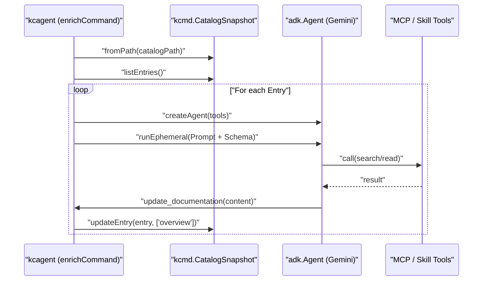

# 보강 에이전트

<details>
<summary>관련 소스 파일</summary>

다음 파일들은 이 위키 페이지를 생성하기 위한 컨텍스트로 사용되었습니다.

- [toolbox/enrichment/README.md](toolbox/enrichment/README.md)
- [toolbox/enrichment/package-lock.json](toolbox/enrichment/package-lock.json)
- [toolbox/enrichment/package.json](toolbox/enrichment/package.json)
- [toolbox/enrichment/src/agent/enrich/agent.ts](toolbox/enrichment/src/agent/enrich/agent.ts)
- [toolbox/enrichment/src/agent/enrich/command.ts](toolbox/enrichment/src/agent/enrich/command.ts)
- [toolbox/enrichment/src/agent/tools.ts](toolbox/enrichment/src/agent/tools.ts)
- [toolbox/enrichment/tsconfig.json](toolbox/enrichment/tsconfig.json)

</details>


Knowledge Catalog 저장소는 Large Language Models (LLMs)를 사용해 데이터 자산 메타데이터를 보강하도록 설계된 두 가지 서로 다른 보강 에이전트 구현을 제공합니다. 이러한 에이전트는 Google Drive, BigQuery 사용 이력, 소스 코드 저장소 같은 다양한 소스에서 정보를 추출하는 작업을 자동화하여 카탈로그를 위한 풍부한 문서와 기술 컨텍스트를 생성합니다.

두 구현 모두 `kcmd` 도구와 상호작용하여 로컬 메타데이터 스냅샷을 관리하고 Dataplex Knowledge Catalog에 업데이트를 게시함으로써 **Metadata as Code (mdcode)** 패러다임을 활용합니다.

### 시스템 개요

보강 에이전트는 비정형 조직 지식과 구조화된 카탈로그 메타데이터 사이의 간극을 연결합니다.

| Agent Implementation | Language | Primary Use Case | Entrypoint |
|:---|:---|:---|:---|
| **Python Enrichment Agent** | Python | 특수 모드(Table, Doc, Overlay)를 포함하는 복잡한 다단계 파이프라인입니다. | `agent_runner.py` |
| **TypeScript Enrichment Agent** | TypeScript | MCP 및 ADK skill을 사용하는 도구 중심 agentic 워크플로입니다. | `kcagent` CLI |

출처: [agents/enrichment/README.md:9-20](), [toolbox/enrichment/README.md:3-12]().

---

### 보강 워크플로 아키텍처

다음 다이어그램은 보강 에이전트가 `kcmd` 인터페이스를 통해 외부 지식 소스와 Knowledge Catalog 사이에 어떻게 위치하는지 보여줍니다.

**다이어그램: 보강 에이전트 데이터 흐름**
```mermaid
graph TD
  subgraph "External_Sources"
    [GD] "Google Drive / Docs"
    [BQ_IS] "BigQuery INFORMATION_SCHEMA"
    [GH] "GitHub Repo (via MCP)"
    [FB] "User Feedback Proposals"
  end

  subgraph "Enrichment_Agents"
    direction TB
    [PA] "Python Agent (agents/enrichment)"
    [TA] "TypeScript Agent (toolbox/enrichment)"
  end

  subgraph "Metadata_as_Code_mdcode"
    [KCMD] "kcmd CLI"
    [LocalFiles] "Local Workspace (YAML/Markdown)"
  end

  subgraph "Cloud_Catalog"
    [DPX] "Dataplex Knowledge Catalog"
  end

  [GD] & [BQ_IS] & [GH] & [FB] --> [PA] & [TA]
  [PA] & [TA] -- "shell out / lib call" --> [KCMD]
  [KCMD] -- "pull / push" --> [DPX]
  [KCMD] -- "manages" --> [LocalFiles]
  [PA] & [TA] -- "write updates" --> [LocalFiles]
```
출처: [agents/enrichment/README.md:16-19](), [toolbox/enrichment/src/agent/enrich/command.ts:39-40](), [toolbox/enrichment/README.md:18-27]().

---

### agents/enrichment: Python Enrichment Agent

Python 구현은 다단계 LLM 에이전트(Vertex AI Gemini 기반)를 사용해 메타데이터를 처리하는 고성능 보강 파이프라인입니다. 세 가지 특정 운영 모드를 중심으로 구성되어 있습니다.

*   **Table Mode**: 관련 Drive 문서와 사용 패턴을 특정 테이블로 라우팅하여 BigQuery 테이블 메타데이터를 보강합니다.
*   **Doc Mode**: 대규모 문서 컬렉션을 Knowledge Base 형식으로 요약합니다.
*   **Context Overlay Mode**: 읽기 전용 시스템 Entry 위에 비파괴 메타데이터 계층을 생성합니다.

이 구현은 자산을 발견하기 위해 `kcmd`와 깊게 통합되며, human-in-the-loop 방식의 개선을 위해 대화형 REPL에 로직을 유지합니다.

자세한 내용은 [agents/enrichment: Python Enrichment Agent](#3.1)를 참조하세요.

출처: [agents/enrichment/README.md:21-55](), [agents/enrichment/src/agent_runner.py:65-79]().

---

### toolbox/enrichment: TypeScript kcagent

주로 `toolbox/enrichment`에 위치한 TypeScript 구현은 **Model Context Protocol (MCP)** 및 **Agent Development Kit (ADK)** 를 사용하는 확장 가능한 도구 기반 접근 방식에 초점을 맞춥니다. 

`kcagent` CLI는 `toolbox/enrichment/src/agent/enrich/command.ts` [16-113]()의 `enrichCommand` 루프를 조율하며, 이 루프는 `kcmd.CatalogSnapshot` [40-42]()의 Entry를 순회합니다. 각 Entry에 대해 다음을 갖춘 `adk.Agent` [77-81]()를 초기화합니다.
*   **MCP Tools**: `mcp.json` 구성에서 `loadMcpTools`를 통해 로드됩니다 [36]().
*   **Skills**: `skills/` 디렉터리에서 `loadSkills`를 통해 로드되는 재사용 가능한 agentic 로직입니다 [37]().
*   **Built-in Tools**: 특히 LLM 출력을 `dataplex-types.global.overview` Aspect [68-71]()로 다시 매핑하는 `update_documentation` `adk.FunctionTool` [51-75]()입니다.

자세한 내용은 [toolbox/enrichment: TypeScript kcagent and md-fileset](#3.2)를 참조하세요.

**다이어그램: kcagent 실행 로직**

출처: [toolbox/enrichment/src/agent/enrich/command.ts:16-113](), [toolbox/enrichment/src/agent/enrich/agent.ts:89-108](), [toolbox/enrichment/src/agent/tools.ts:16-92]().

---

### 주요 구성 요소 비교

| Feature | Python Agent (`agents/enrichment`) | TypeScript Agent (`toolbox/enrichment`) |
|:---|:---|:---|
| **Core Library** | `google-adk` (Python), `google-genai` | `@google/adk` (JS/TS), `kcmd` |
| **CLI Entrypoint** | `agent_runner.py` | `kcagent` |
| **Tooling** | 하드코딩된 도구 모듈(예: `drive_tools.py`) | 동적 MCP 서버 로딩(`mcp.json`) |
| **State Management** | `kcmd` 바이너리를 shell out으로 호출 | `kcmd`를 라이브러리 의존성으로 사용 |
| **Output Target** | `catalog.yaml` 및 sidecar 파일 | `CatalogSnapshot` Entry 업데이트 |

출처: [agents/enrichment/README.md:58-80](), [toolbox/enrichment/src/agent/enrich/command.ts:5-8](), [toolbox/enrichment/README.md:116-126](), [toolbox/enrichment/package.json:23-27]().
