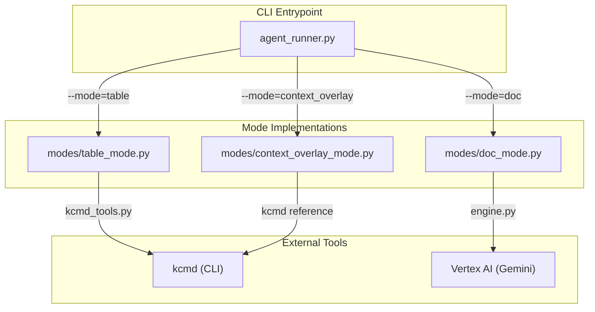
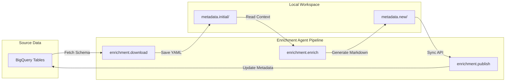

# agents/enrichment: Python Enrichment Agent

<details>
<summary>관련 소스 파일</summary>

다음 파일들은 이 위키 페이지를 생성하기 위한 컨텍스트로 사용되었습니다.

- [samples/enrichment/README.md](samples/enrichment/README.md)

</details>


Python Enrichment Agent(`agents/enrichment`)는 Knowledge Catalog(Dataplex)를 위한 **Metadata as Code (MaC)** 아티팩트를 생성하도록 설계된 명령줄 도구입니다. Google Docs, 로컬 Markdown 파일, BigQuery 사용 이력, GitHub 저장소 같은 소스 자료에서 도메인 지식을 추출하여 데이터 자산을 설명하는 YAML 및 Markdown 파일을 생성합니다.

에이전트는 "pull-enrich-publish" 워크플로로 동작합니다. `kcmd`를 통해 카탈로그와 상호작용하며, 클라우드로 푸시되기 전에 검토할 수 있는 보강된 메타데이터로 로컬 작업 공간을 채웁니다 [samples/enrichment/README.md:8-17]().

## 시스템 아키텍처

에이전트는 세 가지 주요 운영 모드, 다단계 LLM 파이프라인, 컨텍스트 소싱을 위한 도구 통합 모음을 중심으로 구성됩니다.

### 보강 모드

에이전트는 `--mode` 플래그에 따라 세 가지 흐름 중 하나로 dispatch합니다 [agents/enrichment/src/agent_runner.py:3-14]().

| Mode | Purpose | Primary Output |
| :--- | :--- | :--- |
| `table` | Drive/로컬 문서에 기반해 BigQuery 데이터셋 테이블을 보강합니다. | `bq-dataset` 형식의 보강된 테이블 overview와 `queries` Aspect입니다. |
| `doc` | 문서를 크롤링하여 지식 베이스를 처음부터 구축합니다. | `STANDARD` 레이아웃의 Knowledge-base Entry입니다. |
| `context_overlay` | 1P BigQuery 테이블을 위한 비파괴 "overlay"를 생성합니다. | 읽기 전용 테이블을 참조하는 편집 가능한 Entry Group의 Overlay Entry입니다. |

### 로직 흐름 및 코드 엔티티 매핑

다음 다이어그램은 `agent_runner.py` entrypoint가 특정 모드 구현 및 `kcmd` CLI와 어떻게 조율되는지 보여줍니다.

**에이전트 오케스트레이션 흐름**

출처: [agents/enrichment/src/agent_runner.py:26-36](), [agents/enrichment/src/modes/table_mode.py:1-13](), [agents/enrichment/src/modes/doc_mode.py:1-4](), [agents/enrichment/src/modes/context_overlay_mode.py:1-26]()

## 워크플로: Download, Enrich, Publish

보강 프로세스는 일반적으로 샘플 구현에 나타난 것처럼 네 단계 수명 주기를 따릅니다 [samples/enrichment/README.md:56-90]().

1.  **Download**: `enrichment.download`를 사용해 소스(예: BigQuery 데이터셋)에서 로컬 메타데이터 스냅샷을 초기화합니다 [samples/enrichment/README.md:60-66]().
2.  **Enrich**: `enrichment.enrich` 모듈을 실행하여 로컬 스냅샷을 처리하고, LLM을 사용해 제공된 구성에 기반한 설명과 문서를 생성합니다 [samples/enrichment/README.md:68-75]().
3.  **Review**: `git diff` 같은 표준 도구를 사용해 로컬 디렉터리에 생성된 변경 사항을 검사합니다 [samples/enrichment/README.md:77-82]().
4.  **Publish**: `enrichment.publish`를 사용해 최종 로컬 메타데이터를 Knowledge Catalog로 다시 동기화합니다 [samples/enrichment/README.md:84-89]().

**샘플 데이터 파이프라인**

출처: [samples/enrichment/README.md:60-89](), [agents/enrichment/src/agent_runner.py:11-19]()

## 주요 기능

### Metadata as Code 통합
에이전트는 로컬 메타데이터 작업 공간을 관리하기 위해 `kcmd_tools.py`에 의존합니다. 예를 들어 `table` 모드에서는 `.overview.md` sidecar 파일을 추가하기 전에 기존 스키마를 발견하기 위해 `kcmd init --bigquery-dataset`와 `kcmd pull`을 사용합니다 [agents/enrichment/src/modes/table_mode.py:3-9]().

### 다중 소스 컨텍스트 기반화
보강은 여러 컨텍스트 소스에 기반합니다.
*   **Google Drive/Docs**: 문서의 재귀적 크롤링 및 요약 [agents/enrichment/src/modes/doc_mode.py:1-4]().
*   **BigQuery Usage**: `bq_usage_tools.py`를 통해 `INFORMATION_SCHEMA`에서 쿼리 패턴과 SQL 예제를 추출합니다 [agents/enrichment/src/agent_runner.py:144-156]().
*   **GitHub Repositories**: GitHub MCP 서버를 통한 소스 코드의 agentic 탐색으로 "component cards"를 생성합니다 [agents/enrichment/src/agent_runner.py:59-67]().
*   **User Feedback**: LLM 생성 콘텐츠를 override하는 높은 우선순위의 JSON 제안입니다 [agents/enrichment/src/agent_runner.py:176-180]().

### 대화형 개선
초기 생성 후 사용자는 대화형 REPL(`--interactive`)에 들어가 자연어 지시로 출력을 개선할 수 있습니다. 이 프로세스는 이미 로드된 컨텍스트를 재사용하여 중복 문서 처리를 피합니다 [agents/enrichment/src/agent_runner.py:51-54]().

## 하위 구성 요소 개요

### [LLM Engine and Agent Pipeline](#3.1.1)
핵심 지능은 다단계 파이프라인을 정의하는 `engine.py`에 있습니다. Entry를 식별하기 위한 `EnumerationAgent`, 상세 Markdown을 생성하기 위한 `EntryWriterAgent`, 문서를 데이터 자산에 매칭하기 위한 `RelevanceRouterAgent`가 포함됩니다.
자세한 내용은 [LLM Engine and Agent Pipeline](#3.1.1)을 참조하세요.

### [Tools: Drive, BigQuery, GitHub, Feedback, and kcmd](#3.1.2)
에이전트는 모듈식 도구 시스템을 사용합니다. `drive_tools.py`는 문서 가져오기와 캐싱을 처리하고, `bq_usage_tools.py`는 SQL 이력을 분석하며, `github_tools.py`는 소스 코드 저장소에 대한 agentic 인터페이스를 제공합니다.
자세한 내용은 [Tools: Drive, BigQuery, GitHub, Feedback, and kcmd](#3.1.2)를 참조하세요.

### [Evaluation Framework](#3.1.3)
`agents/enrichment/eval/`에 위치한 이 프레임워크는 "golden-free"(동적) 및 "golden-based" 채점을 모두 제공합니다. 구조적 유효성, hallucination 비율, 중복성 같은 지표를 측정합니다.
자세한 내용은 [Evaluation Framework](#3.1.3)를 참조하세요.

## 디렉터리 구조
```
agents/enrichment/
├── src/
│   ├── agent_runner.py      # Main entrypoint
│   ├── engine.py            # LLM agents and pipeline logic
│   ├── common.py            # Shared utilities (retry logic, direct API calls)
│   ├── modes/               # Mode-specific orchestration
│   └── tools/               # External service integrations
└── eval/                    # Evaluation toolkit
```
출처: [agents/enrichment/README.md:60-90]()
