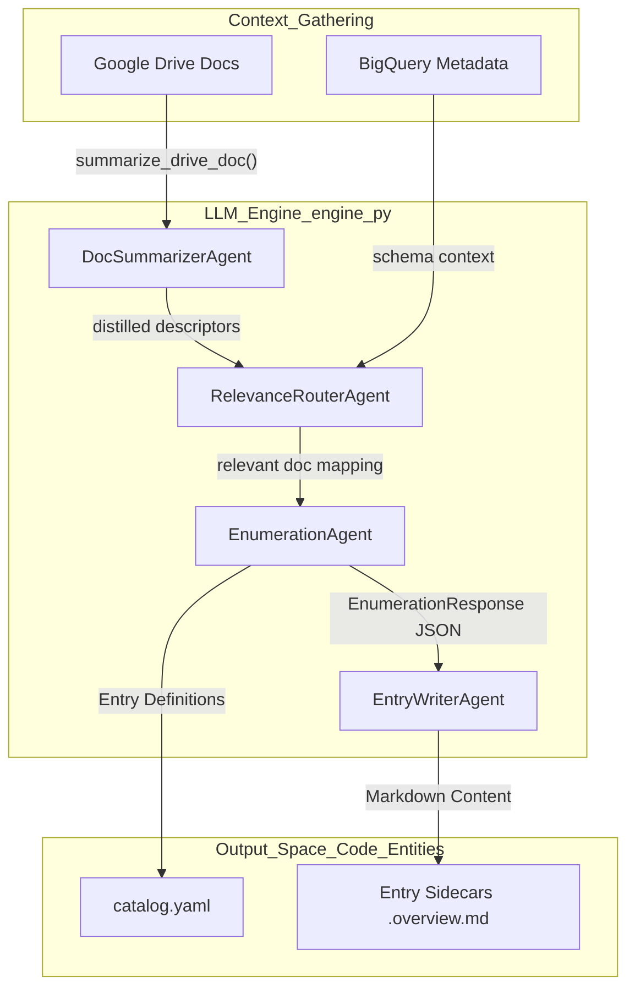

# LLM 엔진 및 에이전트 파이프라인

<details>
<summary>관련 소스 파일</summary>

다음 파일들은 이 위키 페이지를 생성하기 위한 컨텍스트로 사용되었습니다.

- [samples/enrichment/README.md](samples/enrichment/README.md)

</details>


보강 에이전트는 비정형 컨텍스트(Google Docs, BigQuery 스키마, 사용 메타데이터)를 구조화된 Knowledge Catalog Entry로 변환하기 위해 다단계 LLM 파이프라인을 사용합니다. 이 파이프라인은 `engine.py`에 정의되어 있으며, 구조화된 출력을 위한 Pydantic 스키마와 Gemini용 특수 Vertex AI 래퍼를 활용하면서 모델에 구애받지 않도록 설계되었습니다.

## 에이전트 파이프라인 개요

파이프라인은 특화된 에이전트들로 나뉘며, 각 에이전트는 메타데이터 생성 수명 주기의 특정 단계를 담당합니다. 이러한 에이전트는 Entry 식별과 콘텐츠 품질의 일관성을 보장하기 위해 여러 모드(Table, Doc, Context Overlay)에서 사용됩니다.

### 다단계 파이프라인 아키텍처

다음 다이어그램은 `engine.py`의 다양한 에이전트가 원시 데이터를 보강된 카탈로그 Entry로 처리하기 위해 어떻게 상호작용하는지 보여줍니다.

**그림 1: 보강 에이전트 데이터 흐름**

출처: [agents/enrichment/src/engine.py:4-25](), [agents/enrichment/src/engine.py:304-320]()

## 핵심 에이전트 구성 요소

### VertexGemini 래퍼
`VertexGemini` 클래스는 ADK `Gemini` 모델을 확장하여 Application Default Credentials (ADC)를 사용해 Vertex AI와 연동합니다. GCP 환경 전반에서 이식성을 보장하기 위해 환경에서 `GOOGLE_CLOUD_PROJECT` 및 `GOOGLE_CLOUD_LOCATION`을 동적으로 가져옵니다.
출처: [agents/enrichment/src/engine.py:43-64]()

### EnumerationAgent
`EnumerationAgent`는 제공된 컨텍스트에서 표준화되고 분류된 Entry 목록을 생성하는 역할을 합니다. 실행 간 Entry ID와 중복 제거 결정이 안정적으로 유지되도록 엄격한 Pydantic 스키마 JSON(`EnumerationResponse`)을 출력합니다.
- **입력:** 컴파일된 컨텍스트(요약 또는 스키마).
- **출력:** category와 Entry 메타데이터를 포함하는 `EnumerationResponse`.
출처: [agents/enrichment/src/engine.py:4-10](), [agents/enrichment/src/engine.py:236-258]()

### EntryWriterAgent
이 에이전트는 단일 Entry의 "Overview" 본문을 작성하는 데 초점을 맞춥니다. Entry별로 작업을 분산함으로써 시스템은 최종 작성 작업에 Gemini Flash처럼 더 작은 컨텍스트 창을 가진 모델을 활용할 수 있습니다.
- **입력:** 특정 Entry 메타데이터와 라우팅된 소스 문서 snippet을 포함하는 grounding prompt.
- **출력:** Markdown 형식의 overview 텍스트.
출처: [agents/enrichment/src/engine.py:11-12](), [agents/enrichment/src/engine.py:270-285]()

### RelevanceRouterAgent
주로 **Table Mode**에서 사용되며, 이 에이전트는 문서의 정제된 descriptor를 분석하고 특정 BigQuery 테이블과 관련 있는 문서를 판단합니다.
출처: [agents/enrichment/src/engine.py:23-25](), [agents/enrichment/src/engine.py:322-337]()

## 구조화된 출력 스키마

엔진은 LLM 응답에 구조를 강제하기 위해 Pydantic `BaseModel` 정의에 의존합니다. 이는 자연어 추론과 `kcmd` 카탈로그 형식의 엄격한 요구 사항 사이의 간극을 연결합니다.

| Class Name | Purpose | Key Fields |
| :--- | :--- | :--- |
| `EnumerationResponse` | 카탈로그 구조를 정의합니다 | `categories`, `entries` |
| `RelevanceResponse` | 문서를 테이블에 매핑합니다 | `reasoning`, `relevant_doc_ids` |
| `RefinementPlan` | 사용자 피드백을 작업에 매핑합니다 | `operation` (rewrite/answer), `entry_ids` |

출처: [agents/enrichment/src/engine.py:236-258](), [agents/enrichment/src/engine.py:304-320](), [agents/enrichment/src/engine.py:365-385]()

## 대화형 개선 REPL

`refine.py` 모듈은 사용자가 자연어를 통해 생성된 메타데이터를 수정할 수 있는 다중 턴 피드백 루프를 제공합니다. 소스 문서를 다시 읽거나 전체 파이프라인을 다시 실행하지 않도록 `EnrichmentSession`을 유지합니다.

**그림 2: 개선 루프(코드 엔티티 매핑)**
```mermaid
sequenceDiagram
    participant User
    participant REPL["refine.py:run_repl"]
    participant Dispatcher["engine.py:RefinementPlan"]
    participant Writer["engine.py:EntryWriterAgent"]
    participant Disk["FileSystem EntryState.overview_path"]

    User->>REPL: "Make the overview more technical"
    REPL->>Dispatcher: "plan_refinement(user_text)"
    Dispatcher-->>REPL: "Return RefinementPlan (operation='rewrite')"
    REPL->>Writer: "apply_refinement(grounding_prompt + feedback)"
    Writer-->>REPL: "New Markdown Body"
    REPL->>Disk: "EntryState.write(body)"
    Disk-->>User: "Updated .overview.md sidecar"
```
출처: [agents/enrichment/src/refine.py:1-29](), [agents/enrichment/src/refine.py:183-195](), [agents/enrichment/src/refine.py:77-84]()

### 세션 관리
- **영속화:** 세션은 출력 디렉터리의 `refine_session.json`으로 저장됩니다. 이를 통해 webapp은 상태를 잃지 않고 개선을 위해 에이전트를 다시 호출할 수 있습니다.
- **Grounding 재사용:** 각 `EntryState` 객체는 초기 실행 중 사용된 `grounding_prompt`를 저장합니다. 개선은 사용자의 새 지시를 이 prompt에 추가하고 `EntryWriterAgent`를 다시 호출하는 방식으로 수행됩니다.
출처: [agents/enrichment/src/refine.py:47-75](), [agents/enrichment/src/refine.py:115-136]()
