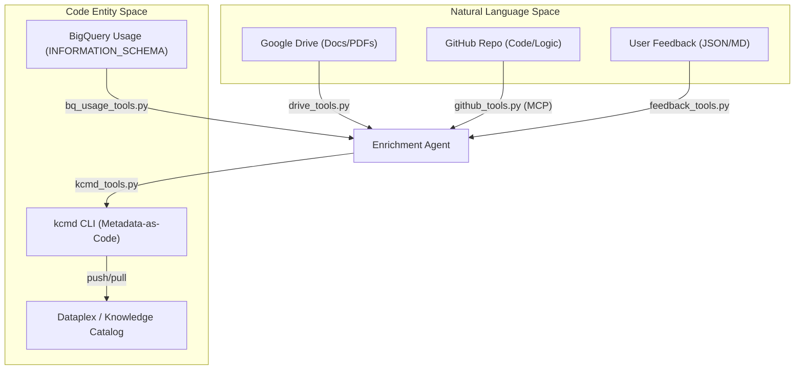
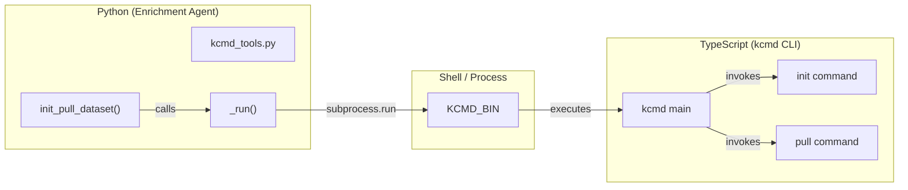

# 도구: Drive, BigQuery, GitHub, Feedback, kcmd

관련 소스 파일

다음 파일들은 이 위키 페이지를 생성하기 위한 컨텍스트로 사용되었습니다.

- [samples/enrichment/README.md](samples/enrichment/README.md)

Python 보강 에이전트는 다양한 소스에서 컨텍스트를 수집하고, Knowledge Catalog와 상호작용하며, 사람의 피드백을 반영하기 위해 모듈식 도구 모음을 사용합니다. 이러한 도구는 "Natural Language Space"(문서, 코드, 사용자 의도)와 "Code Entity Space"(BigQuery 스키마, Dataplex Aspect, 카탈로그 매니페스트) 사이의 간극을 연결합니다.

## 도구 아키텍처 및 데이터 흐름

보강 에이전트는 여러 소스에서 컨텍스트를 수집하고, 이를 LLM 엔진이 처리하여 메타데이터를 생성하는 방식으로 동작합니다. `kcmd` 도구는 카탈로그 동기화를 위한 유일한 인터페이스 역할을 합니다.

### 데이터 흐름: 컨텍스트에서 카탈로그까지

Title: Enrichment Agent Tooling Data Flow

**출처:** [agents/enrichment/src/tools/drive_tools.py:1-12](), [agents/enrichment/src/tools/bq_usage_tools.py:1-14](), [agents/enrichment/src/tools/github_tools.py:1-11](), [agents/enrichment/src/tools/kcmd_tools.py:1-17]()

---

## Google Drive 및 로컬 Markdown(`drive_tools.py`)

이 모듈은 Google Drive(Docs, Sheets, Slides, PDFs)와 로컬 Markdown 파일에서 콘텐츠를 발견하고 읽기 위한 helper를 제공합니다.

### 주요 함수
- **`get_service()`**: Application Default Credentials (ADC)를 사용해 thread-local 인증된 Drive v3 서비스를 반환합니다 [agents/enrichment/src/tools/drive_tools.py:37-55](). `drive.readonly` scope가 필요합니다 [agents/enrichment/src/tools/drive_tools.py:27-27]().
- **`list_folder_files()`**: Drive 폴더에서 지원되는 MIME type을 재귀적으로 나열하고, `id`, `name`, `webViewLink` 같은 메타데이터를 반환합니다 [agents/enrichment/src/tools/drive_tools.py:148-185]().
- **`fetch_doc_text()`**: Google Docs를 plain text로 export하거나 Drive API를 사용해 PDF 콘텐츠를 읽습니다 [agents/enrichment/src/tools/drive_tools.py:210-255]().
- **`is_local_path()`**: 제공된 문자열이 로컬 파일/디렉터리를 가리키는지 Google Drive 리소스를 가리키는지 판단합니다 [agents/enrichment/src/tools/drive_tools.py:85-108]().

### Thread Safety
이 모듈은 thread별로 Drive 서비스를 캐시하기 위해 `threading.local()`을 사용합니다. `googleapiclient`가 사용하는 기반 `httplib2` transport가 thread-safe하지 않기 때문입니다 [agents/enrichment/src/tools/drive_tools.py:29-34]().

**출처:** [agents/enrichment/src/tools/drive_tools.py:20-55](), [agents/enrichment/src/tools/drive_tools.py:85-108](), [agents/enrichment/src/tools/drive_tools.py:148-185]()

---

## BigQuery 사용 신호(`bq_usage_tools.py`)

이 모듈은 테이블 보강을 위한 "사용 신호"를 제공하기 위해 BigQuery의 `INFORMATION_SCHEMA`에서 쿼리 이력을 추출합니다.

### 구현 세부 사항
- **Batching**: 비용을 최소화하기 위해 테이블별이 아니라 데이터셋별로 하나의 batch query를 수행합니다 [agents/enrichment/src/tools/bq_usage_tools.py:11-14]().
- **Normalization**: `normalize_query()` 함수는 SQL 텍스트에서 literal(문자열, 숫자, 날짜)을 제거하여 유사한 쿼리를 패턴으로 축약하고 PII를 보호합니다 [agents/enrichment/src/tools/bq_usage_tools.py:144-161]().
- **Caching**: 집계된 사용 데이터는 로컬의 `~/.kc_enrich_cache/usage/`에 캐시됩니다 [agents/enrichment/src/tools/bq_usage_tools.py:37-38]().

### TableUsage 스키마
`TableUsage` dataclass는 다음 신호를 캡처합니다 [agents/enrichment/src/tools/bq_usage_tools.py:75-97]().
| Field | Description |
| :--- | :--- |
| `top_users` | 가장 활발한 사용자(익명성을 위해 선택적으로 hash 처리됨) |
| `top_query_patterns` | literal 제거 후의 빈번한 SQL 구조 |
| `top_join_partners` | 대상 테이블과 자주 join되는 테이블 |
| `top_referenced_columns` | 쿼리에 가장 자주 등장하는 컬럼 |

**출처:** [agents/enrichment/src/tools/bq_usage_tools.py:11-22](), [agents/enrichment/src/tools/bq_usage_tools.py:75-97](), [agents/enrichment/src/tools/bq_usage_tools.py:144-161]()

---

## GitHub Agentic 탐색(`github_tools.py`)

GitHub 도구는 Model Context Protocol (MCP)을 사용하여 LLM이 소스 코드 저장소를 탐색할 수 있게 합니다.

### Agentic 파이프라인
다른 도구와 달리 `github_tools.py`는 GitHub MCP 서버의 도구(예: `search_code`, `get_file_contents`)를 사용해 코드를 "component cards"로 정제하는 `LlmAgent`(Google ADK를 통해)를 초기화합니다 [agents/enrichment/src/tools/github_tools.py:1-11]().

### 구성
- **Transport**: `stdio`(로컬 바이너리)와 `http`(원격 endpoint) transport를 모두 지원합니다 [agents/enrichment/src/tools/github_tools.py:157-160]().
- **Precedence**: 구성은 `--mcp-config` 플래그 또는 `KC_ENRICH_MCP_CONFIG` 환경 변수에서 해석됩니다 [agents/enrichment/src/tools/github_tools.py:161-165]().

**출처:** [agents/enrichment/src/tools/github_tools.py:1-37](), [agents/enrichment/src/tools/github_tools.py:144-160]()

---

## 사용자 피드백 통합(`feedback_tools.py`)

이 모듈은 사람이 제공한 수정 사항을 처리하며, 이는 자동화된 컨텍스트 소스보다 더 높은 우선순위로 취급됩니다.

### 라우팅 로직
제안은 `target_asset.name` FQN을 기준으로 특정 테이블에 라우팅됩니다.
- **TABLE**: `project.dataset.table`(3 segments) [agents/enrichment/src/tools/feedback_tools.py:148-149]().
- **COLUMN**: `project.dataset.table.column`(4 segments, 마지막 segment 제거) [agents/enrichment/src/tools/feedback_tools.py:150-151]().

### Golden SQL
피드백 제안에 `golden_sql`이 포함된 `eval_candidate`가 있으면, 이는 `[Source: User Feedback]`로 인용되는 `queries` Aspect용 Entry로 변환됩니다 [agents/enrichment/src/tools/feedback_tools.py:24-29]().

**출처:** [agents/enrichment/src/tools/feedback_tools.py:1-38](), [agents/enrichment/src/tools/feedback_tools.py:138-156](), [agents/enrichment/src/tools/feedback_tools.py:172-199]()

---

## 카탈로그 통합(`kcmd_tools.py`)

보강 에이전트는 Metadata-as-Code 워크플로를 보장하기 위해 `kcmd` CLI를 통해서만 Dataplex와 상호작용합니다.

### 매니페스트 템플릿
이 모듈은 작업 공간 초기화에 사용되는 여러 매니페스트 템플릿을 관리합니다.
- **`_BQ_MANIFEST`**: `bq-dataset` scope를 구성하고 `overview` 및 `queries` Aspect가 추적되도록 보장합니다 [agents/enrichment/src/tools/kcmd_tools.py:63-78]().
- **`_EG_MANIFEST`**: `doc_mode`에 사용되며, `generic` Entry type이 있는 Entry Group을 구성합니다 [agents/enrichment/src/tools/kcmd_tools.py:136-150]().
- **`_OVERLAY_MANIFEST`**: `context_overlay` 모드에 사용되며, 별도 Entry Group에서 편집을 허용하면서 읽기 전용 BigQuery 테이블에 대한 참조를 생성합니다 [agents/enrichment/src/tools/kcmd_tools.py:157-181]().

### 코드 엔티티 매핑
다음 다이어그램은 Python `kcmd_tools` 모듈이 `kcmd` TypeScript 바이너리를 어떻게 호출하는지 보여줍니다.

Title: kcmd Tool Execution Bridge

**출처:** [agents/enrichment/src/tools/kcmd_tools.py:1-17](), [agents/enrichment/src/tools/kcmd_tools.py:27-45](), [agents/enrichment/src/tools/kcmd_tools.py:183-205]()

---

## 보강 워크플로 통합

위에서 설명한 도구들은 보강 에이전트의 주요 entrypoint에 의해 조율됩니다. 예를 들어 `enrichment.download`는 초기 상태를 pull하기 위해 `kcmd_tools`를 사용하고, `enrichment.publish`는 업데이트를 push하기 위해 이를 사용합니다.

| Step | Script | Tool Used | Purpose |
| :--- | :--- | :--- | :--- |
| **Download** | `enrichment.download` | `kcmd_tools.py` | BigQuery에서 로컬 메타데이터 스냅샷을 생성합니다 [samples/enrichment/README.md:63-66]() |
| **Enrich** | `enrichment.enrich` | `drive_tools.py`, `bq_usage_tools.py` | 컨텍스트를 수집하고 새 메타데이터를 생성합니다 [samples/enrichment/README.md:71-75]() |
| **Publish** | `enrichment.publish` | `kcmd_tools.py` | 로컬 변경 사항을 Dataplex로 다시 동기화합니다 [samples/enrichment/README.md:87-89]() |

**출처:** [samples/enrichment/README.md:60-90]()
