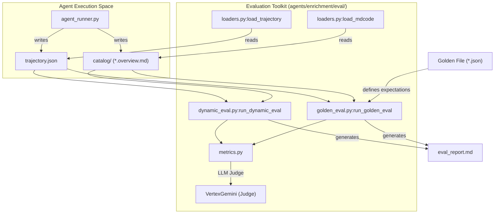
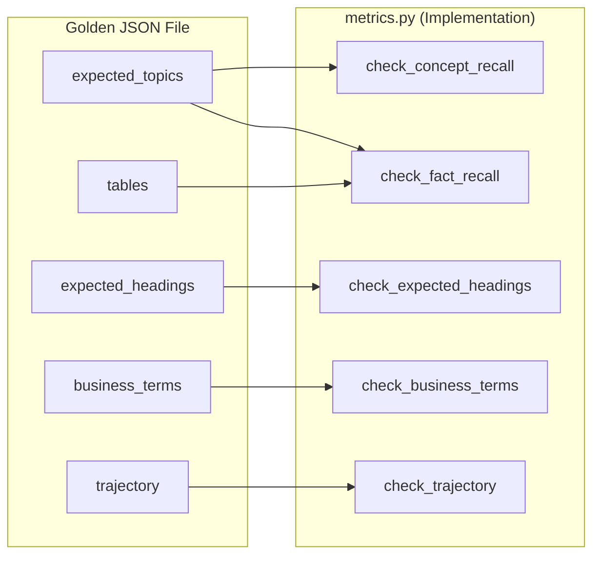

# 평가 프레임워크

<details>
<summary>관련 소스 파일</summary>

다음 파일들은 이 위키 페이지를 생성하기 위한 컨텍스트로 사용되었습니다.

- [samples/enrichment/README.md](samples/enrichment/README.md)

</details>


Knowledge Catalog 평가 프레임워크는 보강 에이전트의 품질, 정확성, 안정성을 평가하기 위한 툴킷을 제공합니다. 에이전트가 직접 검색한 컨텍스트에 claim을 기반화하는 **Dynamic (Golden-free)** 평가와, 에이전트 출력을 사람이 큐레이션한 정답과 비교하는 **Golden-based** 평가를 모두 지원합니다.

프레임워크는 주로 `agents/enrichment/eval/` 아래에 위치하며, Python 보강 에이전트의 출력에 대해 실행되도록 설계되었습니다.

## 시스템 아키텍처 및 데이터 흐름

평가 프레임워크는 에이전트 실행으로 생성된 `trajectory.json`(실행 로그와 검색된 컨텍스트) 및 생성된 `catalog/`(Metadata-as-Code 아티팩트)을 소비하여 동작합니다.

### 평가 파이프라인 다이어그램

다음 다이어그램은 에이전트 실행에서 평가 채점 프로세스까지의 데이터 흐름을 보여주며, 문서의 개념적 "Natural Language Space"를 평가 모듈의 "Code Entity Space"와 연결합니다.

**보강 평가 데이터 흐름**

**출처:** `agents/enrichment/eval/dynamic_eval.py`, `agents/enrichment/eval/golden_eval.py`, `agents/enrichment/eval/loaders.py`

## Metric 범주

Metric은 계산 방식에 따라 deterministic(코드 기반) 또는 subjective(LLM judge 기반)로 분류됩니다.

### 핵심 Metric 표

| Metric | Category | Description |
| :--- | :--- | :--- |
| `structural_validity` | Deterministic | 생성된 MaC가 올바른 형식이며 명명 규칙을 따르는지 확인합니다. |
| `hallucination_free` | Judge-based | overview의 모든 사실 claim이 에이전트가 검색한 컨텍스트에 의해 뒷받침되는지 검증합니다. |
| `concept_recall` | Golden-based | 예상 개념(`expected_topics`에서 가져옴)이 Entry로 포착되었는지 측정합니다. |
| `fact_recall` | Golden-based | golden에 선언된 특정 사실이 출력에 존재하는지 확인합니다. |
| `perf` | Deterministic | 선택적 budget 대비 token 사용량과 latency를 평가합니다. |
| `redundancy_index` | Judge-based | 에이전트가 정보를 불필요하게 반복했는지 평가합니다. |

**출처:** `agents/enrichment/eval/dynamic_eval.py`, `agents/enrichment/eval/golden_eval.py`

## 다중 실행 집계 및 안정성

LLM의 비결정성을 고려하기 위해 프레임워크는 `eval/__main__.py`의 `--runs` 플래그를 사용해 동일한 case를 여러 번 실행하는 기능을 지원합니다. `aggregate.py` 모듈은 이러한 실행을 하나의 보고서로 집계합니다.

### 안정성 Metric
`runs >= 2`일 때 프레임워크는 두 가지 안정성 metric을 계산합니다.
1.  **`concept_consistency`**: 에이전트가 실행마다 동일한 Entry 집합을 생성하는가?
2.  **`content_consistency`**: 반복해서 등장하는 Entry의 경우, 서술된 사실이 일관적인가?

**출처:** `agents/enrichment/eval/aggregate.py`, `agents/enrichment/eval/__main__.py`

## 평가 실행

평가 suite는 `agents/enrichment/` 디렉터리에서 `python -m eval`로 호출됩니다.

### 1. Dynamic Evaluation (Golden-free)
참조 파일 없이 기존 출력 디렉터리를 채점하는 데 사용됩니다. claim을 기반화하기 위해 `trajectory.json`에 의존합니다.
```bash
python -m eval --output-dir /path/to/output
```
**출처:** `agents/enrichment/eval/__main__.py`

### 2. Golden Evaluation (Score-only)
특정 golden JSON 파일을 기준으로 기존 출력을 채점합니다.
```bash
python -m eval --output-dir /path/to/output --golden eval/goldens/supply_chain.json
```
**출처:** `agents/enrichment/eval/__main__.py`

### 3. Case Execution (`--run`)
이 모드는 에이전트를 실행한 다음 채점합니다. golden 파일 내의 `run` 블록을 사용해 에이전트 입력을 결정합니다.
```bash
python -m eval --run --goldens eval/goldens/thelook_ecommerce.json \
    --project my-gcp-project --runs 3 --concurrency 2
```
**출처:** `agents/enrichment/eval/__main__.py`, `samples/enrichment/README.md:71-75`()

## Golden 파일 스키마

Golden 파일은 특정 시나리오의 "Ground Truth"를 정의합니다. `agents/enrichment/eval/goldens/`에 저장됩니다.

### Golden 스키마 연결
다음 다이어그램은 Golden 파일의 JSON key를 이를 처리하는 내부 metric 함수에 매핑합니다.

**Golden 스키마에서 코드 엔티티로의 매핑**

**출처:** `agents/enrichment/eval/golden_eval.py`

## Corpora 및 샘플 Goldens

저장소에는 외부 Google Drive 접근 없이 평가 프레임워크를 테스트하기 위한 합성 corpora가 포함되어 있습니다.

*   **Corpora (`eval/corpora/`)**: `financial_services`, `phone_services`, `supply_chain` 같은 도메인의 Markdown 문서를 포함합니다.
*   **theLook eCommerce**: BigQuery public data를 기반으로 하는 즉시 실행 가능한 table-mode golden(`thelook_ecommerce.json`)입니다. 평가 runner는 실행 전에 public dataset을 대상 프로젝트로 복사하는 작업을 처리합니다.

**출처:** `agents/enrichment/eval/runner.py`, `samples/enrichment/README.md:53-54`()
