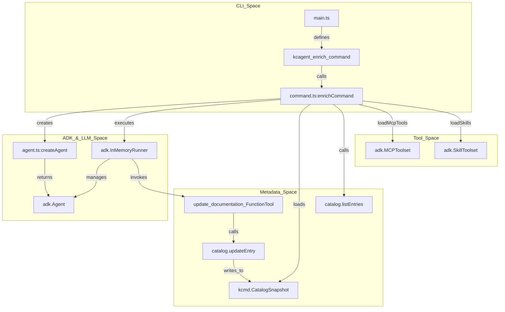
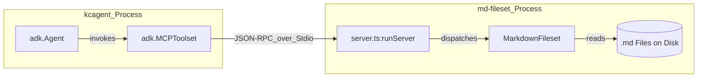

# toolbox/enrichment: TypeScript kcagent 및 md-fileset

관련 소스 파일

다음 파일들은 이 위키 페이지를 생성하기 위한 컨텍스트로 사용되었습니다.

- [toolbox/enrichment/README.md](toolbox/enrichment/README.md)
- [toolbox/enrichment/package-lock.json](toolbox/enrichment/package-lock.json)
- [toolbox/enrichment/package.json](toolbox/enrichment/package.json)
- [toolbox/enrichment/src/agent/enrich/agent.ts](toolbox/enrichment/src/agent/enrich/agent.ts)
- [toolbox/enrichment/src/agent/enrich/command.ts](toolbox/enrichment/src/agent/enrich/command.ts)
- [toolbox/enrichment/src/agent/tools.ts](toolbox/enrichment/src/agent/tools.ts)
- [toolbox/enrichment/src/tools/md/fileset.ts](toolbox/enrichment/src/tools/md/fileset.ts)
- [toolbox/enrichment/src/tools/md/main.ts](toolbox/enrichment/src/tools/md/main.ts)
- [toolbox/enrichment/src/tools/md/server.ts](toolbox/enrichment/src/tools/md/server.ts)
- [toolbox/enrichment/tsconfig.json](toolbox/enrichment/tsconfig.json)

TypeScript 보강 에이전트는 외부 소스에서 메타데이터를 추출하고 데이터 자산을 문서화하기 위한 agentic 워크플로를 제공합니다. **Google ADK (Agent Development Kit)** 및 **Model Context Protocol (MCP)** 을 활용하여 다양한 도구와 상호작용하며, 특히 `kcmd`(Metadata as Code) 라이브러리로 관리되는 자산을 문서화하는 데 초점을 맞춥니다.

## 아키텍처 및 오케스트레이션

시스템은 LLM 주도 루프를 조율하는 명령줄 인터페이스(`kcagent`)로 구축되어 있습니다. 로컬 `kcmd` 카탈로그의 Entry를 순회하고, 각 Entry에 대한 문서를 합성하기 위해 에이전트를 호출하며, 외부 정보를 발견하고 읽기 위해 도구를 사용합니다.

### 구성 요소 관계 다이어그램
다음 다이어그램은 CLI entrypoint가 ADK Agent 및 기반 메타데이터 스토리지에 어떻게 연결되는지 보여줍니다.

**그림 1: 오케스트레이션 흐름**

**출처:** `[toolbox/enrichment/src/agent/enrich/command.ts:16-113]()`, `[toolbox/enrichment/src/agent/enrich/agent.ts:89-108]()`, `[toolbox/enrichment/package.json:12-13]()`

---

## kcagent CLI

`kcagent` CLI는 보강 워크플로의 기본 entry point입니다. `bun`을 사용해 컴파일된 독립 실행형 바이너리로 배포됩니다 `[toolbox/enrichment/package.json:12]()`.

### `enrich` 명령 워크플로
`[toolbox/enrichment/src/agent/enrich/command.ts:16-113]()`의 `enrichCommand` 함수는 다음 단계를 수행합니다.
1.  **검증**: catalog path, tools path, prompt file이 존재하며 접근 가능한지 확인합니다 `[toolbox/enrichment/src/agent/enrich/command.ts:19-33]()`.
2.  **구성 로딩**: 특수 loader를 사용해 `mcp.json`에서 MCP 도구를 로드하고 `skills/` 디렉터리에서 ADK skill을 로드합니다 `[toolbox/enrichment/src/agent/enrich/command.ts:36-37]()`.
3.  **카탈로그 초기화**: `kcmd.CatalogSnapshot.fromPath`를 사용해 로컬 `kcmd` catalog snapshot을 로드합니다 `[toolbox/enrichment/src/agent/enrich/command.ts:40]()`.
4.  **Entry 루프**: `catalog.listEntries()`를 통해 가져온 모든 Entry 이름을 순회합니다 `[toolbox/enrichment/src/agent/enrich/command.ts:42-43]()`.
5.  **에이전트 실행**: 각 Entry에 대해 새 `adk.Agent` 인스턴스를 생성합니다. 에이전트의 toolset에 특정 `update_documentation` 도구를 주입합니다 `[toolbox/enrichment/src/agent/enrich/command.ts:51-77]()`.
6.  **영속화**: 에이전트가 `update_documentation`을 호출하면 Entry의 `dataplex-types.global.overview` Aspect를 업데이트하고 `catalog.updateEntry(entry, [...])`를 호출하여 변경 사항을 디스크에 영속화합니다 `[toolbox/enrichment/src/agent/enrich/command.ts:68-72]()`.

**출처:** `[toolbox/enrichment/src/agent/enrich/command.ts:16-113]()`, `[toolbox/enrichment/README.md:16-27]()`

---

## 에이전트 구현(ADK)

에이전트는 Google ADK를 사용해 `[toolbox/enrichment/src/agent/enrich/agent.ts]()`에 정의되어 있습니다. 기본적으로 `gemini-2.5-flash` 모델을 사용합니다 `[toolbox/enrichment/src/agent/enrich/agent.ts:9]()`.

### Prompting 및 동작
에이전트는 자신의 persona를 경험 많은 데이터 관리자로 정의하는 system instruction으로 초기화됩니다 `[toolbox/enrichment/src/agent/enrich/agent.ts:12]()`. prompt는 엄격한 문서 템플릿을 강제합니다.
*   **Summary**: 핵심 정보에 대한 몇 개의 문단.
*   **Data Details**: 데이터에 대한 중요한 세부 사항.
*   **Usage Details**: 비즈니스 컨텍스트와 쿼리 조언.
*   **Citations**: title 및 reference 형식의 source 목록 `[toolbox/enrichment/src/agent/enrich/agent.ts:46-61]().

### Thinking 구성
에이전트는 Gemini의 thinking 기능을 사용하도록 구성되어 있으며, `includeThoughts`는 true로 설정되고 `thinkingBudget`은 -1로 설정됩니다(모델이 필요한 깊이를 결정하도록 허용) `[toolbox/enrichment/src/agent/enrich/agent.ts:101-106]().

**출처:** `[toolbox/enrichment/src/agent/enrich/agent.ts:8-108]()`, `[toolbox/enrichment/src/agent/enrich/command.ts:116-140]()`

---

## 도구 및 Skill 로딩

에이전트의 기능은 `[toolbox/enrichment/src/agent/tools.ts]()`에서 관리되는 두 가지 메커니즘을 통해 확장됩니다.

### MCP 도구 로딩
`loadMcpTools` 함수는 `tools/mcp.json` 파일을 읽습니다 `[toolbox/enrichment/src/agent/tools.ts:17]()`. `mcpServers` 구성을 파싱하고 두 가지 연결 유형을 지원합니다.
*   **StdioConnectionParams**: `command`와 `args`를 사용해 로컬 프로세스를 생성합니다. 구성 값에 대한 환경 변수 확장을 처리합니다 `[toolbox/enrichment/src/agent/tools.ts:30-46]()`.
*   **StreamableHTTPConnectionParams**: `url`을 통해 원격 MCP 서버에 연결합니다 `[toolbox/enrichment/src/agent/tools.ts:48-59]()`.

### Skill 로딩
Skill은 종종 Markdown 파일에 정의되는 상위 수준 에이전트 기능입니다. `loadSkills`는 `skills/` 하위 디렉터리를 찾고 `adk.loadAllSkillsInDir`를 사용해 이를 수집합니다 `[toolbox/enrichment/src/agent/tools.ts:70-77]()`. 이러한 skill은 `adk.UnsafeLocalCodeExecutor`를 사용해 실행됩니다 `[toolbox/enrichment/src/agent/tools.ts:84]()`.

**출처:** `[toolbox/enrichment/src/agent/tools.ts:9-92]()`

---

## md-fileset MCP 서버

`md-fileset` 도구는 에이전트가 로컬 Markdown 파일 디렉터리를 탐색하고 읽을 수 있게 하는 특수 MCP 서버입니다.

### 구현 세부 사항
핵심 로직은 `MarkdownFileset` 클래스 `[toolbox/enrichment/src/tools/md/fileset.ts:13]()`에 있습니다. MCP 프레임워크에 세 가지 도구를 노출합니다.

| Tool Name | Implementation Function | Description |
| :--- | :--- | :--- |
| `list_fileset_contents` | `listContents()` | 지정된 상대 경로의 파일과 하위 디렉터리를 나열합니다 `[toolbox/enrichment/src/tools/md/server.ts:31-40](). |
| `read_fileset_file` | `readFile()` | 지정된 Markdown 파일의 전체 텍스트 콘텐츠를 반환합니다 `[toolbox/enrichment/src/tools/md/server.ts:54-62](). |
| `search_fileset_contents`| `searchContents()` | fileset의 모든 `.md` 파일에 대해 regex 기반 검색을 수행합니다 `[toolbox/enrichment/src/tools/md/server.ts:42-52](). |

### 보안 및 경로 처리
`MarkdownFileset`에는 모든 파일 작업이 지정된 루트 디렉터리로 제한되도록 하여 directory traversal을 방지하는 `safePath` 유틸리티가 포함되어 있습니다 `[toolbox/enrichment/src/tools/md/fileset.ts:23-31]().

**그림 2: md-fileset 데이터 흐름**

**출처:** `[toolbox/enrichment/src/tools/md/fileset.ts:13-125]()`, `[toolbox/enrichment/src/tools/md/server.ts:25-66]()`, `[toolbox/enrichment/src/tools/md/main.ts:11-33]()`
