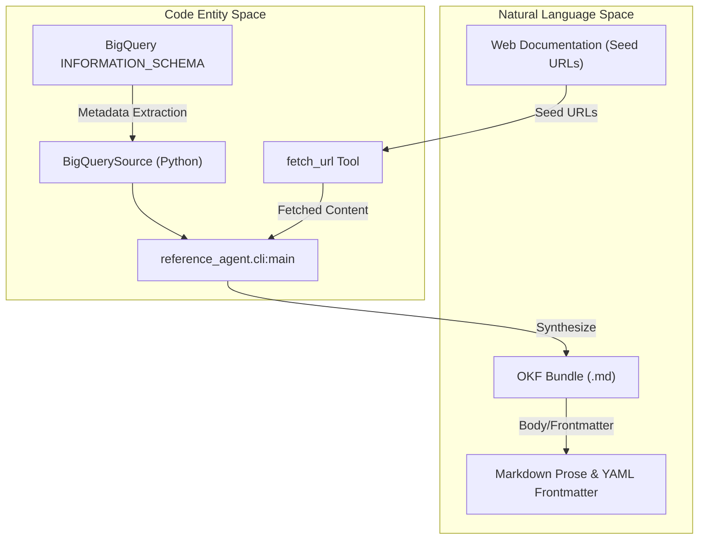
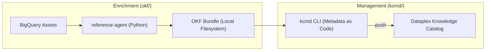

# Open Knowledge Format (OKF)

관련 소스 파일

다음 파일들은 이 위키 페이지를 생성하기 위한 컨텍스트로 사용되었습니다.

- [okf/README.md](okf/README.md)
- [okf/pyproject.toml](okf/pyproject.toml)

**Open Knowledge Format (OKF)** 은 YAML frontmatter가 포함된 plain Markdown 파일로 지식을 표현하기 위한 범용 벤더 중립 사양입니다 [okf/README.md:8-11](). 이 저장소에서 OKF는 데이터 소스, 자동화된 보강 에이전트, Knowledge Catalog 사이의 표준 교환 형식 역할을 합니다. "Metadata as Code"로 설계되어 버전 관리, 사람이 읽기 쉬운 형식, LLM의 원활한 수집을 가능하게 합니다 [okf/README.md:37-52]().

## OKF 구성 요소 개요

OKF 생태계는 세 가지 주요 축으로 구성됩니다. 공식 사양, 이러한 bundle을 생성하고 처리하기 위한 참조 구현, 그리고 실제 적용 사례를 보여주는 샘플 bundle입니다.

### OKF Specification (v0.1)
사양은 "Bundle"을 YAML frontmatter가 포함된 Markdown 파일을 담는 디렉터리 기반 구조로 정의합니다 [okf/README.md:39-41](). 이 형식은 지식이 사람이 읽기 쉽고 LLM 또는 전통적인 소프트웨어가 쉽게 파싱할 수 있도록 보장합니다. 주요 설계 속성은 다음과 같습니다.
*   **사람과 에이전트가 읽을 수 있음:** 콘텐츠에 접근하기 위해 독점 SDK가 필요하지 않습니다 [okf/README.md:43-45]().
*   **버전 관리 가능:** Bundle은 git에 저장되어 표준 PR 및 diff 워크플로를 사용할 수 있습니다 [okf/README.md:46-48]().
*   **그래프 형태:** 개념은 표준 Markdown 링크를 통해 서로 연결되어 복잡한 관계를 표현합니다 [okf/README.md:68-70]().
*   **점진적 공개:** `index.md` 파일을 통해 소비자는 전체 bundle을 컨텍스트에 로드하지 않고도 계층 구조를 탐색할 수 있습니다 [okf/README.md:65-67]().

자세한 내용은 [OKF Specification](#4.1)을 참조하세요.

### OKF Reference Enrichment Agent
`okf/src/enrichment_agent/`에 위치한 참조 보강 에이전트는 OKF bundle을 자동으로 생성하는 방법을 보여주는 Python 기반 도구(`reference-agent`로 호출)입니다 [okf/README.md:22-25](), [okf/pyproject.toml:21-22](). 이 도구는 다중 pass 파이프라인을 구현합니다.
*   **BQ Pass:** BigQuery에서 직접 기술 메타데이터, 스키마, 사용 패턴을 추출합니다 [okf/README.md:94-95]().
*   **Web Pass:** LLM을 crawler로 사용하여 seed URL에서 문서를 가져오고(`fetch_url` 도구를 통해) 기존 concept doc을 보강합니다 [okf/README.md:96-105]().
*   **Visualization:** Bundle을 독립 실행형 대화형 HTML 파일로 렌더링하는 `visualize` 하위 명령을 포함합니다 [okf/README.md:149-156]().

자세한 내용은 [OKF Reference Enrichment Agent](#4.2)를 참조하세요.

### 샘플 Bundle
저장소에는 `okf/bundles/`에 위치한, 참조 에이전트가 생성한 바로 탐색 가능한 세 가지 bundle이 포함되어 있습니다 [okf/README.md:27-35]().
*   **GA4 Google Merchandise Store:** 표준 GA4 export 문서를 seed로 사용한 public e-commerce dataset입니다 [okf/README.md:131-135]().
*   **Stack Overflow:** Stack Exchange Data Dump의 mirror로, multi-concept 보강을 실행합니다 [okf/README.md:136-141]().
*   **Bitcoin (Crypto):** 테이블 간 foreign-key 관계를 강조하는 public blockchain dataset입니다 [okf/README.md:142-147]().

## 시스템 아키텍처: 데이터에서 지식으로

다음 다이어그램은 `reference-agent`가 "Natural Language Space"(웹 문서와 prose)와 "Code Entity Space"(BigQuery 메타데이터와 Python 구현)를 어떻게 연결하는지 보여줍니다.

### 지식 합성 파이프라인

**출처:** [okf/README.md:92-106](), [okf/pyproject.toml:21-22]()

## Knowledge Catalog와의 통합

OKF는 메타데이터가 Dataplex(Knowledge Catalog)로 푸시되기 전의 중간 표현 역할을 합니다. 일반적인 워크플로는 에이전트가 OKF bundle을 생성하고, 이를 `kcmd`가 동기화를 위해 관리하는 방식입니다.

### 메타데이터 수명 주기

**출처:** [okf/README.md:1-25](), [okf/README.md:108-119]()

## 관련 하위 페이지
*   **[OKF Specification](#4.1):** 파일 형식, frontmatter 스키마, 링크 의미론에 대한 심층 설명입니다.
*   **[OKF Reference Enrichment Agent](#4.2):** Python 구현, BQ source 통합, visualization 도구에 대한 기술 세부 사항입니다.

**출처:**
*   [okf/README.md:1-156]()
*   [okf/pyproject.toml:1-33]()
