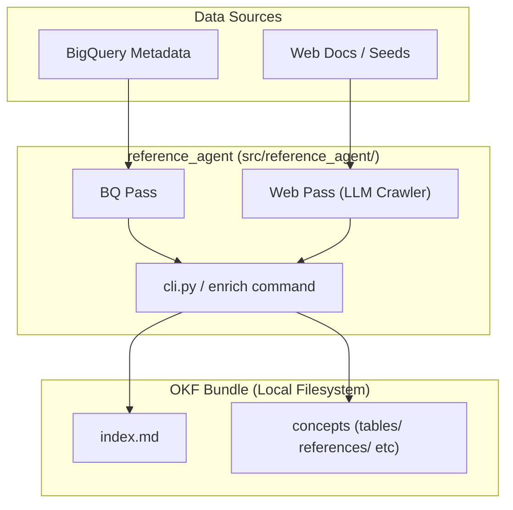
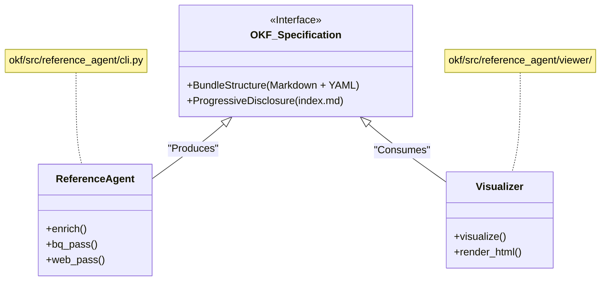

<!-- DeepWiki TOC/H1 drift: TOC 제목 "OKF Specification"은 raw/pages/4.1-okf-specification.html의 원본 payload H1 "4.1. OKF Specification"과 일치했습니다. 외부 baseline일 뿐이며, repos/knowledge-catalog/. 기준으로 검증하세요. -->

# 4.1. OKF Specification

<details>
<summary>관련 소스 파일</summary>

다음 파일들은 이 위키 페이지를 생성하기 위한 컨텍스트로 사용되었습니다.

- [okf/README.md](okf/README.md)
- [okf/bundles/ga4/index.md](okf/bundles/ga4/index.md)
- [okf/bundles/stackoverflow/index.md](okf/bundles/stackoverflow/index.md)
- [okf/pyproject.toml](okf/pyproject.toml)

</details>


**Open Knowledge Format (OKF)** v0.1은 YAML frontmatter가 포함된 plain Markdown 파일로 지식을 표현하기 위한 범용 벤더 중립 사양입니다. 사람도 완전히 접근할 수 있으면서 AI 에이전트가 machine-readable하게 사용할 수 있도록 설계되었습니다. OKF는 원시 기술 메타데이터(예: 테이블 스키마)와 사람 중심의 비즈니스 컨텍스트(예: 프로젝트 목표, 데이터 lineage, 사용 정책) 사이의 간극을 연결합니다.

OKF의 주요 목표는 문서를 버전 관리되는 아티팩트로 취급하는 "Metadata as Code" (MaC) 워크플로를 가능하게 하여, 다양한 카탈로그 provider 전반에서 자동화된 보강, 검증, 동기화를 지원하는 것입니다 [okf/README.md:8-14]().

### 1. Bundle 구조 및 설계 근거

OKF bundle은 응집된 지식 집합을 캡슐화하는 디렉터리 기반 구조입니다. 이 형식은 콘텐츠에는 Markdown을, 구조화된 메타데이터(frontmatter)에는 YAML을 선호하여, 파일이 사람이 읽기 쉽고 표준 IDE에서 쉽게 편집 가능하면서도 자동화 도구가 파싱할 수 있도록 보장합니다 [okf/README.md:39-45]().

#### Bundle 레이아웃
표준 OKF bundle은 점진적 공개를 가능하게 하기 위해 계층적 디렉터리 구조를 따릅니다 [okf/README.md:65-67]().
*   `index.md`: Bundle의 entry point이자 탐색 hub입니다 [okf/bundles/ga4/index.md:1-6]().
*   `log.md`: (선택 사항) 변경 사항과 agentic 작업의 이력 기록입니다.
*   `datasets/`: dataset 수준 컨테이너에 대한 문서를 포함하는 디렉터리입니다 [okf/bundles/ga4/index.md:3-3]().
*   `tables/`: 데이터 테이블별 개별 문서 파일을 포함하는 디렉터리입니다 [okf/bundles/ga4/index.md:5-5]().
*   `references/`: 교차 관심 문서, 열거형 type, 외부 정의를 위한 디렉터리입니다 [okf/bundles/stackoverflow/index.md:4-4]().

#### 설계 근거
*   **벤더 중립성**: OKF는 특정 에이전트 프레임워크(Google ADK, LangChain)나 serving system(Dataplex, Collibra)에 묶이지 않습니다 [okf/README.md:8-11]().
*   **버전 관리**: Bundle은 Git에 저장되어 지식 큐레이션을 위한 pull request, 줄 단위 diff, 리뷰 워크플로를 가능하게 합니다 [okf/README.md:46-48]().
*   **이식성**: Bundle은 tarball로 전달하거나 임의의 정적 파일 서버에 호스팅할 수 있는 파일 디렉터리일 뿐입니다 [okf/README.md:49-52]().
*   **그래프 형태**: 개념은 표준 Markdown 링크를 통해 서로 연결되어 단순한 부모/자식 계층보다 풍부한 관계를 표현합니다 [okf/README.md:68-70]().

**출처:**
* [okf/README.md:8-74]()
* [okf/bundles/ga4/index.md:1-6]()
* [okf/bundles/stackoverflow/index.md:1-6]()

### 2. Concept Document 및 필수 Frontmatter

하위 디렉터리(예: `tables/`) 안의 모든 Markdown 파일은 "Concept Document"입니다. 이러한 문서는 기술 메타데이터라는 "뼈대"에 의미론적 "살"을 제공합니다.

#### 필수 Frontmatter 필드
각 Concept Document에는 YAML frontmatter 블록이 포함됩니다. 이 구조화된 데이터는 쿼리와 인덱싱을 가능하게 하며, Markdown 본문은 prose를 위해 남겨둡니다 [okf/README.md:53-56]().

| Field | Description |
| :--- | :--- |
| `type` | Entry type입니다(예: `table`, `dataset`, `reference`). |
| `resource` | 물리적 리소스 경로입니다(예: BigQuery table ID). |
| `tags` | 필터링을 위한 label 목록입니다. |
| `timestamp` | 문서가 마지막으로 업데이트된 시간입니다. |

#### Markdown 본문
문서 본문에는 상세 prose, 스키마, 예제 쿼리가 포함됩니다. 표준 Markdown이므로 Obsidian, MkDocs, 내장 OKF visualizer 같은 도구로 렌더링할 수 있습니다 [okf/README.md:61-64]().

**출처:**
* [okf/README.md:53-64]()

### 3. Index 및 탐색 규칙

#### index.md
`index.md` 파일은 디렉터리 index 역할을 합니다. 하위 디렉터리와 파일을 나열하기 위해 특정 형식을 사용하며, 에이전트가 전체 bundle을 컨텍스트에 로드하지 않고도 탐색할 수 있도록 각각에 대한 요약을 제공합니다 [okf/README.md:65-67]().

`okf/bundles/ga4/index.md`의 예시 구조:
```markdown
# Subdirectories

* [datasets](datasets/index.md) - A sample of obfuscated Google Analytics...
* [references](references/index.md) - This directory contains specifications...
* [tables](tables/index.md) - Contains Google Analytics event export data...
```

**출처:**
* [okf/bundles/ga4/index.md:1-6]()
* [okf/README.md:65-67]()

### 4. 링크 및 Citation 의미론

OKF는 탐색 가능한 지식 그래프를 유지하기 위해 엄격한 링크 구문을 구현합니다.

*   **Internal Links**: 개념 간 링크는 상대 경로를 가리키는 표준 Markdown 구문을 사용합니다: `[Table Name](../tables/table_id.md)`.
*   **External Citations**: 에이전트(예: `reference_agent`)가 생성한 문서는 웹 source를 인용할 수 있습니다. 에이전트는 URL을 가져오고 권위 있는 문서를 기반으로 개념을 보강합니다 [okf/README.md:96-102]().

**출처:**
* [okf/README.md:68-70]()
* [okf/README.md:96-102]()

### 5. 데이터 흐름: Source에서 OKF Bundle까지

다음 다이어그램은 `reference_agent`(proof-of-concept producer)가 원시 데이터 소스를 구조화된 OKF bundle로 변환하는 방식을 보여줍니다.

**OKF 합성 파이프라인**

**출처:**
* [okf/README.md:92-105]() (Agent pass 및 web crawler 로직)
* [okf/pyproject.toml:21-22]() (CLI entry point)

### 6. OKF를 코드 엔티티에 매핑

OKF 사양은 `reference_agent`가 구현하고 `visualize` 도구가 소비합니다.

**사양에서 구현으로의 매핑**

**출처:**
* [okf/README.md:22-25]() (Agent 및 Visualizer 역할)
* [okf/README.md:149-155]() (Visualize 하위 명령)
* [okf/pyproject.toml:27-28]() (template용 package data)

### 7. 설계 근거: 이식성 및 협업

독점 API와 독립적인 형식을 유지함으로써 OKF는 다음을 보장합니다.
1.  **사람-에이전트 협업**: 사람과 LLM이 동일한 도구(Git)를 사용해 동일한 아티팩트(Markdown)에서 협업합니다 [okf/README.md:72-74]().
2.  **Zero Lock-in**: Bundle을 읽기 위해 독점 SDK가 필요하지 않습니다. `cat` 또는 임의의 텍스트 편집기면 충분합니다 [okf/README.md:43-45]().
3.  **확장성**: Bundle은 표준 consumer를 깨뜨리지 않고 임의의 추가 frontmatter key 또는 본문 섹션을 포함할 수 있습니다 [okf/README.md:57-60]().

**출처:**
* [okf/README.md:37-74]() (Why OKF 섹션)
