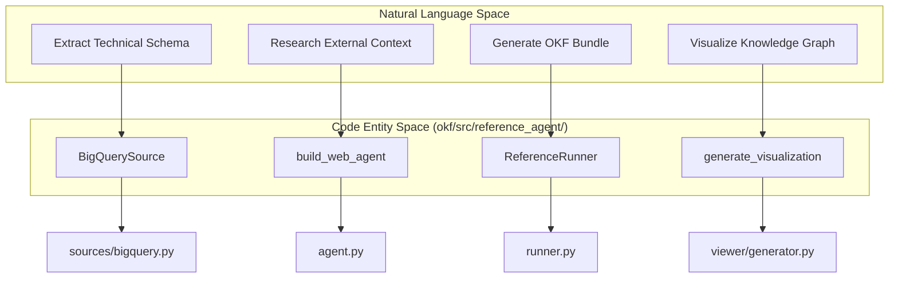
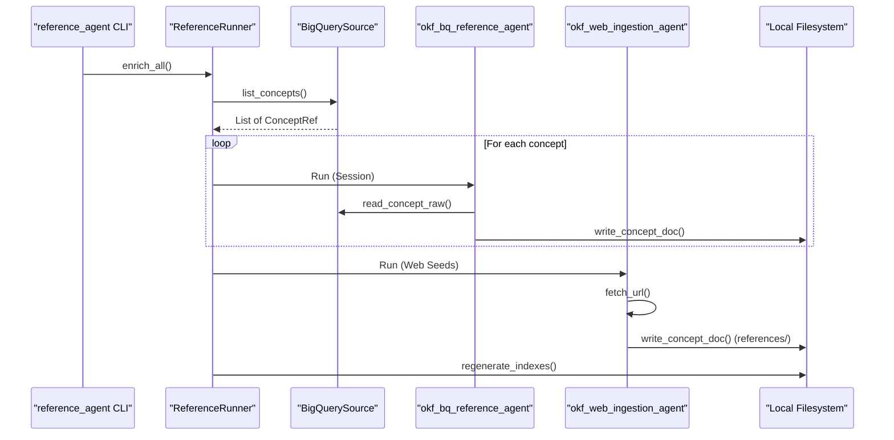

# OKF Reference Enrichment Agent

<details>
<summary>관련 소스 파일</summary>

다음 파일들은 이 위키 페이지를 생성하기 위한 컨텍스트로 사용되었습니다.

- [okf/src/reference_agent/__init__.py](okf/src/reference_agent/__init__.py)
- [okf/src/reference_agent/__main__.py](okf/src/reference_agent/__main__.py)
- [okf/src/reference_agent/agent.py](okf/src/reference_agent/agent.py)
- [okf/src/reference_agent/bundle/synthesizer.py](okf/src/reference_agent/bundle/synthesizer.py)
- [okf/src/reference_agent/cli.py](okf/src/reference_agent/cli.py)
- [okf/src/reference_agent/runner.py](okf/src/reference_agent/runner.py)
- [okf/src/reference_agent/sources/bigquery.py](okf/src/reference_agent/sources/bigquery.py)
- [okf/src/reference_agent/viewer/generator.py](okf/src/reference_agent/viewer/generator.py)

</details>


OKF Reference Enrichment Agent는 Open Knowledge Format (OKF) bundle 생성을 자동화하도록 설계된 Python 기반 구현입니다. 데이터 추출, 웹 기반 조사, Google ADK (Agent Development Kit)를 사용하는 LLM 주도 합성을 포함하는 다단계 파이프라인을 조율하여, 원시 기술 메타데이터(BigQuery 같은 소스에서 가져온 것)와 풍부하고 사람이 읽기 쉬운 문서 사이의 간극을 연결합니다.

## 파이프라인 아키텍처

에이전트는 데이터 추출에서 지식 합성으로 전환되는 구조화된 파이프라인을 통해 동작합니다. Google Analytics 4 (GA4) 샘플, Stack Overflow 데이터셋, Bitcoin 블록체인 데이터 같은 특정 정보 "bundle"을 처리하도록 설계되었습니다.

### 데이터 흐름 및 구성 요소

보강 프로세스는 `ReferenceRunner`가 관리하는 two-pass 아키텍처를 따릅니다 [okf/src/reference_agent/runner.py:155-168]().

1.  **BigQuery Pass**: `BigQuerySource`는 BigQuery 데이터셋에서 스키마 정보, 테이블 preview, 기술 메타데이터를 추출합니다 [okf/src/reference_agent/sources/bigquery.py:29-57](). `okf_bq_reference_agent`는 `list_concepts`, `read_concept_raw`, `sample_rows` 같은 도구를 사용해 기술 컨텍스트를 수집합니다 [okf/src/reference_agent/agent.py:27-39]().
2.  **Web Pass**: `okf_web_ingestion_agent`는 `fetch_url` 도구를 사용해 외부 문서, 블로그 게시물, 공식 가이드를 crawl합니다 [okf/src/reference_agent/agent.py:42-54](). hop depth와 허용된 host에 대한 엄격한 제한을 따릅니다 [okf/src/reference_agent/runner.py:123-152]().
3.  **Bundle 합성**: 에이전트가 실행되면서 `write_concept_doc`을 호출하여 Markdown 파일을 로컬 파일 시스템에 commit합니다 [okf/src/reference_agent/tools/bundle_tools.py:24-40](). 마지막으로 에이전트는 디렉터리 index를 다시 생성하고 콘텐츠를 요약합니다 [okf/src/reference_agent/bundle/index.py:11-25]().

### 시스템 매핑: 자연어에서 코드로

다음 다이어그램은 상위 수준의 보강 개념을 `okf/src/reference_agent/` 디렉터리의 특정 Python 클래스와 모듈에 매핑합니다.

**보강 에이전트 구성 요소 맵**


**출처:**
- [okf/src/reference_agent/agent.py:27-54]() (Agent factory 함수)
- [okf/src/reference_agent/runner.py:155-215]() (오케스트레이션 로직)
- [okf/src/reference_agent/sources/bigquery.py:29-45]() (BigQuery source 구현)
- [okf/src/reference_agent/viewer/generator.py:139-150]() (Visualization entry point)

---

## 핵심 구성 요소

### BigQuerySource
`BigQuerySource`는 에이전트를 실제 데이터에 "grounding"하는 역할을 합니다 [okf/src/reference_agent/sources/bigquery.py:29-31]().
*   **스키마 검사**: BigQuery Python 클라이언트를 사용해 컬럼 이름, type, description을 가져옵니다 [okf/src/reference_agent/sources/bigquery.py:121-153]().
*   **Shard 감지**: regex를 사용해 sharded table(예: `events_20230101`)을 하나의 "family" concept으로 자동 그룹화합니다 [okf/src/reference_agent/sources/bigquery.py:10-11](), [okf/src/reference_agent/sources/bigquery.py:75-101]().
*   **데이터 샘플링**: LLM에 테이블에 저장된 값의 구체적인 예시를 제공하기 위해 대표 row를 가져옵니다 [okf/src/reference_agent/sources/bigquery.py:181-185]().

### Bundle Synthesizer
`synthesize_description` 함수는 디렉터리 콘텐츠를 요약하는 유틸리티 역할을 합니다 [okf/src/reference_agent/bundle/synthesizer.py:26-31](). child title과 description 목록을 받아 Gemini 모델을 사용해 OKF `index.md` 파일을 위한 간결한 한 문장 요약을 생성합니다 [okf/src/reference_agent/bundle/synthesizer.py:7-18]().

### Visualize 하위 명령
에이전트에는 로컬 OKF bundle을 파싱하고 독립 실행형 HTML 그래프 뷰를 생성하는 `visualize` 명령이 포함되어 있습니다 [okf/src/reference_agent/cli.py:145-148](), [okf/src/reference_agent/viewer/generator.py:139-144]().
*   **링크 추출**: 문서 본문 안의 Markdown 링크(`.md`)를 찾기 위해 regex를 사용하고, 이를 바탕으로 graph edge를 구축합니다 [okf/src/reference_agent/viewer/generator.py:48-66]().
*   **Type Palette**: OKF `type`(예: BigQuery Table vs. Reference)에 따라 node에 특정 색상을 할당합니다 [okf/src/reference_agent/viewer/generator.py:13-17]().

**실행 흐름: 조사에서 합성까지**


**출처:**
- [okf/src/reference_agent/runner.py:211-215]() (Runner entry point)
- [okf/src/reference_agent/sources/bigquery.py:58-73]() (Concept listing)
- [okf/src/reference_agent/agent.py:27-54]() (Agent definitions)
- [okf/src/reference_agent/bundle/index.py:11-25]() (Index regeneration)

---

## 샘플 Bundle에 대해 에이전트 실행

에이전트는 OKF 문서를 생성하기 위해 특정 BigQuery 데이터셋에 대해 실행되도록 설계되었습니다.

### 지원 샘플
| Sample Bundle | Source Data Type | CLI Source Argument |
| :--- | :--- | :--- |
| **GA4** | BigQuery (Export) | `--source bq --dataset <project>.<dataset>` |
| **Stack Overflow** | BigQuery (Public) | `--source bq --dataset bigquery-public-data.stackoverflow` |
| **Bitcoin** | BigQuery (Public) | `--source bq --dataset bigquery-public-data.crypto_bitcoin` |

### 실행 워크플로

1.  **보강 실행**:
    source, dataset, output directory를 지정해 에이전트를 실행합니다.
    ```bash
    python3 -m reference_agent enrich \
      --source bq \
      --dataset my-project.my_ga4_dataset \
      --out ./my-ga4-bundle \
      --web-seed https://support.google.com/analytics/answer/7029846
    ```
    [okf/src/reference_agent/cli.py:63-143]()

2.  **Visualization**:
    결과 bundle에 대한 대화형 HTML 그래프를 생성합니다.
    ```bash
    python3 -m reference_agent visualize --bundle ./my-ga4-bundle
    ```
    [okf/src/reference_agent/cli.py:145-161]()

**출처:**
- [okf/src/reference_agent/cli.py:63-143]() (Enrich command flag)
- [okf/src/reference_agent/cli.py:145-161]() (Visualize command flag)
- [okf/src/reference_agent/runner.py:123-152]() (Web pass parameterization)
