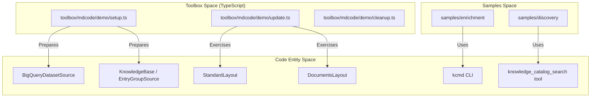
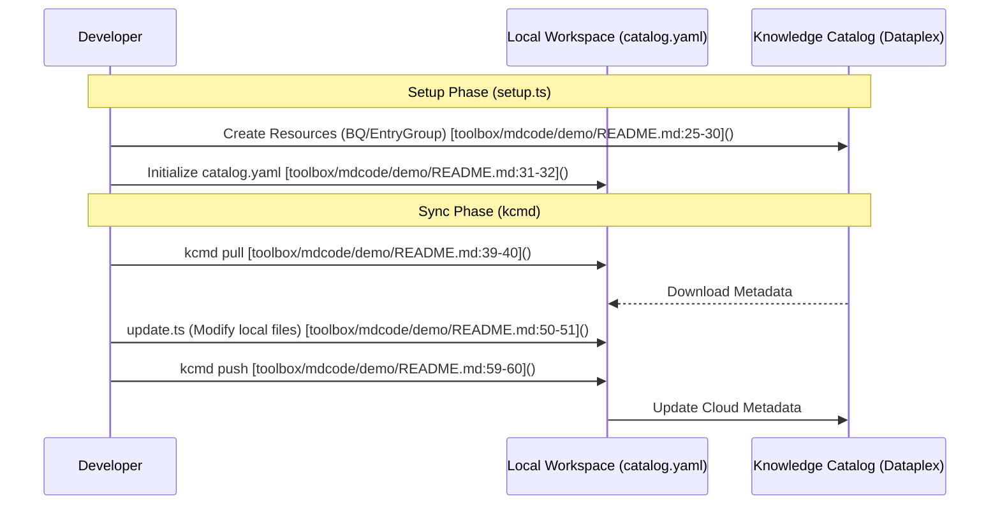

# 샘플 및 데모

관련 소스 파일

다음 파일들은 이 위키 페이지를 생성하기 위한 컨텍스트로 사용되었습니다.

- [samples/enrichment/README.md](samples/enrichment/README.md)
- [toolbox/mdcode/demo/README.md](toolbox/mdcode/demo/README.md)

이 섹션은 Knowledge Catalog 저장소에서 사용할 수 있는 실제 적용 사례, 데모 스크립트, 샘플 워크플로에 대한 개요를 제공합니다. 이러한 리소스는 "Metadata as Code" (MaC) 철학과 보강 에이전트의 기능을 보여주도록 설계되었습니다.

저장소는 이러한 리소스를 네 가지 주요 영역으로 구성합니다.
1.  **Python Enrichment Samples**: Python을 사용한 데이터 자산 보강을 위한 엔드투엔드 워크플로입니다.
2.  **Discovery Agent Sample**: Knowledge Catalog 위의 semantic search 에이전트 구현입니다.
3.  **Toolbox Demos**: TypeScript 기반 `kcmd` 도구를 위한 스크립트화된 시나리오입니다.
4.  **Agent Demos**: 에이전트 통합 메타데이터 관리를 위한 특수 시나리오입니다.

## 저장소 데모 지형

다음 다이어그램은 상위 수준 데모 구성 요소를 각각의 디렉터리 및 이들이 실행하는 핵심 `kcmd` 기능에 매핑합니다.

### 데모에서 코드 엔티티로의 매핑

**출처:** [toolbox/mdcode/demo/README.md:1-172](), [samples/enrichment/README.md:1-90]()

---

## Python Enrichment Sample
`samples/enrichment` 디렉터리에는 agentic 접근 방식으로 Knowledge Catalog 메타데이터를 보강하는 방법을 보여주는 완전한 데모가 포함되어 있습니다 [samples/enrichment/README.md:8-12](). 이 샘플은 BigQuery 데이터 자산에 초점을 맞추며 다단계 워크플로를 사용합니다.

1.  **환경 설정**: GCP 프로젝트와 Python 가상 환경을 구성합니다 [samples/enrichment/README.md:21-45]().
2.  **데이터 생성**: `create_data.py`를 사용해 샘플 BigQuery 데이터셋을 스크립트로 생성합니다 [samples/enrichment/README.md:47-54]().
3.  **수명 주기**: `enrichment.download`, `enrichment.enrich`, `enrichment.publish` 모듈을 실행하여 클라우드와 로컬 YAML 스냅샷 사이에서 메타데이터를 이동합니다 [samples/enrichment/README.md:56-89]().

자세한 내용은 [samples/enrichment: Python Enrichment Sample](#5.1)을 참조하세요.

**출처:** [samples/enrichment/README.md:1-90]()

---

## Knowledge Catalog Discovery Agent
`samples/discovery` 에이전트는 Knowledge Catalog 위에 semantic search 인터페이스를 구축하는 방법을 보여줍니다. 특수한 `knowledge_catalog_search` 도구를 사용해 Entry와 predicate를 쿼리합니다. 이 샘플은 데이터 거버넌스와 카탈로그화된 자산에 대한 자연어 쿼리를 해석하도록 `SKILL.md` 파일로 에이전트를 구성하는 방법을 설명합니다.

자세한 내용은 [samples/discovery: Knowledge Catalog Discovery Agent](#5.2)를 참조하세요.

---

## Toolbox kcmd Demos
`toolbox/mdcode/demo/`에 위치한 이 스크립트들은 `kcmd` CLI 도구의 핵심 기능을 보여줍니다 [toolbox/mdcode/demo/README.md:1-2](). 여러 리소스 유형에 걸쳐 Metadata as Code 워크플로를 테스트할 수 있는 "batteries-included" 방식을 제공합니다.

| Demo Scenario | Key Components Tested | Description |
| :--- | :--- | :--- |
| **BigQuery Dataset** | `StandardLayout`, `BigQueryDatasetSource` | BigQuery 테이블 메타데이터를 로컬 YAML 파일로 동기화합니다 [toolbox/mdcode/demo/README.md:19-22](). |
| **Knowledge Base** | `DocumentsLayout`, `EntryGroupSource` | Dataplex EntryGroups를 Markdown 파일 컬렉션으로 관리합니다 [toolbox/mdcode/demo/README.md:70-73](). |
| **OKF Wiki** | `DocumentsLayout`, `okf/catalog/` | Open Knowledge Format bundle을 Knowledge Catalog에 게시합니다 [toolbox/mdcode/demo/README.md:121-130](). |

### kcmd 데모 워크플로

**출처:** [toolbox/mdcode/demo/README.md:1-172]()

자세한 내용은 [toolbox/mdcode Demos: BigQuery and Knowledge Base](#5.3)를 참조하세요.

---

## Agent mdcode Demos
`agents/mdcode/demo/` 디렉터리에는 메타데이터 도구의 에이전트 통합 빌드와 함께 사용하도록 특별히 맞춘 데모가 포함되어 있습니다. 이러한 데모는 `kcmd` 코어와 보강 에이전트 사이의 상호작용을 강조하며, 종종 에이전트가 업데이트를 자동으로 생성하고 이후 CLI를 통해 푸시하는 방식을 보여줍니다. Python 기반 agent runner 환경을 사용한다는 점에서 toolbox 데모와 다릅니다.

자세한 내용은 [agents/mdcode Demos](#5.4)를 참조하세요.

**출처:** [toolbox/mdcode/demo/README.md:1-172]()
