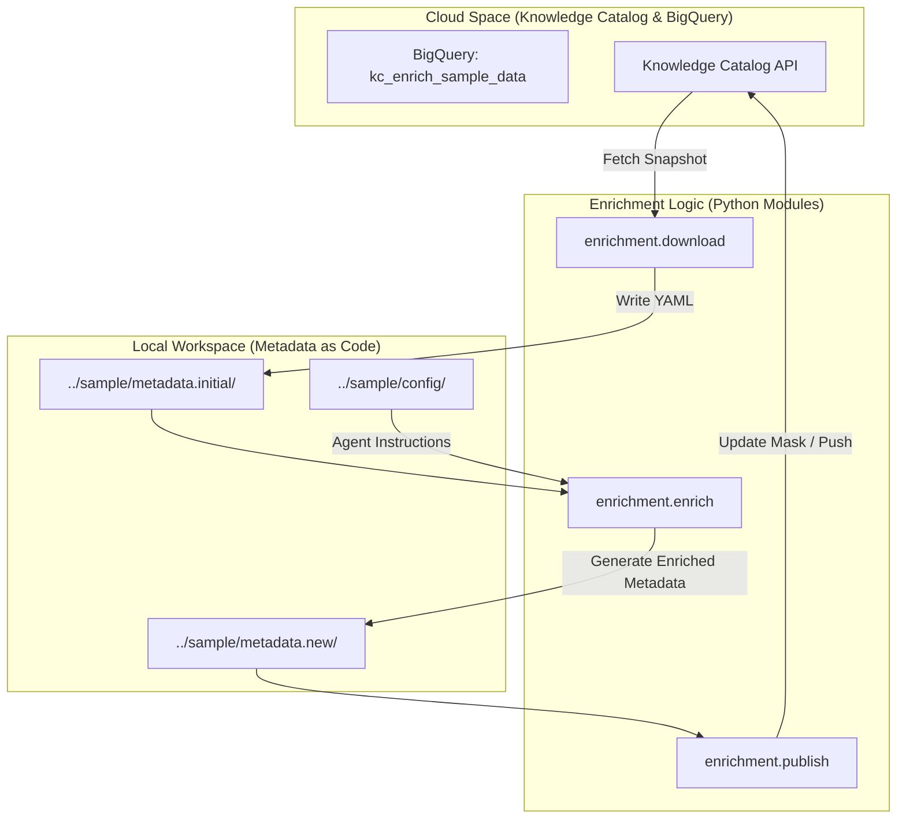
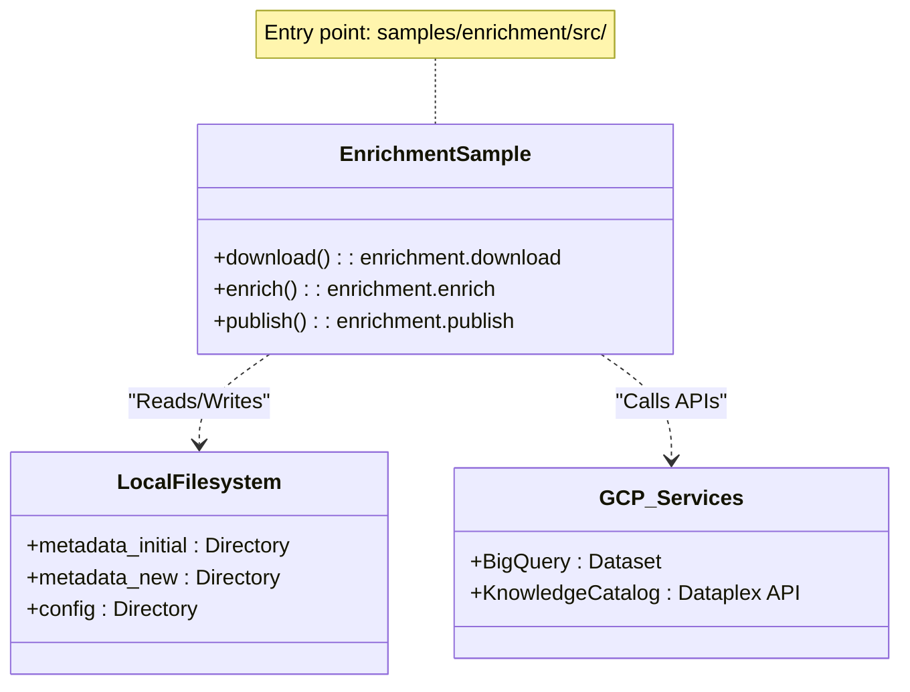

# samples/enrichment: Python Enrichment Sample

관련 소스 파일

다음 파일들은 이 위키 페이지를 생성하기 위한 컨텍스트로 사용되었습니다.

- [samples/enrichment/README.md](samples/enrichment/README.md)

## 개요

**Python Enrichment Sample**은 agentic 워크플로를 사용해 Knowledge Catalog 메타데이터를 보강하는 엔드투엔드 데모를 제공합니다. 외부 정보 소스를 활용해 데이터 자산(예: BigQuery 테이블)에 대한 풍부한 문서를 생성하고, "Metadata as Code" (MaC) 접근 방식을 사용해 해당 문서를 Knowledge Catalog(이전 명칭 Dataplex)에 다시 게시하는 방법을 보여줍니다 [samples/enrichment/README.md:3-12]().

이 샘플은 다단계 파이프라인을 구현합니다.
1.  **환경 설정**: GCP 자격 증명과 Python 가상 환경을 구성합니다.
2.  **데이터 시딩**: 보강 대상으로 사용할 합성 BigQuery 데이터셋을 생성합니다.
3.  **Download**: 현재 메타데이터를 로컬 작업 공간으로 가져옵니다.
4.  **Enrichment**: 사용 가능한 컨텍스트를 기반으로 새 메타데이터를 생성하기 위해 AI 에이전트를 실행합니다.
5.  **Review**: `git diff` 같은 표준 개발자 도구를 사용해 제안된 변경 사항을 검사합니다.
6.  **Publish**: 보강된 로컬 상태를 클라우드 카탈로그로 다시 동기화합니다.

---

## 환경 설정 및 데이터 시딩

보강 워크플로를 실행하기 전에 환경을 인증하고 필요한 Python 의존성을 설치해야 합니다. 이 샘플은 application-default credentials를 위해 `gcloud` CLI에 의존합니다 [samples/enrichment/README.md:31-39]().

### 1. 초기화
샘플은 Python 가상 환경 생성과 필요한 패키지 설치를 자동화하기 위해 helper script `env.sh`를 사용합니다 [samples/enrichment/README.md:41-45]().

### 2. 샘플 데이터 생성
에이전트에 구체적인 대상을 제공하기 위해 샘플에는 데이터 생성 script가 포함되어 있습니다. 이 script는 구성된 프로젝트 안에 `kc_enrich_sample_data`라는 BigQuery 데이터셋을 생성합니다 [samples/enrichment/README.md:47-55]().

**출처:**
- [samples/enrichment/README.md:20-55]()

---

## 보강 워크플로

워크플로는 메타데이터를 다운로드하고, 보강하고, 업로드하는 주기를 따릅니다. 이 프로세스는 메타데이터를 버전 관리 및 리뷰 가능한 로컬 파일 시스템 아티팩트로 취급합니다.

### 데이터 흐름 다이어그램: 보강 수명 주기

다음 다이어그램은 "Natural Language Space"(LLM이 동작하는 곳)에서 "Code/Metadata Space"(카탈로그가 위치한 곳)로의 전환을 보여줍니다.

**출처:**
- [samples/enrichment/README.md:60-89]()

---

## 워크플로 구현 세부 사항

### 1. 메타데이터 다운로드
`enrichment.download` 모듈은 로컬 작업 공간을 초기화합니다. 특정 BigQuery 데이터셋을 대상으로 하며, 현재 메타데이터(Entries 및 Aspects)를 디렉터리 구조로 직렬화합니다 [samples/enrichment/README.md:60-66]().

### 2. 보강 엔진
샘플의 핵심은 `enrichment.enrich` 모듈입니다. 이 모듈은 초기 메타데이터와 구성 디렉터리를 입력으로 받습니다. 구성 디렉터리에는 보통 에이전트가 데이터의 비즈니스 컨텍스트를 이해하는 데 사용하는 사용자 정의 지침과 도구 정의가 포함됩니다 [samples/enrichment/README.md:68-75]().

| Argument | Description |
| :--- | :--- |
| `--dir` | 초기 메타데이터 스냅샷이 포함된 소스 디렉터리입니다. |
| `--output-dir` | 생성된(보강된) 메타데이터의 대상 위치입니다. |
| `--config-dir` | 에이전트 지침, 도구 스키마, skill을 포함합니다. |

### 3. 리뷰 및 Diffing
메타데이터가 로컬 YAML 파일로 저장되므로 사용자는 표준 도구로 에이전트 출력을 검토할 수 있습니다. 샘플은 초기 스냅샷과 보강된 출력을 비교하기 위해 `--no-index` 플래그와 함께 `git diff`를 사용할 것을 권장합니다 [samples/enrichment/README.md:77-82]().

### 4. 게시
변경 사항을 검토한 후 `enrichment.publish` 모듈은 로컬 `metadata.new` 디렉터리를 Knowledge Catalog로 다시 동기화합니다. 이 단계는 update mask를 사용해 incremental update를 수행하는 기반 로직을 사용하여 보강된 필드만 수정되도록 보장합니다 [samples/enrichment/README.md:84-89]().

---

## 시스템 구성 요소 매핑

이 다이어그램은 논리적 단계를 샘플에서 사용되는 특정 Python 모듈과 파일 시스템 위치에 매핑합니다.

**출처:**
- [samples/enrichment/README.md:1-90]()
