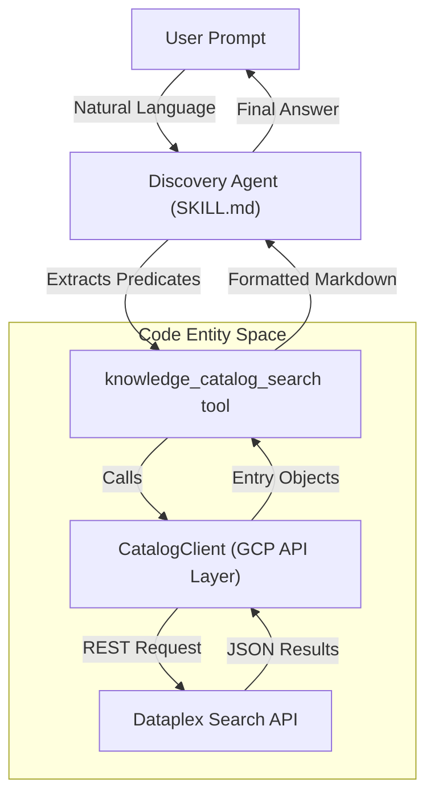
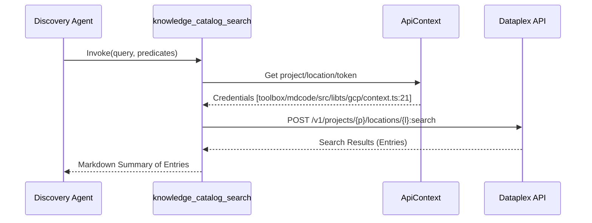

# samples/discovery: Knowledge Catalog Discovery Agent

관련 소스 파일

다음 파일들은 이 위키 페이지를 생성하기 위한 컨텍스트로 사용되었습니다.

- [CODE_OF_CONDUCT.md](CODE_OF_CONDUCT.md)
- [CONTRIBUTING.md](CONTRIBUTING.md)
- [LICENSE.md](LICENSE.md)
- [README.md](README.md)
- [samples/README.md](samples/README.md)
- [toolbox/README.md](toolbox/README.md)
- [toolbox/mdcode/src/libts/gcp/context.ts](toolbox/mdcode/src/libts/gcp/context.ts)
- [toolbox/mdcode/src/libts/tsconfig.json](toolbox/mdcode/src/libts/tsconfig.json)

Discovery Agent는 Knowledge Catalog Search API 위에 검색 및 탐색 인터페이스를 구축하는 방법을 보여주는 샘플 구현입니다 [samples/README.md:8-9](). 사용자는 자연어를 사용해 관리되는 메타데이터에 대해 semantic search 및 predicate 기반 검색을 수행할 수 있습니다.

## 개요 및 목적

Discovery Agent의 주요 목표는 데이터 자산의 "Knowledge Graph"를 탐색하기 위한 대화형 인터페이스를 제공하는 것입니다 [README.md:3-5](). 사용자의 자연어 의도(예: "US region의 marketing과 관련된 모든 테이블 찾기")와 Dataplex/Knowledge Catalog API가 요구하는 구조화된 검색 쿼리 사이의 간극을 연결합니다.

### 주요 기능
*   **Semantic Search**: LLM의 이해 능력을 활용해 사용자 쿼리를 해석합니다.
*   **Predicate Extraction**: 사용자 prompt에서 project ID, location, entry type 같은 filter를 자동으로 식별합니다.
*   **Tool-Based Retrieval**: `CatalogClient`와 연동하기 위해 특수 도구를 사용합니다.

## 시스템 아키텍처

에이전트는 사용자 입력을 처리하고, 검색 parameter를 결정하며, 도구를 통해 검색을 실행하고, 결과를 요약하는 특수 루프로 동작합니다.

### 자연어에서 코드 엔티티 공간으로

다음 다이어그램은 자연어 요청이 시스템 내에서 기술적 검색 작업으로 어떻게 변환되는지 보여줍니다.

**검색 실행 흐름**

출처: [samples/README.md:8-9](), [README.md:3-5](), [toolbox/README.md:3-7]()

## `knowledge_catalog_search` 도구

Discovery Agent 기능의 핵심은 `knowledge_catalog_search` 도구입니다. 이 도구는 LLM과 Knowledge Catalog backend 사이의 인터페이스 역할을 합니다.

### 구현 세부 사항
이 도구는 `CatalogClient`를 사용해 Google Cloud Dataplex 서비스에 대한 검색을 실행합니다. 일반적으로 다음을 지원합니다.
1.  **Query String**: 주요 text search 구성 요소입니다.
2.  **Scope**: 검색을 특정 GCP project 또는 location으로 제한합니다 [toolbox/mdcode/src/libts/gcp/context.ts:11-12]().
3.  **Filters**: 메타데이터 Aspect 또는 시스템 정의 필드를 기반으로 predicate를 적용합니다.

### 검색 데이터 흐름
검색 프로세스는 필요한 인증 및 프로젝트 구성을 제공하기 위해 `ApiContext`에 의존합니다 [toolbox/mdcode/src/libts/gcp/context.ts:10-13]().

**검색 데이터 흐름**

출처: [toolbox/mdcode/src/libts/gcp/context.ts:6-23](), [samples/README.md:8-9]()

## SKILL.md: 에이전트 지침

에이전트의 동작은 `SKILL.md` 파일(이 저장소의 에이전트 표준)에 의해 관리됩니다. 이 파일은 LLM을 위한 system prompt와 지침을 정의합니다.

### Predicate Extraction 로직
`SKILL.md`는 사용자 개념을 Knowledge Catalog predicate에 매핑하는 방법을 LLM에 지시합니다. 예를 들면 다음과 같습니다.
*   **Time-based queries**: "recent"를 특정 date filter에 매핑합니다.
*   **Ownership**: "my tables"를 특정 creator 또는 owner Aspect에 매핑합니다.
*   **Data Quality**: "high quality"를 data quality Aspect의 filter에 매핑합니다.

## 실행 모드

Discovery Agent는 두 가지 주요 방식으로 배포할 수 있습니다.

### 1. Standalone Mode
이 모드에서 에이전트는 전용 검색 assistant로 동작합니다. 사용자는 자산을 찾기 위해 직접 상호작용합니다. **Enrichment Agent**가 보강한 메타데이터가 올바르게 인덱싱되고 검색 가능한지 검증하는 데 자주 사용됩니다 [toolbox/README.md:9-12]().

### 2. Sub-Agent Mode
Discovery Agent는 더 큰 agentic 워크플로(예: "Data Scientist Agent")에 통합될 수 있습니다. 이 시나리오에서는 다음이 이루어집니다.
1.  부모 에이전트가 복잡한 작업을 받습니다(예: "지난 marketing campaign의 영향을 분석").
2.  부모 에이전트가 관련 BigQuery 테이블 또는 문서를 찾기 위해 **Discovery Agent**를 도구로 호출합니다.
3.  Discovery Agent가 메타데이터를 반환하고, 부모 에이전트는 이를 사용해 SQL을 작성하거나 보고서를 생성합니다.

## Metadata as Code (MaC)와의 통합

Discovery Agent의 효과는 `kcmd`를 통해 관리되는 메타데이터 품질과 직접적으로 연결됩니다. `kcmd push`를 사용해 메타데이터가 카탈로그에 푸시되면 Discovery Agent가 이를 찾을 수 있게 됩니다 [toolbox/README.md:5-7]().

| Feature | Description |
| :--- | :--- |
| **Indexing** | `kcmd`는 `catalog.yaml` 구조가 Dataplex에 반영되도록 보장합니다. |
| **Searchability** | 로컬 YAML 파일에 정의된 Aspect 값은 semantic search를 위해 인덱싱됩니다. |
| **Context** | Discovery Agent는 결과 관련성을 개선하기 위해 Enrichment Agent가 제공한 description과 tag를 사용합니다 [samples/README.md:11-14](). |

출처: [toolbox/README.md:5-12](), [samples/README.md:1-15]()
