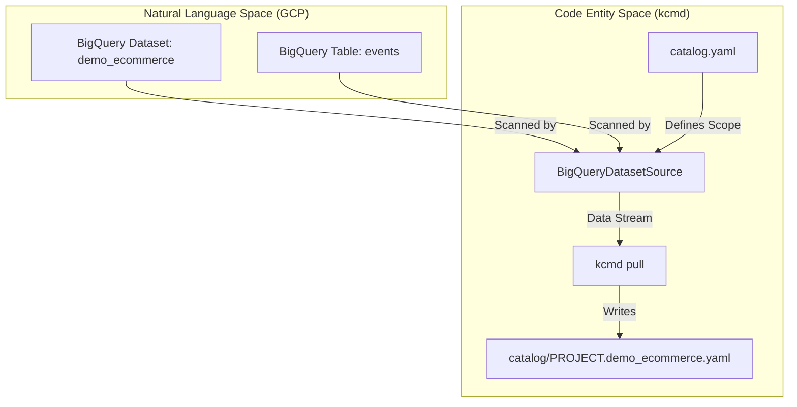
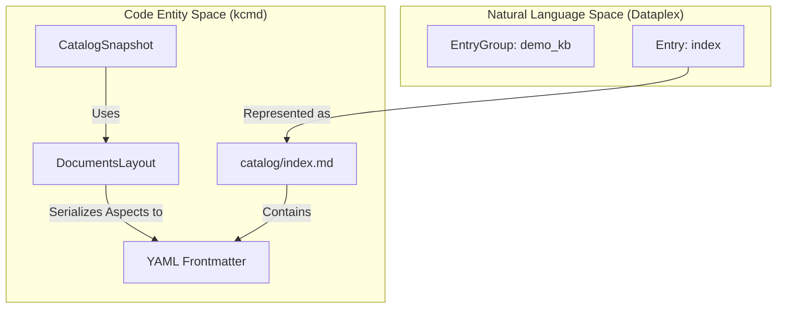

# agents/mdcode Demos

<details>
<summary>관련 소스 파일</summary>

다음 파일들은 이 위키 페이지를 생성하기 위한 컨텍스트로 사용되었습니다.

- [toolbox/mdcode/demo/README.md](toolbox/mdcode/demo/README.md)

</details>


`agents/mdcode/demo/` 디렉터리에는 `kcmd` 라이브러리와 CLI를 사용한 "Metadata as Code" (MaC) 워크플로를 보여주도록 설계된 데모 스크립트가 포함되어 있습니다. 이러한 데모는 Bun runtime을 사용하는 `agents/mdcode` 빌드 환경에 최적화되어 있으며, BigQuery 메타데이터 관리, Knowledge Base(Dataplex EntryGroup) 관리, OKF Wiki 게시 예제를 제공한다는 점에서 `toolbox/mdcode` 데모와 구분됩니다.

## 개요 및 구성

데모는 메타데이터 관리의 전체 수명 주기를 보여줍니다.
1.  **Setup**: GCP 리소스를 provision하고 `catalog.yaml` 매니페스트를 생성합니다 [toolbox/mdcode/demo/README.md:23-32]().
2.  **Pull**: 원격 메타데이터를 로컬 파일 시스템 스냅샷으로 동기화합니다 [toolbox/mdcode/demo/README.md:34-42]().
3.  **Update**: 로컬 메타데이터를 수정합니다(직접 파일 조작 또는 `kcmd` 라이브러리 사용) [toolbox/mdcode/demo/README.md:44-52]().
4.  **Push**: 로컬 변경 사항을 Google Cloud Dataplex로 다시 게시합니다 [toolbox/mdcode/demo/README.md:54-60]().
5.  **Cleanup**: 데모 리소스를 제거합니다 [toolbox/mdcode/demo/README.md:62-68]().

### 사전 요구 사항
이 데모를 실행하려면 BigQuery 및 Dataplex(Knowledge Catalog) API가 활성화된 Google Cloud 프로젝트가 있어야 합니다 [toolbox/mdcode/demo/README.md:3-6]().

```bash
export DEMO_CLOUD_PROJECT=<GCP_PROJECT_ID>
gcloud auth application-default login
gcloud config set project $DEMO_CLOUD_PROJECT
```
출처: [toolbox/mdcode/demo/README.md:3-17]()

---

## BigQuery Dataset 데모

이 데모는 BigQuery 리소스, 특히 데이터셋과 테이블의 메타데이터 관리에 초점을 맞춥니다. 각 BigQuery 엔티티가 YAML 파일로 표현되는 `StandardLayout`을 사용합니다 [toolbox/mdcode/demo/README.md:19-21]().

### 구현 세부 사항
setup 스크립트는 지정된 cloud project에 `demo_ecommerce`라는 BigQuery 데이터셋과 BigQuery 샘플 데이터를 기반으로 한 `events` 테이블을 생성합니다 [toolbox/mdcode/demo/README.md:25-26](). 그런 다음 로컬 카탈로그 스냅샷을 지정하기 위해 `catalog.yaml` 매니페스트를 생성합니다 [toolbox/mdcode/demo/README.md:27]().

### 데이터 흐름: BigQuery 메타데이터에서 코드로
다음 다이어그램은 setup과 `kcmd`가 BigQuery 리소스와 로컬 YAML 표현 사이의 간극을 어떻게 연결하는지 보여줍니다.

**BigQuery에서 YAML 엔티티로의 매핑**

출처: [toolbox/mdcode/demo/README.md:23-42]()

### 작업
*   **Setup**: `bun setup.ts`가 GCP 환경을 초기화합니다 [toolbox/mdcode/demo/README.md:30]().
*   **Update**: `bun update.ts <file>`이 로컬 YAML에 dummy `overview` Aspect를 추가합니다 [toolbox/mdcode/demo/README.md:49-50]().
*   **Cleanup**: `bun cleanup.ts`가 BigQuery 리소스를 삭제합니다 [toolbox/mdcode/demo/README.md:67]().

출처: [toolbox/mdcode/demo/README.md:30-67]()

---

## Knowledge Base 데모

이 데모는 Dataplex Entry가 YAML frontmatter가 포함된 Markdown 파일로 표현되는 `DocumentsLayout`을 보여줍니다. 이는 카탈로그 내에서 관리되는 "Knowledge Bases"에 선호되는 형식입니다 [toolbox/mdcode/demo/README.md:70-72]().

### 구현 세부 사항
Knowledge Base 데모는 `demo_kb`라는 Dataplex `EntryGroup`과 그 안의 문서 Entry 집합을 생성합니다 [toolbox/mdcode/demo/README.md:76]().

### 데이터 흐름: Dataplex Entry에서 Markdown으로
YAML을 직접 수정하는 BigQuery 데모와 달리, Knowledge Base update 스크립트는 `kcmd` 라이브러리를 사용해 `index.md` 파일에 placeholder 업데이트를 생성합니다 [toolbox/mdcode/demo/README.md:96-98]().

**Dataplex Entry에서 Markdown 엔티티로의 매핑**

출처: [toolbox/mdcode/demo/README.md:74-103]()

### 작업
*   **Pull**: 메타데이터가 `catalog/index.md`로 pull됩니다 [toolbox/mdcode/demo/README.md:89-91]().
*   **Update**: `bun update.ts`가 `kcmd` 라이브러리를 사용해 `index` Entry 콘텐츠를 프로그래밍 방식으로 수정합니다 [toolbox/mdcode/demo/README.md:101]().
*   **Cleanup**: `bun cleanup.ts`가 `EntryGroup`을 삭제합니다 [toolbox/mdcode/demo/README.md:118]().

출처: [toolbox/mdcode/demo/README.md:89-118]()

---

## OKF Wiki 데모

이 데모는 `DocumentsLayout`을 통해 Open Knowledge Format (OKF) wiki bundle을 Knowledge Catalog `EntryGroup`에 게시하는 과정을 보여줍니다 [toolbox/mdcode/demo/README.md:121-125]().

### 구현 세부 사항
`okf/catalog/`의 bundle에는 index, reference, 데이터 자산 설명을 포함한 17개의 Markdown 파일로 이루어진 GA4 샘플이 포함되어 있습니다 [toolbox/mdcode/demo/README.md:125-127](). `DocumentsLayout`은 각 `.md` 파일을 파일 경로에서 도출된 이름의 Entry에 매핑합니다(예: `references/metrics/event_count.md`는 `references/metrics/event_count` Entry가 됨) [toolbox/mdcode/demo/README.md:128-129, 145-147]().

### 주요 기능
*   **Overview Aspect**: Markdown 본문은 `dataplex-types.global.overview` Aspect에 저장됩니다 [toolbox/mdcode/demo/README.md:129-130]().
*   **Frontmatter Mapping**: `title`, `description`, `tags` 같은 필드는 YAML frontmatter에서 Dataplex Aspect로 매핑됩니다 [toolbox/mdcode/demo/README.md:157-159]().
*   **Type Fallback**: 유효한 Dataplex type reference가 아닌 frontmatter의 사용자 정의 `type:` 값은 `dataplex-types.global.generic`으로 fallback됩니다 [toolbox/mdcode/demo/README.md:147-149]().

출처: [toolbox/mdcode/demo/README.md:121-172]()

---

## toolbox/mdcode 데모와의 비교

`agents/mdcode`와 `toolbox/mdcode`가 모두 데모 스크립트를 제공하지만, 구현과 runtime에는 중요한 차이가 있습니다.

| Feature | agents/mdcode/demo | toolbox/mdcode/demo |
| :--- | :--- | :--- |
| **Runtime** | Bun | Node.js / TypeScript |
| **Library Reference** | 로컬 빌드에서 `kcmd`를 import | 일반적으로 컴파일된 JS 사용 |
| **Update Logic** | 수동 YAML 편집과 라이브러리 사용의 혼합 | 주로 CLI 상호작용에 초점 |
| **OKF Support** | OKF Wiki bundle 게시 포함 | 표준 카탈로그 작업 |

출처: [toolbox/mdcode/demo/README.md:30-152]()
