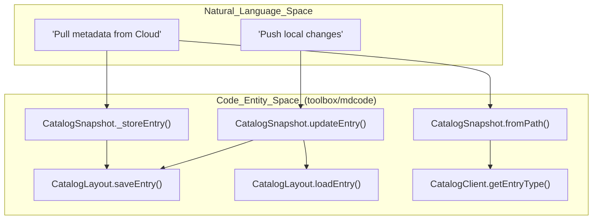
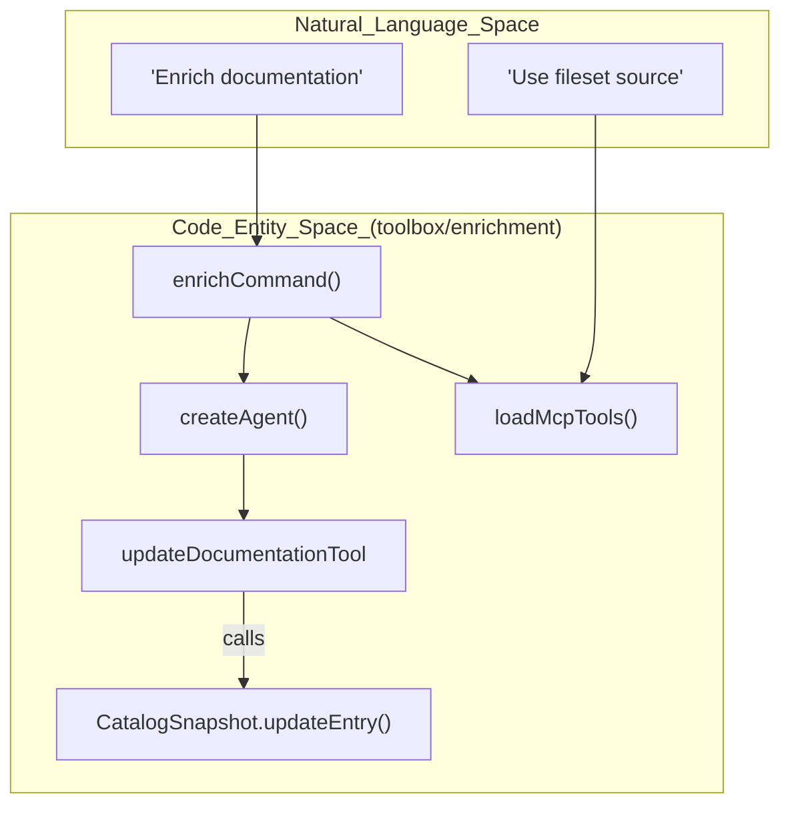

# 용어집

관련 소스 파일

다음 파일들은 이 위키 페이지를 생성하기 위한 컨텍스트로 사용되었습니다.

- [CODE_OF_CONDUCT.md](CODE_OF_CONDUCT.md)
- [CONTRIBUTING.md](CONTRIBUTING.md)
- [LICENSE.md](LICENSE.md)
- [README.md](README.md)
- [okf/README.md](okf/README.md)
- [okf/pyproject.toml](okf/pyproject.toml)
- [toolbox/enrichment/README.md](toolbox/enrichment/README.md)
- [toolbox/enrichment/src/agent/enrich/agent.ts](toolbox/enrichment/src/agent/enrich/agent.ts)
- [toolbox/enrichment/src/agent/enrich/command.ts](toolbox/enrichment/src/agent/enrich/command.ts)
- [toolbox/enrichment/src/agent/tools.ts](toolbox/enrichment/src/agent/tools.ts)
- [toolbox/mdcode/README.md](toolbox/mdcode/README.md)
- [toolbox/mdcode/package-lock.json](toolbox/mdcode/package-lock.json)
- [toolbox/mdcode/package.json](toolbox/mdcode/package.json)
- [toolbox/mdcode/src/libts/snapshot.ts](toolbox/mdcode/src/libts/snapshot.ts)

이 페이지는 Knowledge Catalog 저장소 전반에서 사용되는 코드베이스 고유 용어, 약어, 도메인 개념의 정의를 제공합니다. 엔지니어가 온보딩할 때 개념적 용어와 기반 구현 사이의 매핑을 이해하기 위한 기술 참조 역할을 합니다.

## 핵심 개념

### Metadata as Code (MaC)
소프트웨어 엔지니어링 관행을 사용해 데이터 카탈로그 메타데이터를 관리하는 패러다임입니다. 메타데이터는 소스 코드 아티팩트(YAML 및 Markdown)로 취급되어 데이터 거버넌스를 위한 버전 관리, 동료 리뷰, 자동화된 CI/CD 파이프라인을 가능하게 합니다.
*   **구현:** 주로 `toolbox/mdcode`의 `kcmd` 도구가 관리합니다.
*   **출처:** [toolbox/mdcode/README.md:1-7](), [toolbox/mdcode/README.md:11-15]()

### Knowledge Catalog (Dataplex)
AI 기반 데이터 카탈로그 및 메타데이터 관리 플랫폼을 제공하는 Google Cloud 서비스(이전 명칭 Dataplex)입니다. 구조화 및 비구조화 데이터의 동적 지식 그래프를 제공하여 AI 에이전트에 비즈니스 컨텍스트를 제공합니다.
*   **코드 포인터:** Dataplex API의 래퍼 로직은 `CatalogClient` 클래스에 있습니다.
*   **출처:** [README.md:1-5](), [toolbox/mdcode/src/libts/snapshot.ts:138-138]()

### Open Knowledge Format (OKF)
YAML frontmatter가 포함된 plain markdown 파일로 지식을 표현하기 위한 범용 벤더 중립 형식입니다. 사람이 읽기 쉽고, 버전 관리 가능하며, 서로 다른 에이전트 프레임워크와 카탈로그 간에 이식 가능하도록 설계되었습니다.
*   **구현:** 사양과 참조 에이전트는 `okf/` 디렉터리에 위치합니다.
*   **출처:** [okf/README.md:3-12](), [okf/README.md:39-45]()

---

## 데이터 모델 용어

### Entry
Knowledge Catalog의 기본 메타데이터 단위로, 특정 데이터 자산(예: BigQuery 테이블, 파일 집합, 논리적 "Knowledge Base" 문서)을 나타냅니다.
*   **구현:** TypeScript 라이브러리의 `md.Entry` 인터페이스로 표현됩니다.
*   **출처:** [toolbox/mdcode/src/libts/snapshot.ts:9-9](), [toolbox/mdcode/src/libts/snapshot.ts:60-62]()

### Aspect
**Entry**에 연결되는 모듈식 메타데이터 조각입니다. Aspect는 type을 가지며(예: `overview`, `schema`, `descriptions`), 자산의 메타데이터를 확장할 수 있게 합니다.
*   **구현:** `Entry` 객체 내의 `aspects` 맵에 저장됩니다.
*   **출처:** [toolbox/mdcode/src/libts/snapshot.ts:94-103](), [toolbox/mdcode/README.md:82-92]()

### EntryType / AspectType
Entry와 Aspect의 정의(스키마)입니다. 필요한 필드와 허용되는 필드를 정의합니다.
*   **구현:** `CatalogSnapshot`이 관리하며, 매니페스트 구성에서 초기화하는 동안 이러한 type을 캐시합니다.
*   **출처:** [toolbox/mdcode/src/libts/snapshot.ts:19-20](), [toolbox/mdcode/src/libts/snapshot.ts:135-176]()

---

## 작업 공간 및 동기화

### Catalog Manifest (`catalog.yaml`)
메타데이터 작업 공간의 루트에 있는 구성 파일로, **Scope**, **SnapshotConfig**(추적할 Entry와 Aspect), **PublishingConfig**를 정의합니다.
*   **구현:** `CatalogManifest` 클래스.
*   **출처:** [toolbox/mdcode/src/libts/snapshot.ts:10-10](), [toolbox/mdcode/src/libts/snapshot.ts:38-38](), [toolbox/mdcode/README.md:34-58]()

### Scope
특정 작업 공간이 관리하는 클라우드 리소스를 정의합니다. 일반적으로 리소스 URI 또는 특정 축약 형식(예: `bq-dataset.project.dataset`)으로 작성됩니다.
*   **구현:** `catalog.yaml`에 정의되며 카탈로그 초기화에 사용됩니다.
*   **출처:** [toolbox/mdcode/README.md:37-37](), [toolbox/enrichment/README.md:92-92]()

### Pull
Dataplex 서비스에서 메타데이터를 가져와 로컬 YAML/Markdown 파일로 변환하는 프로세스입니다.
*   **구현:** 동기화 로직(예: `kcmd pull` 명령)이 처리합니다.
*   **출처:** [toolbox/mdcode/README.md:152-156](), [toolbox/mdcode/src/libts/snapshot.ts:180-184]()

### Push
로컬 수정 사항을 가져와 Dataplex 서비스에 다시 게시하는 프로세스입니다.
*   **구현:** 동기화 로직(예: `kcmd push` 명령)이 처리합니다.
*   **출처:** [toolbox/mdcode/README.md:161-166](), [toolbox/mdcode/src/libts/snapshot.ts:186-187]()

---

## 아키텍처 다이어그램

### 자연어에서 코드 엔티티로: 동기화
이 다이어그램은 개념적 동기화 작업이 TypeScript 구현의 특정 클래스 및 메서드와 어떻게 관련되는지 보여줍니다.

Title: Synchronization Data Flow

**출처:** [toolbox/mdcode/src/libts/snapshot.ts:32-44](), [toolbox/mdcode/src/libts/snapshot.ts:68-107](), [toolbox/mdcode/src/libts/snapshot.ts:181-184]()

### 자연어에서 코드 엔티티로: 보강
이 다이어그램은 보강 프로세스가 사용자 prompt와 도구를 메타데이터 업데이트에 어떻게 연결하는지 보여줍니다.

Title: Enrichment Agent Logic

**출처:** [toolbox/enrichment/src/agent/enrich/command.ts:16-113](), [toolbox/enrichment/src/agent/enrich/agent.ts:89-108]()

---

## 기술 용어 표

| Term | Definition | Code Pointer |
| :--- | :--- | :--- |
| **Sidecar File** | 특정 Aspect의 콘텐츠를 포함하며 기본 YAML Entry와 연결되는 Markdown 파일(예: `.overview.md`)입니다. | [toolbox/mdcode/README.md:82-92]() |
| **Ingested Entries** | BigQuery 같은 소스 시스템에서 Dataplex로 자동 동기화되는 메타데이터 Entry입니다. 이러한 Entry는 특정 필드에 대해 보통 읽기 전용입니다. | [toolbox/mdcode/src/libts/snapshot.ts:87-92]() |
| **MCP Server** | AI 에이전트가 `kcmd` 함수(pull, push, lookup)를 도구로 호출할 수 있게 하는 Model Context Protocol 서버입니다. | [toolbox/mdcode/README.md:170-195]() |
| **Skill** | LLM에 지침과 도구 설명을 제공하는 Markdown으로 정의된 상위 수준 에이전트 기능입니다. | [toolbox/enrichment/src/agent/enrich/command.ts:37-37](), [toolbox/enrichment/README.md:129-136]() |
| **Fileset** | 보강을 위한 지식 소스로 사용되는 로컬 Markdown 파일 디렉터리이며, 종종 `md-fileset` MCP 서버를 통해 노출됩니다. | [toolbox/enrichment/README.md:119-124](), [toolbox/enrichment/README.md:157-158]() |
| **ADK** | Agent Development Kit입니다. 보강 에이전트를 구축하고 도구 실행을 관리하는 데 사용되는 라이브러리입니다. | [toolbox/enrichment/src/agent/enrich/command.ts:5-5](), [toolbox/enrichment/src/agent/enrich/agent.ts:4-4]() |

**출처:** [toolbox/mdcode/src/libts/snapshot.ts:87-92](), [toolbox/mdcode/README.md:170-195](), [toolbox/enrichment/src/agent/enrich/command.ts:37-37](), [toolbox/enrichment/README.md:119-124]()
