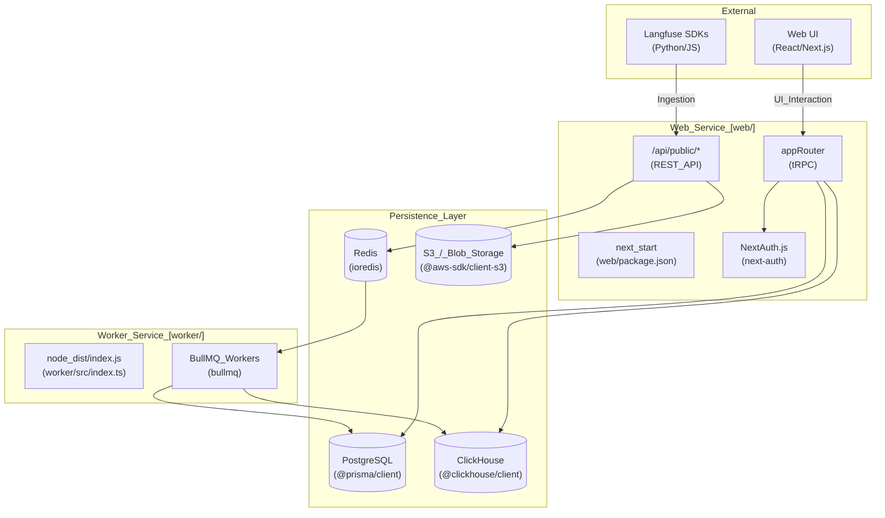
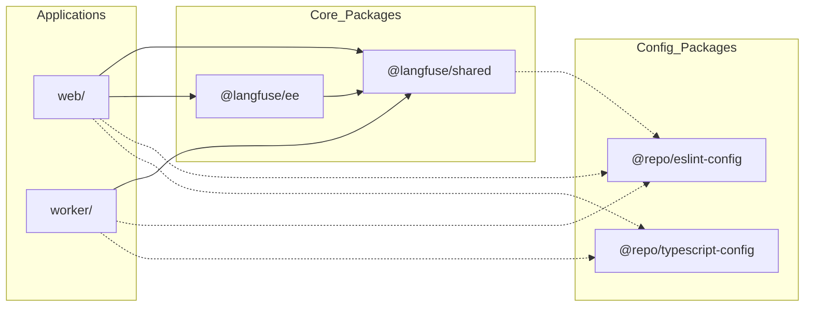

# 개요

관련 소스 파일

다음 파일들은 이 위키 페이지를 생성하기 위한 컨텍스트로 사용되었습니다.

- [.devcontainer/Dockerfile](.devcontainer/Dockerfile)
- [.github/workflows/ci.yml.template](.github/workflows/ci.yml.template)
- [CONTRIBUTING.md](CONTRIBUTING.md)
- [README.cn.md](README.cn.md)
- [README.ja.md](README.ja.md)
- [README.kr.md](README.kr.md)
- [README.md](README.md)
- [ee/package.json](ee/package.json)
- [package.json](package.json)
- [packages/config-eslint/package.json](packages/config-eslint/package.json)
- [packages/shared/package.json](packages/shared/package.json)
- [packages/shared/src/constants/VERSION.ts](packages/shared/src/constants/VERSION.ts)
- [packages/shared/src/features/analytics-integrations/blob-export-gate.ts](packages/shared/src/features/analytics-integrations/blob-export-gate.ts)
- [pnpm-lock.yaml](pnpm-lock.yaml)
- [pnpm-workspace.yaml](pnpm-workspace.yaml)
- [scripts/codex/maintenance.sh](scripts/codex/maintenance.sh)
- [scripts/codex/setup.sh](scripts/codex/setup.sh)
- [turbo.json](turbo.json)
- [web/Dockerfile](web/Dockerfile)
- [web/package.json](web/package.json)
- [web/src/__tests__/server/unit/assertLegacyBlobExportSourceAllowed.servertest.ts](web/src/__tests__/server/unit/assertLegacyBlobExportSourceAllowed.servertest.ts)
- [web/src/components/layouts/routes.tsx](web/src/components/layouts/routes.tsx)
- [web/src/components/nav/book-a-call-button.tsx](web/src/components/nav/book-a-call-button.tsx)
- [web/src/components/nav/sidebar-notifications.clienttest.tsx](web/src/components/nav/sidebar-notifications.clienttest.tsx)
- [web/src/components/nav/sidebar-notifications.tsx](web/src/components/nav/sidebar-notifications.tsx)
- [web/src/constants/VERSION.ts](web/src/constants/VERSION.ts)
- [web/src/features/command-k-menu/CommandMenu.tsx](web/src/features/command-k-menu/CommandMenu.tsx)
- [web/src/features/command-k-menu/CommandMenuProvider.tsx](web/src/features/command-k-menu/CommandMenuProvider.tsx)
- [web/src/features/telemetry/README.md](web/src/features/telemetry/README.md)
- [worker/Dockerfile](worker/Dockerfile)
- [worker/package.json](worker/package.json)
- [worker/src/constants/VERSION.ts](worker/src/constants/VERSION.ts)
- [worker/src/index.ts](worker/src/index.ts)

Langfuse는 팀이 AI 애플리케이션을 공동으로 개발, 모니터링, 평가, 디버깅하도록 돕기 위해 설계된 오픈소스 LLM(Large Language Model) 엔지니어링 플랫폼입니다. LLM 상호작용의 trace 캡처, prompt 관리, 자동 평가(LLM-as-a-judge) 수행, 복잡한 LLM chain 전반의 비용과 지연 시간 추적을 위한 통합 인터페이스를 제공합니다. [README.md:80-98]()

이 문서는 시스템 아키텍처, monorepo 구성, 기술 스택을 소개합니다. 자세한 기술 심층 분석은 다음 하위 페이지를 참조하세요.
- [System Architecture](#1.1) — web/worker 이중 서비스 모델과 데이터 영속성 계층에 대한 세부 정보입니다.
- [Monorepo Structure](#1.2) — `pnpm` workspace, 공유 내부 package, AI agent skills 시스템의 개요입니다.
- [Technology Stack](#1.3) — 핵심 framework와 library의 종합 목록입니다.

---

## 시스템 아키텍처

Langfuse는 두 개의 주요 서비스와, 트랜잭션 및 분석 워크로드를 모두 위해 설계된 특화 데이터 계층을 중심으로 하는 분산 아키텍처를 따릅니다.

1.  **Web Service** (`web/`): 사용자 인터페이스, 내부 tRPC API, SDK ingestion을 위한 public REST API를 처리하는 Next.js 애플리케이션입니다. [web/package.json:2-130]()
2.  **Worker Service** (`worker/`): ingestion 처리, 평가 실행, BullMQ를 사용하는 데이터 유지 관리 job을 포함한 백그라운드 작업을 위한 전용 Node.js 서비스입니다. [worker/package.json:2-50]()

### 상위 수준 아키텍처 다이어그램

이 다이어그램은 시스템 컴포넌트를 각각의 코드 entity 및 데이터 저장소에 매핑합니다.

**출처**: [web/package.json:1-170](), [worker/package.json:1-92](), [packages/shared/package.json:1-122](), [web/Dockerfile:141-171]()

서비스 상호작용과 데이터 흐름에 대한 자세한 내용은 [System Architecture](#1.1)를 참조하세요.

---

## Monorepo 구조

Langfuse는 `pnpm` workspace와 build orchestration을 위한 `turbo`를 사용하는 monorepo로 구성되어 있습니다. 이를 통해 web 서비스와 worker 서비스 전반에서 공유 logic과 type definition을 사용할 수 있습니다. [package.json:100-101](), [package.json:51]()

### Workspace 구성

| Package | Path | Role |
| :--- | :--- | :--- |
| **Web** | `web/` | Next.js frontend 및 API server입니다. [web/package.json:2-3]() |
| **Worker** | `worker/` | BullMQ를 사용하는 백그라운드 작업 processor입니다. [worker/package.json:2-3]() |
| **Shared** | `packages/shared/` | Core logic, Prisma schema, ClickHouse script입니다. [packages/shared/package.json:2-3]() |
| **EE** | `ee/` | Enterprise 기능(예: 고급 SSO, ingestion masking)입니다. [ee/package.json:2-3]() |

### 코드 의존성 다이어그램

이 다이어그램은 workspace 구성원 간의 내부 dependency graph를 보여줍니다.

**출처**: [package.json:1-51](), [web/package.json:51-52](), [worker/package.json:35](), [packages/shared/package.json:1-3](), [pnpm-lock.yaml:52-163]()

공유 package와 `.agents/` AI agent skills 시스템에 대한 자세한 분석은 [Monorepo Structure](#1.2)를 참조하세요.

---

## 기술 스택

Langfuse는 높은 처리량의 데이터 ingestion과 복잡한 분석 query에 최적화된 최신 TypeScript stack을 활용합니다.

### 핵심 기술

*   **Runtime**: Node.js 24 [package.json:8]()
*   **Frontend**: Next.js 16.2.6, React 19.2.4, Tailwind CSS [web/package.json:133-146]()
*   **API**: tRPC(내부), REST(public), Model Context Protocol(MCP) [web/package.json:102-105](), [web/package.json:54]()
*   **Database (Transactional)**: Prisma ORM 6.19.3을 사용하는 PostgreSQL [packages/shared/package.json:104]()
*   **Database (Analytical)**: trace 및 observation 저장을 위한 ClickHouse [packages/shared/package.json:95]()
*   **Queuing**: Redis를 backend로 사용하는 BullMQ 5.76.3 [packages/shared/package.json:114]()
*   **Observability**: OpenTelemetry, Sentry, Datadog(optional) [web/package.json:56-69](), [web/package.json:95]()

**출처**: [web/package.json:30-169](), [worker/package.json:31-69](), [packages/shared/package.json:87-135]()

library와 tool의 전체 목록은 [Technology Stack](#1.3)을 참조하세요.

---

## 버전 정보

Langfuse는 핵심 서비스 전반에서 동기화된 버전을 유지합니다.

*   **Current Version**: `v3.175.0` [web/src/constants/VERSION.ts:1](), [worker/src/constants/VERSION.ts:1]()
*   **Release Tooling**: `release-it`은 versioning과 GitHub release를 관리하는 데 사용되며, `packages/shared`, `web`, `worker` 전반의 파일을 업데이트합니다. [package.json:53-95]()

**출처**: [package.json:3](), [web/src/constants/VERSION.ts:1](), [worker/src/constants/VERSION.ts:1]()
