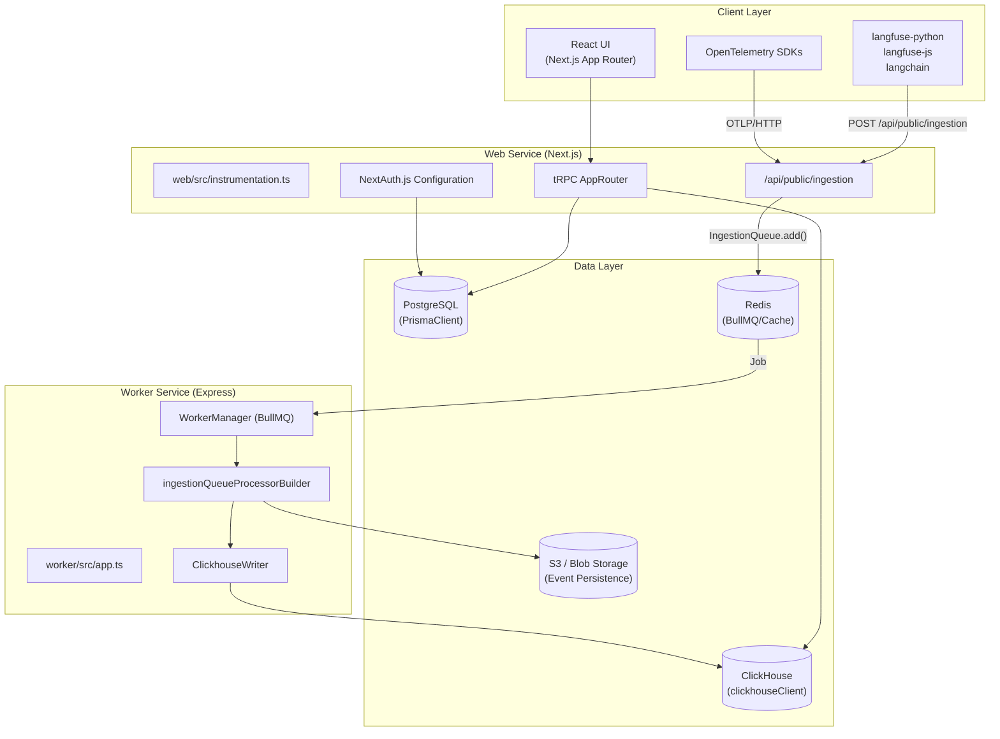
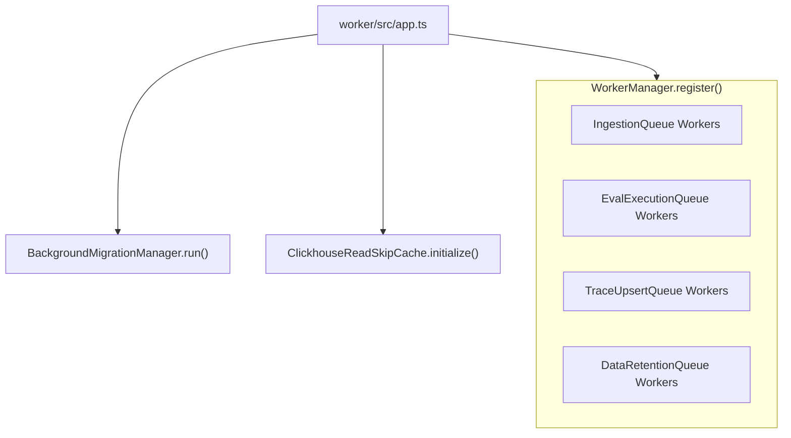

# 시스템 아키텍처

관련 소스 파일

다음 파일들은 이 위키 페이지를 생성하기 위한 컨텍스트로 사용되었습니다.

- [.env.dev-azure.example](.env.dev-azure.example)
- [.env.dev-redis-cluster.example](.env.dev-redis-cluster.example)
- [.env.dev.example](.env.dev.example)
- [.env.prod.example](.env.prod.example)
- [.vscode/launch.json](.vscode/launch.json)
- [docker-compose.build.yml](docker-compose.build.yml)
- [docker-compose.dev-azure.yml](docker-compose.dev-azure.yml)
- [docker-compose.dev-redis-cluster.yml](docker-compose.dev-redis-cluster.yml)
- [docker-compose.dev.yml](docker-compose.dev.yml)
- [docker-compose.yml](docker-compose.yml)
- [packages/shared/src/env.ts](packages/shared/src/env.ts)
- [packages/shared/src/server/auth/jumpcloudProvider.ts](packages/shared/src/server/auth/jumpcloudProvider.ts)
- [packages/shared/src/server/index.ts](packages/shared/src/server/index.ts)
- [packages/shared/src/server/queues.ts](packages/shared/src/server/queues.ts)
- [packages/shared/src/server/redis/getQueue.ts](packages/shared/src/server/redis/getQueue.ts)
- [web/src/components/layouts/app-layout/utils/pathClassification.ts](web/src/components/layouts/app-layout/utils/pathClassification.ts)
- [web/src/ee/features/multi-tenant-sso/types.ts](web/src/ee/features/multi-tenant-sso/types.ts)
- [web/src/ee/features/multi-tenant-sso/utils.ts](web/src/ee/features/multi-tenant-sso/utils.ts)
- [web/src/env.mjs](web/src/env.mjs)
- [web/src/features/auth-credentials/components/ResetPasswordButton.tsx](web/src/features/auth-credentials/components/ResetPasswordButton.tsx)
- [web/src/features/auth-credentials/components/ResetPasswordPage.tsx](web/src/features/auth-credentials/components/ResetPasswordPage.tsx)
- [web/src/features/auth-credentials/lib/credentialsUtils.ts](web/src/features/auth-credentials/lib/credentialsUtils.ts)
- [web/src/features/auth-credentials/server/signupApiHandler.ts](web/src/features/auth-credentials/server/signupApiHandler.ts)
- [web/src/features/posthog-analytics/usePostHogClientCapture.ts](web/src/features/posthog-analytics/usePostHogClientCapture.ts)
- [web/src/pages/api/admin/bullmq/index.ts](web/src/pages/api/admin/bullmq/index.ts)
- [web/src/pages/api/auth/signup-verify.ts](web/src/pages/api/auth/signup-verify.ts)
- [web/src/pages/auth/setup-password.tsx](web/src/pages/auth/setup-password.tsx)
- [web/src/pages/auth/sign-in.tsx](web/src/pages/auth/sign-in.tsx)
- [web/src/pages/auth/sign-up.tsx](web/src/pages/auth/sign-up.tsx)
- [web/src/server/auth.ts](web/src/server/auth.ts)
- [web/types/next-auth.d.ts](web/types/next-auth.d.ts)
- [worker/src/app.ts](worker/src/app.ts)
- [worker/src/env.ts](worker/src/env.ts)
- [worker/src/features/tokenisation/usage.ts](worker/src/features/tokenisation/usage.ts)
- [worker/src/queues/ingestionQueue.ts](worker/src/queues/ingestionQueue.ts)
- [worker/src/queues/workerManager.ts](worker/src/queues/workerManager.ts)
- [worker/src/utils/shutdown.ts](worker/src/utils/shutdown.ts)

이 문서는 Langfuse의 전체 시스템 아키텍처를 설명하며, 핵심 서비스, 데이터 계층, 통신 패턴, 배포 아키텍처를 포함합니다.

## 아키텍처 개요

Langfuse는 동기식 사용자 대면 작업과 집약적인 비동기 처리를 분리하는 **이중 서비스 monorepo 아키텍처**를 구현합니다. **Web Service**(`web/`)는 React UI와 API ingestion을 처리하는 Next.js 애플리케이션이고, **Worker Service**(`worker/`)는 BullMQ를 통한 백그라운드 job 처리 전용 Express 기반 서비스입니다. 두 서비스 모두 `packages/shared/`의 공유 core logic 계층을 활용합니다.

**상위 수준 시스템 다이어그램**

**주요 아키텍처 결정:**

| 결정 | 근거 | 구현 |
|----------|-----------|----------------|
| **서비스 분리** | 리소스를 많이 사용하는 백그라운드 작업(eval, trace reconstruction)을 사용자 요청으로부터 격리합니다. | `web/` 및 `worker/` 서비스 [worker/src/app.ts:96-107]() |
| **공유 Package** | DB schema, 환경 검증, core logic을 중앙화합니다. | `@langfuse/shared` workspace [packages/shared/package.json:2-3]() |
| **이중 Database** | 관계형 metadata에는 PostgreSQL을, 높은 처리량의 OLAP tracing 데이터에는 ClickHouse를 사용합니다. | Prisma + ClickHouse Client [packages/shared/src/env.ts:81-87]() |
| **S3 우선 Ingestion** | 처리 전 raw event의 내구성을 보장하고 replay를 가능하게 합니다. | `LANGFUSE_S3_EVENT_UPLOAD_BUCKET` 사용 [worker/src/env.ts:41-43]() |
| **Queue Sharding** | BullMQ queue를 sharding하여 worker의 horizontal scaling을 가능하게 합니다. | `LANGFUSE_INGESTION_QUEUE_SHARD_COUNT` [packages/shared/src/env.ts:129]() |

**출처:**
- [worker/src/app.ts:96-107]()
- [packages/shared/src/env.ts:1-174]()
- [worker/src/env.ts:41-43]()

## 핵심 서비스

### Web Service

Web Service는 frontend UI, 인증, tracing 데이터의 초기 ingestion을 처리합니다. Next.js [web/package.json:133]()로 구축되었으며 client와 server 간 type-safe 통신을 위해 `tRPC`를 사용합니다 [web/package.json:102-105](). NextAuth.js를 통해 복잡한 인증 흐름을 관리하며, Google, GitHub, enterprise SSO 같은 여러 provider를 지원합니다 [web/src/server/auth.ts:24-38]().

**Web Runtime 컴포넌트:**

| Component | Code Entity | Purpose |
|-----------|-------------|---------|
| **API Ingestion** | `/api/public/ingestion` | SDK에서 tracing 데이터를 수신하기 위한 높은 처리량의 endpoint입니다. |
| **Internal API** | `tRPC AppRouter` | React frontend를 위한 type-safe backend입니다. |
| **Auth System** | `NextAuth.js` | 사용자 인증과 multi-tenant project access를 처리합니다 [web/src/server/auth.ts:101-159](). |
| **Instrumentation** | `dd-trace` / `OpenTelemetry` | web service 자체에 대한 observability입니다 [web/package.json:118](). |

### Worker Service

Worker Service는 queue consumer를 초기화하는 장기 실행 Express process입니다 [worker/src/app.ts:96](). LLM cost 계산, automated evaluation 실행, event를 ClickHouse로 전파하는 등의 복잡한 logic을 처리합니다.

**서비스 초기화 흐름**

**핵심 서비스 컴포넌트:**

| Component | Code Entity | Purpose |
|-----------|-------------|---------|
| **Worker Manager** | `WorkerManager` | 표준화된 metric을 갖춘 BullMQ worker의 중앙 registry입니다 [worker/src/app.ts:24]() |
| **Background Migrations** | `BackgroundMigrationManager` | main process를 차단하지 않고 장기 실행 data migration을 관리합니다 [worker/src/app.ts:112-117]() |
| **Clickhouse Cache** | `ClickhouseReadSkipCache` | ingestion 중 중복 ClickHouse read를 건너뛰기 위해 project metadata를 cache합니다 [worker/src/app.ts:120-124]() |
| **Queue Sharding** | `TraceUpsertQueue.getShardNames()` | 구성된 모든 queue shard에 대해 worker를 동적으로 등록합니다 [worker/src/app.ts:128-137]() |

**출처:**
- [worker/src/app.ts:1-197]()
- [worker/package.json:50-68]()
- [worker/src/env.ts:111-145]()

## 데이터 계층

Langfuse는 트랜잭션 무결성과 분석 성능의 균형을 맞추기 위해 특화된 stack을 활용합니다.

### PostgreSQL (Metadata)
PostgreSQL은 모든 관계형 데이터의 source of truth 역할을 합니다.
- **ORM:** Prisma [packages/shared/package.json:104]().
- **Entities:** Organization, Project, User, API Key, Dataset item, Prompt version.
- **Environment:** `DATABASE_URL`을 통해 구성됩니다 [worker/src/env.ts:9]().

### ClickHouse (Analytics & Traces)
ClickHouse는 대용량 observability 데이터의 primary store입니다.
- **Connectivity:** `CLICKHOUSE_URL` 및 credential을 통해 관리됩니다 [packages/shared/src/env.ts:81-87]().
- **Optimization:** 높은 write pressure를 처리하기 위한 `ASYNC_INSERT` 설정을 지원합니다 [packages/shared/src/env.ts:91-97]().
- **Deletion:** 데이터 관리를 위해 lightweight delete를 구현합니다 [packages/shared/src/env.ts:98-101]().

### Redis (Queues & Caching)
Redis는 서비스 조정을 위한 backbone 역할을 합니다.
- **BullMQ:** `ioredis`를 통해 모든 job state와 concurrency를 관리합니다 [packages/shared/src/env.ts:20-57]().
- **Key Prefixing:** `REDIS_KEY_PREFIX`를 통해 multi-tenant Redis를 지원합니다 [packages/shared/src/env.ts:32]().
- **Availability:** Redis Cluster 및 Sentinel mode를 지원합니다 [packages/shared/src/env.ts:46-57]().

### S3 / Blob Storage (Durability)
Langfuse는 다음 용도로 blob storage(AWS S3, Azure Blob 또는 Google Cloud Storage)를 사용합니다.
- **Event Persistence:** Raw ingestion batch는 처리 전에 S3에 저장됩니다 [worker/src/env.ts:41-43]().
- **Batch Exports:** 대용량 CSV/JSONL export는 사용자 download를 위해 이곳에 staging됩니다 [worker/src/env.ts:27-32]().
- **Storage Strategy:** Minio 호환성을 위해 AWS KMS SSE와 forced path style을 지원합니다 [worker/src/env.ts:49-53]().

**출처:**
- [packages/shared/src/env.ts:20-163]()
- [worker/src/env.ts:9-110]()
- [packages/shared/src/server/index.ts:1-132]()

## 통신 및 Ingestion Pipeline

### Ingestion 흐름
1. **수신:** Web service가 `/api/public/ingestion`에서 POST request를 수신합니다.
2. **인증:** `ApiAuthService`가 PostgreSQL을 기준으로 `Basic` 또는 `Bearer` auth header를 검증합니다.
3. **내구성:** Raw payload가 `StorageService`를 통해 S3에 업로드됩니다 [packages/shared/src/server/index.ts:1]().
4. **Queueing:** `IngestionEvent` schema를 사용해 job이 `IngestionQueue`에 추가됩니다 [packages/shared/src/server/queues.ts:14-28]().
5. **처리:** Worker가 `ingestionQueueProcessorBuilder`를 사용해 job을 가져오고 데이터를 ClickHouse로 전파합니다 [worker/src/app.ts:48]().

### Queue 정의
시스템은 백그라운드 작업을 관리하기 위해 다양한 queue를 사용합니다.

| Queue Name | Code Entity | Purpose |
|------------|-------------|---------|
| **Ingestion** | `IngestionQueue` | raw tracing event를 ClickHouse로 처리합니다 [worker/src/app.ts:35]() |
| **OTel Ingestion** | `OtelIngestionQueue` | OpenTelemetry 형식의 span을 전용으로 처리합니다 [worker/src/app.ts:37]() |
| **Eval Execution** | `EvalExecutionQueue` | LLM-as-judge 또는 programmatic evaluation을 실행합니다 [worker/src/app.ts:43]() |
| **Trace Upsert** | `TraceUpsertQueue` | trace metadata에 대한 비동기 update를 처리합니다 [worker/src/app.ts:39]() |
| **Cloud Metering** | `CloudUsageMeteringQueue` | Langfuse Cloud의 billing을 위한 usage를 추적합니다 [worker/src/app.ts:41]() |

**출처:**
- [worker/src/app.ts:25-81]()
- [packages/shared/src/server/index.ts:59-93]()
- [packages/shared/src/env.ts:125-159]()
- [packages/shared/src/server/queues.ts:14-107]()
