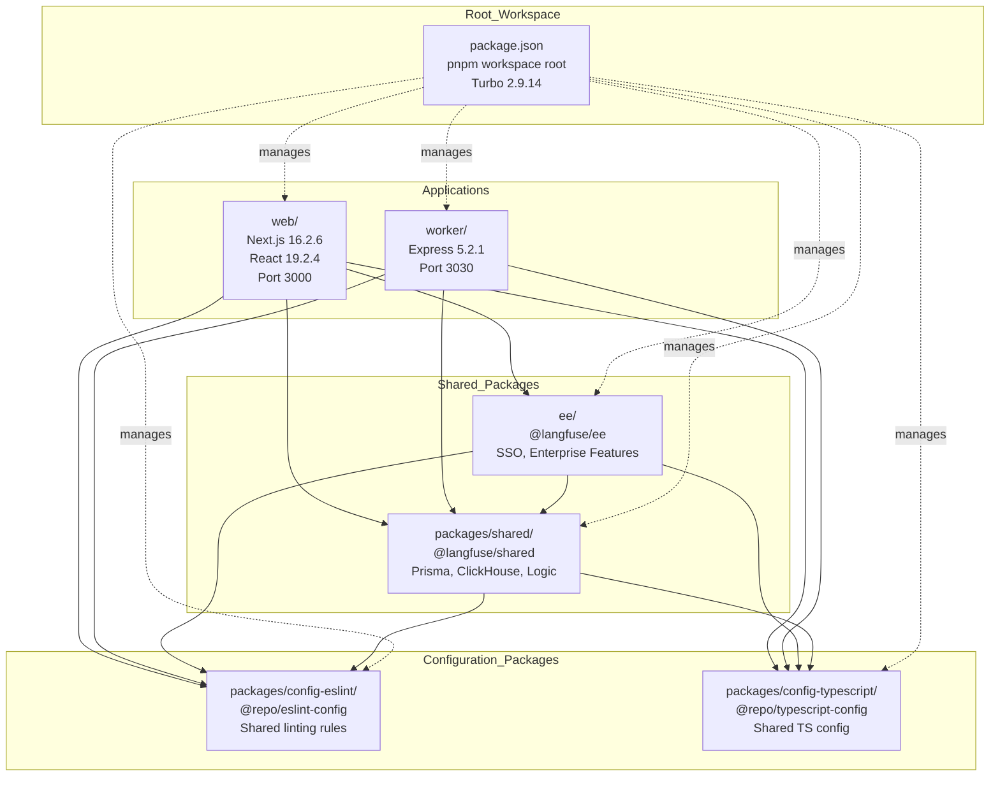
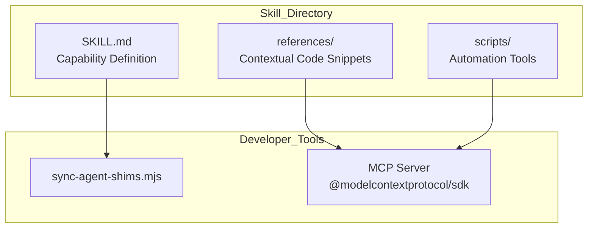
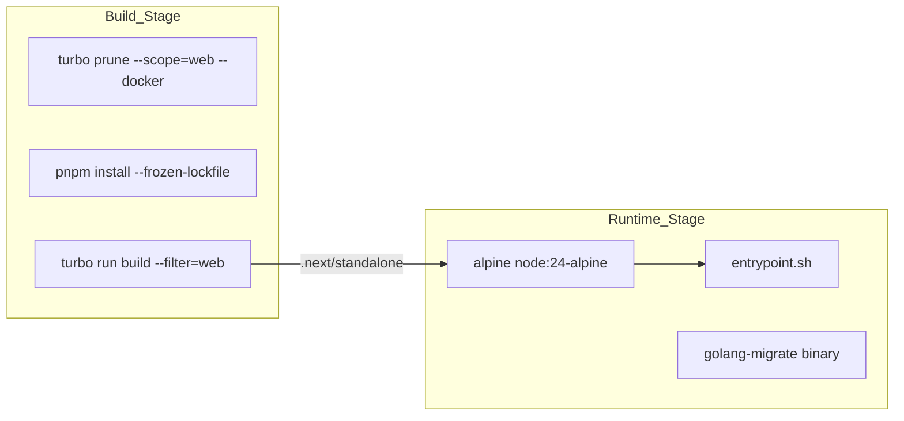

# Monorepo 구조

관련 소스 파일

다음 파일들은 이 위키 페이지를 생성하기 위한 컨텍스트로 사용되었습니다.

- [.agents/AGENTS.md](.agents/AGENTS.md)
- [.agents/README.md](.agents/README.md)
- [.agents/skills/README.md](.agents/skills/README.md)
- [.agents/skills/agent-setup-maintenance/SKILL.md](.agents/skills/agent-setup-maintenance/SKILL.md)
- [.agents/skills/backend-dev-guidelines/AGENTS.md](.agents/skills/backend-dev-guidelines/AGENTS.md)
- [.agents/skills/backend-dev-guidelines/SKILL.md](.agents/skills/backend-dev-guidelines/SKILL.md)
- [.agents/skills/backend-dev-guidelines/references/architecture-overview.md](.agents/skills/backend-dev-guidelines/references/architecture-overview.md)
- [.agents/skills/backend-dev-guidelines/references/services-and-repositories.md](.agents/skills/backend-dev-guidelines/references/services-and-repositories.md)
- [.agents/skills/backend-dev-guidelines/references/testing-guide.md](.agents/skills/backend-dev-guidelines/references/testing-guide.md)
- [.agents/skills/skill-creator/SKILL.md](.agents/skills/skill-creator/SKILL.md)
- [.agents/skills/skill-creator/agents/openai.yaml](.agents/skills/skill-creator/agents/openai.yaml)
- [.agents/skills/skill-creator/assets/skill-creator-small.svg](.agents/skills/skill-creator/assets/skill-creator-small.svg)
- [.agents/skills/skill-creator/assets/skill-creator.png](.agents/skills/skill-creator/assets/skill-creator.png)
- [.agents/skills/skill-creator/license.txt](.agents/skills/skill-creator/license.txt)
- [.agents/skills/skill-creator/references/openai_yaml.md](.agents/skills/skill-creator/references/openai_yaml.md)
- [.agents/skills/skill-creator/scripts/generate_openai_yaml.py](.agents/skills/skill-creator/scripts/generate_openai_yaml.py)
- [.devcontainer/Dockerfile](.devcontainer/Dockerfile)
- [.github/workflows/ci.yml.template](.github/workflows/ci.yml.template)
- [AGENTS.md](AGENTS.md)
- [CONTRIBUTING.md](CONTRIBUTING.md)
- [ee/package.json](ee/package.json)
- [package.json](package.json)
- [packages/config-eslint/package.json](packages/config-eslint/package.json)
- [packages/shared/package.json](packages/shared/package.json)
- [packages/shared/src/constants/VERSION.ts](packages/shared/src/constants/VERSION.ts)
- [packages/shared/src/features/analytics-integrations/blob-export-gate.ts](packages/shared/src/features/analytics-integrations/blob-export-gate.ts)
- [pnpm-lock.yaml](pnpm-lock.yaml)
- [pnpm-workspace.yaml](pnpm-workspace.yaml)
- [scripts/codex/maintenance.sh](scripts/codex/maintenance.sh)
- [scripts/codex/setup.sh](scripts/codex/setup.sh)
- [scripts/postinstall.sh](scripts/postinstall.sh)
- [turbo.json](turbo.json)
- [web/AGENTS.md](web/AGENTS.md)
- [web/Dockerfile](web/Dockerfile)
- [web/package.json](web/package.json)
- [web/src/__tests__/server/unit/assertLegacyBlobExportSourceAllowed.servertest.ts](web/src/__tests__/server/unit/assertLegacyBlobExportSourceAllowed.servertest.ts)
- [web/src/constants/VERSION.ts](web/src/constants/VERSION.ts)
- [web/src/pages/api/public/annotation-queues/[queueId]/index.ts](web/src/pages/api/public/annotation-queues/[queueId]/index.ts)
- [web/src/pages/api/public/datasets/index.ts](web/src/pages/api/public/datasets/index.ts)
- [web/src/pages/project/[projectId]/annotation-queues/index.tsx](web/src/pages/project/[projectId]/annotation-queues/index.tsx)
- [web/src/pages/project/[projectId]/datasets/[datasetId]/items/index.tsx](web/src/pages/project/[projectId]/datasets/[datasetId]/items/index.tsx)
- [web/src/pages/project/[projectId]/datasets/index.tsx](web/src/pages/project/[projectId]/datasets/index.tsx)
- [web/src/pages/project/[projectId]/experiments/index.tsx](web/src/pages/project/[projectId]/experiments/index.tsx)
- [web/src/pages/project/[projectId]/observations/index.tsx](web/src/pages/project/[projectId]/observations/index.tsx)
- [web/src/pages/project/[projectId]/sessions/index.tsx](web/src/pages/project/[projectId]/sessions/index.tsx)
- [worker/Dockerfile](worker/Dockerfile)
- [worker/package.json](worker/package.json)
- [worker/src/constants/VERSION.ts](worker/src/constants/VERSION.ts)
- [worker/src/index.ts](worker/src/index.ts)

이 문서는 Langfuse codebase의 pnpm workspace 기반 monorepo 구조를 설명하며, application 구성, 공유 package, configuration package, dependency management, 그리고 developer tooling을 위한 `.agents/` AI agent skills 시스템을 포함합니다. 전체 시스템 아키텍처와 이러한 component가 runtime에 어떻게 상호작용하는지에 대한 정보는 [System Architecture]()를 참조하세요.

## Workspace 구성

Langfuse repository는 build orchestration을 위해 Turborepo로 관리되는 pnpm workspace monorepo로 구성되어 있습니다. 이 workspace에는 두 개의 주요 배포 가능 application(`web` 및 `worker`)과 공통 기능 및 구성을 제공하는 여러 공유 package가 포함됩니다.

### Workspace 구조

다음 다이어그램은 workspace 구성원 간의 dependency flow와 root configuration의 중심 역할을 보여줍니다.

Title: Langfuse Monorepo Dependency Graph

출처: [package.json:1-52](), [pnpm-lock.yaml:26-132](), [web/package.json:1-169](), [worker/package.json:1-91](), [packages/shared/package.json:1-157](), [CONTRIBUTING.md:97-108]()

### Workspace 정의

monorepo는 root `package.json`에 구성된 pnpm workspace를 사용해 정의됩니다. workspace는 package manager로 pnpm version 11.1.3을 사용하고 build orchestration에는 Turbo 2.9.14를 사용합니다.

| Workspace Member | Location | Package Name | Purpose |
|-----------------|----------|--------------|---------|
| Web Application | `web/` | `web` (private) | Next.js frontend 및 API route [web/package.json:2-4]() |
| Worker Service | `worker/` | `worker` (private) | Express background job processor [worker/package.json:2-6]() |
| Shared Package | `packages/shared/` | `@langfuse/shared` | Prisma schema, ClickHouse script, business logic [packages/shared/package.json:2-5]() |
| Enterprise Package | `ee/` | `@langfuse/ee` | SSO 및 enterprise-only 기능 [ee/package.json:1-3]() |
| ESLint Config | `packages/config-eslint/` | `@repo/eslint-config` | 공유 linting configuration [packages/config-eslint/package.json:1-3]() |
| TypeScript Config | `packages/config-typescript/` | `@repo/typescript-config` | 공유 TypeScript compiler option [packages/config-typescript/package.json:1-3]() |

출처: [package.json:51-101](), [pnpm-lock.yaml:26-132](), [CONTRIBUTING.md:97-108]()

## Applications

### Web Application (`web/`)

web application은 Next.js 16.2.6과 React 19.2.4로 구축되었습니다. UI와 public ingestion API의 주요 entry point 역할을 합니다.

**주요 Dependencies:**
- `@langfuse/shared`: 핵심 business logic 및 database access [web/package.json:52]()
- `@langfuse/ee`: Enterprise 기능 [web/package.json:51]()
- `next`: Framework [web/package.json:133]()
- `prisma`: Database ORM [web/package.json:141]()
- `bullmq`: Queue management [web/package.json:109]()
- `@modelcontextprotocol/sdk`: AI agent connectivity를 위한 MCP server implementation [web/package.json:54]()

출처: [web/package.json:1-169](), [CONTRIBUTING.md:45-52]()

### Worker Service (`worker/`)

worker service는 BullMQ queue의 background job을 처리하는 Express 5.2.1 application입니다.

**주요 Dependencies:**
- `@langfuse/shared`: 공유 business logic [worker/package.json:35]()
- `express`: health check 및 metric을 위한 HTTP server [worker/package.json:57]()
- `bullmq`: Queue processing [worker/package.json:50]()

**Build Configuration:**
- `tsc`를 통한 TypeScript compilation [worker/package.json:20]()
- Entrypoint: `dist/index.js` [worker/package.json:19]()

출처: [worker/package.json:1-91]()

## 공유 Package

### @langfuse/shared

database schema와 공유 server-side utility를 포함하는 core logic 계층입니다. `web`과 `worker` 모두에서 사용되는 data model의 "Single Source of Truth" 역할을 합니다.

**Package Exports:**
- `.`: Main entry [packages/shared/package.json:18-21]()
- `./src/db`: Prisma client 및 DB utility [packages/shared/package.json:22-25]()
- `./src/env`: Environment variable validation [packages/shared/package.json:26-29]()
- `./src/server`: Server-side logic [packages/shared/package.json:30-33]()
- `./encryption`: Encryption utility [packages/shared/package.json:42-45]()
- `./src/server/ee/ingestionMasking`: Enterprise masking logic [packages/shared/package.json:46-49]()

**Database Management:**
- Prisma schema 및 migration [packages/shared/package.json:67-73]()
- ClickHouse script(`ch:up`, `ch:reset`, `ch:dev-tables`) [packages/shared/package.json:76-80]()

출처: [packages/shared/package.json:1-157]()

### @langfuse/ee

SSO 및 advanced billing 같은 enterprise edition 기능을 포함합니다. `@langfuse/shared`에 의존하며 workspace protocol을 통해 link됩니다.

출처: [pnpm-lock.yaml:51-55](), [CONTRIBUTING.md:107](), [ee/package.json:29]()

## AI Agent Skills 시스템 (`.agents/`)

repository에는 developer tooling과 automation을 위해 설계된 AI agent skills 시스템을 담는 전용 `.agents/` directory가 포함되어 있습니다. 이 시스템은 AI assistant(Claude 또는 OpenAI 기반 agent 등)가 표준화된 instruction과 script를 사용해 복잡한 repository task를 수행할 수 있게 합니다.

### Skill Architecture
각 skill은 `.agents/skills/` 아래의 자체 directory에 포함되며 documentation(`SKILL.md`)과 implementation reference를 포함합니다. 

Title: AI Agent Skill Architecture

출처: [package.json:11-12](), [CONTRIBUTING.md:160-165](), [web/package.json:54]()

### Agent Tooling Integration
repository는 agent "shim"과 configuration을 sync하는 script를 제공합니다.
- `pnpm run agents:sync`: agent tool을 동기화하기 위해 `node scripts/agents/sync-agent-shims.mjs`를 실행합니다 [package.json:12]().
- `pnpm run agents:check`: agent shim의 상태를 확인합니다 [package.json:11]().

출처: [package.json:11-12](), [CONTRIBUTING.md:160-165]()

## Dependency Management

### pnpm Workspace Configuration

monorepo는 내부 dependency를 위한 workspace protocol과 security patch 및 일관성을 위한 dependency override를 포함해 pnpm 11.1.3을 사용합니다.

**Dependency Overrides:**
root `pnpm-lock.yaml`과 `package.json`은 모든 package에서 일관되고 안전한 version을 보장하기 위해 override를 정의합니다.

| Package | Override Version | Reason |
|---------|-----------------|--------|
| `zod` | `4.3.6` | 통합 schema validation [pnpm-lock.yaml:8]() |
| `nanoid` | `^3.3.8` | Security patch [pnpm-lock.yaml:9]() |
| `katex` | `^0.16.21` | Security patch [pnpm-lock.yaml:10]() |
| `qs` | `6.14.1` | Security patch [pnpm-lock.yaml:17]() |
| `path-to-regexp` | `0.1.13` | Security patch [pnpm-lock.yaml:18]() |

**Patched Dependencies:**
- `next-auth@4.24.13`: hash `7b301d26...`로 식별되는 custom patch [pnpm-lock.yaml:23]()

출처: [package.json:100](), [pnpm-lock.yaml:7-23]()

### Node.js Version Pinning
monorepo는 `engines` field를 통해 모든 package에서 Node.js 24를 강제합니다.
출처: [package.json:7-9](), [web/package.json:6-8](), [worker/package.json:11-13](), [packages/shared/package.json:14-16]()

## Build System and Orchestration

### Turbo Configuration
Turbo 2.9.14는 monorepo 전반의 build, test, development task를 orchestrate합니다.

| Script | Command | Purpose |
|--------|---------|---------|
| `build` | `turbo run build` | 모든 package를 build합니다 [package.json:26]() |
| `dev` | `turbo run dev` | 모든 service를 시작합니다 [package.json:31]() |
| `db:generate` | `turbo run db:generate` | Prisma client를 생성합니다 [package.json:18]() |
| `db:migrate` | `turbo run db:migrate` | database migration을 실행합니다 [package.json:19]() |
| `test` | `turbo run test` | workspace 전체에서 test를 실행합니다 [package.json:39]() |

출처: [package.json:10-51]()

### Docker Build Strategy
`web`과 `worker` 모두 특정 target에 필요한 dependency만 격리하여 image size를 최적화하기 위해 `turbo prune`을 활용하는 multi-stage Dockerfile을 사용합니다.

Title: Docker Build and Runtime Pipeline

출처: [web/Dockerfile:37-177](), [worker/Dockerfile:22-99]()

## Version Management

동기화된 versioning은 `release-it`과 `@release-it/bumper` plugin을 통해 관리되며, monorepo file 전반의 version string을 update합니다.

| File | Entity |
|------|--------|
| `web/src/constants/VERSION.ts` | `VERSION` constant [web/src/constants/VERSION.ts:1]() |
| `worker/src/constants/VERSION.ts` | `VERSION` constant [worker/src/constants/VERSION.ts:1]() |
| `packages/shared/src/constants/VERSION.ts` | bumper가 update [package.json:68]() |
| `package.json` | Root version [package.json:3]() |

출처: [package.json:53-99](), [web/src/constants/VERSION.ts:1](), [worker/src/constants/VERSION.ts:1]()
