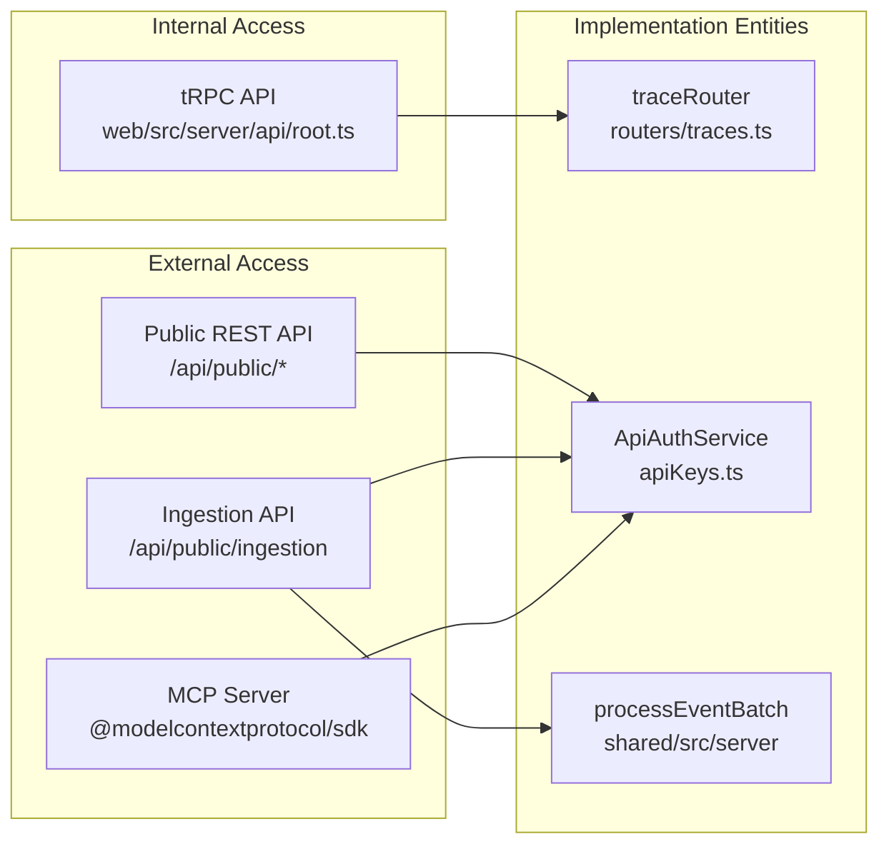

# 기술 스택

관련 소스 파일

다음 파일들은 이 위키 페이지를 생성하기 위한 컨텍스트로 사용되었습니다.

- [ee/package.json](ee/package.json)
- [package.json](package.json)
- [packages/config-eslint/package.json](packages/config-eslint/package.json)
- [packages/shared/package.json](packages/shared/package.json)
- [packages/shared/src/constants/VERSION.ts](packages/shared/src/constants/VERSION.ts)
- [pnpm-lock.yaml](pnpm-lock.yaml)
- [pnpm-workspace.yaml](pnpm-workspace.yaml)
- [web/Dockerfile](web/Dockerfile)
- [web/instrumentation-client.ts](web/instrumentation-client.ts)
- [web/next.config.mjs](web/next.config.mjs)
- [web/package.json](web/package.json)
- [web/playwright.config.ts](web/playwright.config.ts)
- [web/src/__e2e__/auth.spec.ts](web/src/__e2e__/auth.spec.ts)
- [web/src/__tests__/redirect.clienttest.ts](web/src/__tests__/redirect.clienttest.ts)
- [web/src/components/error-page.tsx](web/src/components/error-page.tsx)
- [web/src/components/layouts/app-layout/hooks/useAuthGuard.ts](web/src/components/layouts/app-layout/hooks/useAuthGuard.ts)
- [web/src/components/layouts/app-layout/hooks/useAuthSession.ts](web/src/components/layouts/app-layout/hooks/useAuthSession.ts)
- [web/src/components/layouts/app-layout/hooks/useFilteredNavigation.ts](web/src/components/layouts/app-layout/hooks/useFilteredNavigation.ts)
- [web/src/components/layouts/app-layout/hooks/useLayoutConfiguration.ts](web/src/components/layouts/app-layout/hooks/useLayoutConfiguration.ts)
- [web/src/components/layouts/app-layout/hooks/useLayoutMetadata.ts](web/src/components/layouts/app-layout/hooks/useLayoutMetadata.ts)
- [web/src/components/layouts/app-layout/hooks/useProjectAccess.ts](web/src/components/layouts/app-layout/hooks/useProjectAccess.ts)
- [web/src/components/layouts/app-layout/index.tsx](web/src/components/layouts/app-layout/index.tsx)
- [web/src/components/layouts/app-layout/utils/navigationFilters.types.ts](web/src/components/layouts/app-layout/utils/navigationFilters.types.ts)
- [web/src/constants/VERSION.ts](web/src/constants/VERSION.ts)
- [web/src/hooks/useTrpcError.tsx](web/src/hooks/useTrpcError.tsx)
- [web/src/instrumentation.ts](web/src/instrumentation.ts)
- [web/src/observability.config.ts](web/src/observability.config.ts)
- [web/src/pages/_app.tsx](web/src/pages/_app.tsx)
- [web/src/pages/api/trpc/[trpc].ts](web/src/pages/api/trpc/[trpc].ts)
- [web/src/pages/auth/error.tsx](web/src/pages/auth/error.tsx)
- [web/src/utils/api.ts](web/src/utils/api.ts)
- [web/src/utils/redirect.ts](web/src/utils/redirect.ts)
- [worker/Dockerfile](worker/Dockerfile)
- [worker/package.json](worker/package.json)
- [worker/src/constants/VERSION.ts](worker/src/constants/VERSION.ts)
- [worker/src/index.ts](worker/src/index.ts)
- [worker/src/instrumentation.ts](worker/src/instrumentation.ts)

이 문서는 Langfuse codebase 전반에서 사용되는 핵심 기술, framework, library에 대한 종합 reference를 제공합니다. 이러한 component가 아키텍처적으로 어떻게 상호작용하는지에 대한 정보는 [1.1 System Architecture]()를 참조하세요. monorepo 구성에 대한 자세한 내용은 [1.2 Monorepo Structure]()를 참조하세요.

---

## 기술 계층 개요

Langfuse 기술 스택은 고유한 책임에 최적화된 전문 기술을 사용하는 별도의 계층으로 구성됩니다.

### 시스템 컴포넌트와 코드 Entity
다음 다이어그램은 상위 수준 시스템 컴포넌트를 각각의 구현 기술 및 코드 entity에 매핑합니다.

```mermaid
graph TB
    subgraph "Frontend Layer"
        NextJS["Next.js 16.2.6<br/>App Router + Pages"]
        React["React 19.2.4<br/>UI Components"]
        TypeScript["TypeScript 5.9.2<br/>Type Safety"]
        TailwindCSS["Tailwind CSS<br/>Styling"]
        RadixUI["Radix UI<br/>Accessible Components"]
    end
    
    subgraph "API Layer"
        TRPC["tRPC 11.13.4<br/>Type-safe Internal API"]
        NextAuth["NextAuth.js 4.24.13<br/>Authentication"]
        PublicAPI["Public REST API<br/>Next.js Pages/API"]
        Zod["Zod 4.3.6<br/>Schema Validation"]
        MCP["@modelcontextprotocol/sdk 1.29.0<br/>MCP Server"]
    end
    
    subgraph "Backend Services"
        Express["Express 5.2.1<br/>Worker HTTP Server"]
        BullMQ["BullMQ 5.76.3<br/>Queue Processing"]
        Node24["Node.js 24<br/>Runtime"]
    end
    
    subgraph "Data Access"
        Prisma["Prisma 6.19.3<br/>PostgreSQL ORM"]
        ClickHouseClient["@clickhouse/client 1.18.5<br/>ClickHouse Driver"]
        IORedis["ioredis 5.10.1<br/>Redis Client"]
        AWSSDK["AWS SDK v3<br/>S3 Storage"]
    end
    
    subgraph "Observability"
        OpenTelemetry["OpenTelemetry SDK 2.7.1<br/>Distributed Tracing"]
        DDTrace["dd-trace 5.97.0<br/>Datadog APM"]
        Sentry["@sentry/nextjs 10.46.0<br/>Error Tracking"]
    end
    
    subgraph "LLM Integration"
        Langchain["langchain 1.3.0<br/>LLM Framework"]
        LCAnthropic["@langchain/anthropic 1.3.26"]
        LCOpenAI["@langchain/openai 1.4.2"]
        LCAWS["@langchain/aws 1.3.4"]
        LCGoogle["@langchain/google-* 2.1.26"]
    end
    
    subgraph "Build Tools"
        pnpm["pnpm 11.1.3<br/>Package Manager"]
        Turbo["Turbo 2.9.14<br/>Monorepo Build"]
        Docker["Docker<br/>Containerization"]
        Prettier["Prettier 3.8.3<br/>Code Formatting"]
        ESLint["ESLint 9.39.4<br/>Linting"]
    end
    
    NextJS --> TRPC
    NextJS --> NextAuth
    React --> RadixUI
    React --> TailwindCSS
    TRPC --> Zod
    Express --> BullMQ
    BullMQ --> IORedis
    NextJS --> Prisma
    Express --> Prisma
    NextJS --> ClickHouseClient
    Express --> ClickHouseClient
    Express --> AWSSDK
    NextJS --> OpenTelemetry
    Express --> OpenTelemetry
    OpenTelemetry --> DDTrace
    Express --> Langchain
    Langchain --> LCAnthropic
    Langchain --> LCOpenAI
    
    pnpm -.manages.-> NextJS
    pnpm -.manages.-> Express
    Turbo -.builds.-> NextJS
    Turbo -.builds.-> Express
```

**출처:** `package.json`, `web/package.json`, `worker/package.json`, `packages/shared/package.json`, `pnpm-lock.yaml`

---

## Runtime Environment

### Node.js Version

Langfuse는 모든 package configuration과 containerization에 명시된 대로 **Node.js 24**를 요구합니다.

Node version은 다음을 통해 강제됩니다.
- **Package Management**: 모든 `package.json` 파일이 `"engines": { "node": "24" }`를 선언합니다 [package.json:8-9](), [web/package.json:7-8](), [worker/package.json:12](), [packages/shared/package.json:15]().
- **Production**: Docker image는 `node:24-alpine`을 base image로 사용합니다 [web/Dockerfile:2](), [worker/Dockerfile:2]().

**출처:** [package.json:8-9](), [web/package.json:7-8](), [worker/package.json:12](), [packages/shared/package.json:15](), [web/Dockerfile:2](), [worker/Dockerfile:2]().

### Package Manager

**pnpm 11.1.3**은 필수 package manager이며, 다음을 통해 강제됩니다.
- `npx only-allow pnpm`을 사용하는 preinstall hook [package.json:14]().
- `packageManager` field의 명시적 version pinning [package.json:100]().
- Docker build의 Corepack preparation [web/Dockerfile:14](), [worker/Dockerfile:14]().

**출처:** [package.json:14](), [package.json:100](), [web/Dockerfile:14](), [worker/Dockerfile:14]().

---

## Web Service Technology Stack (Next.js)

web service는 UI, 내부 tRPC API, public REST API를 제공합니다.

### Core Framework

| Technology | Version | Purpose |
|------------|---------|---------|
| Next.js | 16.2.6 | App Router와 Pages Router를 갖춘 full-stack React framework |
| React | 19.2.4 | component 기반 interface를 위한 UI library |
| TypeScript | 5.9.2 | Static type checking |

**Configuration:** Next.js는 `web/next.config.mjs`에서 구성됩니다.
- **Output mode**: 최적화된 production build를 위한 `"standalone"` [web/next.config.mjs:100]().
- **Server externals**: `dd-trace`, `bullmq`, `@opentelemetry/api`를 포함해 observability 및 queue package를 bundling에서 제외합니다 [web/next.config.mjs:63-70]().
- **Transpile packages**: `@langfuse/shared`와 `vis-network/standalone`을 처리합니다 [web/next.config.mjs:61]().
- **Base path**: `env.NEXT_PUBLIC_BASE_PATH`를 통해 구성 가능합니다 [web/next.config.mjs:72]().

**출처:** [web/package.json:133-146](), [web/next.config.mjs:61-100]().

### UI Component Libraries

| Library | Version | Purpose |
|---------|---------|---------|
| Tailwind CSS | - | Utility-first CSS framework(workspace에서 구성됨) |
| Radix UI | - | 접근성을 위한 primitive component(Accordion, Dialog, Popover 등) |
| TanStack Table | 8.20.5 | 강력한 table 구축을 위한 headless UI |
| TanStack Virtual | 3.13.12 | 대규모 list/table을 위한 virtualization |
| Recharts | 3.8.0 | 조합 가능한 charting library |

**출처:** [web/package.json:72-100](), [web/package.json:156]().

### Data Fetching & State Management

| Technology | Version | Purpose |
|------------|---------|---------|
| tRPC | 11.13.4 | Type-safe API layer |
| React Query | 5.85.1 | 비동기 data의 fetching, caching, updating을 위한 hook |
| SuperJSON | 2.2.2 | type 보존을 지원하는 JSON serialization |

tRPC는 transformer로 `superjson`을 사용해 초기화됩니다. client-side entrypoint `web/src/utils/api.ts`는 type-safe React Query hook을 위한 `api` object를 생성합니다.

**출처:** [web/package.json:102-105](), [web/package.json:161]().

---

## Worker Service Technology Stack (Express)

worker service는 background task와 queue processing을 처리합니다.

| Technology | Version | Purpose |
|------------|---------|---------|
| Express | 5.2.1 | health check와 internal endpoint를 위한 minimalist web framework |
| BullMQ | 5.76.3 | asynchronous job processing을 위한 message queue |
| ioredis | 5.10.1 | BullMQ state와 caching을 위한 Redis client |

**출처:** [worker/package.json:50-59]().

---

## Database & Storage Technologies

### PostgreSQL with Prisma

| Technology | Version | Purpose |
|------------|---------|---------|
| Prisma Client | 6.19.3 | Type-safe PostgreSQL ORM |

Prisma는 PostgreSQL schema를 관리합니다. production에서 `web` container는 migration 실행과 client 생성을 위해 Prisma CLI를 설치합니다 [web/Dockerfile:140]().

**출처:** [web/package.json:141](), [packages/shared/package.json:104](), [web/Dockerfile:140]().

### ClickHouse

ClickHouse는 대용량 observability data(trace, observation, score)에 사용됩니다. application은 database와 interface하기 위해 `@clickhouse/client`(v1.18.5)를 사용합니다 [packages/shared/package.json:95]().

**출처:** [packages/shared/package.json:95]().

### Blob Storage (S3 / Azure / GCP)

Langfuse는 대용량 event body와 export를 위해 여러 blob storage provider를 지원합니다.
- **AWS S3**: `@aws-sdk/client-s3` [packages/shared/package.json:90]()
- **Azure Blob**: `@azure/storage-blob` [packages/shared/package.json:94]()
- **GCP Storage**: `@google-cloud/storage` [packages/shared/package.json:96]()

**출처:** [packages/shared/package.json:90-96]().

---

## API Layer Architecture

다음 다이어그램은 logical API structure를 code router 및 handler에 연결합니다.

**출처:** [web/package.json:54](), [packages/shared/package.json:34-37](), [web/src/pages/api/trpc/\[trpc\].ts:1-20]().

---

## Observability & Monitoring Stack

### OpenTelemetry Instrumentation

Langfuse는 distributed tracing을 위해 OpenTelemetry를 사용합니다. Instrumentation은 `web/src/instrumentation.ts`와 `worker/src/instrumentation.ts`의 `register` function을 통해 초기화됩니다.

**출처:** [web/src/instrumentation.ts:1-20](), [worker/src/instrumentation.ts:1-10]().

### Error Tracking & Analytics

| Technology | Purpose |
|------------|---------|
| Sentry | client 및 server-side error tracking과 reporting [web/package.json:95]() |
| Datadog (dd-trace) | APM 및 infrastructure monitoring [web/package.json:118]() |
| PostHog | Product analytics 및 feature flag [web/package.json:137-138]() |

**출처:** [web/package.json:95-138]().

---

## Authentication & Authorization

| Technology | Purpose |
|------------|---------|
| NextAuth.js | UI 및 SSO를 위한 core authentication framework [web/package.json:134]() |
| ApiAuthService | Public API Key verification을 위한 custom service [packages/shared/package.json:34-37]() |

NextAuth.js는 session과 provider configuration을 처리합니다. `SessionProvider`는 `_app.tsx`에서 application을 감쌉니다. Public API authentication은 PostgreSQL database에 대해 hashed key를 검증하는 `ApiAuthService`가 처리합니다.

**출처:** [web/package.json:134](), [packages/shared/package.json:34-37](), [web/src/pages/_app.tsx:1-200]().
