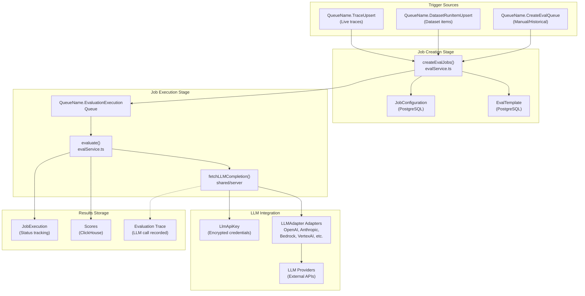
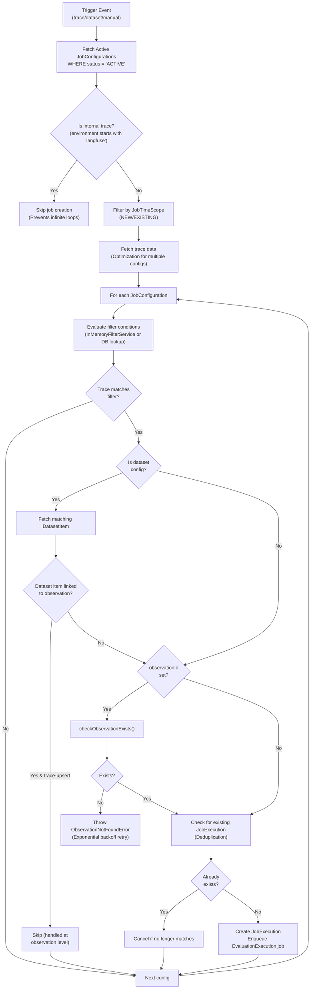
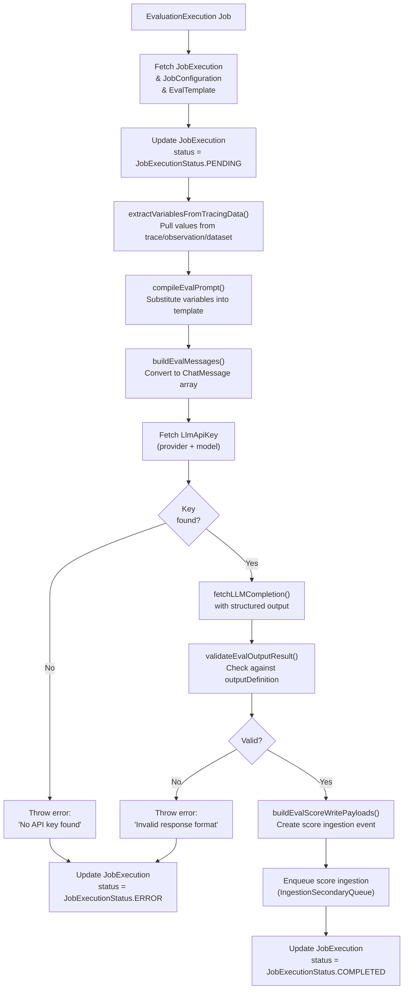

# 평가 시스템

관련 소스 파일

다음 파일들은 이 위키 페이지를 생성하기 위한 컨텍스트로 사용되었습니다.

- [packages/shared/src/features/evals/types.ts](packages/shared/src/features/evals/types.ts)
- [web/src/features/evals/components/evaluator-table.tsx](web/src/features/evals/components/evaluator-table.tsx)
- [web/src/features/evals/components/inner-evaluator-form.tsx](web/src/features/evals/components/inner-evaluator-form.tsx)
- [web/src/features/evals/components/template-selector.tsx](web/src/features/evals/components/template-selector.tsx)
- [web/src/features/evals/hooks/useEvaluationModel.ts](web/src/features/evals/hooks/useEvaluationModel.ts)
- [web/src/features/evals/server/router.ts](web/src/features/evals/server/router.ts)
- [web/src/features/experiments/components/MultiStepExperimentForm.tsx](web/src/features/experiments/components/MultiStepExperimentForm.tsx)
- [web/src/features/experiments/components/steps/EvaluatorsStep.tsx](web/src/features/experiments/components/steps/EvaluatorsStep.tsx)
- [web/src/features/experiments/components/steps/PromptModelStep.tsx](web/src/features/experiments/components/steps/PromptModelStep.tsx)
- [web/src/features/experiments/hooks/useEvaluatorDefaults.ts](web/src/features/experiments/hooks/useEvaluatorDefaults.ts)
- [web/src/features/experiments/hooks/useExperimentEvaluatorData.ts](web/src/features/experiments/hooks/useExperimentEvaluatorData.ts)
- [web/src/features/experiments/hooks/useExperimentPromptData.ts](web/src/features/experiments/hooks/useExperimentPromptData.ts)
- [web/src/features/experiments/types/stepProps.ts](web/src/features/experiments/types/stepProps.ts)
- [web/src/features/experiments/utils/evaluatorMappingUtils.ts](web/src/features/experiments/utils/evaluatorMappingUtils.ts)
- [web/src/features/playground/page/hooks/useModelParams.ts](web/src/features/playground/page/hooks/useModelParams.ts)
- [web/src/utils/getFinalModelParams.tsx](web/src/utils/getFinalModelParams.tsx)
- [worker/src/__tests__/evalService.filtering.test.ts](worker/src/__tests__/evalService.filtering.test.ts)
- [worker/src/__tests__/evalService.test.ts](worker/src/__tests__/evalService.test.ts)
- [worker/src/ee/cloudUsageMetering/handleCloudUsageMeteringJob.ts](worker/src/ee/cloudUsageMetering/handleCloudUsageMeteringJob.ts)
- [worker/src/features/evaluation/evalService.ts](worker/src/features/evaluation/evalService.ts)
- [worker/src/queues/batchExportQueue.ts](worker/src/queues/batchExportQueue.ts)
- [worker/src/queues/cloudUsageMeteringQueue.ts](worker/src/queues/cloudUsageMeteringQueue.ts)
- [worker/src/queues/evalQueue.ts](worker/src/queues/evalQueue.ts)

## 목적과 범위

이 문서는 Langfuse의 평가 시스템을 설명합니다. 이 시스템은 trace, observation, dataset item에 대한 자동화된 LLM-as-a-Judge 평가를 구현합니다. 사용자는 LLM 모델을 사용해 들어오는 데이터에 자동으로 점수를 매기는 평가 작업을 구성할 수 있습니다.

dataset 관리와 실험 workflow에 대한 정보는 [Datasets & Experiments](#9.4)를 참고하세요. score 데이터 모델과 score configuration에 대한 자세한 내용은 [Scores & Scoring](#9.2)을 참고하세요. queue infrastructure와 background job processing에 대해서는 [Queue & Worker System](#7)을 참고하세요.

---

## 시스템 개요

평가 시스템은 **Configuration → Job Creation → Job Execution**의 세 단계 pipeline을 따릅니다. 작업은 trace 생성, dataset run item 생성, 또는 UI에서의 수동 실행으로 트리거됩니다. 이 시스템은 비동기 처리를 위해 BullMQ queue를 사용하며, 통합 adapter interface를 통해 여러 LLM provider를 지원합니다.

### 평가 시스템 아키텍처

**출처:** [worker/src/features/evaluation/evalService.ts:94-144](), [worker/src/queues/evalQueue.ts:25-116](), [worker/src/queues/evalQueue.ts:16-17]()

---

## 작업 구성 엔티티

평가 작업은 두 PostgreSQL 엔티티인 `JobConfiguration`과 `EvalTemplate`으로 정의됩니다.

### JobConfiguration

`JobConfiguration` 엔티티는 평가 작업이 언제, 어떻게 생성되어야 하는지를 정의합니다. `TRACE`, `DATASET`, `EVENT`, `EXPERIMENT`를 포함한 다양한 target object를 지원합니다 [web/src/features/evals/server/router.ts:83-83]().

| Field | Type | Purpose |
|-------|------|---------|
| `id` | string | 고유 식별자 |
| `projectId` | string | 프로젝트 범위 |
| `evalTemplateId` | string | `EvalTemplate` 참조 |
| `status` | `JobConfigState` | ACTIVE/PAUSED/INACTIVE [web/src/features/evals/server/router.ts:92-92]() |
| `targetObject` | `EvalTargetObject` | TRACE/DATASET/EVENT/EXPERIMENT [packages/shared/src/features/evals/types.ts:3-8]() |
| `filter` | `singleFilter[]` | 필터링 조건(trace/dataset item) |
| `variableMapping` | JSON | template variable을 data source에 매핑 [packages/shared/src/features/evals/types.ts:63-82]() |
| `timeScope` | `JobTimeScope[]` | NEW/EXISTING - historical execution 제어 [packages/shared/src/features/evals/types.ts:199-202]() |
| `sampling` | `Decimal` | 일치하는 항목 중 평가할 비율 |
| `delay` | number | 작업 실행 전 대기할 밀리초 |

**출처:** [worker/src/features/evaluation/evalService.ts:3-9](), [web/src/features/evals/server/router.ts:78-117](), [packages/shared/src/features/evals/types.ts:3-202]()

### EvalTemplate

`EvalTemplate` 엔티티는 LLM 평가 prompt와 scoring schema를 정의합니다.

| Field | Type | Purpose |
|-------|------|---------|
| `id` | string | 고유 식별자 |
| `name` | string | template 이름 |
| `prompt` | string | variable을 포함한 Mustache template |
| `outputDefinition` | JSON | `PersistedEvalOutputDefinitionSchema` [web/src/features/evals/server/router.ts:150-150]() |
| `provider` | string | LLM provider |
| `model` | string | 모델 이름 |
| `modelParams` | JSON | 모델 구성(temperature 등) |

`prompt` 필드는 variable substitution을 위해 Mustache syntax를 사용합니다(예: `{{input}}`, `{{output}}`). `outputDefinition`은 LLM response의 예상 구조를 정의하며, 일반적으로 reasoning과 score field를 포함합니다 [worker/src/__tests__/evalService.test.ts:76-83]().

**출처:** [worker/src/features/evaluation/evalService.ts:3-9](), [web/src/features/evals/server/router.ts:100-116](), [worker/src/__tests__/evalService.test.ts:75-83]()

---

## 작업 생성 파이프라인

작업 생성은 trace upsert, dataset run item upsert, UI에서의 수동 실행이라는 세 가지 source로 트리거됩니다. `createEvalJobs` 함수는 live data(TraceQueue, DatasetRunItemUpsert)와 historical batch data(CreateEvalQueue)를 포함한 모든 case를 처리합니다 [worker/src/features/evaluation/evalService.ts:83-107]().

### 작업 생성 흐름

**출처:** [worker/src/features/evaluation/evalService.ts:83-146](), [worker/src/queues/evalQueue.ts:25-116]()

---

## 작업 실행 파이프라인

작업 실행은 `EvaluationExecution` queue job을 처리하는 `evaluate()` 함수가 담당합니다. 이 함수는 variable extraction부터 scoring까지 전체 lifecycle을 관리합니다 [worker/src/features/evaluation/evalService.ts:16-16]().

### 실행 흐름

**출처:** [worker/src/features/evaluation/evalService.ts:16-16](), [worker/src/features/evaluation/evalService.ts:71-77](), [worker/src/queues/evalQueue.ts:176-176]()

---

## LLM 통합 계층

평가 시스템은 통합 abstraction을 통해 LLM provider와 통합되며, `fetchLLMCompletion`을 통해 암호화와 structured output을 지원합니다 [worker/src/features/evaluation/evalService.ts:34-34]().

### LLM API 키 관리

LLM credential은 암호화되어 `LlmApiKey` table에 저장됩니다. 시스템은 작업 실행 전에 model configuration을 검증합니다. LLM call이 retry 불가능한 error로 실패하면, 비용 절감을 위해 `blockEvaluatorConfigs`를 사용하여 해당 configuration의 추가 실행을 방지합니다 [worker/src/features/evaluation/evalService.ts:34-36]().

---

## 큐 아키텍처

평가 시스템은 많은 양의 평가와 project-specific redirection을 처리하기 위해 sharded queue와 secondary queue를 사용합니다 [worker/src/queues/evalQueue.ts:118-157]().

| Queue Name | Processor | Purpose |
|------------|-----------|---------|
| `QueueName.TraceUpsert` | `evalJobTraceCreatorQueueProcessor` | live trace에 대한 eval 트리거 [worker/src/queues/evalQueue.ts:25-44]() |
| `QueueName.DatasetRunItemUpsert` | `evalJobDatasetCreatorQueueProcessor` | dataset item에 대한 eval 트리거 [worker/src/queues/evalQueue.ts:46-96]() |
| `QueueName.CreateEvalQueue` | `evalJobCreatorQueueProcessor` | historical data에 대한 eval 트리거 [worker/src/queues/evalQueue.ts:98-116]() |
| `QueueName.EvaluationExecution` | `evalJobExecutorQueueProcessorBuilder` | LLM call 실행 [worker/src/queues/evalQueue.ts:118-177]() |
| `QueueName.EvaluationExecutionSecondaryQueue` | Same as above | high-load project를 위한 secondary queue [worker/src/queues/evalQueue.ts:142-154]() |

---

## 오류 처리와 재시도

시스템은 rate limit, missing data, 복구 불가능한 configuration error를 구분하는 정교한 retry logic을 구현합니다 [worker/src/queues/evalQueue.ts:178-202]().

- **LLM Rate Limits**: 429 또는 5xx error가 발생하면, 작업이 생성된 지 24시간 미만인 경우 system이 manual delay를 두고 job을 다시 schedule합니다 [worker/src/queues/evalQueue.ts:184-200]().
- **Observation Not Found**: observation이 아직 사용 가능하지 않은 경우(eventual consistency), `retryObservationNotFound`가 exponential backoff를 구현합니다 [worker/src/queues/evalQueue.ts:59-86]().
- **Unrecoverable Errors**: invalid schema나 missing API key 같은 error는 `JobExecution`을 `ERROR`로 표시하고 retry를 중지합니다 [worker/src/queues/evalQueue.ts:195-200]().

---

## 하위 페이지

- [Evaluation Overview](#10.1) — configuration부터 scoring까지의 자세한 workflow.
- [Job Configuration](#10.2) — `JobConfiguration` model과 filter 문서화.
- [Job Creation Pipeline](#10.3) — `createEvalJobs` 함수와 filter matching logic.
- [Job Execution](#10.4) — `JobExecution` lifecycle과 prompt compilation.
- [LLM Integration](#10.5) — `fetchLLMCompletion`과 LLM-as-Judge structured output.
- [Annotation Queues](#10.6) — human-in-the-loop workflow와 `AnnotationQueueItem`.
- [LLM API Key Management](#10.7) — secure storage와 provider adapter.
- [LLM Playground](#10.8) — model parameter tuning과 testing interface.
