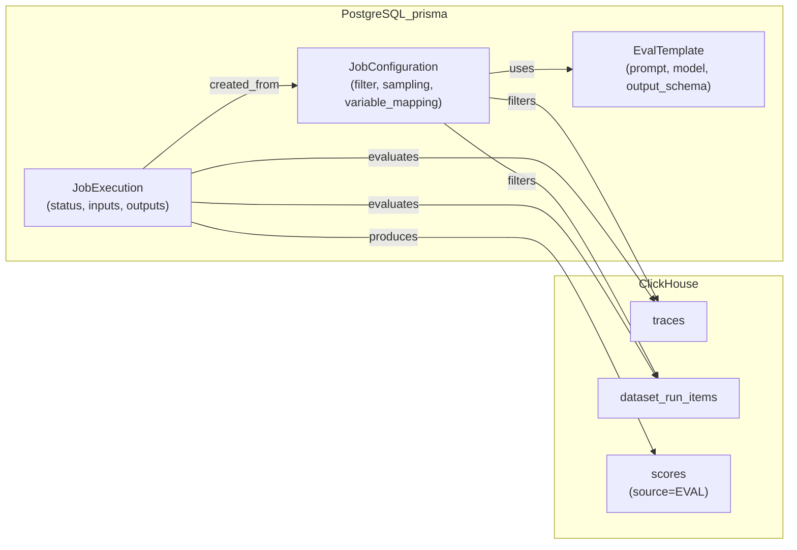
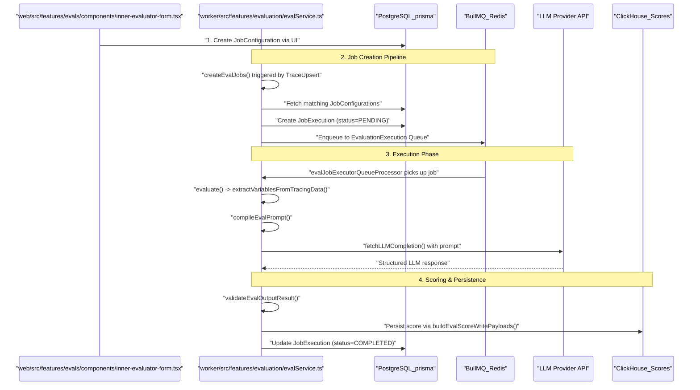

# 평가 개요

관련 소스 파일

다음 파일들은 이 위키 페이지를 생성하기 위한 컨텍스트로 사용되었습니다.

- [fern/apis/server/definition/unstable/commons.yml](fern/apis/server/definition/unstable/commons.yml)
- [fern/apis/server/definition/unstable/evaluation-rules.yml](fern/apis/server/definition/unstable/evaluation-rules.yml)
- [packages/shared/src/features/evals/observationForEval.ts](packages/shared/src/features/evals/observationForEval.ts)
- [packages/shared/src/features/evals/utilities.ts](packages/shared/src/features/evals/utilities.ts)
- [web/src/__tests__/server/event-query-builder.servertest.ts](web/src/__tests__/server/event-query-builder.servertest.ts)
- [web/src/features/evals/components/evaluator-table.tsx](web/src/features/evals/components/evaluator-table.tsx)
- [web/src/features/evals/components/inner-evaluator-form.tsx](web/src/features/evals/components/inner-evaluator-form.tsx)
- [web/src/features/evals/components/variable-mapping-card.tsx](web/src/features/evals/components/variable-mapping-card.tsx)
- [web/src/features/evals/hooks/useEvalCapabilities.ts](web/src/features/evals/hooks/useEvalCapabilities.ts)
- [web/src/features/evals/hooks/useEvaluatorTarget.ts](web/src/features/evals/hooks/useEvaluatorTarget.ts)
- [web/src/features/evals/server/router.ts](web/src/features/evals/server/router.ts)
- [web/src/features/evals/server/unstable-public-api/adapters.ts](web/src/features/evals/server/unstable-public-api/adapters.ts)
- [web/src/features/evals/server/unstable-public-api/validation.ts](web/src/features/evals/server/unstable-public-api/validation.ts)
- [web/src/features/evals/utils/evaluator-form-utils.ts](web/src/features/evals/utils/evaluator-form-utils.ts)
- [web/src/features/public-api/types/unstable-public-evals-contract.ts](web/src/features/public-api/types/unstable-public-evals-contract.ts)
- [worker/src/__tests__/evalService.filtering.test.ts](worker/src/__tests__/evalService.filtering.test.ts)
- [worker/src/__tests__/evalService.test.ts](worker/src/__tests__/evalService.test.ts)
- [worker/src/ee/cloudUsageMetering/handleCloudUsageMeteringJob.ts](worker/src/ee/cloudUsageMetering/handleCloudUsageMeteringJob.ts)
- [worker/src/features/evaluation/__tests__/extractValueFromObject.test.ts](worker/src/features/evaluation/__tests__/extractValueFromObject.test.ts)
- [worker/src/features/evaluation/evalService.ts](worker/src/features/evaluation/evalService.ts)
- [worker/src/features/evaluation/observationEval/__tests__/extractObservationVariables.test.ts](worker/src/features/evaluation/observationEval/__tests__/extractObservationVariables.test.ts)
- [worker/src/features/evaluation/observationEval/extractObservationVariables.ts](worker/src/features/evaluation/observationEval/extractObservationVariables.ts)
- [worker/src/queues/batchExportQueue.ts](worker/src/queues/batchExportQueue.ts)
- [worker/src/queues/cloudUsageMeteringQueue.ts](worker/src/queues/cloudUsageMeteringQueue.ts)
- [worker/src/queues/evalQueue.ts](worker/src/queues/evalQueue.ts)

Langfuse 평가 시스템은 LLM-as-Judge pattern을 사용하여 LLM output을 자동으로 assessment할 수 있게 합니다. 이 시스템을 통해 사용자는 평가 기준을 정의하고, 평가가 실행되는 시점을 구성하며, trace, observation, dataset experiment에 대해 평가를 자동으로 실행할 수 있습니다.

이 페이지는 evaluation workflow의 high-level overview를 제공합니다. 특정 component에 대한 자세한 정보는 다음을 참고하세요.
- Configuration setting과 filter: 10.2 Job Configuration 페이지 참고
- Job creation pipeline과 deduplication: 10.3 Job Creation Pipeline 페이지 참고
- Job execution lifecycle과 error handling: 10.4 Job Execution 페이지 참고
- LLM provider integration과 calling logic: 10.5 LLM Integration 페이지 참고
- Human-in-the-loop annotation workflow: 10.6 Annotation Queues 페이지 참고
- LLM API key management와 encryption: 10.7 LLM API Key Management 페이지 참고
- 평가 테스트용 Playground UI: 10.8 LLM Playground 페이지 참고

**출처:** [worker/src/features/evaluation/evalService.ts:83-107](), [web/src/features/evals/server/router.ts:158-173]()

---

## 핵심 컴포넌트

평가 시스템은 Prisma schema에 정의되고 analytical scoring을 위해 ClickHouse와 동기화되는 세 가지 주요 database entity를 통해 동작합니다.

**다이어그램: 데이터베이스 엔티티 관계**

**출처:** [worker/src/features/evaluation/evalService.ts:3-9](), [web/src/features/evals/server/router.ts:78-117]()

| Component | Purpose | Key Code Symbols |
|-----------|---------|------------|
| `EvalTemplate` | 평가 logic(LLM prompt, model parameter, output schema)을 정의 | `EvalTemplate` [worker/src/features/evaluation/evalService.ts:8]() |
| `JobConfiguration` | 평가가 언제, 어떻게 실행되는지(filter, sampling, mapping)를 정의 | `JobConfiguration` [worker/src/features/evaluation/evalService.ts:7]() |
| `JobExecution` | 개별 평가 instance와 그 status를 추적 | `JobExecution` [worker/src/features/evaluation/evalService.ts:6]() |

template은 평가할 *내용*을 정의하고, configuration은 평가할 *시점*과 *위치*를 정의하며, execution은 각 평가 실행을 추적합니다.

**출처:** [worker/src/features/evaluation/evalService.ts:3-9](), [web/src/features/evals/server/router.ts:78-117]()

---

## 평가 워크플로

평가 시스템은 configuration → job creation → execution → scoring의 네 단계 workflow를 따릅니다.

**다이어그램: End-to-End 평가 워크플로**

**출처:** [worker/src/features/evaluation/evalService.ts:98-145](), [worker/src/queues/evalQueue.ts:127-177](), [web/src/features/evals/components/inner-evaluator-form.tsx:50-58]()

### 1단계: 구성

사용자는 다음을 포함하는 `JobConfiguration`을 생성합니다.
- **Target**: `TRACE`, `DATASET`, `EVENT`, `EXPERIMENT` 중 무엇을 평가할지 [web/src/features/evals/server/router.ts:28-30]().
- **Filters**: 특정 trace 또는 observation과 일치시키는 기준 [web/src/features/evals/components/inner-evaluator-form.tsx:163-168]().
- **Variable Mapping**: `variableMapping` 또는 `observationVariableMapping`을 사용해 trace/observation field를 prompt variable에 매핑 [web/src/features/evals/server/router.ts:85-89]().
- **Sampling**: randomized evaluation을 위한 0과 1 사이의 값 [web/src/features/evals/server/router.ts:169]().

**출처:** [web/src/features/evals/server/router.ts:158-173](), [web/src/features/evals/utils/evaluator-form-utils.ts:16-25]()

### 2단계: 작업 생성

`createEvalJobs` 함수 [worker/src/features/evaluation/evalService.ts:16]()는 pipeline의 entry point입니다. 이는 세 가지 주요 queue processor에 의해 트리거됩니다.
1. `evalJobTraceCreatorQueueProcessor`: live trace ingestion(`QueueName.TraceUpsert`) 처리 [worker/src/queues/evalQueue.ts:25-34]().
2. `evalJobDatasetCreatorQueueProcessor`: dataset run item(`QueueName.DatasetRunItemUpsert`) 처리 [worker/src/queues/evalQueue.ts:46-55]().
3. `evalJobCreatorQueueProcessor`: UI에서 manual/historical batch creation(`QueueName.CreateEvalQueue`) 처리 [worker/src/queues/evalQueue.ts:98-106]().

pipeline은 filter matching을 수행하고, `EvaluationExecution` queue에 enqueue하기 전에 PostgreSQL에 `JobExecution` record를 생성합니다 [worker/src/queues/evalQueue.ts:151-154]().

**출처:** [worker/src/queues/evalQueue.ts:25-154](), [worker/src/features/evaluation/evalService.ts:83-145]()

### 3단계: 작업 실행

`evalJobExecutorQueueProcessorBuilder` [worker/src/queues/evalQueue.ts:118]()는 execution job용 processor를 생성합니다. 핵심 logic은 `evaluate` 함수 [worker/src/features/evaluation/evalService.ts:176]()에 있습니다.
1. **Data Extraction**: `extractVariablesFromTracingData` [worker/src/__tests__/evalService.test.ts:33]()가 tracing data에서 필요한 input을 가져옵니다.
2. **Prompt Compilation**: `compileEvalPrompt` [worker/src/features/evaluation/evalService.ts:71]()가 variable을 `EvalTemplate`에 주입합니다.
3. **LLM Call**: `fetchLLMCompletion` [worker/src/__tests__/evalService.test.ts:49]()을 사용해 구성된 provider로부터 response를 가져옵니다.
4. **Validation**: `validateEvalOutputResult` [worker/src/features/evaluation/evalService.ts:61]()가 LLM output이 예상되는 `ScoreDataTypeEnum` [worker/src/features/evaluation/evalService.ts:60]()에 부합하는지 확인합니다.

**출처:** [worker/src/features/evaluation/evalService.ts:60-75](), [worker/src/queues/evalQueue.ts:118-177]()

### 4단계: 채점

평가가 완료되면, 시스템은 `buildEvalScoreWritePayloads` [worker/src/features/evaluation/evalService.ts:76]()를 사용해 score payload를 생성합니다. 이러한 score는 target trace 또는 observation과 연결되도록 database에 기록됩니다.

**출처:** [worker/src/features/evaluation/evalService.ts:76]()

---

## Trace 및 Dataset과의 통합

평가 시스템은 세분화된 assessment를 가능하게 하기 위해 여러 `EvalTargetObject` type을 지원합니다.

| Target | Description | Code Constant |
|--------|-------------|---------------|
| `TRACE` | 전체 trace context를 평가 | `EvalTargetObject.TRACE` [worker/src/features/evaluation/evalService.ts:54]() |
| `DATASET` | 단일 `dataset_item`을 평가 | `EvalTargetObject.DATASET` [worker/src/features/evaluation/evalService.ts:54]() |
| `EVENT` | 개별 span/generation을 평가 | `EvalTargetObject.EVENT` [worker/src/features/evaluation/evalService.ts:54]() |
| `EXPERIMENT` | dataset run/experiment를 평가 | `EvalTargetObject.EXPERIMENT` [worker/src/features/evaluation/evalService.ts:54]() |

### Live 평가와 Historical 평가

`timeScope` parameter는 실행 timing을 결정합니다.
- **NEW**: 새 data ingest 시 즉시 트리거됩니다(live evaluation) [worker/src/queues/evalQueue.ts:33]().
- **EXISTING**: historical backfill을 위해 UI에서 수동으로 트리거됩니다 [worker/src/queues/evalQueue.ts:103]().

**출처:** [worker/src/queues/evalQueue.ts:33-103](), [web/src/features/evals/utils/evaluator-form-utils.ts:23]()

---

## 오류 처리와 신뢰성

시스템은 LLM call에 대해 견고한 error handling을 구현합니다.
- **Retryable Errors**: `isLLMCompletionError` [worker/src/features/evaluation/evalService.ts:34]()는 429(Rate Limit)와 5xx(Server Error)를 식별하여 exponential backoff로 re-enqueue를 트리거합니다 [worker/src/queues/evalQueue.ts:185-201]().
- **Unrecoverable Errors**: `UnrecoverableError` [worker/src/features/evaluation/evalService.ts:68]()는 `JobExecution`을 `ERROR`로 표시하고 retry를 중지합니다.
- **Config Blocking**: evaluator가 지속적으로 실패하면(예: invalid model parameter 때문에), 특정 `EvaluatorBlockReason` [worker/src/features/evaluation/evalService.ts:55]()과 함께 `blockEvaluatorConfigs` [worker/src/features/evaluation/evalService.ts:35]()를 사용해 차단됩니다.

**출처:** [worker/src/queues/evalQueue.ts:178-201](), [worker/src/features/evaluation/evalService.ts:34-36](), [worker/src/features/evaluation/evalService.ts:55-57]()
