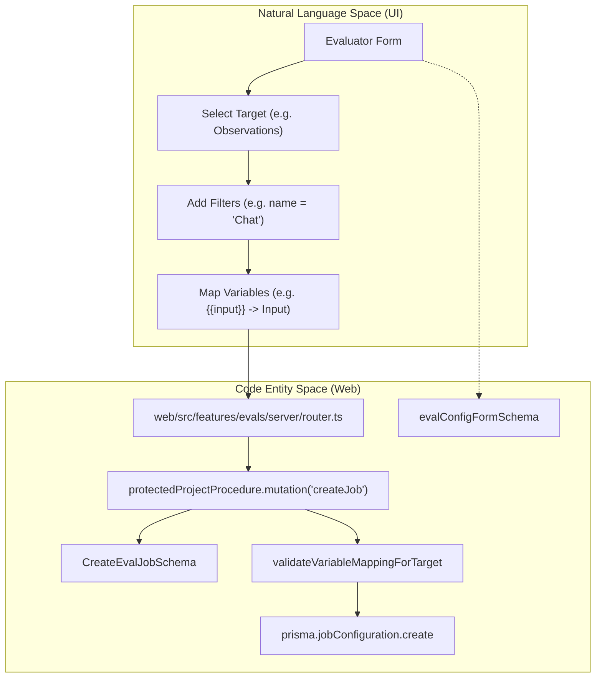
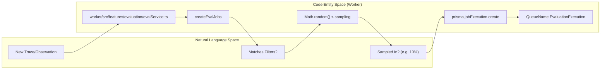

# 작업 구성

관련 소스 파일

다음 파일들은 이 위키 페이지를 생성하기 위한 컨텍스트로 사용되었습니다.

- [fern/apis/server/definition/unstable/commons.yml](fern/apis/server/definition/unstable/commons.yml)
- [fern/apis/server/definition/unstable/evaluation-rules.yml](fern/apis/server/definition/unstable/evaluation-rules.yml)
- [packages/shared/src/features/evals/observationForEval.ts](packages/shared/src/features/evals/observationForEval.ts)
- [packages/shared/src/features/evals/types.ts](packages/shared/src/features/evals/types.ts)
- [packages/shared/src/features/evals/utilities.ts](packages/shared/src/features/evals/utilities.ts)
- [web/src/__tests__/server/event-query-builder.servertest.ts](web/src/__tests__/server/event-query-builder.servertest.ts)
- [web/src/features/evals/components/evaluator-table.tsx](web/src/features/evals/components/evaluator-table.tsx)
- [web/src/features/evals/components/inner-evaluator-form.tsx](web/src/features/evals/components/inner-evaluator-form.tsx)
- [web/src/features/evals/components/template-selector.tsx](web/src/features/evals/components/template-selector.tsx)
- [web/src/features/evals/components/variable-mapping-card.tsx](web/src/features/evals/components/variable-mapping-card.tsx)
- [web/src/features/evals/hooks/useEvalCapabilities.ts](web/src/features/evals/hooks/useEvalCapabilities.ts)
- [web/src/features/evals/hooks/useEvaluationModel.ts](web/src/features/evals/hooks/useEvaluationModel.ts)
- [web/src/features/evals/hooks/useEvaluatorTarget.ts](web/src/features/evals/hooks/useEvaluatorTarget.ts)
- [web/src/features/evals/server/router.ts](web/src/features/evals/server/router.ts)
- [web/src/features/evals/server/unstable-public-api/adapters.ts](web/src/features/evals/server/unstable-public-api/adapters.ts)
- [web/src/features/evals/server/unstable-public-api/validation.ts](web/src/features/evals/server/unstable-public-api/validation.ts)
- [web/src/features/evals/utils/evaluator-form-utils.ts](web/src/features/evals/utils/evaluator-form-utils.ts)
- [web/src/features/experiments/components/MultiStepExperimentForm.tsx](web/src/features/experiments/components/MultiStepExperimentForm.tsx)
- [web/src/features/experiments/components/steps/EvaluatorsStep.tsx](web/src/features/experiments/components/steps/EvaluatorsStep.tsx)
- [web/src/features/experiments/components/steps/PromptModelStep.tsx](web/src/features/experiments/components/steps/PromptModelStep.tsx)
- [web/src/features/experiments/hooks/useEvaluatorDefaults.ts](web/src/features/experiments/hooks/useEvaluatorDefaults.ts)
- [web/src/features/experiments/hooks/useExperimentEvaluatorData.ts](web/src/features/experiments/hooks/useExperimentEvaluatorData.ts)
- [web/src/features/experiments/hooks/useExperimentPromptData.ts](web/src/features/experiments/hooks/useExperimentPromptData.ts)
- [web/src/features/experiments/types/stepProps.ts](web/src/features/experiments/types/stepProps.ts)
- [web/src/features/experiments/utils/evaluatorMappingUtils.ts](web/src/features/experiments/utils/evaluatorMappingUtils.ts)
- [web/src/features/playground/page/hooks/useModelParams.ts](web/src/features/playground/page/hooks/useModelParams.ts)
- [web/src/features/public-api/types/unstable-public-evals-contract.ts](web/src/features/public-api/types/unstable-public-evals-contract.ts)
- [web/src/utils/getFinalModelParams.tsx](web/src/utils/getFinalModelParams.tsx)
- [worker/src/__tests__/evalService.filtering.test.ts](worker/src/__tests__/evalService.filtering.test.ts)
- [worker/src/__tests__/evalService.test.ts](worker/src/__tests__/evalService.test.ts)
- [worker/src/ee/cloudUsageMetering/handleCloudUsageMeteringJob.ts](worker/src/ee/cloudUsageMetering/handleCloudUsageMeteringJob.ts)
- [worker/src/features/evaluation/__tests__/extractValueFromObject.test.ts](worker/src/features/evaluation/__tests__/extractValueFromObject.test.ts)
- [worker/src/features/evaluation/evalService.ts](worker/src/features/evaluation/evalService.ts)
- [worker/src/features/evaluation/observationEval/__tests__/extractObservationVariables.test.ts](worker/src/features/evaluation/observationEval/__tests__/extractObservationVariables.test.ts)
- [worker/src/features/evaluation/observationEval/extractObservationVariables.ts](worker/src/features/evaluation/observationEval/extractObservationVariables.ts)
- [worker/src/queues/batchExportQueue.ts](worker/src/queues/batchExportQueue.ts)
- [worker/src/queues/cloudUsageMeteringQueue.ts](worker/src/queues/cloudUsageMeteringQueue.ts)
- [worker/src/queues/evalQueue.ts](worker/src/queues/evalQueue.ts)

## 목적과 범위

Job configuration은 trace, observation, dataset run에 대한 응답으로 LLM-as-a-judge 평가가 언제, 어떻게 트리거되는지 정의합니다. Job configuration은 automated evaluation을 위한 filtering criteria, variable mapping, sampling rate, execution delay, target object를 지정하는 영속적인 trigger 역할을 합니다.

이 시스템은 Web service가 tRPC API를 통해 configuration을 관리하고, Worker service가 BullMQ queue를 통해 job creation과 execution을 orchestrate하는 dual-service architecture를 사용합니다.

---

## 데이터베이스 스키마

### JobConfiguration 테이블

Prisma의 `JobConfiguration` model은 evaluation trigger의 구조를 정의합니다. Configuration은 database에서 가져올 때 type safety를 보장하기 위해 `ConfigWithTemplateSchema`에 대해 validation됩니다 [web/src/features/evals/server/router.ts:78-117]().

| Field | Type | Description |
|-------|------|-------------|
| `id` | String | 고유 식별자(cuid) |
| `projectId` | String | 이 config가 속한 project |
| `jobType` | JobType | 현재는 항상 `EVAL` [web/src/features/evals/server/router.ts:96]() |
| `status` | JobConfigState | `ACTIVE`, `PAUSED`, 또는 `INACTIVE` [web/src/features/evals/server/router.ts:92]() |
| `evalTemplateId` | String | LLM prompt template 참조 [web/src/features/evals/server/router.ts:81]() |
| `scoreName` | String | Langfuse에서 생성될 score의 이름 [web/src/features/evals/server/router.ts:82]() |
| `filter` | Json | `singleFilter` object 배열 [web/src/features/evals/server/router.ts:84]() |
| `targetObject` | EvalTargetObject | 평가할 entity(예: "trace", "event") [web/src/features/evals/server/router.ts:83]() |
| `variableMapping` | Json | trace data를 template variable에 매핑 [web/src/features/evals/server/router.ts:86-89]() |
| `sampling` | Decimal | 확률(0.0에서 1.0) [web/src/features/evals/server/router.ts:90]() |
| `delay` | Int | 실행 전 대기할 초 단위 시간 [web/src/features/evals/server/router.ts:91]() |
| `timeScope` | TimeScopeSchema | `NEW`(live) 또는 `EXISTING`(backfill) [web/src/features/evals/server/router.ts:99]() |
| `blockedAt` | DateTime | error로 인해 evaluator가 blocked된 timestamp [web/src/features/evals/server/router.ts:93]() |
| `blockReason` | EvaluatorBlockReason | blocking 사유(예: `EVAL_MODEL_CONFIG_INVALID`) [web/src/features/evals/server/router.ts:94]() |

**출처:** [web/src/features/evals/server/router.ts:78-117](), [packages/shared/src/features/evals/types.ts:1-203]()

---

## 대상 객체

Job configuration은 `EvalTargetObject` schema를 통해 평가할 entity type을 지정합니다 [packages/shared/src/features/evals/types.ts:3-13]().

| Target | Display Name | Code Entity |
|--------|-------------|-------------|
| `trace` | "traces" | `EvalTargetObject.TRACE` [packages/shared/src/features/evals/types.ts:4]() |
| `dataset` | "dataset run items" | `EvalTargetObject.DATASET` [packages/shared/src/features/evals/types.ts:5]() |
| `event` | "observations" | `EvalTargetObject.EVENT` [packages/shared/src/features/evals/types.ts:6]() |
| `experiment` | "experiments" | `EvalTargetObject.EXPERIMENT` [packages/shared/src/features/evals/types.ts:7]() |

`getEvalTargetObjectFromSourceTable` 함수는 UI source table과 이러한 internal target type 간의 mapping을 처리합니다 [packages/shared/src/features/evals/types.ts:36-42]().

**출처:** [packages/shared/src/features/evals/types.ts:3-42](), [web/src/features/evals/utils/evaluator-form-utils.ts:54-67]()

---

## 구성 라이프사이클

다음 diagram은 "Natural Language Space"의 UI interaction을 Web application의 underlying "Code Entity Space"에 mapping합니다.

Title: Evaluator Configuration Data Flow

**출처:** [web/src/features/evals/server/router.ts:158-173](), [web/src/features/evals/server/router.ts:188-207](), [web/src/features/evals/utils/evaluator-form-utils.ts:50-55]()

---

## 변수 매핑

Variable mapping은 Langfuse의 internal data와 `EvalTemplate`이 요구하는 input variable을 연결합니다.

### 매핑 유형
1.  **Standard Mapping (`variableMapping`):** Trace와 Dataset에 사용됩니다. 어떤 specific observation에서 값을 추출할지 식별하기 위해 `langfuseObject`(예: "span", "generation")와 `objectName`이 필요합니다 [packages/shared/src/features/evals/types.ts:63-82]().
2.  **Observation Mapping (`observationVariableMapping`):** `EVENT`와 `EXPERIMENT` target에 맞게 단순화되었습니다. Observation이 이미 직접 target으로 지정되어 있으므로 mapping은 flatten되고 `objectName`을 생략합니다 [packages/shared/src/features/evals/types.ts:207-211]().

### 사용 가능한 컬럼
Variable은 `input`, `output`, `metadata` 같은 field에서 추출됩니다. Trace의 경우 이들은 `t."input"` 또는 `t."metadata"`에 mapping되고, observation의 경우 `o."input"`에 mapping됩니다 [packages/shared/src/features/evals/types.ts:97-173]().

**출처:** [packages/shared/src/features/evals/types.ts:63-211](), [web/src/features/evals/server/router.ts:188-207]()

---

## 필터링과 샘플링

### 필터 구현
Filter는 `singleFilter` schema를 사용해 정의되고 target object에 적용됩니다 [web/src/features/evals/server/router.ts:84](). UI에서는 `InlineFilterBuilder`가 이를 관리합니다 [web/src/features/evals/components/inner-evaluator-form.tsx:34](). 시스템은 `validateEvaluatorFiltersForTarget`를 사용해 filter가 선택된 target과 호환되는지 확인합니다 [worker/src/features/evaluation/evalService.ts:63]().

### 작업 생성 파이프라인
Event가 발생하면 worker는 `createEvalJobs`를 통해 이를 처리합니다. Worker는 `sourceEventType`과 filter를 기준으로 어떤 configuration이 match되는지 결정합니다 [worker/src/features/evaluation/evalService.ts:84-141]().

Title: Evaluation Job Creation and Sampling

**출처:** [worker/src/features/evaluation/evalService.ts:84-141](), [worker/src/queues/evalQueue.ts:25-44](), [web/src/features/evals/components/inner-evaluator-form.tsx:113-147]()

---

## 운영 제어

### 상태와 차단
Evaluator는 `ACTIVE`, `PAUSED`, 또는 `INACTIVE`일 수 있습니다 [web/src/features/evals/server/router.ts:92]().
- **Blocking:** evaluator가 invalid model configuration 때문에 실패하면, `blockEvaluatorConfigs`를 통해 blocked state로 이동합니다 [worker/src/features/evaluation/evalService.ts:35](). 사유에는 `EVAL_MODEL_CONFIG_INVALID`가 포함됩니다 [worker/src/features/evaluation/evalService.ts:57]().
- **State Reset:** configuration이 수동으로 update되거나 `resetEvalConfigBlockFields`를 통해 reactivate되면 block field가 reset됩니다 [web/src/features/evals/server/router.ts:62]().

### 시간 범위
`timeScope`는 job이 live data에 대해 실행되는지 historical backfill에 대해 실행되는지를 결정합니다 [packages/shared/src/features/evals/types.ts:199-202]().
- `NEW`: `TraceUpsert` 또는 `DatasetRunItemUpsert` event에 의해 트리거됩니다 [worker/src/queues/evalQueue.ts:33, 54]().
- `EXISTING`: UI를 통한 historical batch processing에 사용됩니다 [worker/src/queues/evalQueue.ts:102-106]().

**출처:** [worker/src/features/evaluation/evalService.ts:35-57](), [worker/src/queues/evalQueue.ts:25-116](), [web/src/features/evals/server/router.ts:92-95]()
