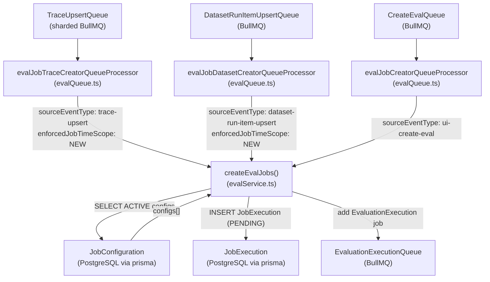
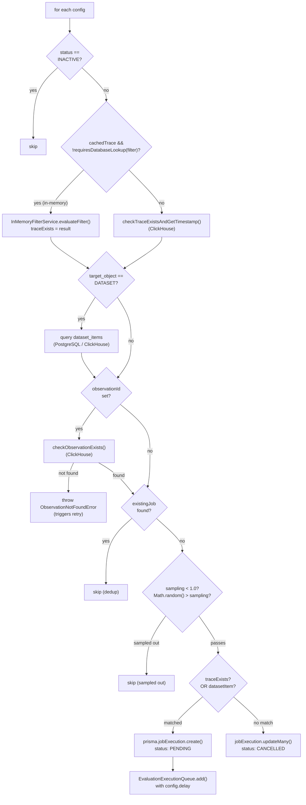
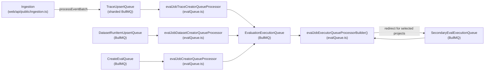

# 작업 생성 파이프라인

<details>
<summary>관련 소스 파일</summary>

다음 파일들은 이 위키 페이지를 생성하기 위한 컨텍스트로 사용되었습니다.

- [fern/apis/server/definition/unstable/commons.yml](fern/apis/server/definition/unstable/commons.yml)
- [fern/apis/server/definition/unstable/evaluation-rules.yml](fern/apis/server/definition/unstable/evaluation-rules.yml)
- [packages/shared/src/features/evals/observationForEval.ts](packages/shared/src/features/evals/observationForEval.ts)
- [packages/shared/src/features/evals/utilities.ts](packages/shared/src/features/evals/utilities.ts)
- [web/src/__tests__/server/event-query-builder.servertest.ts](web/src/__tests__/server/event-query-builder.servertest.ts)
- [web/src/features/evals/components/evaluator-table.tsx](web/src/features/evals/components/evaluator-table.tsx)
- [web/src/features/evals/components/inner-evaluator-form.tsx](web/src/features/evals/components/inner-evaluator-form.tsx)
- [web/src/features/evals/components/variable-mapping-card.tsx](web/src/features/evals/components/variable-mapping-card.tsx)
- [web/src/features/evals/hooks/useEvalCapabilities.ts](web/src/features/evals/hooks/useEvalCapabilities.ts)
- [web/src/features/evals/hooks/useEvaluatorTarget.ts](web/src/features/evals/hooks/useEvaluatorTarget.ts)
- [web/src/features/evals/server/router.ts](web/src/features/evals/server/router.ts)
- [web/src/features/evals/server/unstable-public-api/adapters.ts](web/src/features/evals/server/unstable-public-api/adapters.ts)
- [web/src/features/evals/server/unstable-public-api/validation.ts](web/src/features/evals/server/unstable-public-api/validation.ts)
- [web/src/features/evals/utils/evaluator-form-utils.ts](web/src/features/evals/utils/evaluator-form-utils.ts)
- [web/src/features/public-api/types/unstable-public-evals-contract.ts](web/src/features/public-api/types/unstable-public-evals-contract.ts)
- [worker/src/__tests__/evalService.filtering.test.ts](worker/src/__tests__/evalService.filtering.test.ts)
- [worker/src/__tests__/evalService.test.ts](worker/src/__tests__/evalService.test.ts)
- [worker/src/ee/cloudUsageMetering/handleCloudUsageMeteringJob.ts](worker/src/ee/cloudUsageMetering/handleCloudUsageMeteringJob.ts)
- [worker/src/features/evaluation/__tests__/extractValueFromObject.test.ts](worker/src/features/evaluation/__tests__/extractValueFromObject.test.ts)
- [worker/src/features/evaluation/evalService.ts](worker/src/features/evaluation/evalService.ts)
- [worker/src/features/evaluation/observationEval/__tests__/extractObservationVariables.test.ts](worker/src/features/evaluation/observationEval/__tests__/extractObservationVariables.test.ts)
- [worker/src/features/evaluation/observationEval/extractObservationVariables.ts](worker/src/features/evaluation/observationEval/extractObservationVariables.ts)
- [worker/src/queues/batchExportQueue.ts](worker/src/queues/batchExportQueue.ts)
- [worker/src/queues/cloudUsageMeteringQueue.ts](worker/src/queues/cloudUsageMeteringQueue.ts)
- [worker/src/queues/evalQueue.ts](worker/src/queues/evalQueue.ts)

</details>


이 페이지는 trace, observation, dataset run item이 ingest될 때 evaluation job이 어떻게 생성되는지 문서화합니다. Trigger event를 수신하는 queue processor, 어떤 evaluator가 적용되는지 결정하는 `createEvalJobs` 함수, filtering과 validation logic, 그리고 `JobExecution` record가 어떻게 생성되어 execution queue로 넘겨지는지를 다룹니다.

Evaluator가 처음에 어떻게 구성되는지는 [Job Configuration](10.2)을 참고하세요. 생성된 `JobExecution` record가 실제로 어떻게 실행되는지(LLM call, score writing)는 [Job Execution](10.4)을 참고하세요.

---

## 개요

Evaluation job creation pipeline은 새 trace, observation, dataset run item이 처리될 때마다 활성화됩니다. 이 pipeline은 *이 새 data가 주어졌을 때, 어떤 active evaluator configuration이 job execution을 생성해야 하는가?* 라는 질문에 답합니다.

Pipeline은 완전히 asynchronous합니다. BullMQ queue에 의해 구동되며 worker process 내부에서 실행됩니다. 주요 entry point는 `worker/src/features/evaluation/evalService.ts`의 `createEvalJobs` 함수입니다 [[worker/src/features/evaluation/evalService.ts:83-95]]().

**Trigger source**

| Source Queue | Event Type | Processor Function | Enforced Time Scope |
|---|---|---|---|
| `TraceUpsert` | `TraceQueueEventType` | `evalJobTraceCreatorQueueProcessor` | `NEW` [[worker/src/queues/evalQueue.ts:33]]() |
| `DatasetRunItemUpsert` | `DatasetRunItemUpsertEventType` | `evalJobDatasetCreatorQueueProcessor` | `NEW` [[worker/src/queues/evalQueue.ts:54]]() |
| `CreateEvalQueue` | `CreateEvalQueueEventType` | `evalJobCreatorQueueProcessor` | 없음 [[worker/src/queues/evalQueue.ts:102]]() |

`CreateEvalQueue`는 사용자가 UI를 통해 새 evaluator를 구성하고 "run on existing data"를 선택하거나 batch action을 트리거할 때 사용됩니다. 이는 `NEW` 전용 제한을 우회합니다 [[worker/src/queues/evalQueue.ts:98-116]]().

출처: `worker/src/queues/evalQueue.ts`, `worker/src/features/evaluation/evalService.ts`

---

## End-to-End 흐름

**다이어그램: Job Creation Pipeline — Queue to Database**



출처: `worker/src/queues/evalQueue.ts`, `worker/src/features/evaluation/evalService.ts`

---

## 큐 프로세서

`worker/src/queues/evalQueue.ts`의 세 processor가 BullMQ job을 `createEvalJobs` 함수에 연결합니다.

### `evalJobTraceCreatorQueueProcessor`

`TraceUpsert` queue의 job을 consume합니다. Historical data(`EXISTING` only)로 제한된 evaluator configuration이 skip되도록 `enforcedJobTimeScope: "NEW"`를 전달합니다 [[worker/src/queues/evalQueue.ts:25-35]](). 모든 error는 logging 후 다시 throw되어 BullMQ가 retry할 수 있습니다 [[worker/src/queues/evalQueue.ts:36-43]]().

### `evalJobDatasetCreatorQueueProcessor`

`DatasetRunItemUpsert` queue의 job을 consume합니다. 이 processor도 `NEW` time scope를 강제합니다 [[worker/src/queues/evalQueue.ts:46-56]](). `ObservationNotFoundError`에 대한 special handling을 포함합니다. Dataset item에 연결된 observation이 아직 ClickHouse에 전파되지 않은 경우, processor는 실패시키는 대신 `retryObservationNotFound`를 통해 manual delayed retry를 schedule합니다 [[worker/src/queues/evalQueue.ts:59-86]]().

### `evalJobCreatorQueueProcessor`

`CreateEvalQueue`의 job을 consume합니다. Time scope를 강제하지 **않으므로** historical evaluation이 진행될 수 있습니다. 이 queue는 사용자가 UI를 통해 새 evaluator configuration을 저장하거나 batch evaluation action을 시작할 때 트리거됩니다 [[worker/src/queues/evalQueue.ts:98-116]]().

출처: `worker/src/queues/evalQueue.ts`

---

## `createEvalJobs` — 상세 로직

함수 signature는 세 source event type을 모두 포괄하는 union type을 받습니다.

```typescript
createEvalJobs({
  event,
  sourceEventType,
  jobTimestamp,
  enforcedJobTimeScope?,
})
```

[[worker/src/features/evaluation/evalService.ts:83-116]]()

### 1단계: Active Configuration 가져오기

Service는 project에 대해 `job_type = 'EVAL'`이고 `target_object IN ('TRACE', 'DATASET', 'EXPERIMENT', 'EVENT')`인 모든 `ACTIVE` `JobConfiguration` row를 가져옵니다 [[worker/src/features/evaluation/evalService.ts:179-205]]().

Event에 `configId`가 있으면(UI-triggered path), 해당 specific configuration만 가져옵니다. `enforcedJobTimeScope`가 설정된 경우 query는 `time_scope @> ARRAY['NEW']` filter를 추가합니다 [[worker/src/features/evaluation/evalService.ts:218-220]]().

Active configuration이 없으면, subsequent event에서 redundant database lookup을 피하기 위해 project ID가 Redis no-config cache(`setNoEvalConfigsCache`)에 기록됩니다 [[worker/src/features/evaluation/evalService.ts:211-217]]().

### 2단계: 내부 Trace 건너뛰기

`trace-upsert` event의 경우, environment가 `LangfuseInternalTraceEnvironment`와 일치하는 모든 trace(예: evaluation system 자체가 생성한 trace)는 skip됩니다 [[worker/src/features/evaluation/evalService.ts:240-250]](). 이는 infinite evaluation loop를 방지합니다.

### 3단계: Batch Optimization Fetch

Configuration을 iterate하기 전에, 함수는 per-config database query를 줄이기 위해 optional batch fetch를 수행합니다.

| Condition | Fetch | Cache Variable |
|---|---|---|
| 전체 config가 2개 이상 | `getTraceById(traceId, projectId)` | `cachedTrace` [[worker/src/features/evaluation/evalService.ts:257-272]]() |
| dataset config가 2개 이상 | `getDatasetItemIdsByTraceIdCh(traceId)` | `cachedDatasetItemIds` [[worker/src/features/evaluation/evalService.ts:303-317]]() |

또한 모든 config ID에 걸쳐 trace에 대한 existing `job_executions`를 단일 query로 가져와 `allExistingJobs`에 저장합니다 [[worker/src/features/evaluation/evalService.ts:322-351]]().

### 4단계: Configuration별 루프

각 active configuration에 대해 다음 logic이 실행됩니다.

**다이어그램: Configuration별 결정 트리**



출처: `worker/src/features/evaluation/evalService.ts`

#### 4a. Trace 존재 여부 확인

각 config에 대해, 함수는 참조된 trace가 존재하고 config의 filter condition과 match되는지 검증합니다.

- **In-memory path**: `cachedTrace`를 사용할 수 있고 모든 filter column을 memory에서 evaluate할 수 있으면(`worker/src/features/evaluation/traceFilterUtils.ts`의 `requiresDatabaseLookup()`을 통해 판단 [[worker/src/features/evaluation/traceFilterUtils.ts:35-41]]()), `InMemoryFilterService.evaluateFilter()`가 호출됩니다 [[worker/src/features/evaluation/evalService.ts:391-419]]().
- **Database path**: filter condition을 적용하고 trace timestamp를 반환하는 ClickHouse query인 `checkTraceExistsAndGetTimestamp()`로 fallback합니다 [[worker/src/features/evaluation/evalService.ts:421-444]]().

#### 4b. Dataset Item Lookup(Dataset Config 전용)

`target_object === 'DATASET'`인 경우:
- Event에 `datasetItemId`가 포함되어 있으면, 함수는 filter condition을 사용해 `dataset_items`를 query합니다 [[worker/src/features/evaluation/evalService.ts:474-508]]().
- 그렇지 않으면 `cachedDatasetItemIds`에서 resolve하거나 `getDatasetItemIdsByTraceIdCh`를 통해 ClickHouse를 query합니다 [[worker/src/features/evaluation/evalService.ts:510-532]]().

#### 4c. Observation 존재 여부 확인

`observationId`가 있는 경우 `checkObservationExists()`가 ClickHouse를 query합니다. 찾지 못하면 `ObservationNotFoundError`가 throw되어 processor에서 delayed retry를 트리거합니다 [[worker/src/features/evaluation/evalService.ts:551-573]]().

#### 4d. Deduplication

함수는 일치하는 `(job_configuration_id, job_input_trace_id, job_input_dataset_item_id, job_input_observation_id)` tuple이 있는지 `allExistingJobs`를 확인합니다. Match가 존재하면 duplicate evaluation을 피하기 위해 config를 skip합니다 [[worker/src/features/evaluation/evalService.ts:576-595]]().

#### 4e. Sampling

Config의 `sampling` 값이 `1.0`보다 작으면 random number를 뽑습니다. `Math.random() > sampling`이면 job을 skip합니다 [[worker/src/features/evaluation/evalService.ts:598-607]]().

#### 4f. Job Execution 생성 및 Enqueue

모든 check를 통과하면:
1. `prisma.jobExecution.create()`가 `status: "PENDING"` record를 insert합니다 [[worker/src/features/evaluation/evalService.ts:613-633]]().
2. `EvaluationExecutionQueue.getInstance()?.add(...)`가 optional `config.delay`와 함께 job을 enqueue합니다 [[worker/src/features/evaluation/evalService.ts:636-655]]().

출처: `worker/src/features/evaluation/evalService.ts`

---

## 데이터 모델: JobExecution Record

Pipeline 끝에서 생성되는 `JobExecution` record는 다음을 포함합니다.

| Field | Description |
|---|---|
| `id` | Random UUID [[worker/src/features/evaluation/evalService.ts:614]]() |
| `projectId` | Source event에서 가져옴 [[worker/src/features/evaluation/evalService.ts:615]]() |
| `jobConfigurationId` | 연결된 evaluator configuration [[worker/src/features/evaluation/evalService.ts:616]]() |
| `jobInputTraceId` | 평가되는 trace [[worker/src/features/evaluation/evalService.ts:617]]() |
| `status` | `PENDING`으로 초기화 [[worker/src/features/evaluation/evalService.ts:620]]() |
| `jobInputDatasetItemId` | Dataset item ID(해당하는 경우) [[worker/src/features/evaluation/evalService.ts:626]]() |
| `jobInputObservationId` | Observation ID(해당하는 경우) [[worker/src/features/evaluation/evalService.ts:627]]() |

출처: `worker/src/features/evaluation/evalService.ts`

---

## 다른 큐와의 관계

**다이어그램: Eval Job Creation 주변 Queue Topology**



출처: `worker/src/queues/evalQueue.ts`, `worker/src/features/evaluation/evalService.ts`

`EvaluationExecutionQueue` consumer는 생성된 `JobExecution` record를 가져와 실제 LLM-as-judge logic을 실행합니다. `SecondaryEvalExecutionQueue`는 selected project ID를 primary consumer에서 redirect하여 high-volume project에 대한 throughput isolation을 제공합니다 [[worker/src/queues/evalQueue.ts:122-157]]().

---

## 오류 처리 요약

| Error Type | Handling |
|---|---|
| Active config 없음 | Cache miss를 Redis에 기록하고 조기 return [[worker/src/features/evaluation/evalService.ts:211-217]]() |
| 내부 Langfuse trace | 조용히 skip [[worker/src/features/evaluation/evalService.ts:240-250]]() |
| ClickHouse에서 trace를 찾을 수 없음 | `traceExists = false`; existing job cancel [[worker/src/features/evaluation/evalService.ts:657-679]]() |
| Observation을 찾을 수 없음 | `ObservationNotFoundError` catch 후 retry schedule [[worker/src/queues/evalQueue.ts:59-86]]() |
| General error | BullMQ의 standard exponential backoff를 위해 다시 throw [[worker/src/queues/evalQueue.ts:42]]() |

출처: `worker/src/queues/evalQueue.ts`, `worker/src/features/evaluation/evalService.ts`
