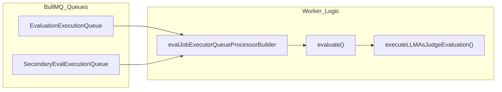
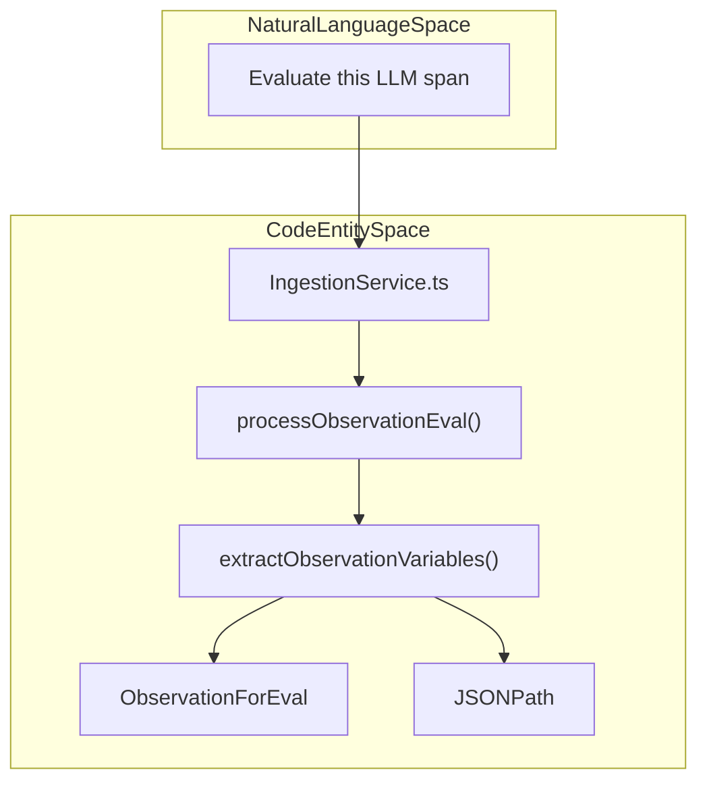
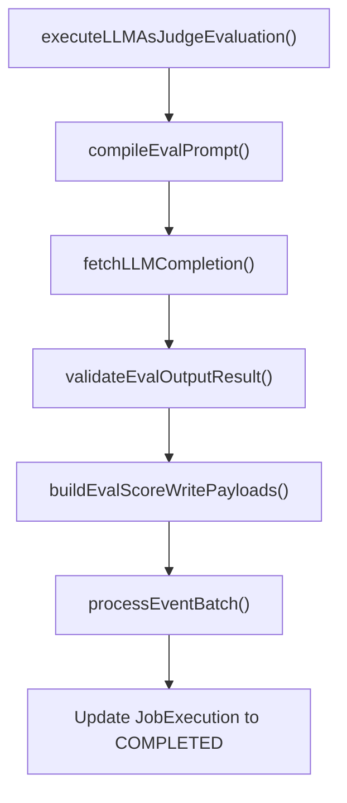

# 작업 실행

<details>
<summary>관련 소스 파일</summary>

다음 파일들은 이 위키 페이지를 생성하기 위한 컨텍스트로 사용되었습니다.

- [packages/shared/src/server/ingestion/extractToolsBackend.ts](packages/shared/src/server/ingestion/extractToolsBackend.ts)
- [packages/shared/src/utils/chatml/adapters/aisdk.ts](packages/shared/src/utils/chatml/adapters/aisdk.ts)
- [packages/shared/src/utils/chatml/adapters/gemini.ts](packages/shared/src/utils/chatml/adapters/gemini.ts)
- [packages/shared/src/utils/chatml/adapters/langgraph.ts](packages/shared/src/utils/chatml/adapters/langgraph.ts)
- [packages/shared/src/utils/chatml/adapters/microsoft-agent.ts](packages/shared/src/utils/chatml/adapters/microsoft-agent.ts)
- [packages/shared/src/utils/chatml/adapters/openai.ts](packages/shared/src/utils/chatml/adapters/openai.ts)
- [packages/shared/src/utils/chatml/adapters/pydantic-ai.ts](packages/shared/src/utils/chatml/adapters/pydantic-ai.ts)
- [packages/shared/src/utils/chatml/helpers.ts](packages/shared/src/utils/chatml/helpers.ts)
- [web/src/features/evals/components/evaluator-table.tsx](web/src/features/evals/components/evaluator-table.tsx)
- [web/src/features/evals/components/inner-evaluator-form.tsx](web/src/features/evals/components/inner-evaluator-form.tsx)
- [web/src/features/evals/server/router.ts](web/src/features/evals/server/router.ts)
- [web/src/utils/chatml/extractTools.ts](web/src/utils/chatml/extractTools.ts)
- [worker/src/__tests__/evalService.filtering.test.ts](worker/src/__tests__/evalService.filtering.test.ts)
- [worker/src/__tests__/evalService.test.ts](worker/src/__tests__/evalService.test.ts)
- [worker/src/__tests__/extractToolsBackend.test.ts](worker/src/__tests__/extractToolsBackend.test.ts)
- [worker/src/ee/cloudUsageMetering/handleCloudUsageMeteringJob.ts](worker/src/ee/cloudUsageMetering/handleCloudUsageMeteringJob.ts)
- [worker/src/features/evaluation/evalService.ts](worker/src/features/evaluation/evalService.ts)
- [worker/src/queues/__tests__/otelToObservationForEval.test.ts](worker/src/queues/__tests__/otelToObservationForEval.test.ts)
- [worker/src/queues/batchExportQueue.ts](worker/src/queues/batchExportQueue.ts)
- [worker/src/queues/cloudUsageMeteringQueue.ts](worker/src/queues/cloudUsageMeteringQueue.ts)
- [worker/src/queues/evalQueue.ts](worker/src/queues/evalQueue.ts)

</details>


이 페이지는 Langfuse의 LLM-as-a-judge 평가 시스템에서 evaluation job의 execution phase를 문서화합니다. Queued evaluation job이 어떻게 처리되는지, tracing data에서 variable이 어떻게 추출되는지, prompt가 어떻게 compile되는지, LLM call이 어떻게 수행되는지, 그리고 error가 어떻게 처리되는지를 다룹니다.

## 작업 실행 라이프사이클

Evaluation job은 lifecycle 동안 여러 state를 거치며, PostgreSQL의 `JobExecution` model이 이를 관리합니다.

Title: Job Execution State Machine
```mermaid
stateDiagram-v2
    [*] --> "PENDING" : "Job created"
    "PENDING" --> "DELAYED" : "LLM rate limit (429/5xx)"
    "DELAYED" --> "PENDING" : "Retry scheduled (exp. backoff)"
    "PENDING" --> "COMPLETED" : "Successful execution"
    "PENDING" --> "ERROR" : "Unrecoverable/Max retries"
    "PENDING" --> "CANCELLED" : "Trace deselected/Deleted"
    "COMPLETED" --> [*]
    "ERROR" --> [*]
    "CANCELLED" --> [*]
```

**Job Execution Lifecycle State**

| State | Description |
|-------|-------------|
| `PENDING` | Job이 queue에 들어가 worker가 처리하기를 기다리는 상태입니다. |
| `DELAYED` | Job에서 retry 가능한 error(예: LLM rate limit)가 발생했고 retry가 schedule된 상태입니다. |
| `COMPLETED` | Job이 성공적으로 실행되었고 결과 score가 persisted된 상태입니다. |
| `ERROR` | Job이 복구 불가능한 error로 실패했거나 최대 retry 횟수를 초과한 상태입니다. |
| `CANCELLED` | Job이 취소된 상태이며, 일반적으로 underlying trace가 더 이상 filter와 match되지 않기 때문입니다. |

출처: `[worker/src/features/evaluation/evalService.ts:4-9]()`, `[worker/src/queues/evalQueue.ts:178-201]()`

## 큐 프로세서

Worker service는 BullMQ processor를 사용해 evaluation job의 execution을 처리합니다. 시스템은 job creation(ingestion으로 trigger됨)과 job execution(LLM call)을 구분합니다.

Title: Evaluation Queue Processing Flow


### 실행 라우팅
`evalJobExecutorQueueProcessorBuilder`는 evaluation execution용 processor를 생성합니다. High-volume project에서 "noisy neighbor" 문제를 방지하기 위해 secondary queue를 지원합니다.

- **Redirection Logic**: `enableRedirectToSecondaryQueue`가 true이고 `projectId`가 `LANGFUSE_SECONDARY_EVAL_EXECUTION_QUEUE_ENABLED_PROJECT_IDS` environment variable에 포함되어 있으면, job은 `SecondaryEvalExecutionQueue.getInstance()`를 통해 `SecondaryEvalExecutionQueue`로 이동됩니다. `[worker/src/queues/evalQueue.ts:132-157]()`
- **Instrumentation**: 각 job execution은 `instrumentAsync`를 사용한 OpenTelemetry span으로 감싸지며, `jobExecutionId`와 `projectId`가 attribute로 capture됩니다. `[worker/src/queues/evalQueue.ts:159-174]()`, `[worker/src/features/evaluation/evalService.ts:26-26]()`

출처: `[worker/src/queues/evalQueue.ts:118-157]()`, `[worker/src/queues/evalQueue.ts:176-177]()`, `[worker/src/features/evaluation/evalService.ts:26-26]()`

## Trace-Level 평가 실행

`evalService.ts`의 `evaluate()` 함수는 trace-level evaluation의 primary entry point입니다.

1.  **Validation**: `JobExecution`과 `JobConfiguration`을 가져옵니다. Job이 이미 cancelled되었거나 configuration이 더 이상 executable하지 않으면(예: model config 누락), `isJobConfigExecutable`을 사용해 execution을 중지합니다. `[worker/src/features/evaluation/evalService.ts:58-58]()`
2.  **Variable Extraction**: Job configuration에 정의된 모든 template variable을 resolve하기 위해 `extractVariablesFromTracingData()`를 호출합니다. `[worker/src/__tests__/evalService.test.ts:33-34]()`
3.  **Core Execution**: Resolved data를 LLM interaction을 관리하는 `executeLLMAsJudgeEvaluation()`에 전달합니다. `[worker/src/features/evaluation/evalService.ts:75-75]()`

출처: `[worker/src/features/evaluation/evalService.ts:16-16]()`, `[worker/src/__tests__/evalService.test.ts:31-34]()`, `[worker/src/features/evaluation/evalService.ts:58-58]()`

## Observation-Level Evaluation (LLM-as-Judge)

Trace-level evaluation 외에도 Langfuse는 `observationEval`(개별 span에 대한 LLM-as-Judge)을 지원합니다. 이는 `processObservationEval` 함수가 처리합니다.

### Observation Eval의 데이터 흐름
시스템은 `extractObservationVariables`를 사용해 observation data(`input`, `output`, `metadata` 등)에서 variable을 구체적으로 추출합니다.

Title: Observation Evaluation System Mapping


- **Variable Extraction**: `extractObservationVariables`는 `JSONPath`를 사용해 observation payload에서 특정 field를 가져옵니다. `jsonSelector`가 있을 때만 field를 parse하는 lazy JSON parsing을 지원합니다. `[worker/src/features/evaluation/observationEval/extractObservationVariables.ts:40-67]()`, `[packages/shared/src/features/evals/utilities.ts:61-73]()`
- **Mapping**: Variable은 `selectedColumnId`(예: `input`, `output`, `metadata`)와 optional `jsonSelector`를 식별하는 `ObservationVariableMapping`을 기준으로 추출됩니다. `[worker/src/features/evaluation/observationEval/extractObservationVariables.ts:69-83]()`
- **Schema Validation**: Observation은 identifier, core property, trace-level context를 포함하는 `observationForEvalSchema`에 대해 validation됩니다. `[packages/shared/src/features/evals/observationForEval.ts:15-72]()`
- **OTEL Integration**: OpenTelemetry를 통해 ingest된 span은 `OtelIngestionProcessor`와 `convertEventRecordToObservationForEval`을 통해 `ObservationForEval`로 mapping됩니다. `[worker/src/queues/__tests__/otelToObservationForEval.test.ts:14-19]()`, `[worker/src/queues/__tests__/otelToObservationForEval.test.ts:98-103]()`

출처: `[worker/src/queues/evalQueue.ts:17-17]()`, `[worker/src/features/evaluation/observationEval/extractObservationVariables.ts:13-53]()`, `[packages/shared/src/features/evals/utilities.ts:76-84]()`, `[packages/shared/src/features/evals/observationForEval.ts:15-72]()`, `[worker/src/queues/__tests__/otelToObservationForEval.test.ts:14-103]()`

## 변수 추출

`extractVariablesFromTracingData()` 함수는 `JobConfiguration`에 정의된 `variableMapping`을 기반으로 trace, observation, dataset item에서 값을 가져옵니다.

### 지원되는 객체 유형

| Target Object | Data Source | Extraction Method |
| :--- | :--- | :--- |
| `trace` | ClickHouse | `input`, `output`, 또는 `metadata`에서 JSONPath extraction. |
| `observation` | ClickHouse | `objectName`(예: "MyRetriever")으로 match하고 `input`/`output`에서 추출. |
| `dataset_item` | PostgreSQL | `input` 또는 `expected_output`에 대해 `DatasetItem` table에서 direct lookup. |

### 성능 최적화
시스템은 target object의 효율적인 matching을 위해 `InMemoryFilterService`를 활용합니다. `[worker/src/features/evaluation/evalService.ts:23-23]()`. Extraction 중에는 `extractValueFromObject`가 multi-encoded JSON string을 처리하여 robust data retrieval을 보장합니다. `[packages/shared/src/features/evals/utilities.ts:75-113]()`

### Tool Extraction
시스템은 `extractToolsBackend.ts`를 사용해 ingestion data에서 tool definition과 tool call도 추출할 수 있습니다. 이는 다양한 format(OpenAI, AI SDK, Anthropic)을 normalized `ClickhouseToolDefinition` 또는 `ClickhouseToolArgument` schema로 flatten하는 과정을 포함합니다. `[packages/shared/src/server/ingestion/extractToolsBackend.ts:11-37]()`, `[packages/shared/src/server/ingestion/extractToolsBackend.ts:169-205]()`

출처: `[worker/src/features/evaluation/evalService.ts:23-23]()`, `[packages/shared/src/features/evals/utilities.ts:75-113]()`, `[packages/shared/src/server/ingestion/extractToolsBackend.ts:11-205]()`

## 프롬프트 컴파일

Prompt는 Mustache-style syntax를 사용해 compile됩니다. `compileEvalPrompt` utility는 추출된 variable을 `EvalTemplate`에 substitute합니다.

- **Logic**: `compileTemplateString` 함수가 variable replacement를 처리합니다. `[worker/src/__tests__/evalService.test.ts:76-83]()`
- **Data Types**: Compilation logic은 `parseUnknownToString`을 통해 다양한 data type을 처리합니다.
    - `null`/`undefined`는 empty string으로 변환됩니다. `[packages/shared/src/features/evals/utilities.ts:7-10]()`
    - Object는 `JSON.stringify`를 통해 stringify됩니다. `[packages/shared/src/features/evals/utilities.ts:18-20]()`
    - Array는 comma로 join됩니다. `[worker/src/__tests__/evalService.test.ts:185-191]()`
    - Number와 Boolean은 string representation으로 변환됩니다. `[packages/shared/src/features/evals/utilities.ts:11-17]()`

출처: `[worker/src/features/evaluation/evalService.ts:69-73]()`, `[worker/src/__tests__/evalService.test.ts:76-199]()`, `[packages/shared/src/features/evals/utilities.ts:7-26]()`

## Core LLM-as-Judge Pipeline

`executeLLMAsJudgeEvaluation()` 함수는 실제 LLM call을 실행하고 output을 처리합니다.

Title: LLM Evaluation Execution Pipeline


### LLM Response Validation
LLM output은 `PersistedEvalOutputDefinitionSchema`에 대해 validation됩니다. 이를 통해 LLM이 예상 score type(numeric, categorical, boolean)을 반환했는지 확인합니다. Validation은 `validateEvalOutputResult`가 수행합니다. `[worker/src/features/evaluation/evalService.ts:61-61]()`

출처: `[worker/src/features/evaluation/evalService.ts:69-74]()`, `[worker/src/features/evaluation/evalService.ts:61-61]()`

## 오류 처리와 Config Blocking

Langfuse는 configuration issue로 지속적으로 실패하는 evaluator에 대해 resource waste를 방지하기 위한 "fail-fast" mechanism을 구현합니다.

### 자동 차단
Evaluation job이 retry 불가능한 error(예: invalid model parameter)로 실패하면, system은 `JobConfiguration`을 block합니다.
- **Reasoning**: Specific failure cause를 식별하기 위해 `getBlockReasonForInvalidModelConfig`를 사용합니다. `[worker/src/features/evaluation/evalService.ts:57-57]()`
- **Effect**: `JobConfiguration` state가 `blockEvaluatorConfigs`를 통해 `DISABLED`로 설정되어 추가 job creation을 방지합니다. `[worker/src/features/evaluation/evalService.ts:35-36]()`

### Rate Limit에 대한 Retry Logic
LLM provider의 `429`(Rate Limit) 또는 `5xx`(Server Error)에 대해, system은 specialized retry logic을 구현합니다.
1. **Check Age**: Job이 생성된 지 24시간 미만이면 retry가 schedule됩니다. `[worker/src/queues/evalQueue.ts:191-192]()`
2. **Backoff**: Exponential backoff를 사용합니다(예: `delayInMs`를 통해). `[worker/src/queues/evalQueue.ts:18-19]()`
3. **State**: Job은 `DELAYED`로 설정되거나 delay와 함께 re-queued됩니다. `[worker/src/queues/evalQueue.ts:196-197]()`

출처: `[worker/src/features/evaluation/evalService.ts:34-36]()`, `[worker/src/queues/evalQueue.ts:185-210]()`, `[worker/src/queues/evalQueue.ts:18-19]()`

## 예약된 백그라운드 작업

Worker service는 scheduled maintenance와 metering task도 처리합니다.

- **Cloud Usage Metering**: `handleCloudUsageMeteringJob`은 billing을 위해 project별 observation, trace, score count를 aggregate하려고 주기적으로 실행됩니다. 이 metric은 `stripe.billing.meterEvents.create`를 통해 Stripe로 push됩니다. `[worker/src/ee/cloudUsageMetering/handleCloudUsageMeteringJob.ts:27-211]()`. Job state는 `cronJobs` table에서 추적됩니다. `[worker/src/queues/cloudUsageMeteringQueue.ts:48-56]()`
- **Batch Export**: `batchExportQueueProcessor`는 long-running data export request를 처리하고, `handleBatchExportJob`의 outcome에 따라 `BatchExport` status를 `FAILED` 또는 `COMPLETED`로 update합니다. `[worker/src/queues/batchExportQueue.ts:14-53]()`

출처: `[worker/src/ee/cloudUsageMetering/handleCloudUsageMeteringJob.ts:27-211]()`, `[worker/src/queues/cloudUsageMeteringQueue.ts:48-56]()`, `[worker/src/queues/batchExportQueue.ts:14-53]()`
