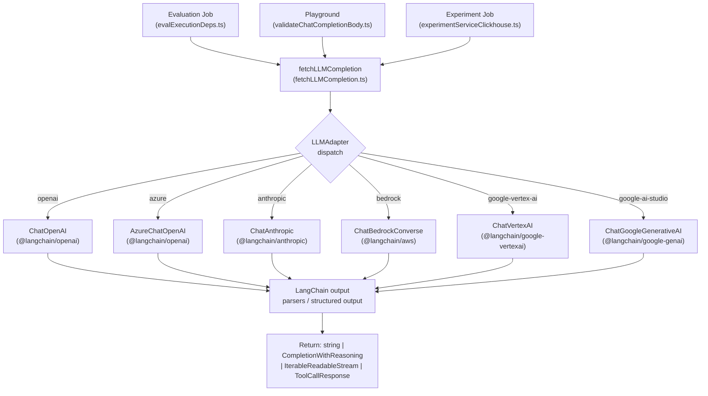
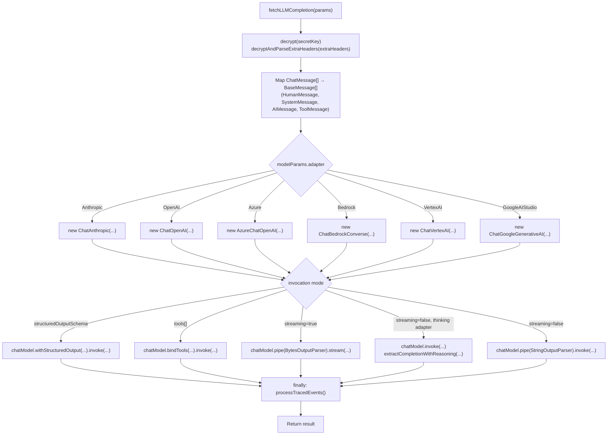

# LLM 통합

<details>
<summary>관련 소스 파일</summary>

다음 파일들은 이 위키 페이지를 생성하기 위한 컨텍스트로 사용되었습니다.

- [packages/shared/src/features/experiments/utils.ts](packages/shared/src/features/experiments/utils.ts)
- [packages/shared/src/interfaces/customLLMProviderConfigSchemas.ts](packages/shared/src/interfaces/customLLMProviderConfigSchemas.ts)
- [packages/shared/src/server/llm/fetchLLMCompletion.ts](packages/shared/src/server/llm/fetchLLMCompletion.ts)
- [packages/shared/src/server/llm/getInternalTracingHandler.ts](packages/shared/src/server/llm/getInternalTracingHandler.ts)
- [packages/shared/src/server/llm/testModelCall.ts](packages/shared/src/server/llm/testModelCall.ts)
- [packages/shared/src/server/llm/types.ts](packages/shared/src/server/llm/types.ts)
- [web/src/components/ModelParameters/LLMApiKeyComponent.tsx](web/src/components/ModelParameters/LLMApiKeyComponent.tsx)
- [web/src/components/ModelParameters/index.tsx](web/src/components/ModelParameters/index.tsx)
- [web/src/features/annotation-queues/components/CreateOrEditAnnotationQueueButton.tsx](web/src/features/annotation-queues/components/CreateOrEditAnnotationQueueButton.tsx)
- [web/src/features/annotation-queues/components/DeleteAnnotationQueueButton.tsx](web/src/features/annotation-queues/components/DeleteAnnotationQueueButton.tsx)
- [web/src/features/experiments/server/router.ts](web/src/features/experiments/server/router.ts)
- [web/src/features/experiments/types.ts](web/src/features/experiments/types.ts)
- [web/src/features/llm-api-key/server/router.ts](web/src/features/llm-api-key/server/router.ts)
- [web/src/features/llm-api-key/types.ts](web/src/features/llm-api-key/types.ts)
- [web/src/features/natural-language-filters/server/router.ts](web/src/features/natural-language-filters/server/router.ts)
- [web/src/features/natural-language-filters/server/utils.ts](web/src/features/natural-language-filters/server/utils.ts)
- [web/src/features/playground/page/components/CreateOrEditLLMSchemaDialog.tsx](web/src/features/playground/page/components/CreateOrEditLLMSchemaDialog.tsx)
- [web/src/features/playground/page/components/CreateOrEditLLMToolDialog.tsx](web/src/features/playground/page/components/CreateOrEditLLMToolDialog.tsx)
- [web/src/features/public-api/components/CreateLLMApiKeyDialog.tsx](web/src/features/public-api/components/CreateLLMApiKeyDialog.tsx)
- [web/src/features/public-api/components/CreateLLMApiKeyForm.tsx](web/src/features/public-api/components/CreateLLMApiKeyForm.tsx)
- [web/src/features/public-api/components/LLMApiKeyList.tsx](web/src/features/public-api/components/LLMApiKeyList.tsx)
- [web/src/features/public-api/components/UpdateLLMApiKeyDialog.tsx](web/src/features/public-api/components/UpdateLLMApiKeyDialog.tsx)
- [worker/src/__tests__/experimentsService.test.ts](worker/src/__tests__/experimentsService.test.ts)
- [worker/src/features/experiments/__tests__/scheduleExperimentEvals.test.ts](worker/src/features/experiments/__tests__/scheduleExperimentEvals.test.ts)
- [worker/src/features/experiments/experimentServiceClickhouse.ts](worker/src/features/experiments/experimentServiceClickhouse.ts)
- [worker/src/features/experiments/scheduleExperimentEvals.ts](worker/src/features/experiments/scheduleExperimentEvals.ts)
- [worker/src/features/experiments/utils.ts](worker/src/features/experiments/utils.ts)
- [worker/src/features/utils/utilities.ts](worker/src/features/utils/utilities.ts)

</details>


이 페이지는 LLM 통합 계층을 문서화합니다. 여기에는 `fetchLLMCompletion` abstraction, `LLMAdapter` enum과 지원 provider, message type system, structured output과 tool-call 처리, 그리고 evaluation 및 experiment execution의 internal tracing이 포함됩니다.

- LLM-as-judge evaluation job이 이 계층을 어떻게 *invoke*하는지는 [10.4]()를 참고하세요.
- LLM provider API key가 UI를 통해 어떻게 저장, 암호화, 관리되는지는 [10.7]()을 참고하세요.

---

## 개요

Langfuse 내부의 모든 LLM call(evaluation, playground, experiment)은 `packages/shared/src/server/llm/fetchLLMCompletion.ts`에 정의된 단일 shared function인 `fetchLLMCompletion`을 거칩니다 [packages/shared/src/server/llm/fetchLLMCompletion.ts:179-213](). 이 함수는 adapter type을 기준으로 적절한 [LangChain](https://js.langchain.com/) chat model class를 선택하고, normalized message list를 구성한 뒤 call을 dispatch합니다. 호출된 overload에 따라 streaming byte stream, plain string, `CompletionWithReasoning`, structured JSON object, 또는 `ToolCallResponse`를 반환합니다 [packages/shared/src/server/llm/fetchLLMCompletion.ts:179-206]().

다음 diagram은 high-level call path를 보여줍니다.

**다이어그램: LLM Integration Call Path**



출처: [packages/shared/src/server/llm/fetchLLMCompletion.ts:3-19](), [packages/shared/src/server/llm/fetchLLMCompletion.ts:179-213](), [packages/shared/src/server/llm/types.ts:335-343]()

---

## `LLMAdapter`와 지원 Provider

`packages/shared/src/server/llm/types.ts`의 `LLMAdapter` enum은 provider-specific behavior를 선택하기 위해 모든 곳에서 사용되는 discriminant입니다 [packages/shared/src/server/llm/types.ts:335-343]().

| `LLMAdapter` value | LangChain class | Auth mechanism |
|---|---|---|
| `openai` | `ChatOpenAI` | API key(`secretKey`) |
| `azure` | `AzureChatOpenAI` | API key + deployment base URL |
| `anthropic` | `ChatAnthropic` | API key |
| `bedrock` | `ChatBedrockConverse` | AWS credential 또는 default provider chain |
| `google-vertex-ai` | `ChatVertexAI` | GCP service account JSON 또는 ADC |
| `google-ai-studio` | `ChatGoogleGenerativeAI` | API key |

각 adapter는 `types.ts`에 hardcoded된 known model name list를 가집니다 [packages/shared/src/server/llm/types.ts:384-550](). 이 list는 UI의 model dropdown과 `llmApiKeyRouter`에서 connection testing을 위한 default model selection을 구동합니다 [web/src/features/llm-api-key/server/router.ts:104-108]().

출처: [packages/shared/src/server/llm/types.ts:335-550](), [packages/shared/src/server/llm/fetchLLMCompletion.ts:3-19](), [web/src/features/llm-api-key/server/router.ts:100-169]()

---

## 타입 시스템

### 메시지 타입

**다이어그램: Chat Message Type Hierarchy**

```mermaid
classDiagram
    class ChatMessageRole {
        <<enum>>
        "System"
        "Developer"
        "User"
        "Assistant"
        "Tool"
        "Model"
    }
    class ChatMessageType {
        <<enum>>
        "System"
        "Developer"
        "User"
        "AssistantText"
        "AssistantToolCall"
        "ToolResult"
        "ModelText"
        "PublicAPICreated"
        "Placeholder"
    }
    class SystemMessageSchema {
        "type: system"
        "role: system"
        "content: string"
    }
    class UserMessageSchema {
        "type: user"
        "role: user"
        "content: string"
    }
    class AssistantToolCallMessageSchema {
        "type: assistant-tool-call"
        "role: assistant"
        "content: string"
        "toolCalls: LLMToolCall[]"
    }
    class ToolResultMessageSchema {
        "type: tool-result"
        "role: tool"
        "content: string"
        "toolCallId: string"
    }
    class PlaceholderMessageSchema {
        "type: placeholder"
        "name: string"
    }
    "ChatMessageSchema" --> SystemMessageSchema
    "ChatMessageSchema" --> UserMessageSchema
    "ChatMessageSchema" --> AssistantToolCallMessageSchema
    "ChatMessageSchema" --> ToolResultMessageSchema
    "ChatMessageSchema" --> PlaceholderMessageSchema
```

출처: [packages/shared/src/server/llm/types.ts:126-233]()

Union type `ChatMessage`는 `fetchLLMCompletion`의 standard input입니다 [packages/shared/src/server/llm/types.ts:214-235](). Message는 LangChain `BaseMessage` subclass인 `HumanMessage`, `SystemMessage`, `AIMessage`, `ToolMessage`로 mapping됩니다 [packages/shared/src/server/llm/fetchLLMCompletion.ts:8-13]().

### 모델 파라미터

`ModelParams`는 provider identity와 `ModelConfig`(inference parameter)의 조합입니다 [packages/shared/src/server/llm/types.ts:366-375]().

```typescript
ModelParams = {
  provider: string   // identifies the LLM API key record in the database
  adapter: LLMAdapter
  model: string
} & ModelConfig
```

`ModelConfig`는 `max_tokens`, `temperature`, `top_p`, `maxReasoningTokens` 같은 field를 포함합니다 [packages/shared/src/server/llm/types.ts:352-364](). `UIModelParams`는 settings UI를 위해 각 field를 `{ value: T; enabled: boolean }`로 감쌉니다 [packages/shared/src/server/llm/types.ts:378-382]().

출처: [packages/shared/src/server/llm/types.ts:352-382](), [web/src/components/ModelParameters/index.tsx:40-55]()

---

## `fetchLLMCompletion` 구현

이 함수는 input parameter에 따라 여러 return type을 지원하기 위해 여러 overload로 선언됩니다 [packages/shared/src/server/llm/fetchLLMCompletion.ts:179-203]().

**Parameter:**

| Parameter | Type | Purpose |
|---|---|---|
| `messages` | `ChatMessage[]` | Normalized message list |
| `modelParams` | `ModelParams` | Provider/model/config |
| `llmConnection` | `{ secretKey, extraHeaders?, baseURL?, config? }` | 암호화된 connection detail |
| `structuredOutputSchema` | `ZodSchema \| LLMJSONSchema` | Structured output mode 강제 |
| `tools` | `LLMToolDefinition[]` | Function calling을 위한 tool definition |
| `traceSinkParams` | `TraceSinkParams` | Internal trace ingestion 제어 |

Database에 저장되는 `secretKey`는 AES-encrypted됩니다. `fetchLLMCompletion`은 내부적으로 `decrypt(llmConnection.secretKey)`를 호출합니다 [packages/shared/src/server/llm/fetchLLMCompletion.ts:227]().

**다이어그램: fetchLLMCompletion Dispatch Logic**



출처: [packages/shared/src/server/llm/fetchLLMCompletion.ts:179-583]()

---

## Reasoning / Thinking Block 추출

`Bedrock`, `VertexAI`, `GoogleAIStudio` adapter의 경우 response에는 primary text와 함께 reasoning/thinking content block이 포함될 수 있습니다 [packages/shared/src/server/llm/fetchLLMCompletion.ts:76-80](). `fetchLLMCompletion`은 `THINKING_BLOCK_TYPES`를 통해 이를 식별합니다 [packages/shared/src/server/llm/fetchLLMCompletion.ts:76-80]().

Return type `CompletionWithReasoning`은 `{ text: string; reasoning?: string }`입니다 [packages/shared/src/server/llm/fetchLLMCompletion.ts:55](). Extraction은 `extractCompletionWithReasoning`이 처리하며, `AIMessage`에서 thinking block(예: Bedrock의 `reasoning_content` 또는 Vertex의 `reasoning`)을 standard text block과 분리합니다 [packages/shared/src/server/llm/fetchLLMCompletion.ts:605-631]().

출처: [packages/shared/src/server/llm/fetchLLMCompletion.ts:55-84](), [packages/shared/src/server/llm/fetchLLMCompletion.ts:605-631]()

---

## Structured Output

`structuredOutputSchema`가 전달되면(Zod schema 또는 raw JSON schema object), 함수는 `chatModel.withStructuredOutput(schema, options)`를 호출합니다 [packages/shared/src/server/llm/fetchLLMCompletion.ts:460-476](). 이는 evaluation system이 사용하는 primary path입니다. Eval template은 expected output schema(예: `{ score: number, reasoning: string }`)를 정의하고, result는 직접 parse됩니다.

출처: [packages/shared/src/server/llm/fetchLLMCompletion.ts:460-476](), [packages/shared/src/server/llm/types.ts:18-42]()

---

## Tool Calling

`tools`가 비어 있지 않으면, `fetchLLMCompletion`은 각 `LLMToolDefinition`을 LangChain format으로 변환하고 `chatModel.bindTools(langchainTools).invoke(...)`를 호출합니다 [packages/shared/src/server/llm/fetchLLMCompletion.ts:478-512](). Raw result는 `ToolCallResponseSchema`로 parse됩니다 [packages/shared/src/server/llm/types.ts:117-124]().

출처: [packages/shared/src/server/llm/fetchLLMCompletion.ts:478-512](), [packages/shared/src/server/llm/types.ts:71-125]()

---

## Eval 및 Experiment Execution의 Internal Tracing

`traceSinkParams`가 제공되면 `fetchLLMCompletion`은 `getInternalTracingHandler(traceSinkParams)`를 호출합니다. 이는 LLM call을 Langfuse internal trace로 ingest하는 LangChain `CallbackHandler`를 반환합니다 [packages/shared/src/server/llm/fetchLLMCompletion.ts:246-250]().

Safeguard는 infinite eval loop를 방지합니다. `traceSinkParams`의 `environment` field는 반드시 `"langfuse"`로 시작해야 합니다 [packages/shared/src/server/llm/fetchLLMCompletion.ts:237-244](). 이 mechanism은 다음에서 사용됩니다.
- **Evaluations**: LLM-as-judge call을 trace하기 위해 사용됩니다.
- **Experiments**: `worker/src/features/experiments/experimentServiceClickhouse.ts`에서 `processLLMCall`은 experiment run을 trace하기 위해 environment를 `LangfuseInternalTraceEnvironment.PromptExperiments`로 설정합니다 [worker/src/features/experiments/experimentServiceClickhouse.ts:182-185]().

출처: [packages/shared/src/server/llm/fetchLLMCompletion.ts:233-251](), [packages/shared/src/server/llm/getInternalTracingHandler.ts:74-85](), [worker/src/features/experiments/experimentServiceClickhouse.ts:181-227]()

---

## LLM API 키 관리

LLM provider용 API key는 `llmApiKeyRouter`를 통해 관리됩니다 [web/src/features/llm-api-key/server/router.ts:192]().

- **Creation**: `create` procedure는 PostgreSQL에 저장하기 전에 system `ENCRYPTION_KEY`를 사용해 `secretKey`를 encrypt합니다 [web/src/features/llm-api-key/server/router.ts:193-248]().
- **Testing**: `testLLMConnection` 함수는 credential이 저장되기 전에 이를 검증하기 위해 `fetchLLMCompletion`을 사용해 simple completion을 시도합니다 [web/src/features/llm-api-key/server/router.ts:100-169]().
- **Sentinels**: Self-hosted deployment의 경우, `BEDROCK_USE_DEFAULT_CREDENTIALS`와 `VERTEXAI_USE_DEFAULT_CREDENTIALS` 같은 sentinel string은 explicit key 대신 environment-based authentication(IAM role, ADC)을 사용할 수 있게 합니다 [packages/shared/src/server/llm/fetchLLMCompletion.ts:26-28]().
- **Base URL Validation**: 모든 custom base URL은 SSRF와 internal hostname 접근을 방지하기 위해 `validateLlmConnectionBaseURL`을 통해 validation됩니다 [web/src/features/llm-api-key/server/router.ts:171-190]().

출처: [web/src/features/llm-api-key/server/router.ts:1-248](), [web/src/features/public-api/components/CreateLLMApiKeyForm.tsx:85-178](), [packages/shared/src/server/llm/utils.ts:33-103]()
