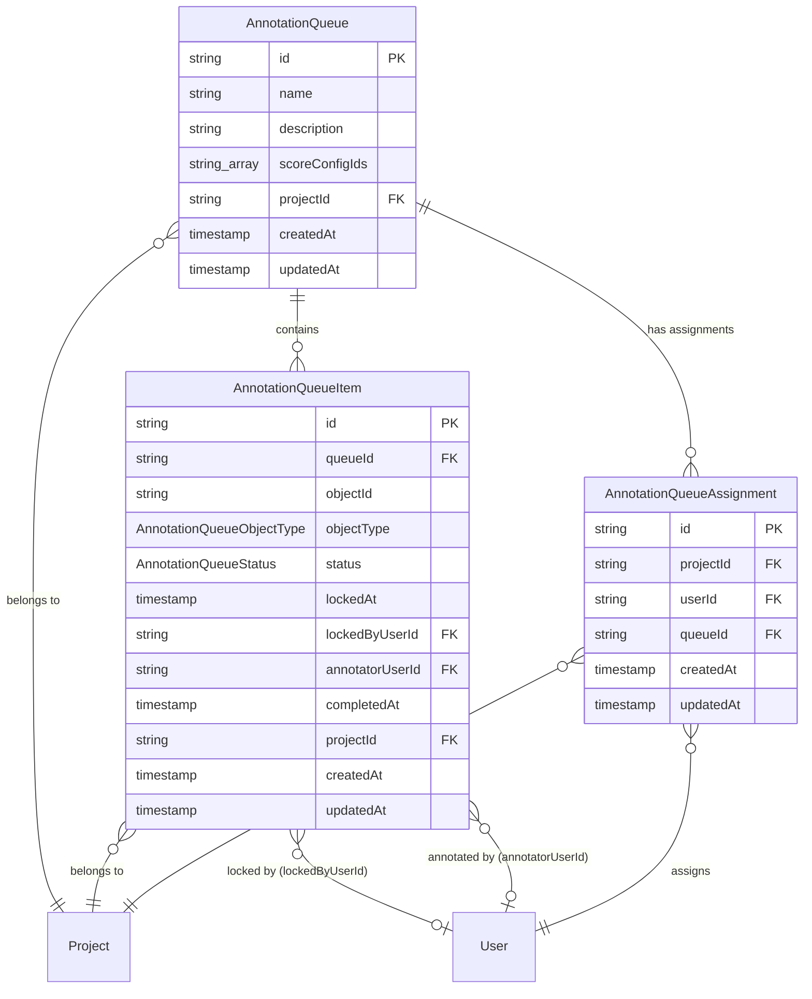
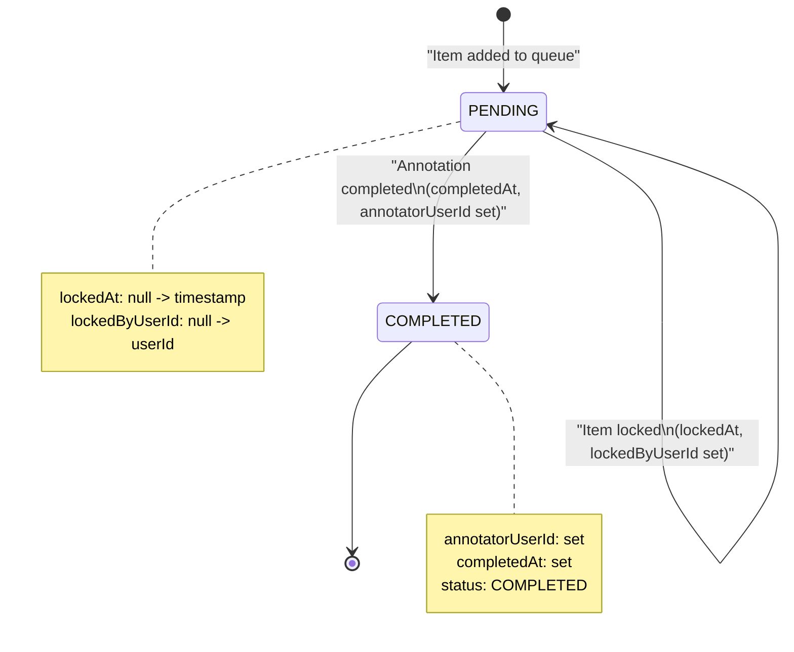
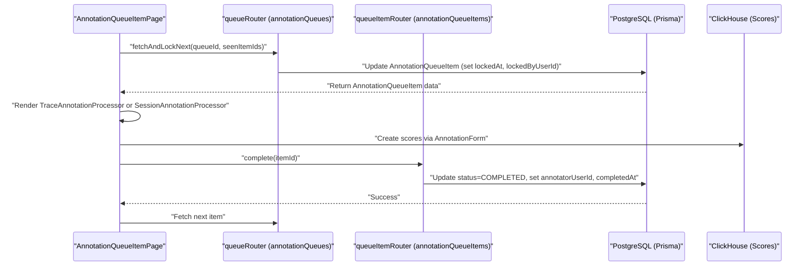

# Annotation Queue

관련 소스 파일

다음 파일들은 이 위키 페이지를 생성하기 위한 컨텍스트로 사용되었습니다.

- [packages/shared/src/server/dataset-run-items/addToDeleteQueue.ts](packages/shared/src/server/dataset-run-items/addToDeleteQueue.ts)
- [packages/shared/src/server/redis/datasetDelete.ts](packages/shared/src/server/redis/datasetDelete.ts)
- [web/src/__tests__/server/annotation-queue-items-trpc.servertest.ts](web/src/__tests__/server/annotation-queue-items-trpc.servertest.ts)
- [web/src/components/layouts/doc-popup.tsx](web/src/components/layouts/doc-popup.tsx)
- [web/src/components/session/NewDatasetItemFromTrace.tsx](web/src/components/session/NewDatasetItemFromTrace.tsx)
- [web/src/components/session/TraceEventsRow.tsx](web/src/components/session/TraceEventsRow.tsx)
- [web/src/components/session/TraceRow.tsx](web/src/components/session/TraceRow.tsx)
- [web/src/components/ui/object-not-found-card.tsx](web/src/components/ui/object-not-found-card.tsx)
- [web/src/features/annotation-queues/components/AnnotationQueueItemPage.tsx](web/src/features/annotation-queues/components/AnnotationQueueItemPage.tsx)
- [web/src/features/annotation-queues/components/AnnotationQueueItemsTable.tsx](web/src/features/annotation-queues/components/AnnotationQueueItemsTable.tsx)
- [web/src/features/annotation-queues/components/AnnotationQueuesItem.tsx](web/src/features/annotation-queues/components/AnnotationQueuesItem.tsx)
- [web/src/features/annotation-queues/components/AnnotationQueuesTable.tsx](web/src/features/annotation-queues/components/AnnotationQueuesTable.tsx)
- [web/src/features/annotation-queues/components/processors/SessionAnnotationProcessor.tsx](web/src/features/annotation-queues/components/processors/SessionAnnotationProcessor.tsx)
- [web/src/features/annotation-queues/components/processors/TraceAnnotationProcessor.tsx](web/src/features/annotation-queues/components/processors/TraceAnnotationProcessor.tsx)
- [web/src/features/annotation-queues/components/shared/AnnotationDrawerSection.tsx](web/src/features/annotation-queues/components/shared/AnnotationDrawerSection.tsx)
- [web/src/features/annotation-queues/components/shared/CommentsSection.tsx](web/src/features/annotation-queues/components/shared/CommentsSection.tsx)
- [web/src/features/annotation-queues/components/shared/hooks/useAnnotationObjectData.ts](web/src/features/annotation-queues/components/shared/hooks/useAnnotationObjectData.ts)
- [web/src/features/annotation-queues/server/annotationQueueItemsRouter.ts](web/src/features/annotation-queues/server/annotationQueueItemsRouter.ts)
- [web/src/features/annotation-queues/server/annotationQueuesRouter.ts](web/src/features/annotation-queues/server/annotationQueuesRouter.ts)
- [web/src/features/automations/components/DeleteAutomationButton.tsx](web/src/features/automations/components/DeleteAutomationButton.tsx)
- [web/src/features/datasets/components/DatasetAnalytics.tsx](web/src/features/datasets/components/DatasetAnalytics.tsx)
- [web/src/features/datasets/components/DeleteDatasetRunButton.tsx](web/src/features/datasets/components/DeleteDatasetRunButton.tsx)
- [web/src/features/prompts/components/NewPromptForm/index.tsx](web/src/features/prompts/components/NewPromptForm/index.tsx)
- [web/src/features/prompts/components/NewPromptForm/validation.ts](web/src/features/prompts/components/NewPromptForm/validation.ts)
- [web/src/features/prompts/components/prompt-detail.tsx](web/src/features/prompts/components/prompt-detail.tsx)
- [web/src/features/scores/components/multi-select-key-values.tsx](web/src/features/scores/components/multi-select-key-values.tsx)
- [web/src/pages/project/[projectId]/datasets/[datasetId]/index.tsx](web/src/pages/project/[projectId]/datasets/[datasetId]/index.tsx)
- [web/src/pages/project/[projectId]/datasets/[datasetId]/runs/[runId].tsx](web/src/pages/project/[projectId]/datasets/[datasetId]/runs/[runId].tsx)
- [web/src/pages/project/[projectId]/prompts/[[...folder]].tsx](web/src/pages/project/[projectId]/prompts/[[...folder]].tsx)
- [web/src/pages/project/[projectId]/prompts/metrics.tsx](web/src/pages/project/[projectId]/prompts/metrics.tsx)
- [web/src/utils/string.ts](web/src/utils/string.ts)

## 목적과 범위

Annotation Queue는 Langfuse에서 trace, observation, session을 수동으로 review하고 scoring하기 위한 human-in-the-loop workflow system을 제공합니다. 이 시스템을 통해 team은 manual review가 필요한 item을 named queue로 구성하고, 특정 user를 assign하며, structured lifecycle을 통해 progress를 추적할 수 있습니다.

주요 기능은 다음과 같습니다.
- **User Assignments**: `AnnotationQueueAssignment`를 통해 특정 team member로 queue access를 제한합니다. [[packages/shared/prisma/schema.prisma:566-579]]()
- **Locking Mechanism**: Active review 중 item을 일정 기간(일반적으로 5분) lock하여 concurrent editing을 방지합니다. [[web/src/features/annotation-queues/server/annotationQueueItemsRouter.ts:32-38]]()
- **Status Tracking**: `PENDING` 및 `COMPLETED` state로 progress를 monitor합니다. [[packages/shared/prisma/schema.prisma:556-559]]()
- **Schema Standardization**: Queue에 `ScoreConfig` definition을 연결하여 일관된 manual evaluation criteria를 보장합니다. [[packages/shared/prisma/schema.prisma:517-517]]()
- **Integrated Feedback**: Annotation process 중 internal comment와 mention을 지원합니다. [[web/src/features/annotation-queues/components/processors/SessionAnnotationProcessor.tsx:60-67]]()

**출처:** [[packages/shared/prisma/schema.prisma:511-579]](), [[web/src/features/annotation-queues/server/annotationQueueItemsRouter.ts:32-38]]()

---

## 핵심 데이터 모델

Annotation queue system은 Prisma를 통해 관리되는 PostgreSQL의 세 가지 주요 model로 구성됩니다.

### 엔티티 관계 다이어그램

**출처:** [[packages/shared/prisma/schema.prisma:511-579]]()

---

## AnnotationQueue 모델

`AnnotationQueue` table은 annotation이 필요한 item을 구성하기 위한 named queue를 정의합니다.

### 스키마

| Field | Type | Description |
|-------|------|-------------|
| `id` | string (cuid) | Primary key |
| `name` | string | Queue name(project별 unique) |
| `description` | string (nullable) | Optional description |
| `scoreConfigIds` | string[] | Annotation schema를 정의하는 `ScoreConfig` ID 배열 |
| `projectId` | string | `Project`에 대한 foreign key |
| `createdAt` | timestamp | Creation timestamp |
| `updatedAt` | timestamp | Last update timestamp |

### 주요 특성

- **Unique Constraint**: `@@unique([projectId, name])`은 project 내에서 queue name이 unique하도록 보장합니다. [[packages/shared/prisma/schema.prisma:526-526]]()
- **Score Configuration**: `scoreConfigIds` 배열은 annotation 중 어떤 score가 생성되어야 하는지 정의하여 evaluation process를 standardize합니다. [[packages/shared/prisma/schema.prisma:517-517]]()

**출처:** [[packages/shared/prisma/schema.prisma:511-527]]()

---

## AnnotationQueueItem 모델

`AnnotationQueueItem` table은 queue 내의 개별 item(trace, observation, session)을 나타냅니다.

### 스키마 [[packages/shared/prisma/schema.prisma:529-553]]()

| Field | Type | Description |
|-------|------|-------------|
| `id` | string (cuid) | Primary key |
| `queueId` | string | `AnnotationQueue`에 대한 foreign key |
| `objectId` | string | Annotation 대상 trace/observation/session의 ID |
| `objectType` | enum | Object type: `TRACE`, `OBSERVATION`, 또는 `SESSION` |
| `status` | enum | `PENDING` 또는 `COMPLETED`(default: `PENDING`) |
| `lockedAt` | timestamp (nullable) | Item이 annotation을 위해 lock된 시점 |
| `lockedByUserId` | string (nullable) | 현재 item을 lock한 user |
| `annotatorUserId` | string (nullable) | Annotation을 완료한 user |
| `completedAt` | timestamp (nullable) | Annotation이 완료된 시점 |
| `projectId` | string | `Project`에 대한 foreign key |

### 상태 흐름

**출처:** [[packages/shared/prisma/schema.prisma:529-553]](), [[packages/shared/prisma/schema.prisma:556-559]]()

---

## Annotation Workflow

### 구현과 데이터 흐름

Frontend implementation은 다양한 tRPC router를 통해 annotation lifecycle을 관리하기 위해 `AnnotationQueueItemPage`를 사용합니다.

**Title: Annotation Workflow Code Interaction**

### 단계별 프로세스

1.  **Item Retrieval & Locking**: UI는 `queueRouter`를 통해 `fetchAndLockNext`를 호출합니다. 이 procedure는 `PENDING` item을 찾고 `lockedByUserId`를 설정합니다. [[web/src/features/annotation-queues/components/AnnotationQueueItemPage.tsx:48-65]]()
2.  **Object Data Fetching**: `useAnnotationObjectData` hook은 `objectType`을 기반으로 underlying trace, observation, session data를 resolve합니다. Legacy ClickHouse path와 `getObservationByIdFromEventsTable`을 통한 V4 Beta `events` table을 모두 지원합니다. [[web/src/features/annotation-queues/components/shared/hooks/useAnnotationObjectData.ts:15-15]](), [[web/src/features/annotation-queues/server/annotationQueueItemsRouter.ts:140-149]]()
3.  **Annotation UI**: Type에 따라 system은 `TraceAnnotationProcessor` 또는 `SessionAnnotationProcessor`를 render합니다. [[web/src/features/annotation-queues/components/AnnotationQueueItemPage.tsx:212-225]]()
4.  **Scoring**: User는 `AnnotationForm`을 통해 feedback을 제공합니다. Score는 persisted되고 `scoreMetadata`를 통해 `queueId`와 연결됩니다. [[web/src/features/annotation-queues/components/shared/AnnotationDrawerSection.tsx:38-51]]()
5.  **Completion**: `queueItemRouter`의 `complete` mutation은 item status를 `COMPLETED`로 update하고 `annotatorUserId`를 기록합니다. [[web/src/features/annotation-queues/components/AnnotationQueueItemPage.tsx:79-99]]()

**출처:** [[web/src/features/annotation-queues/components/AnnotationQueueItemPage.tsx:21-187]](), [[web/src/features/annotation-queues/components/shared/AnnotationDrawerSection.tsx:25-71]](), [[web/src/features/annotation-queues/server/annotationQueueItemsRouter.ts:69-162]]()

---

## Locking Mechanism

Locking mechanism은 여러 user가 같은 item을 동시에 annotate하는 것을 방지합니다.

### Lock State [[packages/shared/prisma/schema.prisma:529-553]]()

| State | `lockedAt` | `lockedByUserId` | `status` | Description |
| :--- | :--- | :--- | :--- | :--- |
| **Unlocked** | `null` | `null` | `PENDING` | Item을 annotation할 수 있음 |
| **Locked** | `timestamp` | `userId` | `PENDING` | 특정 user가 item을 annotation 중 |
| **Completed** | `timestamp` | `userId` | `COMPLETED` | Annotation 완료 |

Lock은 최근 5분 이내에 생성된 경우 valid한 것으로 간주됩니다. [[web/src/features/annotation-queues/server/annotationQueueItemsRouter.ts:32-38]]() Item이 다른 user에 의해 lock된 경우, `AnnotationDrawerSection`은 현재 editor를 식별하는 `TriangleAlertIcon` warning을 표시합니다. [[web/src/features/annotation-queues/components/shared/AnnotationDrawerSection.tsx:53-61]]()

**출처:** [[packages/shared/prisma/schema.prisma:529-553]](), [[web/src/features/annotation-queues/components/shared/AnnotationDrawerSection.tsx:53-61]](), [[web/src/features/annotation-queues/server/annotationQueueItemsRouter.ts:32-38]]()

---

## Score System과의 통합

Annotation queue는 `scoreConfigIds` 배열과 score의 `queueId` field를 통해 scoring system과 통합됩니다.

### Score Configuration Linkage

`AnnotationQueue`는 관련 있는 `ScoreConfig` object를 정의합니다. Annotator가 score를 submit하면, `AnnotationForm`은 `configs` prop을 통해 이러한 configuration을 사용해 UI field를 정의합니다. [[web/src/features/annotation-queues/components/shared/AnnotationDrawerSection.tsx:42-42]]()

### Annotation Queue용 Score Field

Annotation queue에서 score를 생성할 때 특정 metadata가 attach됩니다.

| Field | Value | Description |
| :--- | :--- | :--- |
| `source` | `ANNOTATION` | Manual human input을 나타냅니다. [[packages/shared/prisma/schema.prisma:464-464]]() |
| `queueId` | `AnnotationQueue.id` | 어떤 queue가 score를 생성했는지 추적합니다. [[packages/shared/prisma/schema.prisma:469-469]]() |
| `authorUserId` | Annotator user ID | Human evaluator를 식별합니다. [[packages/shared/prisma/schema.prisma:467-467]]() |

**출처:** [[packages/shared/prisma/schema.prisma:439-470]](), [[packages/shared/prisma/schema.prisma:511-527]]()

---

## Session Annotation Processor

`objectType = SESSION`인 경우, system은 multi-trace context를 처리하기 위해 `SessionAnnotationProcessor`를 사용합니다.

- **Pagination**: Large session을 처리하기 위해 trace rendering을 paginate합니다(default `PAGE_SIZE = 10`). [[web/src/features/annotation-queues/components/processors/SessionAnnotationProcessor.tsx:32-32]]()
- **V4 Beta Support**: V4 events table path가 enabled된 경우 `api.sessions.tracesFromEvents`를 통해 trace를 별도로 fetch합니다. [[web/src/features/annotation-queues/components/processors/SessionAnnotationProcessor.tsx:45-58]]()
- **Trace Visualization**: Trace와 관련 comment의 deferred loading을 위해 `LazyTraceEventsRow`를 사용합니다. [[web/src/features/annotation-queues/components/processors/SessionAnnotationProcessor.tsx:159-171]]()
- **Contextual Data**: `totalTracesForBadge`를 사용해 session-level metadata, environment information, total trace count를 표시합니다. [[web/src/features/annotation-queues/components/processors/SessionAnnotationProcessor.tsx:116-122]]()

**출처:** [[web/src/features/annotation-queues/components/processors/SessionAnnotationProcessor.tsx:1-171]]()

---

## Comment와 Mention

Annotation process 중 user는 annotation processor에 통합된 comment system을 사용해 collaborate할 수 있습니다.

- **Trace Comment Counts**: System은 session 내 trace의 comment count를 fetch하여 existing discussion의 visual indicator를 제공합니다. [[web/src/features/annotation-queues/components/processors/SessionAnnotationProcessor.tsx:60-67]]()
- **Contextual Loading**: Comment는 trace/session data와 함께 load되어 표시되며, V4 beta path에 대한 specific support를 포함합니다. [[web/src/features/annotation-queues/components/processors/SessionAnnotationProcessor.tsx:165-165]]()
- **Audit Logging**: Item completion과 locking을 포함한 queue 내 interaction은 backend router의 `auditLog`를 통해 logging됩니다. [[web/src/features/annotation-queues/server/annotationQueueItemsRouter.ts:1-1]](), [[web/src/features/annotation-queues/server/annotationQueuesRouter.ts:2-2]]()

**출처:** [[web/src/features/annotation-queues/components/processors/SessionAnnotationProcessor.tsx:60-67]](), [[web/src/features/annotation-queues/server/annotationQueueItemsRouter.ts:1-1]](), [[web/src/features/annotation-queues/server/annotationQueuesRouter.ts:2-2]]()
