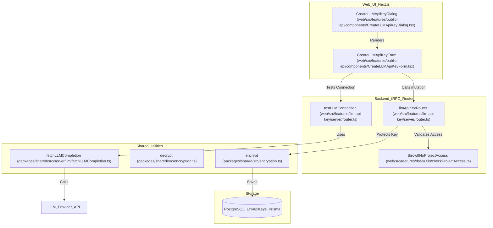
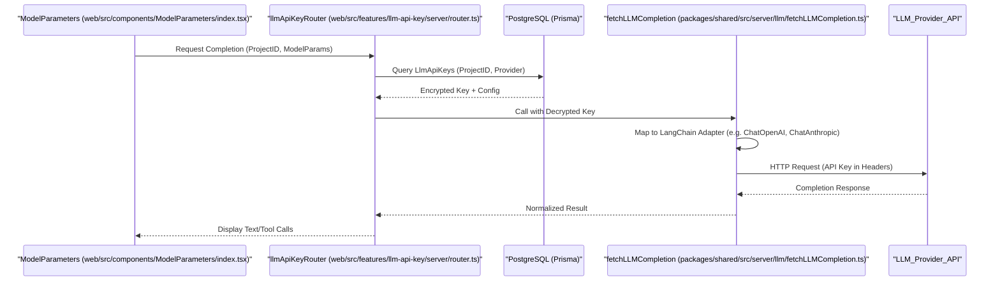

# LLM API 키 관리

관련 소스 파일

다음 파일들은 이 위키 페이지를 생성하기 위한 컨텍스트로 사용되었습니다.

- [packages/shared/src/domain/webhooks.ts](packages/shared/src/domain/webhooks.ts)
- [packages/shared/src/interfaces/customLLMProviderConfigSchemas.ts](packages/shared/src/interfaces/customLLMProviderConfigSchemas.ts)
- [packages/shared/src/server/llm/baseUrlValidation.ts](packages/shared/src/server/llm/baseUrlValidation.ts)
- [packages/shared/src/server/llm/fetchLLMCompletion.ts](packages/shared/src/server/llm/fetchLLMCompletion.ts)
- [packages/shared/src/server/llm/types.ts](packages/shared/src/server/llm/types.ts)
- [packages/shared/src/server/outbound-url/fetch.ts](packages/shared/src/server/outbound-url/fetch.ts)
- [packages/shared/src/server/outbound-url/validation.ts](packages/shared/src/server/outbound-url/validation.ts)
- [packages/shared/src/server/webhooks/ipBlocking.ts](packages/shared/src/server/webhooks/ipBlocking.ts)
- [packages/shared/src/server/webhooks/validation.ts](packages/shared/src/server/webhooks/validation.ts)
- [web/src/__tests__/server/datasets-trpc.servertest.ts](web/src/__tests__/server/datasets-trpc.servertest.ts)
- [web/src/__tests__/server/llm-api-key.servertest.ts](web/src/__tests__/server/llm-api-key.servertest.ts)
- [web/src/__tests__/server/unit/utilities.servertest.ts](web/src/__tests__/server/unit/utilities.servertest.ts)
- [web/src/components/ModelParameters/LLMApiKeyComponent.tsx](web/src/components/ModelParameters/LLMApiKeyComponent.tsx)
- [web/src/components/ModelParameters/index.tsx](web/src/components/ModelParameters/index.tsx)
- [web/src/features/llm-api-key/server/router.ts](web/src/features/llm-api-key/server/router.ts)
- [web/src/features/llm-api-key/types.ts](web/src/features/llm-api-key/types.ts)
- [web/src/features/public-api/components/CreateLLMApiKeyDialog.tsx](web/src/features/public-api/components/CreateLLMApiKeyDialog.tsx)
- [web/src/features/public-api/components/CreateLLMApiKeyForm.tsx](web/src/features/public-api/components/CreateLLMApiKeyForm.tsx)
- [web/src/features/public-api/components/LLMApiKeyList.tsx](web/src/features/public-api/components/LLMApiKeyList.tsx)
- [web/src/features/public-api/components/UpdateLLMApiKeyDialog.tsx](web/src/features/public-api/components/UpdateLLMApiKeyDialog.tsx)
- [web/src/server/api/routers/utilities.ts](web/src/server/api/routers/utilities.ts)
- [worker/src/__tests__/ip-blocking.test.ts](worker/src/__tests__/ip-blocking.test.ts)
- [worker/src/__tests__/llm-base-url-validation.test.ts](worker/src/__tests__/llm-base-url-validation.test.ts)
- [worker/src/__tests__/outbound-connection-validation.test.ts](worker/src/__tests__/outbound-connection-validation.test.ts)
- [worker/src/__tests__/url-normalization.test.ts](worker/src/__tests__/url-normalization.test.ts)
- [worker/src/__tests__/webhook-redirect-headers.test.ts](worker/src/__tests__/webhook-redirect-headers.test.ts)
- [worker/src/__tests__/webhook-redirect.test.ts](worker/src/__tests__/webhook-redirect.test.ts)
- [worker/src/__tests__/webhook-validation.test.ts](worker/src/__tests__/webhook-validation.test.ts)
- [worker/src/__tests__/webhooks.test.ts](worker/src/__tests__/webhooks.test.ts)
- [worker/src/queues/webhooks.ts](worker/src/queues/webhooks.ts)

## 목적과 범위

Langfuse의 LLM API key management system은 사용자가 다양한 Large Language Model(LLM) provider의 credential을 안전하게 저장하고 관리할 수 있게 합니다. 이러한 key는 Langfuse interface 안에서 automated evaluation, LLM Playground, prompt testing 같은 기능을 가능하게 합니다. Project는 자체 API key를 사용함으로써 LLM usage, data privacy, provider-specific configuration을 직접 통제할 수 있습니다.

시스템은 OpenAI, Anthropic, Azure OpenAI, AWS Bedrock, Google Vertex AI, Google AI Studio를 포함한 다양한 adapter를 지원합니다.

---

## 데이터 아키텍처

Management system은 connection metadata와 encrypted credential을 저장하기 위해 PostgreSQL의 `LlmApiKeys` model에 의존합니다.

### LlmApiKeys 모델

각 record는 Langfuse project와 LLM provider 사이의 unique connection을 나타냅니다.

| Field | Type | Purpose |
|-------|------|---------|
| `id` | String | 고유 식별자(CUID). |
| `projectId` | String | Project에 대한 foreign key. [web/src/features/llm-api-key/types.ts:10-10]() |
| `provider` | String | Connection에 대한 user-defined name(예: "MyOpenRouter"). [web/src/features/llm-api-key/types.ts:11-14]() |
| `adapter` | LLMAdapter | 사용되는 technical interface(OpenAI, Anthropic 등). [packages/shared/src/server/llm/types.ts:318-326]() |
| `secretKey` | String | AES-256으로 encrypted된 API key 또는 service account JSON. [web/src/features/llm-api-key/server/router.ts:29-30]() |
| `displaySecretKey` | String | UI display용 masked version(예: "...a1b2"). [web/src/features/llm-api-key/server/router.ts:44-54]() |
| `baseURL` | String? | API endpoint에 대한 optional override(예: Azure 또는 local LLM용). [web/src/features/llm-api-key/types.ts:16-16]() |
| `config` | Json? | AWS Region 또는 GCP Location 같은 adapter-specific setting. [packages/shared/src/server/llm/fetchLLMCompletion.ts:162-165]() |
| `customModels` | String[] | 이 connection에서 사용할 수 있는 model ID list. [web/src/features/llm-api-key/types.ts:18-18]() |
| `extraHeaders` | String? | Request와 함께 전송할 additional HTTP header의 encrypted JSON. [web/src/features/llm-api-key/server/router.ts:29-30]() |

출처: [web/src/features/llm-api-key/types.ts:9-21](), [web/src/features/llm-api-key/server/router.ts:44-54](), [packages/shared/src/server/llm/types.ts:318-326]()

---

## 시스템 엔티티와 로직 흐름

다음 diagram은 UI component, server-side router, encryption layer 사이의 관계를 보여줍니다.

### API 키 관리 흐름

출처: [web/src/features/llm-api-key/server/router.ts:100-169](), [web/src/features/public-api/components/CreateLLMApiKeyForm.tsx:1-50](), [packages/shared/src/server/llm/fetchLLMCompletion.ts:179-213](), [web/src/features/public-api/components/CreateLLMApiKeyDialog.tsx:15-57]()

---

## Provider Adapter와 Configuration

Langfuse는 다양한 LLM provider 전반의 request를 normalize하기 위해 adapter repository를 사용합니다.

### 지원 Adapter
`LLMAdapter` enum은 지원되는 interface를 정의합니다.
- `OpenAI`: Standard OpenAI-compatible API.
- `Anthropic`: Anthropic Messages API.
- `Azure`: Azure OpenAI Service.
- `Bedrock`: AWS Bedrock(Access Key, Bearer Token, Default Credentials 지원). [packages/shared/src/server/llm/fetchLLMCompletion.ts:118-154]()
- `VertexAI`: Google Cloud Vertex AI.
- `GoogleAIStudio`: Google AI Studio(Gemini).

출처: [packages/shared/src/server/llm/types.ts:318-326](), [web/src/features/public-api/components/CreateLLMApiKeyForm.tsx:9-12]()

### 특수 Configuration
일부 adapter는 `config` field에 저장되는 복잡한 configuration object가 필요합니다.
- **AWS Bedrock**: `BedrockConfigSchema`를 통해 validation되며, `region`이 필요합니다. [packages/shared/src/server/llm/fetchLLMCompletion.ts:131-134]()
- **Google Vertex AI**: `VertexAIConfigSchema`를 통해 validation되며, `location`이 필요합니다. [packages/shared/src/server/llm/fetchLLMCompletion.ts:135-140]()

### Default Credentials(Self-Hosted)
Self-hosted environment에서 Langfuse는 sentinel value를 사용해 host의 environment credential(예: IAM role 또는 Application Default Credentials)을 사용하는 것을 지원합니다.
- `BEDROCK_USE_DEFAULT_CREDENTIALS`: `__BEDROCK_DEFAULT_CREDENTIALS__` [web/src/features/llm-api-key/server/router.ts:24-25]()
- `VERTEXAI_USE_DEFAULT_CREDENTIALS`: `__VERTEXAI_DEFAULT_CREDENTIALS__` [web/src/features/llm-api-key/server/router.ts:24-25]()

이는 multi-tenant isolation을 보장하기 위해 Langfuse Cloud에서는 엄격히 금지됩니다. [web/src/features/llm-api-key/server/router.ts:208-234]()

출처: [web/src/features/llm-api-key/server/router.ts:45-50](), [web/src/features/llm-api-key/server/router.ts:208-234]()

---

## Credential Security와 Encryption

### Encryption at Rest
API key와 extra header는 plaintext로 저장되지 않습니다. `llmApiKeyRouter`는 data를 database에 persist하기 전에 shared `encrypt` 함수를 사용합니다. [web/src/features/llm-api-key/server/router.ts:29-30]()

출처: [web/src/features/llm-api-key/server/router.ts:29-30]()

### Base URL Validation
SSRF(Server-Side Request Forgery)를 방지하기 위해 Langfuse는 `validateLlmConnectionBaseURL`을 통해 `baseURL` input을 validation합니다. Local hostname(예: `localhost`, `127.0.0.1`)을 block합니다. [web/src/features/llm-api-key/server/router.ts:171-190]()

출처: [web/src/features/llm-api-key/server/router.ts:171-190]()

### UI에서의 Masking
`getDisplaySecretKey` utility는 key의 마지막 몇 글자만 보여주는 방식으로 display용 safe string을 생성합니다. AWS/GCP default credential의 경우 "Default AWS credentials" 같은 descriptive label을 반환합니다. [web/src/features/llm-api-key/server/router.ts:44-54]()

---

## Playground 통합

Managed API key는 Langfuse 내부의 모든 LLM interaction을 위한 central gateway 역할을 하는 `fetchLLMCompletion` 함수에서 활용되며, Playground도 여기에 포함됩니다.

### LLM Completion의 데이터 흐름

출처: [packages/shared/src/server/llm/fetchLLMCompletion.ts:179-213](), [web/src/components/ModelParameters/index.tsx:93-110]()

### 구현 세부사항
- **Decryption**: `fetchLLMCompletion` 함수는 request가 dispatch되기 직전에 `decrypt`를 사용해 `secretKey`와 `extraHeaders`를 decrypt합니다. [packages/shared/src/server/llm/fetchLLMCompletion.ts:227-228]()
- **Model Selection**: UI는 configured `customModels`와 `withDefaultModels`를 기준으로 available model을 filter합니다. [web/src/components/ModelParameters/index.tsx:57-89]()
- **Thinking/Reasoning**: 시스템은 `THINKING_BLOCK_TYPES`를 사용해 지원 adapter(Bedrock, VertexAI, GoogleAIStudio)에 대해 reasoning content를 별도로 추출하는 것을 지원합니다. [packages/shared/src/server/llm/fetchLLMCompletion.ts:76-84]()
- **Structured Output**: 시스템은 Zod 또는 JSON Schema를 통해 JSON format을 enforce하기 위해 `structuredOutputSchema`를 지원합니다. [packages/shared/src/server/llm/fetchLLMCompletion.ts:193-196]()
- **Tool Calling**: 다양한 provider 전반에서 standard `LLMToolDefinition`과 `ToolCallResponse` mapping을 지원합니다. [packages/shared/src/server/llm/types.ts:44-49](), [packages/shared/src/server/llm/types.ts:117-125]()

출처: [packages/shared/src/server/llm/fetchLLMCompletion.ts:179-228](), [web/src/components/ModelParameters/index.tsx:140-195](), [packages/shared/src/server/llm/types.ts:44-125]()
