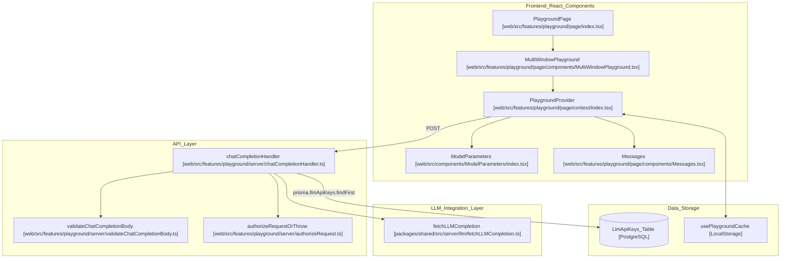
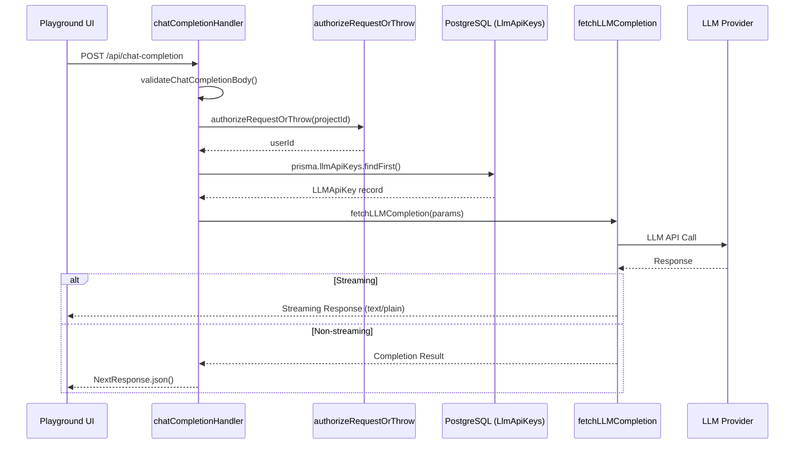

# LLM Playground

관련 소스 파일

다음 파일들은 이 위키 페이지를 생성하기 위한 컨텍스트로 사용되었습니다.

- [CLAUDE.md](CLAUDE.md)
- [packages/shared/scripts/seeder/utils/framework-traces/microsoft-agent-2025-10-14.json](packages/shared/scripts/seeder/utils/framework-traces/microsoft-agent-2025-10-14.json)
- [packages/shared/src/server/llm/compileChatMessages.ts](packages/shared/src/server/llm/compileChatMessages.ts)
- [web/src/components/ChatMessages/ChatMessageComponent.tsx](web/src/components/ChatMessages/ChatMessageComponent.tsx)
- [web/src/components/ChatMessages/index.tsx](web/src/components/ChatMessages/index.tsx)
- [web/src/components/ChatMessages/types.ts](web/src/components/ChatMessages/types.ts)
- [web/src/components/ChatMessages/utils/createEmptyMessage.ts](web/src/components/ChatMessages/utils/createEmptyMessage.ts)
- [web/src/features/playground/page/components/ConfigurationDropdowns.tsx](web/src/features/playground/page/components/ConfigurationDropdowns.tsx)
- [web/src/features/playground/page/components/JumpToPlaygroundButton.tsx](web/src/features/playground/page/components/JumpToPlaygroundButton.tsx)
- [web/src/features/playground/page/components/MessagePlaceholderComponent.tsx](web/src/features/playground/page/components/MessagePlaceholderComponent.tsx)
- [web/src/features/playground/page/components/MessagePlaceholders.tsx](web/src/features/playground/page/components/MessagePlaceholders.tsx)
- [web/src/features/playground/page/components/Messages.tsx](web/src/features/playground/page/components/Messages.tsx)
- [web/src/features/playground/page/components/MultiWindowPlayground.tsx](web/src/features/playground/page/components/MultiWindowPlayground.tsx)
- [web/src/features/playground/page/components/NoModelConfiguredAlert.tsx](web/src/features/playground/page/components/NoModelConfiguredAlert.tsx)
- [web/src/features/playground/page/components/PlaygroundTools/index.tsx](web/src/features/playground/page/components/PlaygroundTools/index.tsx)
- [web/src/features/playground/page/components/PromptVariableComponent.tsx](web/src/features/playground/page/components/PromptVariableComponent.tsx)
- [web/src/features/playground/page/components/ResetPlaygroundButton.tsx](web/src/features/playground/page/components/ResetPlaygroundButton.tsx)
- [web/src/features/playground/page/components/SaveToPromptButton.tsx](web/src/features/playground/page/components/SaveToPromptButton.tsx)
- [web/src/features/playground/page/components/StructuredOutputSchemaSection.tsx](web/src/features/playground/page/components/StructuredOutputSchemaSection.tsx)
- [web/src/features/playground/page/components/Variables.tsx](web/src/features/playground/page/components/Variables.tsx)
- [web/src/features/playground/page/context/index.tsx](web/src/features/playground/page/context/index.tsx)
- [web/src/features/playground/page/hooks/useCommandEnter.ts](web/src/features/playground/page/hooks/useCommandEnter.ts)
- [web/src/features/playground/page/hooks/useNamingConflicts.ts](web/src/features/playground/page/hooks/useNamingConflicts.ts)
- [web/src/features/playground/page/hooks/useWindowCoordination.ts](web/src/features/playground/page/hooks/useWindowCoordination.ts)
- [web/src/features/playground/page/index.tsx](web/src/features/playground/page/index.tsx)
- [web/src/features/playground/page/storage/keys.ts](web/src/features/playground/page/storage/keys.ts)
- [web/src/features/playground/page/types.ts](web/src/features/playground/page/types.ts)
- [web/src/features/playground/server/chatCompletionHandler.ts](web/src/features/playground/server/chatCompletionHandler.ts)
- [web/src/features/playground/server/validateChatCompletionBody.ts](web/src/features/playground/server/validateChatCompletionBody.ts)
- [web/src/features/prompts/components/NewPromptForm/PromptChatMessages.tsx](web/src/features/prompts/components/NewPromptForm/PromptChatMessages.tsx)
- [web/src/utils/chatml/adapters/aisdk.ts](web/src/utils/chatml/adapters/aisdk.ts)
- [web/src/utils/chatml/adapters/gemini.ts](web/src/utils/chatml/adapters/gemini.ts)
- [web/src/utils/chatml/adapters/generic.ts](web/src/utils/chatml/adapters/generic.ts)
- [web/src/utils/chatml/adapters/index.ts](web/src/utils/chatml/adapters/index.ts)
- [web/src/utils/chatml/adapters/langgraph.ts](web/src/utils/chatml/adapters/langgraph.ts)
- [web/src/utils/chatml/adapters/microsoft-agent.ts](web/src/utils/chatml/adapters/microsoft-agent.ts)
- [web/src/utils/chatml/adapters/openai.ts](web/src/utils/chatml/adapters/openai.ts)
- [web/src/utils/chatml/helpers.ts](web/src/utils/chatml/helpers.ts)
- [web/src/utils/chatml/index.ts](web/src/utils/chatml/index.ts)
- [web/src/utils/chatml/jumptoplayground.clienttest.ts](web/src/utils/chatml/jumptoplayground.clienttest.ts)
- [web/src/utils/chatml/playgroundConverter.ts](web/src/utils/chatml/playgroundConverter.ts)
- [worker/src/__tests__/llmConnections.test.ts](worker/src/__tests__/llmConnections.test.ts)

LLM Playground는 Langfuse 안에서 large language model(LLM) call을 테스트하고 실험하기 위한 interactive web interface입니다. 사용자가 model parameter를 구성하고, message를 전송하며, response를 real-time으로 볼 수 있는 multi-window chat-based UI를 제공합니다. Playground는 여러 LLM provider(OpenAI, Anthropic, Azure, Bedrock, Vertex AI, Google AI Studio), tool calling 및 structured output 같은 advanced feature, 그리고 streaming 및 non-streaming mode를 지원합니다.

---

## 아키텍처 개요

Playground는 React component가 user interaction을 처리하고, Next.js API route가 request를 처리하며, shared `fetchLLMCompletion` 함수가 여러 LLM provider에 대한 unified interface를 제공하는 client-server architecture를 따릅니다.

### 시스템 컴포넌트와 데이터 흐름

Playground state는 하나 이상의 window 전반에서 model parameter, chat message, tool을 coordinate하는 `PlaygroundProvider`가 관리합니다.

**다이어그램: Playground System Architecture**

출처: `[web/src/features/playground/page/context/index.tsx:96-138]()`, `[web/src/features/playground/server/chatCompletionHandler.ts:24-55]()`, `[web/src/features/playground/page/components/MultiWindowPlayground.tsx:105-136]()`, `[web/src/features/playground/page/index.tsx:136-150]()`

---

## 요청 흐름

사용자가 playground에서 message를 submit하면 다음 sequence가 발생합니다.

**다이어그램: Playground Request Flow**

출처: `[web/src/features/playground/server/chatCompletionHandler.ts:24-154]()`, `[web/src/features/playground/page/context/index.tsx:238-300]()`

---

## Chat Interface와 Message Management

Playground는 다양한 message type, template variable highlighting, placeholder management를 지원하는 특화된 chat interface를 활용합니다.

### Message Type과 Role
Playground는 `ChatMessageRole`에 정의된 standard LLM role인 `System`, `Developer`, `User`, `Assistant`, `Tool`을 지원합니다 `[web/src/components/ChatMessages/ChatMessageComponent.tsx:50-56]()` .

Message는 `PlaygroundProvider`가 제공하는 `MessagesContext`를 통해 관리됩니다 `[web/src/features/playground/page/context/index.tsx:78-82]()` . 시스템은 다음을 처리합니다.
- **Assistant Tool Calls**: Model-generated tool request를 나타내기 위한 specialized message type `[web/src/utils/chatml/playgroundConverter.ts:105-111]()` .
- **Tool Results**: `toolCallId`를 통해 연결되는 tool execution output을 포함하는 message `[web/src/components/ChatMessages/ChatMessageComponent.tsx:170-176]()` .
- **Placeholder Messages**: Complex prompt composition을 테스트하기 위해 message array로 채울 수 있는 dynamic slot `[web/src/features/playground/page/context/index.tsx:60-62]()` .

### Template Variable과 Placeholder
Playground는 mustache-style variable(예: `{{variable_name}}`)을 지원합니다.
- **Variable Extraction**: `PlaygroundProvider`의 `updatePromptVariables` callback은 `@langfuse/shared`의 `extractVariables`를 사용해 message content를 parse하고 active variable을 식별합니다 `[web/src/features/playground/page/context/index.tsx:210-217]()` .
- **Placeholder Management**: User는 prompt flow에 `ChatMessage` object list를 inject할 수 있게 하는 `messagePlaceholders`를 정의할 수 있습니다 `[web/src/features/playground/page/context/index.tsx:60-62]()` .
- **Reordering**: `@dnd-kit`의 `DndContext`와 `SortableContext`를 사용해 message를 reorder할 수 있어, 사용자가 다양한 conversation flow를 테스트할 수 있습니다 `[web/src/components/ChatMessages/index.tsx:83-117]()` .

### Message Search
Playground에는 긴 chat history를 탐색하기 위한 robust search system이 포함되어 있습니다.
- **MessageSearchProvider**: 여러 window 전반에서 search state를 관리하기 위해 playground를 wrap합니다 `[web/src/features/playground/page/index.tsx:137-140]()` .
- **Registration**: 개별 message는 search action의 `registerMessageTarget`을 사용해 search target으로 등록됩니다 `[web/src/components/ChatMessages/ChatMessageComponent.tsx:103-107]()` .

출처: `[web/src/features/playground/page/context/index.tsx:105-128]()`, `[web/src/components/ChatMessages/ChatMessageComponent.tsx:50-200]()`, `[web/src/components/ChatMessages/index.tsx:83-117]()`

---

## Multi-Window Testing

Playground는 `MultiWindowPlayground`가 관리하는 multi-window interface를 통해 다양한 model 또는 prompt를 side-by-side로 비교할 수 있게 합니다.

- **State Isolation**: 각 window는 unique `windowId`가 있는 자체 `PlaygroundProvider`로 wrap됩니다 `[web/src/features/playground/page/components/MultiWindowPlayground.tsx:124-132]()` .
- **Window Coordination**: "Run All" 같은 global action은 모든 active provider 전반에서 execution을 trigger하는 `useWindowCoordination` hook을 통해 coordinate됩니다 `[web/src/features/playground/page/index.tsx:51-56]()` .
- **Persistence**: Active window ID는 page refresh 후에도 workspace를 유지하기 위해 `usePersistedWindowIds`를 통해 local storage에 persist됩니다 `[web/src/features/playground/page/index.tsx:48-49]()` .
- **Copying Windows**: User는 model parameter나 prompt text에 대한 빠른 iteration을 위해 existing window의 state를 new window로 clone할 수 있습니다 `[web/src/features/playground/page/components/MultiWindowPlayground.tsx:94-99]()` .

출처: `[web/src/features/playground/page/components/MultiWindowPlayground.tsx:47-138]()`, `[web/src/features/playground/page/index.tsx:40-101]()`

---

## Tool Calling과 Structured Output

### Tool Calling 구현
Playground는 complex tool-calling workflow를 지원합니다. Tool은 `PlaygroundTool` object로 관리됩니다 `[web/src/features/playground/page/types.ts:21]()` .
- **Schema Management**: Tool은 saved project tool(`api.llmTools.getAll`)에서 선택하거나 `CreateOrEditLLMToolDialog`를 통해 생성할 수 있습니다 `[web/src/features/playground/page/components/PlaygroundTools/index.tsx:28-69]()` .
- **Request Handling**: Message sequence에 ID가 누락된 `tool-result` type이 포함되어 있으면, `chatCompletionHandler`는 result를 matching name을 가진 가장 최근의 `assistant-tool-call`에 다시 mapping하여 이를 "fix"하려고 시도합니다 `[web/src/features/playground/server/chatCompletionHandler.ts:91-116]()` .

### Structured Output
UI에서 `structuredOutputSchema`가 선택되면 backend로 전달됩니다. Structured output은 full completion parsing이 필요하므로, schema가 있으면 `chatCompletionHandler`는 `streaming: false`를 강제합니다 `[web/src/features/playground/server/chatCompletionHandler.ts:77-84]()` . Schema는 `StructuredOutputSchemaSection` component를 통해 관리되며 `LlmSchema` record로 persist될 수 있습니다 `[web/src/features/playground/page/components/StructuredOutputSchemaSection.tsx:154-195]()` .

출처: `[web/src/features/playground/server/chatCompletionHandler.ts:86-125]()`, `[web/src/features/playground/page/components/PlaygroundTools/index.tsx:144-189]()`, `[web/src/features/playground/page/components/StructuredOutputSchemaSection.tsx:23-87]()`

---

## Testing Workflow

### Jump to Playground
User는 `JumpToPlaygroundButton`을 사용해 existing tracing data에서 playground로 이동할 수 있습니다. 이 기능은 다양한 source의 data를 normalize합니다.

- **From Prompts**: Prompt text와 resolved variable을 capture합니다 `[web/src/features/playground/page/components/JumpToPlaygroundButton.tsx:127-128]()` .
- **From Generations**: `normalizeInput` 및 `normalizeOutput` adapter(예: `openAIAdapter`, `langgraphAdapter`, `geminiAdapter`)를 사용해 다양한 framework format을 standard ChatML로 변환합니다 `[web/src/features/playground/page/components/JumpToPlaygroundButton.tsx:129-133]()` .
- **Format Conversion**: `convertChatMlToPlayground` utility는 normalized ChatML message를 playground의 internal `ChatMessage` 또는 `PlaceholderMessage` type으로 변환하며, nested tool call과 content part를 처리합니다 `[web/src/utils/chatml/playgroundConverter.ts:52-140]()` .

### LLM API 키 관리
Playground는 `llmApiKeys` table에 저장된 key를 활용합니다. `chatCompletionHandler`는 external API call을 하기 전에 selected provider에 적합한 key를 retrieve합니다 `[web/src/features/playground/server/chatCompletionHandler.ts:50-67]()` . 또한 configured provider와 custom model definition을 기준으로 available model을 filter합니다 `[web/src/features/playground/page/components/JumpToPlaygroundButton.tsx:102-120]()` .

출처: `[web/src/features/playground/page/components/JumpToPlaygroundButton.tsx:73-186]()`, `[web/src/utils/chatml/playgroundConverter.ts:1-140]()`, `[web/src/features/playground/server/chatCompletionHandler.ts:50-75]()`
