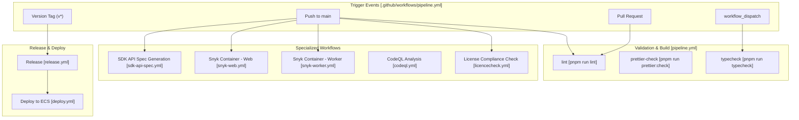
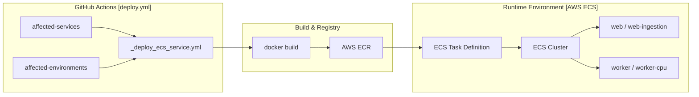

# 개발 및 운영

관련 소스 파일

다음 파일들은 이 위키 페이지를 생성하기 위한 컨텍스트로 사용되었습니다.

- [.devcontainer/Dockerfile](.devcontainer/Dockerfile)
- [.github/dependabot.yml](.github/dependabot.yml)
- [.github/workflows/_deploy_ecs_service.yml](.github/workflows/_deploy_ecs_service.yml)
- [.github/workflows/ci.yml.template](.github/workflows/ci.yml.template)
- [.github/workflows/claude-review-maintainer-prs.yml](.github/workflows/claude-review-maintainer-prs.yml)
- [.github/workflows/codeql.yml](.github/workflows/codeql.yml)
- [.github/workflows/codespell.yml](.github/workflows/codespell.yml)
- [.github/workflows/dependabot-rebase-stale.yml](.github/workflows/dependabot-rebase-stale.yml)
- [.github/workflows/deploy.yml](.github/workflows/deploy.yml)
- [.github/workflows/licencecheck.yml](.github/workflows/licencecheck.yml)
- [.github/workflows/pipeline.yml](.github/workflows/pipeline.yml)
- [.github/workflows/promote-main-to-production.yml](.github/workflows/promote-main-to-production.yml)
- [.github/workflows/release.yml](.github/workflows/release.yml)
- [.github/workflows/sdk-api-spec.yml](.github/workflows/sdk-api-spec.yml)
- [.github/workflows/snyk-web.yml](.github/workflows/snyk-web.yml)
- [.github/workflows/snyk-worker.yml](.github/workflows/snyk-worker.yml)
- [CONTRIBUTING.md](CONTRIBUTING.md)
- [packages/shared/src/features/analytics-integrations/blob-export-gate.ts](packages/shared/src/features/analytics-integrations/blob-export-gate.ts)
- [scripts/codex/maintenance.sh](scripts/codex/maintenance.sh)
- [scripts/codex/setup.sh](scripts/codex/setup.sh)
- [turbo.json](turbo.json)
- [web/src/__tests__/server/unit/assertLegacyBlobExportSourceAllowed.servertest.ts](web/src/__tests__/server/unit/assertLegacyBlobExportSourceAllowed.servertest.ts)

이 페이지는 Langfuse platform의 development workflow, testing strategy, deployment process, operational monitoring을 문서화합니다. CI/CD pipeline configuration, Docker containerization, test execution pattern, observability instrumentation, database migration procedure를 다룹니다.

Monorepo structure와 package organization에 대한 정보는 [Monorepo Structure](#1.2)를 참고하세요. Technology stack 세부사항은 [Technology Stack](#1.3)을 참고하세요.

---

## CI/CD 파이프라인

CI/CD pipeline은 GitHub Actions를 사용해 구현되며 comprehensive validation check를 실행합니다. Primary workflow는 `pipeline.yml`에 정의되어 있으며, linting, formatting check, service health validation을 포함한 복잡한 task matrix를 관리합니다.

### Pipeline Architecture

**출처:** [.github/workflows/pipeline.yml:1-133](), [.github/workflows/sdk-api-spec.yml:1-9](), [.github/workflows/deploy.yml:1-38](), [.github/workflows/snyk-web.yml:1-4](), [.github/workflows/licencecheck.yml:1-10]()

### 자동화된 SDK 생성
Pipeline에는 `fern/` directory의 Fern API definition 변경으로 trigger되는 automated SDK generation step이 포함됩니다. `sdk-api-spec.yml` workflow는 `fern-api` CLI를 사용해 updated TypeScript 및 Python SDK를 생성합니다. 이 workflow는 `langfuse-python` 및 `langfuse-js` repository를 자동으로 clone하고, generated code를 update한 뒤, review를 위한 Pull Request를 엽니다.

**출처:** [.github/workflows/sdk-api-spec.yml:7-8](), [.github/workflows/sdk-api-spec.yml:42-103](), [.github/workflows/sdk-api-spec.yml:123-162]()

자세한 내용은 [CI/CD Pipeline](#11.1)을 참고하세요.

---

## Docker 및 Deployment

시스템은 image size와 security를 최적화하기 위해 multi-stage Dockerfile을 활용합니다. Deployment는 reusable workflow architecture를 통해 주로 AWS ECS를 대상으로 합니다.

### AWS ECS로의 Deployment Flow

**출처:** [.github/workflows/deploy.yml:38-118](), [.github/workflows/_deploy_ecs_service.yml:1-102]()

### Deployment Configuration
`deploy.yml` workflow는 여러 environment(staging, prod-eu, prod-us, prod-hipaa, prod-jp)와 service(web, worker, web-ingestion, web-iso, worker-cpu)를 지원합니다. AWS authentication, ECR login, 그리고 Sentry, PostHog, Langfuse Cloud region용 specific argument를 사용한 image building을 처리하는 reusable `_deploy_ecs_service.yml` workflow를 활용합니다.

**출처:** [.github/workflows/deploy.yml:19-28](), [.github/workflows/_deploy_ecs_service.yml:70-87]()

자세한 내용은 [Docker & Deployment](#11.2)를 참고하세요.

---

## 테스트 전략

Langfuse는 multi-layered testing strategy를 사용합니다. `pipeline.yml`은 current tree SHA를 이전 successful run과 비교하여 identical git tree의 redundant testing을 피하기 위해 `skip_check` step을 사용합니다.

### 테스트 환경
- **Turbo Cache**: `turbo.json`은 CI speed를 최적화하기 위해 `lint`, `typecheck`, `test`에 대한 task dependency와 caching을 구성합니다. Build 또는 test 전에 `db:generate`가 실행되도록 보장합니다.
- **LLM Connection Tests**: `paths-filter`로 식별되는 `fetchLLMCompletion.ts` 또는 관련 shared logic이 변경될 때 specifically trigger됩니다.
- **Dependency Management**: Dependabot은 `prisma`, `next`, `express`, `observability` package 같은 core library update를 group하도록 구성되어 있습니다.

**출처:** [.github/workflows/pipeline.yml:50-74](), [turbo.json:6-73](), [.github/workflows/pipeline.yml:82-89](), [.github/dependabot.yml:24-52]()

자세한 내용은 [Testing Strategy](#11.3)를 참고하세요.

---

## Observability 및 Monitoring

Platform은 Snyk, CodeQL, standard linting tool을 사용한 deep observability와 security monitoring을 위해 instrument되어 있습니다.

### Security Scanning
- **Snyk**: `web` 및 `worker` Docker image의 vulnerability를 scan하고, SARIF file을 GitHub Code Scanning으로 output합니다.
- **CodeQL**: main 및 production branch에 대한 모든 push와 PR에서 JavaScript 및 TypeScript static analysis를 수행합니다.
- **License Compliance**: Dedicated `license_check` job은 third-party dependency가 license policy를 위반하지 않도록 보장합니다(예: Strong Copyleft license 확인).

**출처:** [.github/workflows/snyk-web.yml:11-54](), [.github/workflows/codeql.yml:12-95](), [.github/workflows/licencecheck.yml:17-50]()

자세한 내용은 [Observability & Monitoring](#11.4)를 참고하세요.

---

## 데이터베이스 마이그레이션

Database management에는 relational metadata용 PostgreSQL과 high-volume observability data용 ClickHouse라는 dual schema가 포함됩니다.

### Migration Management
- **PostgreSQL**: Prisma를 통해 관리됩니다. `turbo.json`은 `db:migrate`, `db:deploy`, `db:generate` task를 정의합니다. `db:generate`는 대부분의 build 및 test task의 prerequisite입니다.
- **Promotion Workflow**: Change는 `release.yml`을 통해 `main`에서 `production` branch로 promote되며, 이는 updated application code와 associated schema change의 deployment를 trigger합니다.

**출처:** [turbo.json:15-20](), [turbo.json:50-54](), [.github/workflows/release.yml:1-25]()

자세한 내용은 [Database Migrations](#11.5)를 참고하세요.

---

## 버전 관리

Version synchronization은 `pnpm` workspace를 사용해 monorepo 전반에서 유지됩니다. CI pipeline은 reproducibility를 보장하기 위해 core tool의 specific version을 명시적으로 enforce합니다.
- **Node.js**: Version 24(CI env와 `.nvmrc`에 지정됨)
- **pnpm**: Version 11.1.3(setup action과 codex script에서 사용)

**출처:** [.github/workflows/pipeline.yml:26](), [.github/workflows/pipeline.yml:102](), [scripts/codex/setup.sh:22](), [CONTRIBUTING.md:113-114]()
